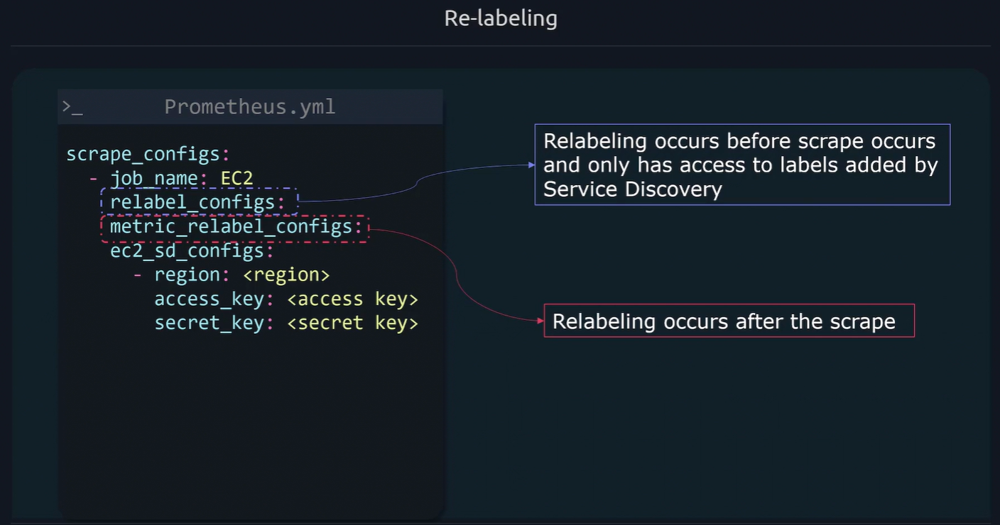
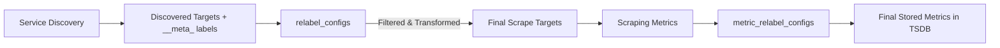

# 🔧 **Prometheus Relabeling** — “Where Labels Are Born, Filtered, and Transformed”

## 📖 **What Is Relabeling?**

> **Relabeling** is Prometheus’s mechanism to **transform, filter, or drop targets and labels** — before scraping happens.

Think of it as a **pipeline** that processes every discovered target (and metric labels later) using flexible rules.

Relabeling =  
🧩 **Discovery → Transformation → Filtering → Scraping**

---

## ⁉️ **Where Relabeling Is Used**

There are **two main contexts** where relabeling occurs:

<div align="center" style="background-color: #141a19ff;color: #a8a5a5ff; border-radius: 10px; border: 2px solid">

| Type                                             | When It Happens | Purpose                                        |
| ------------------------------------------------ | --------------- | ---------------------------------------------- |
| **Target Relabeling** (`relabel_configs`)        | Before scraping | Filter or modify discovered targets            |
| **Metric Relabeling** (`metric_relabel_configs`) | After scraping  | Filter or modify labels _on collected samples_ |

</div>

---

<div align="center" style="background-color: #11171F; border-radius: 10px; border: 2px solid">
    
</div>

---

## 🧩 **Relabeling Flow (Visual)**

<div align="center" style="background-color: #141a19ff;color: #a8a5a5ff; border-radius: 10px; border: 2px solid">



</div>

---

## 🧠 **How It Works**

Each relabel rule is applied **in order**, and every rule can:

- **Read** labels (`source_labels`)
- **Apply** a regex match
- **Perform an action** (keep, drop, replace, etc.)
- **Write** the result into a new or existing label (`target_label`)

---

## 🧩 **The Relabel Rule Structure**

```yaml
relabel_configs:
  - source_labels: [__meta_ec2_tag_Name]
    target_label: instance
    regex: (.*)
    replacement: ${1}
    action: replace
```

<div align="center" style="background-color: #141a19ff;color: #a8a5a5ff; border-radius: 10px; border: 2px solid">

| Field           | Purpose                                                            |
| --------------- | ------------------------------------------------------------------ |
| `source_labels` | List of labels to read input from                                  |
| `regex`         | Regular expression applied to joined source labels                 |
| `replacement`   | Template string to write into `target_label`                       |
| `target_label`  | Label that will be modified or created                             |
| `action`        | Operation type (e.g., `replace`, `keep`, `drop`, `labelmap`, etc.) |

</div>

---

## ⚙️ **Available Actions**

Let’s break down all **actions** with examples 👇

---

### 1️⃣ `replace` — The Most Common One

> Replace or create a new label based on another.

```yaml
- source_labels: [__meta_ec2_tag_Name]
  target_label: instance
  regex: (.*)
  replacement: ${1}
  action: replace
```

🧠 **Example:**  
If AWS tag Name = `webserver-1`  
→ Prometheus sets `instance="webserver-1"`

✅ Used for creating human-friendly labels from metadata.

---

### 2️⃣ `keep` — Keep Only Matching Targets

> Keeps targets that **match** the regex.

```yaml
- source_labels: [__meta_ec2_tag_Environment]
  regex: prod
  action: keep
```

🧠 **Example:**
Only scrape EC2 instances tagged `Environment=prod`.

Everything else is dropped.

---

### 3️⃣ `drop` — Exclude Matching Targets

> Drops targets that **match** the regex.

```yaml
- source_labels: [__meta_kubernetes_namespace]
  regex: dev
  action: drop
```

🧠 **Example:**
Don’t scrape any pods in the `dev` namespace.

✅ Very useful for ignoring test environments.

---

### 4️⃣ `hashmod` — Assign Targets to Buckets

> Compute a hash and take a modulo — often used for **sharding Prometheus** setups.

```yaml
- source_labels: [__address__]
  target_label: __tmp_hash
  modulus: 4
  action: hashmod
```

🧠 **Example:**  
Splits targets into 4 shards (`0`, `1`, `2`, `3`) based on their address.

Used in **federation** or **HA Prometheus** setups.

---

### 5️⃣ `labelmap` — Copy Labels by Pattern

> Dynamically copy labels that match a regex.

```yaml
- regex: __meta_kubernetes_pod_label_(.+)
  action: labelmap
```

🧠 **Example:**  
Copies all pod labels like `app`, `env`, etc. into normal labels:

```INI
__meta_kubernetes_pod_label_app="api"
↓
app="api"
```

✅ Saves you from writing dozens of replace rules.

---

### 6️⃣ `labeldrop` — Drop Labels Matching Regex

> Removes labels from the target or sample.

```yaml
- regex: __meta_kubernetes_pod_label_.+
  action: labeldrop
```

🧠 **Example:**  
Drops all metadata labels to reduce cardinality.

---

### 7️⃣ `labelkeep` — Keep Only Specific Labels

> The opposite of labeldrop.

```yaml
- regex: (app|instance|job)
  action: labelkeep
```

🧠 **Example:**  
Keeps only `app`, `instance`, and `job` — drops everything else.

---

### 8️⃣ `uppercase` / `lowercase`

> Convert label values to uppercase or lowercase.

```yaml
- source_labels: [env]
  target_label: env
  action: lowercase
```

🧠 **Example:**  
Turns `Prod` → `prod` for label consistency.

---

### 9️⃣ `replace_all` (in newer Prometheus)

> Like replace, but applies multiple times per label.

Used when you want to replace _all_ regex matches, not just the first.

---

## 🧩 **Special Labels You Must Know**

<div align="center" style="background-color: #141a19ff;color: #a8a5a5ff; border-radius: 10px; border: 2px solid">

| Label              | Purpose                                            |
| ------------------ | -------------------------------------------------- |
| `__address__`      | The target’s host:port — Prometheus scrapes this   |
| `__scheme__`       | HTTP or HTTPS                                      |
| `__metrics_path__` | Path to metrics endpoint (default `/metrics`)      |
| `__param_<name>`   | Sets query parameter for the scrape request        |
| `__meta_*`         | Metadata labels from Service Discovery (temporary) |
| `__tmp_*`          | Temporary labels (used during relabeling)          |

</div>

---

💡 After relabeling is done:

- `__meta_*` and `__tmp_*` are deleted automatically
- Only normal labels (like `job`, `instance`, `env`) remain

---

## 📝 **Real-World Examples**

### 🧭 Example 1 — Clean Up EC2 Targets

```yaml
scrape_configs:
  - job_name: "ec2-nodes"
    ec2_sd_configs:
      - region: us-east-1
    relabel_configs:
      - source_labels: [__meta_ec2_tag_Environment]
        regex: prod
        action: keep
      - source_labels: [__meta_ec2_private_ip]
        target_label: instance
        action: replace
      - source_labels: [__meta_ec2_tag_Name]
        target_label: name
        action: replace
```

✅ Keeps only `prod` instances  
✅ Renames `__meta_ec2_private_ip` → `instance`  
✅ Adds `name` label from EC2 tag

---

### 🧭 Example 2 — Kubernetes Pods

```yaml
- job_name: "k8s-pods"
  kubernetes_sd_configs:
    - role: pod
  relabel_configs:
    - source_labels: [__meta_kubernetes_pod_annotation_prometheus_io_scrape]
      regex: true
      action: keep
    - source_labels: [__meta_kubernetes_pod_annotation_prometheus_io_path]
      target_label: __metrics_path__
      action: replace
    - source_labels: [__address__, __meta_kubernetes_pod_annotation_prometheus_io_port]
      target_label: __address__
      separator: ;
      regex: (.+);(\d+)
      replacement: ${1}:${2}
      action: replace
```

✅ Keeps only Pods annotated with `prometheus.io/scrape: "true"`  
✅ Configures custom scrape path and port per Pod

---

### 🧭 Example 3 — Add Static Environment Label

```yaml
- target_label: environment
  replacement: production
  action: replace
```

✅ Adds a constant label to all targets.

---

## 🧪 **Debugging Relabeling**

Prometheus UI helps you visualize how relabeling affects targets.

Go to:

```ini
http://<prometheus>:9090/targets
```

🧩 Hover over a target → click “show more” →  
You’ll see **before** and **after** relabeling sections:

- **Discovered Labels** (all `__meta_...`)
- **Labels after relabeling**

This helps debug why something got dropped or renamed.

---

## 🔴 **Common Mistakes**

<div align="center" style="background-color: #141a19ff;color: #a8a5a5ff; border-radius: 10px; border: 2px solid">

| Mistake                            | Why It’s Bad                                           |
| ---------------------------------- | ------------------------------------------------------ |
| Forgetting `action:`               | Defaults to `replace`, may cause unexpected overwrites |
| Dropping too many labels           | Can lose useful metadata                               |
| Using regex `.*` blindly           | Matches everything — unsafe                            |
| Confusing target vs metric relabel | Leads to silent data loss                              |
| Forgetting case sensitivity        | Regex in Prometheus is case-sensitive                  |

</div>

---

## 🧩 **Metric Relabeling — Post-Scrape Filtering**

> Applied **after** the target is scraped — affects the metric samples themselves.

```yaml
metric_relabel_configs:
  - source_labels: [__name__]
    regex: "node_disk_.+"
    action: drop
```

✅ Drops all disk metrics to reduce storage.

💡 Use metric relabeling **carefully** — it permanently drops or rewrites data before storage.

---

## 🏁 **Practical Use Cases Summary**

<div align="center" style="background-color: #141a19ff;color: #a8a5a5ff; border-radius: 10px; border: 2px solid">

| Goal                                | Action                    |
| ----------------------------------- | ------------------------- |
| Keep only production systems        | `keep`                    |
| Drop development or test targets    | `drop`                    |
| Add environment label               | `replace`                 |
| Copy Kubernetes pod labels          | `labelmap`                |
| Remove metadata noise               | `labeldrop`               |
| Normalize label cases               | `lowercase` / `uppercase` |
| Shard scraping among Prom instances | `hashmod`                 |

</div>

---

## 🖼️ **Mental Model — The Label Factory**

<div align="center" style="background-color: #141a19ff;color: #a8a5a5ff; border-radius: 10px; border: 2px solid">

```mermaid
flowchart LR
    A["__meta_* Labels (Raw Input)"] --> B[relabel_configs (Target Filtering)]
    B --> C["Final Scrape Targets (__address__, job, env)"]
    C --> D["Scrape Metrics"]
    D --> E[metric_relabel_configs (Metric Filtering)]
    E --> F["Final Clean Metrics in TSDB"]
```

</div>

---

## 💬 **Human Analogy**

> Think of **Service Discovery** as the _guest list_ of a big event 🎟️
> and **Relabeling** as the _bouncer_ and _name tag printer_:
>
> - Bouncer (`keep`/`drop`) decides who gets in.
> - Name tag printer (`replace`/`labelmap`) gives everyone nice readable labels.
> - Cleanup crew (`labeldrop`) removes unnecessary badges.
> - All before the party (scraping) starts 🎉

---

## 🧾 **TL;DR**

<div align="center" style="background-color: #141a19ff;color: #a8a5a5ff; border-radius: 10px; border: 2px solid">

| Action                    | Description                  | Example                                   |
| ------------------------- | ---------------------------- | ----------------------------------------- |
| `replace`                 | Change or add label          | Rename `__meta_ec2_tag_Name` → `instance` |
| `keep`                    | Keep only matching targets   | Keep only `env=prod`                      |
| `drop`                    | Drop matching targets        | Drop `namespace=dev`                      |
| `labelmap`                | Copy labels matching pattern | Copy `__meta_kubernetes_pod_label_*`      |
| `labeldrop`               | Drop labels matching pattern | Drop `__meta_*`                           |
| `labelkeep`               | Keep only specific labels    | Keep `app`, `env`, `job`                  |
| `hashmod`                 | Shard targets                | Distribute across Prom instances          |
| `uppercase` / `lowercase` | Normalize text               | Convert `Prod` → `prod`                   |

</div>

---

✅ **In short:**  
**Service Discovery** finds everything.  
**Relabeling** decides what stays, how it’s named, and how it looks.
