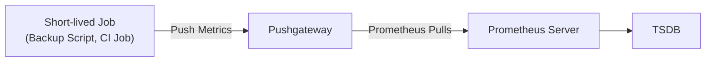
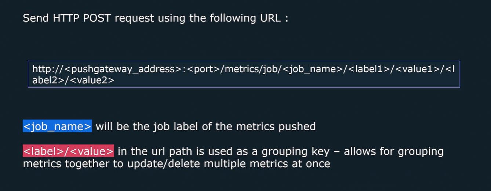
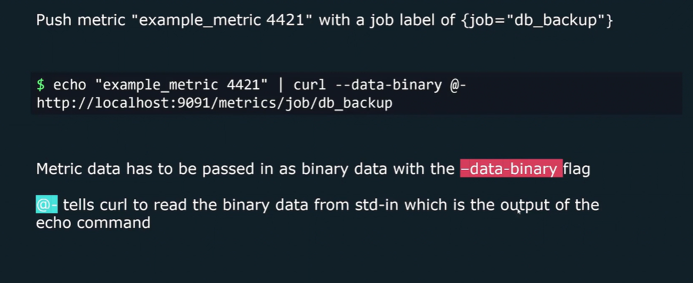
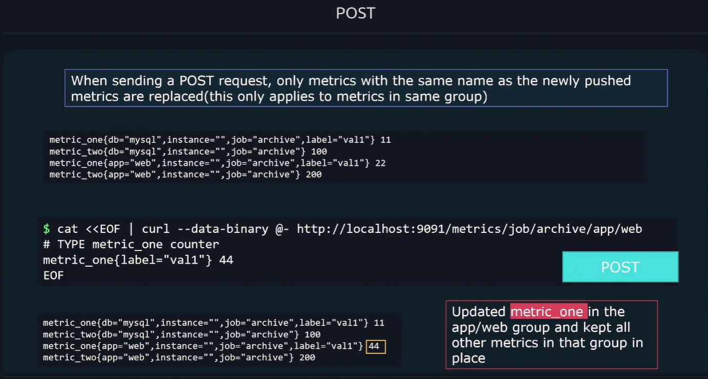
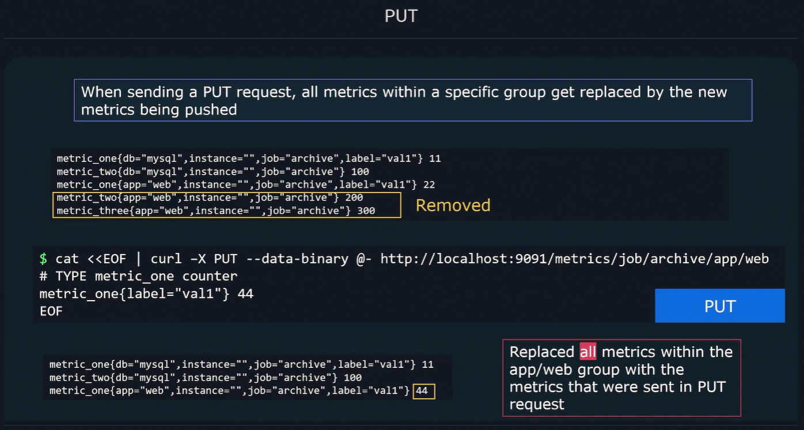
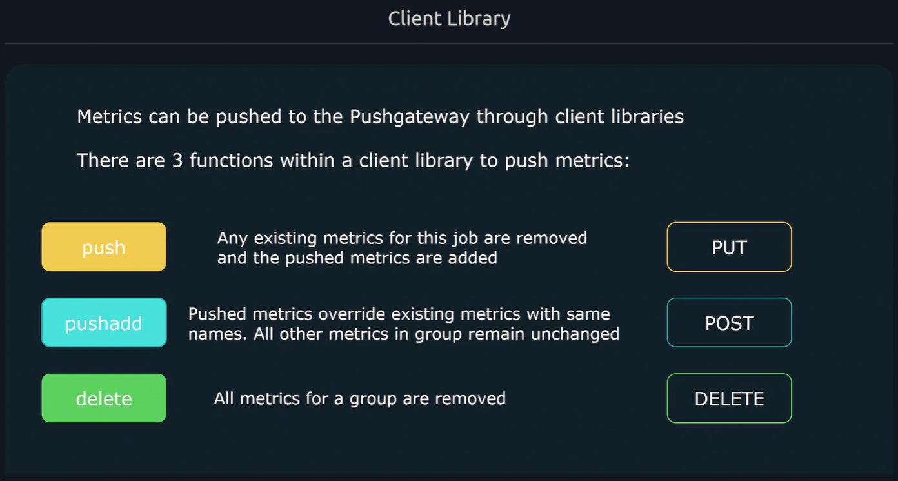

# 📮 **Prometheus Pushgateway**

> “The one time Prometheus lets you **push** instead of **pull**.”

---

## 📖 **What Is the Pushgateway?**

By design, **Prometheus uses pull-based scraping** — it reaches out to targets and scrapes metrics at intervals (every N seconds).
But what if your app is:

- A short-lived job (runs for 10 seconds and exits)
- A CI/CD pipeline
- A cron job or batch task
- Or anything that **doesn’t live long enough to be scraped**?

Then Prometheus can’t pull it in time ⏱️

That’s where **Pushgateway** comes in.

> ✅ The **Pushgateway** acts as a temporary metric storage endpoint that accepts _pushed metrics_ from short-lived jobs, which Prometheus later scrapes _from the gateway itself._

---

## 🧩 **Architecture Overview**



### 🔁 Flow

1. Your job finishes doing something (like running a test or backup).
2. It **pushes metrics** to the Pushgateway via HTTP.
3. Prometheus **scrapes the Pushgateway** like any other target.
4. Metrics appear in Prometheus as if they came from that job.

---

## ⁉️ **Why and When You Need It**

| Use Case                    | Why Pushgateway Helps                        |
| --------------------------- | -------------------------------------------- |
| 🧹 **Short-lived jobs**     | They exit before Prometheus can scrape them. |
| 🧪 **CI/CD pipelines**      | Push build/test metrics on completion.       |
| ⏲️ **Cron jobs / scripts**  | Push “job completed successfully” metrics.   |
| 🐋 **Ephemeral containers** | Container might die before next scrape.      |

---

## 🚫 **When _NOT_ to Use It**

Pushgateway is **not a replacement for normal scraping**.

❌ Don’t use it for:

- Long-running services (use normal `/metrics` endpoints)
- Per-request or per-user metrics (it’ll explode in cardinality)
- Anything that updates too frequently

💬 Think of Pushgateway like a **postbox for one-off messages**, not a mailbox that streams constantly.

---

## ⚙️ **How It Works Internally**

The Pushgateway exposes an HTTP API where clients can **PUT or POST** metrics in the same Prometheus text exposition format:

```ini
# HELP my_job_success Whether the job succeeded (1 = yes)
# TYPE my_job_success gauge
my_job_success{job="backup",instance="host1"} 1
```

Prometheus later scrapes `http://pushgateway:9091/metrics` and stores them.

---

## 🔨 **Typical Deployment Setup**

```yaml
scrape_configs:
  - job_name: "pushgateway"
    honor_labels: true
    static_configs:
      - targets: ["pushgateway:9091"]
```

That’s it. Prometheus treats Pushgateway like any other scrape target.

> 💡 `honor_labels: true`:  
> It tells Prometheus: **“Keep the labels from the client that pushed the metrics. Don’t overwrite them with my own.”**
>
> **Example:**
>
> If the client pushes:
>
> ```text
> job="batch_job"
> ```
>
> And Prometheus scrape config says:
>
> ```yaml
> job: pushgateway
> ```
>
> Then:
>
> - With `honor_labels: true` → Prometheus **keeps `job="batch_job"`**
> - With `honor_labels: false` → Prometheus **overwrites it to `job="pushgateway"`**

---

## ⚡ **1. Pushing Metrics with CLI (curl)**

Pushgateway accepts metrics over HTTP via **PUT** or **POST**.

---

<div align="center" style="background-color: #11171F; border-radius: 10px; border: 2px solid">
    
</div>

<div align="center" style="background-color: #11171F; border-radius: 10px; border: 2px solid">
    
</div>

<div align="center" style="background-color: #11171F; border-radius: 10px; border: 2px solid">
    
</div>

<div align="center" style="background-color: #11171F; border-radius: 10px; border: 2px solid">
    
</div>

<div align="center" style="background-color: #11171F; border-radius: 10px; border: 2px solid">
    
</div>

### ✅ Example 1: Simple One-Time Metric Push

```bash
echo "my_job_duration_seconds 7.3" | curl --data-binary @- http://localhost:9091/metrics/job/backup
```

This sends:

```ini
# TYPE my_job_duration_seconds gauge
my_job_duration_seconds 7.3
```

to the job “backup”.

Prometheus will scrape it from Pushgateway later.

---

### ✅ Example 2: Adding More Labels (Instance / Custom)

```bash
echo "backup_success 1" | curl --data-binary @- http://localhost:9091/metrics/job/backup/instance/node-1
```

➡️ Stored as:

```ini
backup_success{job="backup", instance="node-1"} 1
```

---

### ✅ Example 3: Push Multiple Metrics at Once

```bash
cat <<EOF | curl --data-binary @- http://localhost:9091/metrics/job/backup/instance/serverA
# HELP backup_duration_seconds Time taken for backup
# TYPE backup_duration_seconds gauge
backup_duration_seconds 12.5
# HELP backup_success Whether backup succeeded
# TYPE backup_success gauge
backup_success 1
EOF
```

---

### ✅ Example 4: Using `--data-urlencode` for Multi-Line Text

You can safely encode metrics with `--data-urlencode`:

```bash
curl -X PUT -s \
  --data-urlencode "backup_success 1" \
  http://localhost:9091/metrics/job/backup
```

---

### ✅ Example 5: Using `jq` to Pretty Print JSON (for API responses)

When you query Pushgateway (like `/api/v1/metrics`), pipe through jq:

```bash
curl -s http://localhost:9091/api/v1/metrics | jq
```

---

## 🧰 **2. Pushing Metrics from Code**

<div align="center" style="background-color: #11171F; border-radius: 10px; border: 2px solid">
    
</div>

---

### 🐍 Python Example (using `prometheus_client`)

```python
from prometheus_client import CollectorRegistry, Gauge, push_to_gateway

registry = CollectorRegistry()
g = Gauge('job_last_success', 'Last job success timestamp', registry=registry)
g.set_to_current_time()

push_to_gateway('localhost:9091', job='data_backup', registry=registry)
```

➡️ Pushes current time as success timestamp to job `data_backup`.

---

### 🧑‍💻 Golang Example

```go
import (
    "github.com/prometheus/client_golang/prometheus"
    "github.com/prometheus/client_golang/prometheus/push"
)

func main() {
    completionTime := prometheus.NewGauge(prometheus.GaugeOpts{
        Name: "job_last_success_timestamp_seconds",
        Help: "Timestamp of the last successful job run.",
    })
    completionTime.SetToCurrentTime()

    push.New("http://localhost:9091", "backup").
        Collector(completionTime).
        Push()
}
```

---

## 🌐 **Pushgateway API Endpoints**

| Endpoint                                        | Purpose                                            |
| ----------------------------------------------- | -------------------------------------------------- |
| `/metrics`                                      | Expose all pushed metrics for Prometheus to scrape |
| `/api/v1/metrics`                               | API view of metrics                                |
| `/api/v1/metrics/{job}/{instance}`              | Get metrics for a specific job/instance            |
| `DELETE /metrics/job/<job>`                     | Delete metrics for a job                           |
| `DELETE /metrics/job/<job>/instance/<instance>` | Delete metrics for a specific instance             |

---

### ✅ Example: Delete Metrics After Job Completes

```bash
curl -X DELETE http://localhost:9091/metrics/job/backup/instance/node-1
```

💡 Important:
Pushgateway **does not expire old metrics automatically** — you must clean up manually or use job scripts to delete after completion.

---

## 🗝️ **Key Concepts & Gotchas**

| Concept                                      | Explanation                                                                  |
| -------------------------------------------- | ---------------------------------------------------------------------------- |
| **Persistent Storage**                       | Pushgateway stores metrics in memory (and optionally on disk if configured). |
| **Prometheus Pulls, Not Pushgateway Pushes** | Prometheus still scrapes — Pushgateway just holds data.                      |
| **No Auto-Expiry**                           | Metrics remain until explicitly deleted.                                     |
| **Use for Batch Jobs Only**                  | Long-lived services → expose `/metrics` directly instead.                    |

---

## 📝 **Example CI/CD Use Case (Visual)**


✅ Jenkins or GitLab CI pushes metrics like:

- `ci_build_duration_seconds`
- `ci_build_success`
- `ci_tests_failed`

Then Prometheus can visualize trends over time.

---

## 💡 **Example Grafana Queries**

```promql
# Average build duration over time
avg_over_time(ci_build_duration_seconds[1h])

# Success rate of last 10 jobs
sum(rate(ci_build_success[10m])) / sum(rate(ci_build_success[10m]))
```

---

## ✅ **Best Practices**

| Recommendation                         | Why                                                     |
| -------------------------------------- | ------------------------------------------------------- |
| ❌ Don’t overuse Pushgateway           | Prometheus is designed to pull.                         |
| ✅ Push once per job                   | Avoid overwriting metrics mid-job.                      |
| ✅ Delete after completion             | Avoid stale data.                                       |
| ✅ Include labels for job and instance | Helps distinguish multiple jobs.                        |
| ✅ Store only “final state” metrics    | Duration, success/fail, count — not real-time progress. |

---

## 🧾 **Summary Cheat Sheet**

| Concept             | Description                           |
| ------------------- | ------------------------------------- |
| **Purpose**         | Temporary bridge for short-lived jobs |
| **Direction**       | Client → Pushgateway → Prometheus     |
| **Push Method**     | HTTP `PUT` / `POST`                   |
| **Pull Method**     | Prometheus scrapes `/metrics`         |
| **Storage**         | In-memory or persistent (optional)    |
| **Delete Old Data** | Manually via `DELETE` API             |
| **Best Use Case**   | CI/CD, Cron, Backup scripts           |
| **Avoid For**       | Long-running apps, dynamic metrics    |

---

✅ **In Short:**

> Pushgateway is like a “dropbox” for metrics from short-lived jobs.  
> You push once, Prometheus scrapes it later, and everyone’s happy.
