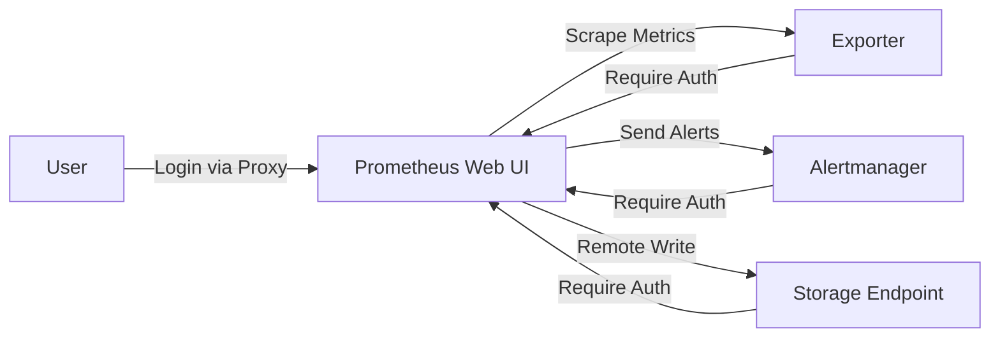

# 🧩 Prometheus Authentication Overview

## 🧠 What “Authentication” Means in Prometheus

In Prometheus, **authentication (AuthN)** isn’t about users logging in — it’s about **verifying identities between systems**.

Think of it this way:

> Prometheus rarely asks “who are _you_ (user?)”,
> but it often must prove “who am _I_ (Prometheus?)” when scraping or sending data.

So we have **two directions**:

| Direction         | Meaning                                       | Example                                            |
| ----------------- | --------------------------------------------- | -------------------------------------------------- |
| **Inbound Auth**  | Protecting access _to Prometheus itself_      | User opening the Prometheus web UI                 |
| **Outbound Auth** | Prometheus authenticating _to other services_ | Prometheus scraping an exporter’s metrics endpoint |

---

## 🔒 Prometheus Philosophy

By design, Prometheus is meant to run in **trusted, internal environments** — it doesn’t have built-in login screens or RBAC.
Therefore:

- **Inbound authentication is optional**, done through **reverse proxies** (like Nginx, Traefik) or the `web.yml` file.
- **Outbound authentication is common**, done through the Prometheus configuration (`basic_auth`, `bearer_token_file`, `tls_config`).

So:
🧭 Prometheus trusts itself. You must protect it **from the outside** and **authenticate it when it calls others**.

---

## ⚙️ Where Authentication Happens

| Component                              | Auth Direction | Method                                       |
| -------------------------------------- | -------------- | -------------------------------------------- |
| **Prometheus → Exporter**              | Outbound       | Basic Auth / Bearer Token / TLS Client Certs |
| **Prometheus → Alertmanager**          | Outbound       | Basic Auth / Bearer Token / mTLS             |
| **Prometheus → Remote Write Endpoint** | Outbound       | Basic Auth / Bearer Token / TLS              |
| **User → Prometheus Web UI**           | Inbound        | Handled externally (Proxy / `web.yml`)       |

---

## 🚀 Simple Visualization

---

## 🧩 Summary Table

| Case                         | Who Authenticates                          | How                  | Goal                    |
| ---------------------------- | ------------------------------------------ | -------------------- | ----------------------- |
| User opening Prometheus UI   | Proxy handles user login                   | Basic / OAuth        | Protect web access      |
| Prometheus scraping exporter | Prometheus authenticates to target         | Basic, Token, or TLS | Access metrics securely |
| Prometheus sending alerts    | Prometheus authenticates to Alertmanager   | Basic, Token, or TLS | Send alerts securely    |
| Prometheus pushing data      | Prometheus authenticates to remote storage | Basic, Token, or TLS | Protect data integrity  |

---

## 🧠 Key Takeaways

- Prometheus itself doesn’t manage users or sessions.
- Authentication mainly applies to **connections Prometheus makes to others**.
- To secure Prometheus UI/API, you need **external or web.yml-based auth**.
- TLS handles **encryption**; Basic/Bearer/mTLS handle **identity**.

---

Next, we’ll move to
👉 **Topic 2️⃣ — Authenticating Exporters (Targets)**
where we’ll cover **Basic Auth, Bearer Token, and mTLS** with examples.

Shall I continue?
