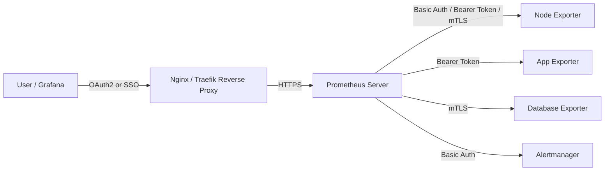

# 🧩 Best Practices for Prometheus Authentication

## 🎯 Purpose

Now that you understand:

- how Prometheus authenticates _to_ exporters,
- how to protect _its own_ web interface,

…it’s time to combine both into a **secure, enterprise-ready architecture** 🧱

---

## 🧭 1️⃣ Core Security Principles

| Principle                | Description                                                                    |
| ------------------------ | ------------------------------------------------------------------------------ |
| **🔒 Defense in Depth**  | Use multiple layers (TLS + Auth + Network restrictions).                       |
| **🔐 Least Privilege**   | Give Prometheus only what it needs — read-only tokens, restricted certs.       |
| **🕵️ Secret Separation** | Never hardcode passwords/tokens directly into config files.                    |
| **🔁 Regular Rotation**  | Rotate credentials, tokens, and certs regularly.                               |
| **🌍 Network Isolation** | Run Prometheus and exporters on a private network (no direct Internet access). |

---

## 🧩 2️⃣ Real-World Authentication Setup

Let’s look at what a **secure production setup** typically looks like 👇



---

## ⚙️ 3️⃣ How Each Layer is Secured

| Component                           | Auth Type                                 | Why It’s Needed                                 |
| ----------------------------------- | ----------------------------------------- | ----------------------------------------------- |
| **Prometheus → Exporter**           | Basic / Token / TLS                       | Ensures only trusted Prometheus scrapes metrics |
| **Prometheus → Alertmanager**       | Basic / TLS                               | Protects alert traffic                          |
| **Prometheus UI**                   | Basic Auth (web.yml) / OAuth2 (via proxy) | Prevents unauthorized access to data            |
| **Reverse Proxy (Nginx / Traefik)** | OAuth2 / LDAP / SAML                      | Enables enterprise login and SSO                |
| **Network Layer (Firewall / SGs)**  | IP Whitelisting                           | Ensures only Prometheus can reach exporters     |

---

## 🔑 4️⃣ Credential Management Best Practices

| Area                      | Recommendation                                                  |
| ------------------------- | --------------------------------------------------------------- |
| **Passwords**             | Use bcrypt-hashed values in `web.yml`.                          |
| **Tokens**                | Store in separate files and reference with `bearer_token_file`. |
| **Certificates**          | Store in `/etc/prometheus/certs`, protect permissions (600).    |
| **Secrets Rotation**      | Automate with Vault / AWS Secrets Manager / Azure Key Vault.    |
| **Environment Variables** | Avoid using them for long-term secrets — use files instead.     |

---

## 🧱 5️⃣ Secure Network Layout Example

| Zone               | Components                          | Access Control                            |
| ------------------ | ----------------------------------- | ----------------------------------------- |
| **Private Subnet** | Prometheus, Alertmanager, Exporters | Only Prometheus IPs allowed               |
| **Public Subnet**  | Reverse Proxy (Nginx)               | Authenticates users, routes HTTPS traffic |
| **Internet**       | Users, Grafana                      | Access only through the proxy             |

✅ This ensures:

- Exporters aren’t exposed publicly.
- Prometheus is reachable only via proxy.
- Metrics can’t be scraped or viewed without login.

---

## 🔧 6️⃣ Combining TLS + Auth (Common Company Pattern)

Many companies combine both:

```yaml
scrape_configs:
  - job_name: "secure_exporter"
    scheme: https
    basic_auth:
      username: "prometheus"
      password: "S3cur3Pa55"
    tls_config:
      ca_file: "/etc/prometheus/certs/ca.crt"
      cert_file: "/etc/prometheus/certs/client.crt"
      key_file: "/etc/prometheus/certs/client.key"
      insecure_skip_verify: false
```

🧩 Why?
Because:

- **TLS** = encrypts traffic + server identity
- **Basic Auth** = extra identity layer for access control

This combo is called **multi-layer authentication**, common in regulated industries (finance, telecom, healthcare).

---

## 🧠 7️⃣ Enterprise Authentication Integration

Larger setups integrate Prometheus with:

- **SSO / LDAP / Azure Entra ID / Okta** via reverse proxy
- **Vault** or **Secrets Manager** for token/cert rotation
- **Mutual TLS** between components
- **Private CA** to issue and trust certificates

---

## 🧩 8️⃣ Summary Cheat Sheet

| What                          | Where               | Recommended Method                                 |
| ----------------------------- | ------------------- | -------------------------------------------------- |
| **Prometheus → Exporter**     | `scrape_configs`    | `basic_auth`, `bearer_token_file`, or `tls_config` |
| **Prometheus → Alertmanager** | `alerting:` section | `basic_auth` or `tls_config`                       |
| **Prometheus Web UI**         | `--web.config.file` | `web.yml` (Basic) or Reverse Proxy (OAuth2)        |
| **Enterprise Security**       | Front proxy + mTLS  | Nginx / Traefik + corporate SSO                    |

---

## 🏁 Final Thought

Prometheus gives you **no authentication by default**, but full flexibility to add the layers you need.
The key is to **treat Prometheus like a service**, not a toy dashboard —
so it’s protected by:

- 🔐 **Authentication**
- 🧱 **Network isolation**
- 🧩 **TLS encryption**
- 🔁 **Secret rotation**
