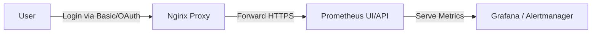

# 📰 **Securing Prometheus UI / API**

## ⁉️ **Why You Need to Secure It**

By default, Prometheus exposes:

- **Web UI** → `http://<host>:9090/`
- **API** → `/api/v1/...`

And guess what? 😅
It’s **completely open** — anyone on the network can:

- See metrics
- Query with PromQL
- Add or delete alert rules
- Access `/metrics` of Prometheus itself

So, we must **secure the interface**, especially in production or shared environments.

---

## 🔒 **Two Ways to Secure Prometheus**

<div align="center" style="background-color: #141a19ff;color: #a8a5a5ff; border-radius: 10px; border: 2px solid">

| Method                                              | Description                                         | Difficulty                     |
| --------------------------------------------------- | --------------------------------------------------- | ------------------------------ |
| **1️⃣ web.yml (built-in security file)**             | Native support for Basic Auth + TLS                 | ⭐ Easy                        |
| **2️⃣ Reverse Proxy (Nginx, Traefik, Apache, etc.)** | External protection layer with advanced auth or SSO | 🔥 Flexible & enterprise-ready |

</div>

---

## 1️⃣ **Option 1** — Using `web.yml`

Prometheus supports a configuration file (`web.yml`) for **Basic Auth** and **TLS**.

### 📄 Example: `/etc/prometheus/web.yml`

```yaml
# web.yml
basic_auth_users:
  admin: "$2b$12$VxCZ3MKu8rQycc1y8WlBi..z0WqweJyycBxoQ6UZVf6J1KGEHdDa6" # bcrypt password

tls_server_config:
  cert_file: /etc/prometheus/certs/server.crt
  key_file: /etc/prometheus/certs/server.key
```

> ⚙️ Password must be **bcrypt-hashed** (use `htpasswd -nBC 10 ""` or `openssl passwd -bcrypt`)

### 🧭 Prometheus service config (e.g. systemd or Docker)

```bash
prometheus \
  --config.file=/etc/prometheus/prometheus.yml \
  --web.config.file=/etc/prometheus/web.yml
```

Now open:  
🔗 [https://your-prometheus-server:9090](https://your-prometheus-server:9090)

and you’ll see a **login prompt** ✅

---

## 2️⃣ **Option 2** — Reverse Proxy (Recommended in Companies)

Most enterprises prefer placing Prometheus **behind a reverse proxy** like **Nginx**, **Traefik**, or **Apache**.

This gives you:

- Centralized **SSO (OAuth2, SAML, LDAP)**
- **Rate limiting**
- **IP whitelisting**
- Easier **certificate rotation**

### ⚙️ Example: Nginx in front of Prometheus

```nginx
server {
  listen 443 ssl;
  server_name prometheus.example.com;

  ssl_certificate     /etc/nginx/certs/server.crt;
  ssl_certificate_key /etc/nginx/certs/server.key;

  auth_basic           "Prometheus Login";
  auth_basic_user_file /etc/nginx/.htpasswd;

  location / {
    proxy_pass http://localhost:9090;
  }
}
```

---

Run this and access:

```ini
https://prometheus.example.com
```

You’ll get a login window from Nginx 🔐

✅ Great for corporate setups where Prometheus is one of many internal dashboards.

---

## ⚔️ **TLS vs. Authentication**

<div align="center" style="background-color: #141a19ff;color: #a8a5a5ff; border-radius: 10px; border: 2px solid">

| Concept            | Purpose                      | Example                                    |
| ------------------ | ---------------------------- | ------------------------------------------ |
| **TLS**            | Encrypts traffic (HTTPS)     | `tls_server_config` or reverse proxy certs |
| **Authentication** | Verifies user identity       | `basic_auth` / OAuth / LDAP                |
| **mTLS**           | Both sides verify each other | Used between Prometheus and exporters      |

</div>

---

🧩 So, companies often use **both** TLS + Auth:

- TLS for secure transport
- Basic Auth or SSO for user access

---

## 💭 **Real-World Security Recommendations**

<div align="center" style="background-color: #141a19ff;color: #a8a5a5ff; border-radius: 10px; border: 2px solid">

| Level         | Recommendation                     | Why                               |
| ------------- | ---------------------------------- | --------------------------------- |
| 🧱 Basic      | Use `web.yml` with bcrypt password | Quick protection for test/staging |
| 🔐 Medium     | Use Nginx with HTTPS + Basic Auth  | More flexible, logs access        |
| 🏢 Enterprise | Use OAuth2 / SSO via reverse proxy | Integrate with AD/Entra/Okta      |
| 🚫 Avoid      | Exposing port 9090 directly        | No built-in protection!           |

</div>

---

## 📊 **Visual Summary**

<div align="center" style="background-color: #141a19ff;color: #a8a5a5ff; border-radius: 10px; border: 2px solid">



</div>

---

## 🗝️ **TL;DR**

<div align="center" style="background-color: #141a19ff;color: #a8a5a5ff; border-radius: 10px; border: 2px solid">

| Option        | Where it runs             | Handles Auth              | Handles TLS | Best For                |
| ------------- | ------------------------- | ------------------------- | ----------- | ----------------------- |
| `web.yml`     | Inside Prometheus         | Basic (bcrypt)            | ✅          | Simple secure setup     |
| Reverse Proxy | External (Nginx, Traefik) | Any (Basic, OAuth2, LDAP) | ✅          | Production / enterprise |

</div>
