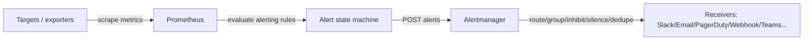
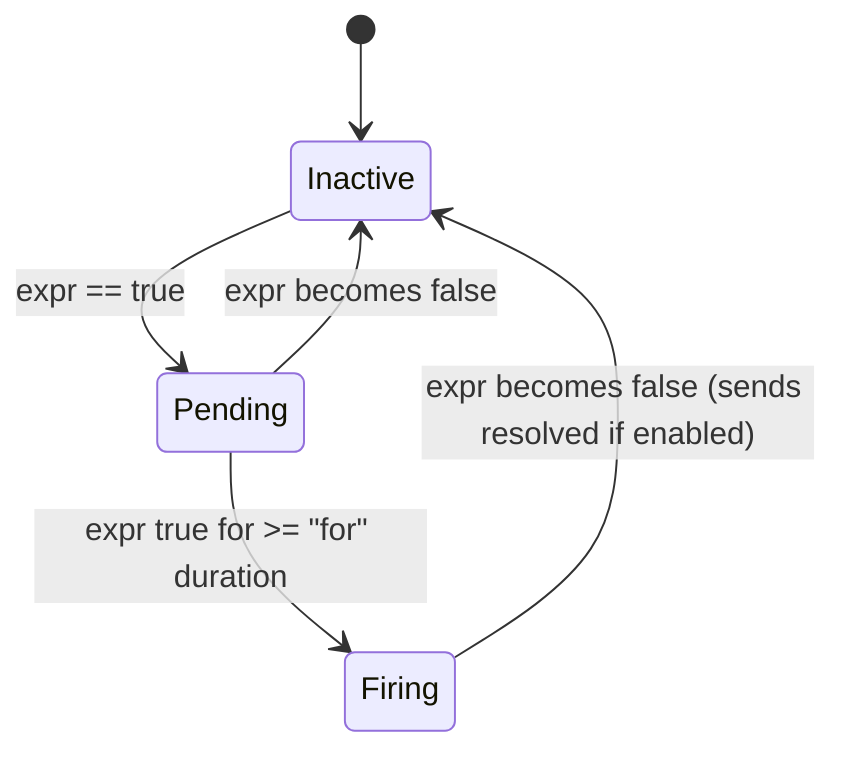

Prometheus **Alertmanager** is the “notification brain” that sits *after* Prometheus. Prometheus decides **when an alert is true**; Alertmanager decides **who to notify, how often, and how to avoid spam**.

---

## 1) The data flow (big picture)



---

## 2) Prometheus Rules: what they do

Prometheus rules live in **rule files** and are loaded by Prometheus. Two main types:

### A) Recording rules

* Precompute expensive expressions into new time series.
* Used for dashboards and speed.

### B) Alerting rules (the ones that trigger alerts)

They look like:

```yaml
groups:
- name: api.rules
  rules:
  - alert: HighErrorRate
    expr: rate(http_requests_total{status=~"5.."}[5m])
          / rate(http_requests_total[5m]) > 0.05
    for: 10m
    labels:
      severity: page
      team: backend
    annotations:
      summary: "High 5xx error rate"
      description: "5xx ratio > 5% for 10m"
```

Key parts:

* **expr**: PromQL condition (true/false per labelset).
* **for**: “must stay true continuously for X time before firing”.
* **labels**: used by Alertmanager routing/grouping (team, severity, env…).
* **annotations**: human text sent in notifications.

---

## 3) When does an alert “trigger”?

Prometheus evaluates alerting rules on a schedule:

* **evaluation_interval** (global): commonly 15s / 30s / 1m.
* Every evaluation, each alert expression is computed.
* Each resulting time series (unique labelset) becomes an **alert instance**.

### Alert state machine (per instance)



So:

* **If `for` is NOT set**: it goes **Firing immediately** when expr is true on an evaluation.
* **If `for: 10m`**: it goes **Pending first**, then becomes **Firing only after 10 minutes of continuous truth**.

---

## 4) “How many until what?” (timing + counts)

This question usually means: *how many evaluations must be true before it fires?*

### With `for: 10m`

Number of consecutive “true” evaluations needed is approximately:

**10 minutes / evaluation_interval**

Examples:

* evaluation_interval = 1m → ~10 consecutive evaluations
* evaluation_interval = 30s → ~20 consecutive evaluations
* evaluation_interval = 15s → ~40 consecutive evaluations

**Important nuance:** Prometheus tracks timestamps, not just “count”. But in practice it behaves like consecutive evaluations over that duration.

### With `[5m]` in PromQL (range vector)

Example: `rate(x[5m])`

* That `[5m]` is **NOT a delay**.
* It means “compute the rate using the last 5 minutes of samples.”
* You still need `for:` if you want “must remain bad for X minutes”.

### What if metrics are missing?

If a time series disappears:

* The alert instance may stop evaluating to true, and can resolve.
* There are special patterns like `absent()` to alert on missing metrics.

---

## 5) What does Alertmanager do (vs Prometheus)?

Prometheus:

* Detects **Firing** / **Resolved**
* Sends alerts to Alertmanager

Alertmanager:

* **Deduplication**: if the same alert keeps firing, don’t spam identical notifications.
* **Grouping**: send one message like “10 alerts for team=backend” instead of 10 separate pings.
* **Routing**: send severity=page to PagerDuty, severity=warn to Slack, etc.
* **Inhibition**: if a “root cause” alert is firing, suppress noisy child alerts.
* **Silences**: mute alerts during maintenance windows.
* **Repeat notifications**: remind periodically while still firing.

---

## 6) How often do notifications get sent?

This is controlled in Alertmanager route config:

* **group_wait**: wait a bit to collect alerts into a group before first notification (e.g., 30s).
* **group_interval**: minimum time between notifications for the *same group* when *new alerts* are added (e.g., 5m).
* **repeat_interval**: reminder interval if alerts are still firing and nothing changed (e.g., 4h).

Typical behavior:

1. Prometheus sends Firing alert → Alertmanager waits **group_wait** → sends initial notification.
2. If more alerts join the same group → at most once per **group_interval**.
3. If nothing changes but it’s still firing → reminder every **repeat_interval**.
4. When it resolves → send “resolved” (if configured and receiver supports it).

---

## 7) Prometheus → Alertmanager communication

Prometheus pushes alerts to Alertmanager continuously:

* Endpoint configured in Prometheus: `alerting.alertmanagers`
* It sends alert instances with labels + annotations + status (firing/resolved)
* Alertmanager treats alerts with the same “fingerprint” (labelset identity) as the same alert for dedupe.

---

## 8) Quick mental model

* **Prometheus rule** answers: “Is this condition true right now (and for long enough)?”
* **Alertmanager** answers: “Who needs to know, how do we package it, and how do we avoid noise?”

---

If you tell me your current values for:

* `scrape_interval`
* `evaluation_interval`
* your alert rule `for: ...`
* and your Alertmanager `group_wait/group_interval/repeat_interval`

…I can calculate the exact “pending → firing” timing and the notification cadence for your setup.
