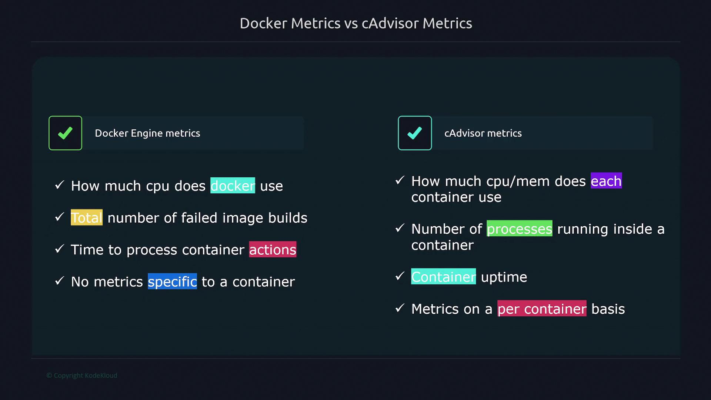

# 🐳 Monitoring Containers with Prometheus

> Extend host-level monitoring to Docker and containers using Prometheus + cAdvisor 🚀

---


---



---

## 🎯 Goal

You’ve already configured Prometheus to monitor Linux hosts.
Now it’s time to make Prometheus aware of **containers** —
so you can track performance, resource usage, and behavior inside Docker environments.

---

## 🧠 Two Sources of Container Metrics

| Source                       | Description                                   | Purpose                                                |
| ---------------------------- | --------------------------------------------- | ------------------------------------------------------ |
| 🧱 **Docker Engine Metrics** | Metrics exposed directly by the Docker daemon | Monitor Docker engine performance & system-level stats |
| 🧩 **cAdvisor Metrics**      | Container Advisor (by Google)                 | Monitor per-container performance and resource usage   |

> Both can be scraped by Prometheus to get a **full picture** of container health.

---

## ⚙️ 1️⃣ Enabling Docker Engine Metrics

Docker can expose internal metrics directly from the Docker daemon (dockerd)
over an HTTP endpoint — usually **`:9323/metrics`**.

### 🪜 Steps

1. **Create or edit** the Docker daemon configuration file:

   ```bash
   sudo vi /etc/docker/daemon.json
   ```

2. **Add these settings:**

   ```json
   {
     "metrics-addr": "127.0.0.1:9323",
     "experimental": true
   }
   ```

   🔍 Explanation:

   - `"metrics-addr"` → binds the Prometheus metrics endpoint
   - `"experimental": true` → required to expose metrics

3. **Restart Docker:**

   ```bash
   sudo systemctl restart docker
   ```

4. **Verify metrics endpoint:**

   ```bash
   curl localhost:9323/metrics
   ```

   ✅ You’ll see Prometheus-formatted metrics like:

   ```ini
   # HELP engine_daemon_engine_time_seconds Docker engine uptime
   # TYPE engine_daemon_engine_time_seconds counter
   engine_daemon_engine_time_seconds 560
   ```

---

### 🧩 Add Docker Metrics to Prometheus

In your Prometheus configuration (`prometheus.yml`):

```yaml
scrape_configs:
  - job_name: "docker"
    static_configs:
      - targets: ["12.1.13.4:9323"]
```

> Replace `12.1.13.4` with your Docker host IP.

✅ **Result:** Prometheus scrapes the Docker daemon’s metrics directly.

---

## 🧠 2️⃣ Enabling cAdvisor for Container Metrics

cAdvisor (**Container Advisor**) is a lightweight container that collects **real-time, container-level metrics**
such as CPU, memory, network, and filesystem stats.

---

### 🪜 Steps (Using Docker Compose)

1. **Create a Docker Compose file:**

   ```yaml
   version: "3.4"
   services:
     cadvisor:
       image: gcr.io/cadvisor/cadvisor
       container_name: cadvisor
       privileged: true
       devices:
         - "/dev/kmsg:/dev/kmsg"
       volumes:
         - /:/rootfs:ro
         - /var/run:/var/run:ro
         - /sys:/sys:ro
         - /var/lib/docker:/var/lib/docker:ro
         - /dev/disk:/dev/disk:ro
       ports:
         - 8000:8000
   ```

2. **Start cAdvisor:**

   ```bash
   docker-compose up -d
   ```

3. **Verify it’s working:**

   ```bash
   curl localhost:8000/metrics
   ```

   ✅ You’ll see metrics like:

   ```ini
   container_cpu_usage_seconds_total{container="nginx"} 542.01
   container_memory_usage_bytes{container="redis"} 21340160
   ```

---

### 🧩 Add cAdvisor Metrics to Prometheus

```yaml
scrape_configs:
  - job_name: "cadvisor"
    static_configs:
      - targets: ["12.1.13.4:8000"]
```

✅ **Result:** Prometheus scrapes cAdvisor metrics for every running container.

---

## 🧩 3️⃣ Visualizing the Setup

```mermaid
flowchart LR
subgraph DockerHost["Docker Host"]
  DE[Docker Engine<br>(port 9323)]:::source
  CA[cAdvisor<br>(port 8000)]:::source
end

P[Prometheus Server]:::prom
G[Grafana Dashboards]:::graf

P -->|Scrape| DE
P -->|Scrape| CA
G -->|Visualize| P

classDef prom fill:#f2c94c,stroke:#222,color:#000;
classDef graf fill:#56ccf2,stroke:#222,color:#000;
classDef source fill:#27ae60,stroke:#222,color:#fff;
```

> Prometheus pulls metrics from **both Docker Engine** and **cAdvisor**
> Grafana then visualizes the data into dashboards (e.g., per-container CPU, memory usage).

---

## 📊 Comparing Docker Engine vs. cAdvisor Metrics

| Feature              | 🐋 Docker Engine Metrics     | 📦 cAdvisor Metrics                      |
| -------------------- | ---------------------------- | ---------------------------------------- |
| **Scope**            | Entire Docker daemon         | Per-container                            |
| **CPU & Memory**     | Global engine-level stats    | Container-level                          |
| **Process Tracking** | ❌ Not available             | ✅ Per-container process count           |
| **Network/FS Stats** | Partial                      | Full per-container                       |
| **Use Case**         | Monitor Docker daemon health | Analyze individual container performance |

---

## 💬 Example Use Cases

| Scenario                                           | Recommended Source |
| -------------------------------------------------- | ------------------ |
| Is my Docker Engine overloaded?                    | 🐋 Docker metrics  |
| Which container is using the most CPU?             | 📦 cAdvisor        |
| How many processes are running inside container X? | 📦 cAdvisor        |
| Did Docker restart unexpectedly?                   | 🐋 Docker metrics  |
| How much memory is container Y using?              | 📦 cAdvisor        |

---

## ⚡ Quick Tip

> 🔄 Use **both**:
>
> - Docker metrics → for **daemon-level** monitoring
> - cAdvisor → for **container-level** performance

Together, they provide **full observability** of your containerized workloads 🧠.

---

## 🧠 Summary

| Layer         | Tool      | Endpoint        | Prometheus Config |
| ------------- | --------- | --------------- | ----------------- |
| Docker Engine | Built-in  | `:9323/metrics` | job: `docker`     |
| cAdvisor      | Container | `:8000/metrics` | job: `cadvisor`   |

✅ Result:
Prometheus gains visibility from **engine → containers**, giving you complete insight into performance, uptime, and behavior inside Dockerized environments.
