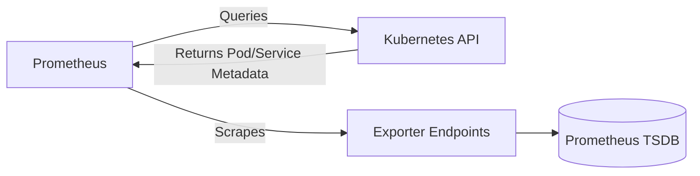

Perfect 🚀 — let’s dive into the next part:

# 🌐 **Kubernetes Service Discovery in Prometheus**

---

## 🧭 1️⃣ Why We Need Service Discovery

In a normal (non-Kubernetes) setup, you manually list all targets in `prometheus.yml`:

```yaml
static_configs:
  - targets: ["10.0.1.2:9100", "10.0.1.3:9100"]
```

But in Kubernetes, pods and services are **dynamic** — they start, die, or move every minute.
So, manual configs quickly become outdated.

👉 **Prometheus solves this** using **service discovery** (SD): it automatically detects new targets via the Kubernetes API.

---

## ⚙️ 2️⃣ How It Works

Prometheus queries the Kubernetes API to discover objects based on a **role**.
Each role tells Prometheus what kind of object to scrape:

| Role        | Discovers         | Typical Metrics            |
| ----------- | ----------------- | -------------------------- |
| `node`      | Worker nodes      | Node Exporter, Kubelet     |
| `pod`       | Individual pods   | Application exporters      |
| `service`   | Cluster services  | Internal app metrics       |
| `endpoints` | Service endpoints | Load-balanced exporters    |
| `ingress`   | Ingress resources | HTTP metrics from gateways |

Prometheus periodically re-syncs (default: every 30 seconds) so that the target list is always up-to-date.

---

## 🧩 3️⃣ Example: Service Discovery for Pods

```yaml
scrape_configs:
  - job_name: "pods"
    kubernetes_sd_configs:
      - role: pod
    relabel_configs:
      - source_labels: [__meta_kubernetes_pod_annotation_prometheus_io_scrape]
        action: keep
        regex: true
      - source_labels: [__meta_kubernetes_pod_annotation_prometheus_io_port]
        action: replace
        target_label: __address__
        replacement: $1
```

🧠 **Explanation:**

* Prometheus asks the K8s API for all pods.
* It filters only those annotated with
  `prometheus.io/scrape: "true"`.
* It reads the port from the annotation
  `prometheus.io/port: "9100"`.

So, you enable scraping by adding this annotation to your pod or deployment:

```yaml
metadata:
  annotations:
    prometheus.io/scrape: "true"
    prometheus.io/port: "9100"
```

---

## 🧩 4️⃣ Example: Service Discovery for Services

```yaml
scrape_configs:
  - job_name: "services"
    kubernetes_sd_configs:
      - role: service
```

This discovers all Kubernetes Services, but usually you’ll pair it with `endpoints`:

```yaml
scrape_configs:
  - job_name: "endpoints"
    kubernetes_sd_configs:
      - role: endpoints
```

Each Service’s `spec.selector` determines which pods are behind it, so Prometheus automatically finds all matching pods.

---

## 🔐 5️⃣ Service Discovery for Kubelet Metrics

```yaml
scrape_configs:
  - job_name: "kubelet"
    kubernetes_sd_configs:
      - role: node
    scheme: https
    tls_config:
      insecure_skip_verify: true
    relabel_configs:
      - source_labels: [__address__]
        regex: (.*):10250
        target_label: instance
        replacement: $1
```

✅ Discovers all nodes and scrapes the Kubelet’s `/metrics` endpoint securely over HTTPS.

---

## 📜 6️⃣ Common Relabeling Rules

| Purpose                  | Example Rule                                                 | What It Does             |
| ------------------------ | ------------------------------------------------------------ | ------------------------ |
| Keep only annotated pods | `__meta_kubernetes_pod_annotation_prometheus_io_scrape=true` | Filters targets          |
| Rename labels            | `target_label: job`                                          | Normalizes label names   |
| Drop internal pods       | `regex: "kube-system/.*"` → `action: drop`                   | Removes noise            |
| Add cluster info         | `target_label: cluster`                                      | Adds environment context |

---

## 🔍 7️⃣ Visualizing the Discovery Process



🧩 Every 30 seconds:

* Prometheus asks API Server → “Who’s alive?”
* Gets pods, endpoints, and services
* Applies relabeling → final scrape list
* Scrapes metrics → stores in TSDB

---

## 🧰 8️⃣ Best Practices

| Best Practice                          | Why It Matters                                           |
| -------------------------------------- | -------------------------------------------------------- |
| 🟢 Use annotations (`prometheus.io/*`) | Easy, lightweight control                                |
| 🟢 Use ServiceMonitors (if Operator)   | More maintainable than raw YAML                          |
| 🟢 Limit scrape scope                  | Avoid collecting thousands of noisy metrics              |
| 🟢 Use namespaces selectively          | Focus on `production`, skip `kube-system` if unnecessary |
| 🟢 Monitor Prometheus target status    | Detect discovery or auth issues fast                     |

---

## 💡 TL;DR

> Kubernetes Service Discovery = dynamic target discovery through the API.
> Prometheus watches nodes, pods, and services, applies relabeling, and scrapes exporters automatically — no static IPs ever again 🎯.

---

Would you like the **next topic** to be:
1️⃣ “Installing Prometheus in Kubernetes (Helm + Operator setup)”
or
2️⃣ “Monitoring Kubernetes system components (API server, Controller Manager, Scheduler, etc.)”?
