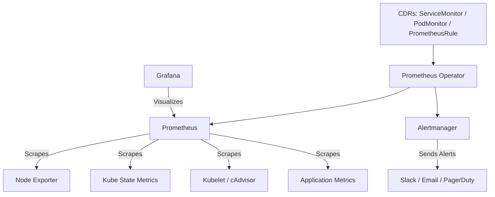
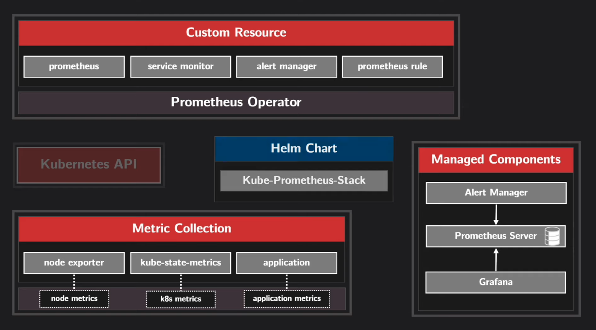
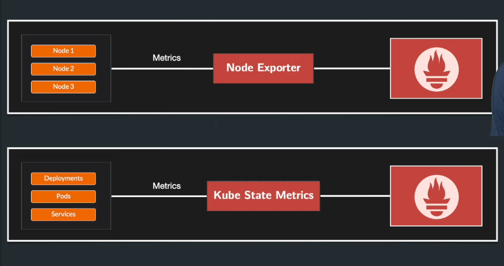
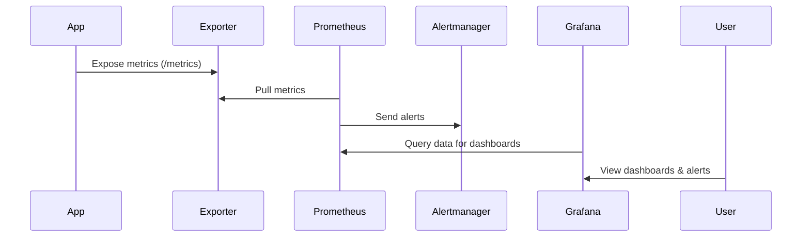

# ☸️ **Prometheus Stack Components in Kubernetes**

> _“Meet the Full Monitoring Family Living Inside Your Cluster”_

---

## 🧠 **What Is the Prometheus Stack?**

> The **Prometheus Stack** (deployed via Helm chart `prometheus-community/kube-prometheus-stack`) is an all-in-one Kubernetes monitoring suite that includes **Prometheus**, **Alertmanager**, **Grafana**, and several **exporters**.

It doesn’t just install Prometheus — it installs an entire **ecosystem** for collecting, storing, alerting, and visualizing cluster metrics.

---

## 🧩 **Core Architecture Overview**

<div align="center" style="background-color: #141a19ff;color: #a8a5a5ff; border-radius: 10px; border: 2px solid">



</div>

---

<div align="center" style="background-color: #11171F; border-radius: 10px; border: 2px solid">
    
</div>

---

## 🧑🏻‍💻 **Deploy Prometheus in K8s**

```bash
# add helm repo for prometheus community
helm repo add prometheus-community https://prometheus-community.github.io/helm-charts
# update helm repo for prometheus community
helm repo update
# install prometheus
helm install prometheus prometheus-community/kube-prometheus-stack --version 45.7.1 --namespace monitoring --create-namespace
```

```bash
# to search all helm chart available for prometheus-community:
helm search repo prometheus-community
# to search specific chart version:
helm search repo prometheus-community/kube-prometheus-stack --versions
# to install specific version:
helm install prometheus prometheus-community/kube-prometheus-stack --version 14.0.1
# to upgrade:
helm upgrade --install prometheus prometheus-community/kube-prometheus-stack
# to uninstall:
helm uninstall prometheus
```

---

## 1️⃣ **Control Plane Components**

These are **brains** of the stack — they orchestrate how everything works together.

---

### 🔹 Prometheus Operator

- 📦 **Type:** Deployment
- 🧩 **Purpose:** Automates setup, updates, and monitoring of Prometheus and Alertmanager.

💡 Instead of writing manual Prometheus configs, you declare monitoring objects as **Custom Resources (CRDs)** — and the operator does the rest.

**CRDs Managed:**

<div align="center" style="background-color: #141a19ff;color: #a8a5a5ff; border-radius: 10px; border: 2px solid">

| CRD              | Description                                                      |
| ---------------- | ---------------------------------------------------------------- |
| `Prometheus`     | Defines Prometheus instances, replicas, storage, scrape settings |
| `Alertmanager`   | Defines Alertmanager cluster specs                               |
| `ServiceMonitor` | Auto-discovers Services for scraping                             |
| `PodMonitor`     | Scrapes Pods directly (without a Service)                        |
| `PrometheusRule` | Defines alerting & recording rules                               |
| `Probe`          | Performs HTTP/TCP/ICMP blackbox probing                          |
| `ThanosRuler`    | Adds Thanos rule evaluation (optional)                           |

</div>

---

✅ **Why Important:**

- Handles upgrades gracefully.
- Ensures consistency of Prometheus configs.
- Enables declarative monitoring (GitOps-friendly).

---

## 2️⃣ **Data Plane Components**

These are the **engines** that collect, store, and visualize your data.

---

### 🔹 **Prometheus**

- 📦 **Type:** StatefulSet
- 🧩 **Purpose:** Collects & stores time-series metrics, evaluates rules, triggers alerts.

**Key Tasks:**

- Scrapes targets discovered via ServiceMonitor & PodMonitor.
- Stores metrics in its built-in **TSDB**.
- Evaluates **PromQL queries** and alert rules.

**Config Options:**

- Retention (`15d`, `30d`, or `retentionSize`)
- Persistent Volume for long-term data
- Remote Write for external storage (Thanos, Cortex, Mimir)
- HA setup (multiple replicas)

**Exposes:**

- `:9090` → Prometheus UI & API (`/api/v1/query`, `/targets`, `/rules`)

---

### 🔹 **Alertmanager**

- 📦 **Type:** StatefulSet
- 🧩 **Purpose:** Receives alerts from Prometheus and routes them to destinations like **Slack**, **Email**, or **PagerDuty**.

**Workflow:**

1. Prometheus triggers an alert based on rule evaluation.
2. Alertmanager groups, deduplicates, and sends notifications.
3. Supports silence periods and routing trees.

**Exposes:**

- `:9093` → Alertmanager Web UI

**Example Receivers:**

- Email
- Slack Webhook
- Microsoft Teams
- PagerDuty

💡 **Tip:** All configuration lives in the Helm chart under `alertmanager.config`.

---

### 🔹 **Grafana**

- 📦 **Type:** Deployment
- 🧩 **Purpose:** The **visual layer** of your monitoring stack.

**Out-of-the-box dashboards include:**

- 🌐 Cluster Overview
- 💾 Node Resource Usage
- ⚙️ API Server & Scheduler Health
- 🧱 Pod & Container Metrics

**Auto-provisioned Datasource:** Prometheus
**Exposes:**

- `:80` → Grafana Web UI

**Credentials:**
Default: `admin / prom-operator` (or your custom password in `values.yaml`)

---

## 3️⃣ **Metrics Collectors (Exporters)**

These are **agents** that expose metrics for Prometheus to scrape.

---

<div align="center" style="background-color: #11171F; border-radius: 10px; border: 2px solid">
    
</div>

---

### 🔹 **Node Exporter**

- 📦 **Type:** DaemonSet
- 🧠 **Purpose:** Exposes Linux host-level metrics (CPU, memory, disk, I/O, filesystem).

Every node runs one Node Exporter pod.

**Common Metrics:**

| Metric                             | Description      |
| ---------------------------------- | ---------------- |
| `node_cpu_seconds_total`           | CPU time by mode |
| `node_memory_MemAvailable_bytes`   | Available memory |
| `node_filesystem_avail_bytes`      | Free disk space  |
| `node_network_receive_bytes_total` | Network traffic  |

---

### 🔹 **Kube-State-Metrics**

- 📦 **Type:** Deployment
- 🧠 **Purpose:** Generates metrics _about_ Kubernetes objects — not the nodes themselves.

Example metrics:

| Metric                                      | Description               |
| ------------------------------------------- | ------------------------- |
| `kube_pod_status_phase`                     | Pod running/pending state |
| `kube_deployment_status_replicas_available` | Available replicas        |
| `kube_hpa_status_current_replicas`          | Autoscaler metrics        |

💡 **Used for:** Kubernetes object health, cluster state, scaling status, and deployment analysis.

---

### 🔹 **Kubelet / cAdvisor**

- 📦 **Type:** Built into every Node
- 🧠 **Purpose:** Provides container and pod resource usage metrics (CPU, memory, network).

**Key Metrics:**

- `container_cpu_usage_seconds_total`
- `container_memory_usage_bytes`

Prometheus scrapes these via built-in ServiceMonitors (`kubelet`, `cadvisor`).

---

### 🔹 **Blackbox Exporter (Optional)**

- 📦 **Type:** Deployment
- 🧠 **Purpose:** Performs HTTP, TCP, ICMP probes to check endpoint health.

Used with `Probe` CRDs:

```yaml
apiVersion: monitoring.coreos.com/v1
kind: Probe
spec:
  module: http_2xx
  targets:
    staticConfig:
      static:
        - https://example.com
```

---

## 4️⃣ **Discovery & Rules Components**

### 🔹 **ServiceMonitor**

- 🧠 **Purpose:** Tells Prometheus **which Services** to scrape.
  You attach it to your app’s Kubernetes Service.

```yaml
apiVersion: monitoring.coreos.com/v1
kind: ServiceMonitor
spec:
  selector:
    matchLabels:
      app: my-app
  endpoints:
    - port: metrics
      interval: 30s
```

💡 If your app exposes `/metrics` on a Service, ServiceMonitor makes Prometheus scrape it automatically.

---

### 🔹 **PodMonitor**

- 🧠 **Purpose:** Tells Prometheus to scrape **pods directly** (no Service).
  Useful for Jobs or headless pods.

---

### 🔹 **PrometheusRule**

- 🧠 **Purpose:** Defines **alerting and recording rules** used by Prometheus.

```yaml
apiVersion: monitoring.coreos.com/v1
kind: PrometheusRule
spec:
  groups:
    - name: node.rules
      rules:
        - record: instance:node_cpu_utilization:rate5m
          expr: 1 - avg(irate(node_cpu_seconds_total{mode="idle"}[5m]))
        - alert: HighCPUUsage
          expr: instance:node_cpu_utilization:rate5m > 0.9
          for: 5m
          labels:
            severity: warning
          annotations:
            description: "High CPU usage detected on {{ $labels.instance }}"
```

---

## 📊 Visualization & Dashboards

Deployed automatically from ConfigMaps and pre-wired to Prometheus.

**Categories:**

<div align="center" style="background-color: #141a19ff;color: #a8a5a5ff; border-radius: 10px; border: 2px solid">

| Dashboard                                    | Focus                     |
| -------------------------------------------- | ------------------------- |
| **Kubernetes / Compute Resources / Cluster** | Overall CPU, memory, pods |
| **Kubernetes / API Server**                  | API performance           |
| **Node Exporter / Nodes**                    | Node-level system stats   |
| **Kubernetes / Pods / Containers**           | App resource usage        |

</div>

---

## ⚙️ Supporting Components

| Component                        | Purpose                                                   |
| -------------------------------- | --------------------------------------------------------- |
| **RBAC Roles & ServiceAccounts** | Secure access to API & scraping endpoints                 |
| **ConfigMaps**                   | Store dashboards, Prometheus config, and rule definitions |
| **Secrets**                      | Grafana admin credentials, alertmanager config            |
| **Persistent Volumes (PVCs)**    | Ensure Prometheus & Alertmanager keep historical data     |

---

## 🧭 How Components Interact

<div align="center" style="background-color: #141a19ff;color: #a8a5a5ff; border-radius: 10px; border: 2px solid">



</div>

---

## ⚡ Why It’s Powerful

✅ **Auto-discovery** of cluster metrics  
✅ **Built-in dashboards** and rules  
✅ **Declarative monitoring** with CRDs  
✅ **Easy scaling & upgrades** via Helm  
✅ **Alerting pipeline included** (Prometheus → Alertmanager → Notifications)  
✅ **Integration ready** with Thanos, Loki, or Mimir

---

## 📝 **Example Real-World Setup**

<div align="center" style="background-color: #141a19ff;color: #a8a5a5ff; border-radius: 10px; border: 2px solid">

| Component           | Resource Type | Example Purpose      |
| ------------------- | ------------- | -------------------- |
| Prometheus          | StatefulSet   | Collect all metrics  |
| Alertmanager        | StatefulSet   | Route alerts         |
| Grafana             | Deployment    | Visualize data       |
| Node Exporter       | DaemonSet     | Node health          |
| Kube-State-Metrics  | Deployment    | K8s object state     |
| Prometheus Operator | Deployment    | CRD controller       |
| ServiceMonitor      | CRD           | Scrape apps          |
| PrometheusRule      | CRD           | Alerts & recording   |
| ConfigMap           | Object        | Dashboards & configs |

</div>

---

## 🧠 **Summary**

<div align="center" style="background-color: #141a19ff;color: #a8a5a5ff; border-radius: 10px; border: 2px solid">

| Category           | Components                                  | Description                               |
| ------------------ | ------------------------------------------- | ----------------------------------------- |
| **Control Plane**  | Prometheus Operator, CRDs                   | Manage Prometheus resources declaratively |
| **Data Plane**     | Prometheus, Alertmanager, Grafana           | Collect, alert, visualize                 |
| **Exporters**      | Node Exporter, Kube-State-Metrics, cAdvisor | Provide raw metrics                       |
| **Discovery**      | ServiceMonitor, PodMonitor                  | Tell Prometheus what to scrape            |
| **Rules & Alerts** | PrometheusRule, Alertmanager                | Predefined alerting logic                 |
| **Visualization**  | Grafana                                     | Dashboards, queries, trends               |
| **Support**        | RBAC, PVCs, ConfigMaps                      | Security & persistence                    |

</div>

---

## 🏁 **TL;DR**

> 💬 The Prometheus Stack in Kubernetes is like a **mini observability platform**:
>
> - **Prometheus** collects data 🧮
> - **Alertmanager** screams when something breaks 📣
> - **Grafana** shows pretty graphs 📊
> - **Exporters** feed them data 🍴
> - **Operator** automates it all 🤖
