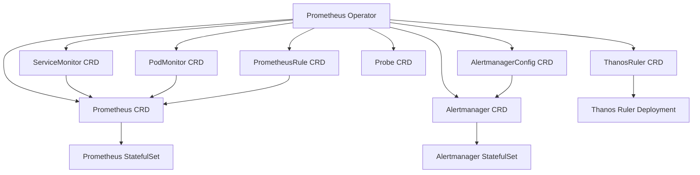

# 🧩 **Prometheus Stack Helm chart Components**

## 📌 **1.Prometheus Stack CRD Components**

This section lists all **Custom Resource Definitions (CRDs)** installed and managed by the **Prometheus Operator** as part of the Prometheus Stack Helm chart (`kube-prometheus-stack`).  
These CRDs extend the Kubernetes API to let Prometheus dynamically discover scrape targets, alerting rules, and configuration objects.

---

### 🧠 1.Core Monitoring CRDs

| CRD Kind       | API Group               | Purpose / Description                                                           |
| -------------- | ----------------------- | ------------------------------------------------------------------------------- |
| `Prometheus`   | `monitoring.coreos.com` | Defines a Prometheus instance (replicas, retention, resources, storage, etc.).  |
| `Alertmanager` | `monitoring.coreos.com` | Defines an Alertmanager cluster, including replicas and configuration.          |
| `ThanosRuler`  | `monitoring.coreos.com` | Defines a Thanos Ruler instance for evaluating rules in a Thanos-enabled setup. |

> These are the **main managed workloads**.
> The Prometheus Operator watches these CRDs and automatically creates StatefulSets and Services accordingly.

---

### 📡 2.Metric Discovery CRDs

| CRD Kind         | API Group               | Purpose / Description                                                                 |
| ---------------- | ----------------------- | ------------------------------------------------------------------------------------- |
| `ServiceMonitor` | `monitoring.coreos.com` | Defines how to scrape metrics from a Kubernetes Service (selectors, endpoints, etc.). |
| `PodMonitor`     | `monitoring.coreos.com` | Defines how to scrape metrics from individual Pods directly (useful for sidecars).    |
| `Probe`          | `monitoring.coreos.com` | Defines blackbox probing configuration (HTTP, TCP, ICMP) for synthetic monitoring.    |

> These CRDs **replace manual Prometheus scrape configs** — they automatically register scrape targets based on label selectors and endpoints.

---

### 📣 3.Alerting & Rule Management CRDs

| CRD Kind         | API Group               | Purpose / Description                                                |
| ---------------- | ----------------------- | -------------------------------------------------------------------- |
| `PrometheusRule` | `monitoring.coreos.com` | Defines alerting and recording rules for Prometheus and ThanosRuler. |

> This CRD centralizes PromQL rule management — enabling operators to create modular, version-controlled rule definitions.

---

### 🔐 4.Secret Management CRDs

| CRD Kind             | API Group               | Purpose / Description                                                                  |
| -------------------- | ----------------------- | -------------------------------------------------------------------------------------- |
| `AlertmanagerConfig` | `monitoring.coreos.com` | Defines Alertmanager routes, receivers, and notification templates within the cluster. |

> This allows **multi-tenant alert routing** and lets each team manage their own alert configuration securely without touching the global Alertmanager config.

---

### 🧠 Conceptual Diagram

---

> The **Prometheus Operator** is the central controller that continuously watches these CRDs and reconciles their desired state into actual Kubernetes objects such as Deployments, StatefulSets, Services, and ConfigMaps.

---

## 📌 **2.Prometheus Stack DaemonSet Components**

This section lists **DaemonSets** created by the Prometheus Stack Helm chart.

| DaemonSet Name                        | Description                                                                                |
| ------------------------------------- | ------------------------------------------------------------------------------------------ |
| `prometheus-prometheus-node-exporter` | Runs on every node to collect system-level metrics such as CPU, memory, disk, and network. |

> The Node Exporter DaemonSet ensures **node-level observability** by deploying one pod per node.

---

## 📌 **3.Prometheus Stack StatefulSet Components**

This section lists **StatefulSets** created by the Prometheus Stack Helm chart.

| StatefulSet Name                          | Description                                                                      |
| ----------------------------------------- | -------------------------------------------------------------------------------- |
| `prometheus-kube-prometheus-prometheus`   | The main Prometheus server that scrapes metrics and stores time series data.     |
| `prometheus-kube-prometheus-alertmanager` | The Alertmanager cluster responsible for managing, grouping, and routing alerts. |

> StatefulSets ensure **stable pod identities and persistent storage**, which is crucial for Prometheus and Alertmanager reliability and data durability.

---

## 📌 **4.Prometheus Stack Deploy Components**

This section lists all **Kubernetes Deployments** created by the Prometheus Stack Helm chart, grouped by function.

| Deployment Name                       | Description                                                                                        |
| ------------------------------------- | -------------------------------------------------------------------------------------------------- |
| `prometheus-kube-prometheus-operator` | The Prometheus Operator that manages CRDs like `Prometheus`, `Alertmanager`, and `ServiceMonitor`. |
| `prometheus-grafana`                  | Grafana dashboard UI for visualizing Prometheus metrics and alerts.                                |
| `prometheus-kube-state-metrics`       | Collects Kubernetes object-level metrics (pods, deployments, services, etc.).                      |

> These Deployments handle **control plane, visualization, and validation logic** — they are typically stateless and can be scaled horizontally.

---

## 📌 **5.Prometheus Stack Svc Components**

This section categorizes all Kubernetes services created by the Prometheus stack, grouped by their functional roles for clarity and future expansion (e.g. deployments, statefulsets, etc.).

---

### 🔧 Core Prometheus Services

| Service Name                            | Type      | Port     | Description                                                           |
| --------------------------------------- | --------- | -------- | --------------------------------------------------------------------- |
| `prometheus-kube-prometheus-prometheus` | ClusterIP | 9090/TCP | The main Prometheus server that scrapes metrics and serves the UI/API |
| `prometheus-operated`                   | Headless  | 9090/TCP | Internal service used by the operator to manage the Prometheus pod    |

> These two are tightly linked — `prometheus-operated` is a headless service created by the operator to access the Prometheus pod directly.

---

### 🧠 Operator Service

| Service Name                          | Type      | Port    | Description                                                                                         |
| ------------------------------------- | --------- | ------- | --------------------------------------------------------------------------------------------------- |
| `prometheus-kube-prometheus-operator` | ClusterIP | 443/TCP | The Prometheus Operator that manages CRDs like `Prometheus`, `Alertmanager`, `ServiceMonitor`, etc. |

> This is the brain of the stack — it watches CRDs and configures Prometheus and Alertmanager accordingly.

---

### 📣 Alertmanager Services

| Service Name                              | Type      | Port(s)                | Description                                                      |
| ----------------------------------------- | --------- | ---------------------- | ---------------------------------------------------------------- |
| `prometheus-kube-prometheus-alertmanager` | ClusterIP | 9093/TCP               | Public-facing Alertmanager service for Prometheus to send alerts |
| `alertmanager-operated`                   | Headless  | 9093/TCP, 9094/TCP/UDP | Internal service used by the operator to configure Alertmanager  |

> Just like Prometheus, Alertmanager has a public-facing service and an internal `-operated` service for operator access.

---

### 📊 Visualization

| Service Name         | Type      | Port   | Description                                                        |
| -------------------- | --------- | ------ | ------------------------------------------------------------------ |
| `prometheus-grafana` | ClusterIP | 80/TCP | Grafana dashboard UI for visualizing Prometheus metrics and alerts |

> Grafana connects to Prometheus and optionally Alertmanager to display dashboards and alerts.

---

### 📦 Metric Sources

| Service Name                          | Type      | Port     | Description                                                           |
| ------------------------------------- | --------- | -------- | --------------------------------------------------------------------- |
| `prometheus-prometheus-node-exporter` | ClusterIP | 9100/TCP | Exposes node-level metrics like CPU, memory, and disk                 |
| `prometheus-kube-state-metrics`       | ClusterIP | 8080/TCP | Exposes Kubernetes object metrics (e.g., pods, deployments, services) |

> These are scraped by Prometheus via `ServiceMonitor` resources.
