```mermaid
---
config:
  theme: dark
  look: handDrawn
title: "📦 Kubernetes Cluster"
---
flowchart TB
    %% Control Plane
    A@{ shape: hex, label: "📜 CRDs<br/>ServiceMonitor / PodMonitor / PrometheusRule" }
    B@{ shape: hex, label: "🧠 Prometheus Operator<br/>(Controller)" }
    C@{ shape: processes, label: "📊 Prometheus<br/>StatefulSet + PVC" }
    D@{ shape: processes, label: "🚨 Alertmanager<br/>StatefulSet + PVC" }
    E@{ shape: processes, label: "📈 Grafana Deployment" }
    F[[🧭 Kubernetes API Server]]

    %% Metrics Sources
    subgraph Sources["📡 Metrics Sources"]
      direction TB
      S1(["🧱 Node Exporter<br/>(DaemonSet)"])
      S2(["📦 Kube-State-Metrics<br/>(Deployment)"])
      S3([🧪 Kubelet / cAdvisor])
      S4([🧬 Your Apps expose<br/>`/metrics`])
    end

    %% Wiring
    A e1@--> B
    B e2@-->|Reconcile CRDs → generate config| C
    B e3@-->|Reconcile CRDs → generate config| D
    C e4@-->|Scrape via SD| S1
    C e5@-->|Scrape via SD| S2
    C e6@-->|Scrape via SD| S3
    C e7@-->|Scrape via SD| S4
    C e8@-->|Query/Rules API| E
    C e9@-->|Send alerts| D
    E e10@-->|PromQL via HTTP API| C
    C e11@-->|SD lists, Pods/Services/Endpoints| F

    classDef animate stroke-dasharray: 9,5,stroke-dashoffset: 900,animation: dash 25s linear infinite;
    class e1,e2,e3,e4,e5,e6,e7,e8,e9,e10,e11 animate
```

# ☸️ How Prometheus Works Internally in a Kubernetes Cluster

> _“From discovery to storage to alerting — the full internal journey”_

---

## 🧭 **High-Level View**

Let’s start with the big picture before diving into the internals:

Prometheus inside Kubernetes follows a **declarative workflow**:

> CRDs (what you want to monitor) → Operator (generates configs) → Prometheus (scrapes data) → Alertmanager (sends alerts) → Grafana (visualizes it)

---

<div align="center" style="background-color: #141a19ff;color: #a8a5a5ff; border-radius: 10px; border: 2px solid">



</div>

---

## 🧠 **Step-by-Step Internal Lifecycle**

Let’s trace **exactly what happens inside the cluster** when you deploy Prometheus Stack.

---

### 🔹 Step 1: CRDs Define Monitoring Intent

When you install the **Prometheus Operator**, it registers new **Custom Resource Definitions (CRDs)** — these extend the Kubernetes API with new resource types under the group `monitoring.coreos.com`.

Common CRDs:

<div align="center" style="background-color: #141a19ff;color: #a8a5a5ff; border-radius: 10px; border: 2px solid">

| CRD              | Purpose                                                             |
| ---------------- | ------------------------------------------------------------------- |
| `Prometheus`     | Defines how to run Prometheus itself (replicas, retention, storage) |
| `Alertmanager`   | Defines alert handling configuration                                |
| `ServiceMonitor` | Defines which Kubernetes Services to scrape                         |
| `PodMonitor`     | Defines which Pods to scrape directly                               |
| `PrometheusRule` | Defines alerting and recording rules                                |

</div>

You (or the Helm chart) create these resources as YAMLs.  
This tells the **Prometheus Operator** what to monitor — not how.

---

### 🔹 Step 2: Prometheus Operator Watches the CRDs

The **Prometheus Operator** is a **controller** running inside the cluster that continuously watches the Kubernetes API.

**It watches for:**

- New or updated `Prometheus` resources
- New or updated `ServiceMonitor`, `PodMonitor`, `PrometheusRule`
- New or updated `Alertmanager` resources

💡 It uses Kubernetes’ **Informer** mechanism — an efficient watch loop that reacts to API changes in real time.

Whenever one of these objects changes, the operator:

1. Regenerates the Prometheus config files (under `/etc/prometheus/config_out/`)
2. Recreates or reloads the Prometheus StatefulSet pods with the new configuration.

---

### 🔹 Step 3: Prometheus StatefulSet Creation

When you define a `Prometheus` custom resource, for example:

```yaml
apiVersion: monitoring.coreos.com/v1
kind: Prometheus
metadata:
  name: prometheus-k8s
spec:
  replicas: 2
  serviceMonitorSelector: {}
  resources:
    requests:
      memory: 1Gi
  retention: 15d
```

The **Operator** responds by creating:

- A **StatefulSet** (e.g. `prometheus-prometheus-k8s-0`)
- A **Service** (to expose it internally)
- A **ConfigMap** with generated configuration files
- A **Secret** for credentials (if needed)
- A **PersistentVolumeClaim** (for TSDB storage)

The StatefulSet ensures consistent **identity** and **storage persistence** for Prometheus replicas.

---

### 🔹 Step 4: Dynamic Service Discovery in Kubernetes

Prometheus doesn’t rely on static configs like in bare-metal.
Instead, it uses **Kubernetes Service Discovery** to find scrape targets automatically.

Prometheus connects to the **Kubernetes API server** using a ServiceAccount and discovers:

<div align="center" style="background-color: #141a19ff;color: #a8a5a5ff; border-radius: 10px; border: 2px solid">

| Target Type          | Source               |
| -------------------- | -------------------- |
| Nodes                | via `node` role      |
| Pods                 | via `pod` role       |
| Endpoints / Services | via `endpoints` role |
| Ingress              | via `ingress` role   |

</div>

It applies **label filters** and **relabeling** rules based on each `ServiceMonitor` or `PodMonitor` object.

✅ Each `ServiceMonitor` adds one or more **scrape jobs** to Prometheus dynamically.

---

### 🔹 Step 5: ServiceMonitor → Prometheus Scrape Config

Let’s take an example:

```yaml
apiVersion: monitoring.coreos.com/v1
kind: ServiceMonitor
metadata:
  name: myapp
  labels:
    release: prometheus
spec:
  selector:
    matchLabels:
      app: myapp
  endpoints:
    - port: http-metrics
      interval: 30s
```

**How it works internally:**

1. Operator sees new `ServiceMonitor`.
2. Finds all `Service` objects matching `app=myapp`.
3. Extracts endpoints named `http-metrics`.
4. Writes a Prometheus config section:

```yaml
scrape_configs:
  - job_name: servicemonitor/myapp/0
    kubernetes_sd_configs:
      - role: endpoints
    relabel_configs:
      - source_labels: [__meta_kubernetes_service_label_app]
        regex: myapp
        action: keep
    metrics_path: /metrics
    scrape_interval: 30s
```

💡 You never have to manually edit Prometheus configs — the operator keeps them in sync automatically.

---

### 🔹 Step 6: Scrape Targets → Prometheus TSDB

Prometheus now begins scraping all registered endpoints.

1. For every job, it sends an HTTP GET request to `/metrics`.

2. The endpoint responds with plain-text metrics like:

   ```ini
   http_requests_total{method="GET",status="200"} 4590
   process_cpu_seconds_total 394.2
   ```

3. Prometheus parses this data into **samples**:

   ```ini
   (metric_name, labels, value, timestamp)
   ```

4. Samples are stored in the **Time Series Database (TSDB)**:

   - Data is organized by `(metric_name + labelset)` into series.
   - Each time series is stored in compressed block files (~2h chunks).
   - Old blocks are compacted and eventually deleted after `retention`.

🧩 Prometheus storage path:

```ini
/prometheus/
 ├── chunks_head/
 ├── wal/ (write-ahead log)
 ├── 01F9D3XYZQF1/ (block dirs)
 └── meta.json
```

💡 WAL ensures crash recovery — Prometheus replays it on startup.

---

### 🔹 Step 7: Rules Evaluation (Recording + Alerting)

Prometheus periodically evaluates two kinds of rules defined in `PrometheusRule` CRDs.

#### 🧩 Recording Rules

Pre-compute frequently used queries:

```yaml
- record: instance:cpu_usage:rate5m
  expr: 1 - avg(irate(node_cpu_seconds_total{mode="idle"}[5m]))
```

→ Stored back into TSDB as a new time series.
✅ Speeds up dashboards & long-term queries.

#### ⚠️ Alerting Rules

Trigger alerts when conditions are met:

```yaml
- alert: HighCPUUsage
  expr: instance:cpu_usage:rate5m > 0.9
  for: 5m
  labels:
    severity: critical
  annotations:
    description: "CPU usage above 90% on {{ $labels.instance }}"
```

If the condition holds for 5 minutes, Prometheus **fires an alert** and sends it to **Alertmanager**.

---

### 🔹 Step 8: Alertmanager Handles Notifications

**Alertmanager** receives alerts via HTTP POST from Prometheus.

It then:

- Groups related alerts
- Deduplicates repeats
- Applies silence windows
- Routes alerts to the correct receivers (Slack, email, PagerDuty, etc.)

🧩 Example internal flow:

<div align="center" style="background-color: #141a19ff;color: #a8a5a5ff; border-radius: 10px; border: 2px solid">


</div>

---

### 🔹 Step 9: Grafana Queries Prometheus

Grafana communicates with Prometheus through the **HTTP API**.

Example query:

```ini
GET /api/v1/query?query=rate(http_requests_total[5m])
```

Prometheus:

- Fetches matching time series
- Executes PromQL
- Returns JSON data
  Grafana renders it in dashboards.

---

### 🔹 Step 10: Continuous Reconciliation

The **Operator** constantly watches:

- All Prometheus, Alertmanager, ServiceMonitor, and Rule CRDs.
- Pod health and configurations.

If anything drifts (e.g., manual change or crash), it reconciles automatically to the desired state.

> Kubernetes + Operator pattern = self-healing monitoring system.

---

## 🧰 **Internal Component Breakdown**

<div align="center" style="background-color: #141a19ff;color: #a8a5a5ff; border-radius: 10px; border: 2px solid">

| Layer                   | Component                                      | Description                                  |
| ----------------------- | ---------------------------------------------- | -------------------------------------------- |
| **Control Plane**       | Prometheus Operator                            | Watches CRDs, manages StatefulSets & configs |
| **Data Plane**          | Prometheus                                     | Scrapes, stores, and evaluates metrics       |
| **Alerting Plane**      | Alertmanager                                   | Routes and manages alerts                    |
| **Visualization Plane** | Grafana                                        | Dashboards, queries, and visual insights     |
| **Metrics Sources**     | Node Exporter, Kube-State-Metrics, App Metrics | Emit Prometheus-formatted metrics            |

</div>

---

## 🧩 **Deep Dive: Prometheus Config Generation Flow**

<div align="center" style="background-color: #141a19ff;color: #a8a5a5ff; border-radius: 10px; border: 2px solid">


</div>

✅ No restarts needed — configs reload dynamically.

---

## 🧮 **Internal Query Execution Flow**

<div align="center" style="background-color: #141a19ff;color: #a8a5a5ff; border-radius: 10px; border: 2px solid">


</div>

💡 PromQL queries are executed in-memory using efficient iterators over the time-series chunks.

---

## 💾 **Storage Architecture Details**

<div align="center" style="background-color: #141a19ff;color: #a8a5a5ff; border-radius: 10px; border: 2px solid">

| Concept                   | Description                                  |
| ------------------------- | -------------------------------------------- |
| **Head Block**            | Recent 2h of samples in memory               |
| **WAL (Write-Ahead Log)** | Disk-backed log for crash recovery           |
| **Persistent Blocks**     | Compressed chunks stored every 2h            |
| **Compactor**             | Merges blocks for efficiency                 |
| **Retention**             | Deletes old blocks after configured duration |

</div>

Typical TSDB file layout:

```ini
/prometheus/
 ├── wal/
 ├── chunks_head/
 ├── 01FABC1234/
 ├── 01FABD5678/
 └── meta.json
```

Each block stores:

- `chunks/` → compressed data
- `index` → series metadata
- `meta.json` → block metadata

---

## 🧠 **Key Internal Features**

<div align="center" style="background-color: #141a19ff;color: #a8a5a5ff; border-radius: 10px; border: 2px solid">

| Feature                     | Purpose                                                   |
| --------------------------- | --------------------------------------------------------- |
| **Relabeling**              | Modify or drop labels before storing                      |
| **Target Discovery**        | Auto-discovers scrape endpoints via Kubernetes            |
| **Rules Engine**            | Evaluates alerts and recording expressions                |
| **Service Discovery Cache** | Efficiently updates targets when cluster changes          |
| **Hot Reload**              | Apply config changes without restart                      |
| **Sharding/HA**             | Multiple Prometheus replicas with label `external_labels` |
| **Remote Write**            | Push data to long-term storage (Thanos, Mimir, Cortex)    |

</div>

---

## 🔍 **Data Flow Summary**

<div align="center" style="background-color: #141a19ff;color: #a8a5a5ff; border-radius: 10px; border: 2px solid">


</div>

1️⃣ Prometheus pulls metrics via `/metrics`  
2️⃣ Stores them in local TSDB  
3️⃣ Evaluates alert rules and notifies Alertmanager  
4️⃣ Grafana queries Prometheus for visualization

---

## 🧰 **Prometheus Operator in Action (Core Logic)**

<div align="center" style="background-color: #141a19ff;color: #a8a5a5ff; border-radius: 10px; border: 2px solid">


</div>

💡 The operator continuously compares _desired state_ (CRDs) vs _actual state_ (cluster resources) and reconciles differences.

---

## 🧱 **Real-World Example: Adding Your App**

1. You deploy your app exposing `/metrics` on port 8080.
2. Create a `Service` selecting your pods.
3. Add a `ServiceMonitor` pointing to that Service.
4. Operator sees it and adds a scrape config.
5. Prometheus scrapes it automatically within 30 seconds.
6. Metrics show up in the UI and Grafana dashboards.

No manual Prometheus edits. No pod restarts.  
Just declarative monitoring. 🌟

---

## 🧩 **Observability Lifecycle Recap**

<div align="center" style="background-color: #141a19ff;color: #a8a5a5ff; border-radius: 10px; border: 2px solid">

| Stage             | Component                 | What Happens                     |
| ----------------- | ------------------------- | -------------------------------- |
| **Discovery**     | ServiceMonitor/PodMonitor | Tells what to watch              |
| **Configuration** | Prometheus Operator       | Generates configs                |
| **Collection**    | Prometheus                | Pulls metrics periodically       |
| **Storage**       | TSDB                      | Persists samples                 |
| **Evaluation**    | Prometheus                | Runs rules (alerts + recordings) |
| **Notification**  | Alertmanager              | Sends alerts                     |
| **Visualization** | Grafana                   | Queries and visualizes           |

</div>

---

## 🧠 **Mental Model Summary**

> 🧩 Prometheus in Kubernetes behaves like a **living organism**:
>
> - **Eyes 👀:** ServiceMonitors & PodMonitors (discover what to watch)
> - **Brain 🧠:** Operator (interprets intent and reconfigures Prometheus)
> - **Heart ❤️:** Prometheus TSDB (stores and pumps metrics)
> - **Voice 📣:** Alertmanager (communicates problems)
> - **Face 🎨:** Grafana (visual representation)
> - **Nerves ⚡:** Exporters (connect cluster to brain)

---

## ✅ **TL;DR**

<div align="center" style="background-color: #141a19ff;color: #a8a5a5ff; border-radius: 10px; border: 2px solid">

| Concept                       | Summary                                                     |
| ----------------------------- | ----------------------------------------------------------- |
| **Prometheus Operator**       | Watches CRDs → Deploys & Configures Prometheus/Alertmanager |
| **ServiceMonitor/PodMonitor** | Define which endpoints to scrape                            |
| **Prometheus**                | Pulls `/metrics` → Stores in TSDB → Evaluates rules         |
| **Alertmanager**              | Handles and routes alerts                                   |
| **Grafana**                   | Queries Prometheus for visual dashboards                    |
| **Dynamic Discovery**         | Uses Kubernetes API to auto-find new pods/services          |
| **Declarative Monitoring**    | Everything is managed via Kubernetes manifests              |

</div>

---

## 1. Service Discovery & Config Reconciliation Loop

<div align="center" style="background-color: #141a19ff;color: #a8a5a5ff; border-radius: 10px; border: 2px solid">


</div>

---

## 2. Scrape → Store (TSDB) → Evaluate Rules → Alert

<div align="center" style="background-color: #141a19ff;color: #a8a5a5ff; border-radius: 10px; border: 2px solid">


</div>

---

## 3. Query Path (Grafana / API / CLI)

<div align="center" style="background-color: #141a19ff;color: #a8a5a5ff; border-radius: 10px; border: 2px solid">


</div>

---

## 4. End-to-End: From App to Dashboard

```mermaid
flowchart TB
  A[Your App exposes /metrics] --> B["Service (optional)"]
  B --> C[ServiceMonitor selects Service/port/path]
  C --> D[Prometheus Operator generates scrape config]
  D --> E[Prometheus scrapes target]
  E --> F[(TSDB)]
  F --> G["Recording Rules (precompute)"]
  F --> H["Alerting Rules (conditions)"]
  H --> I[Alertmanager → notifications]
  F --> J["Grafana panels (PromQL via API)"]
```

<div align="center" style="background-color: #141a19ff;color: #a8a5a5ff; border-radius: 10px; border: 2px solid">



</div>
