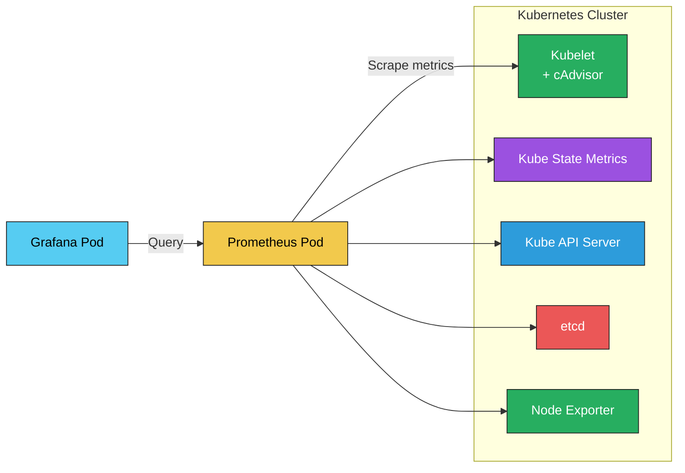

Perfect 👏 Let’s start strong.

---

# ☸️ Monitoring Kubernetes with Prometheus

> The evolution from container-level metrics to full cluster observability 🚀

---

## 🎯 Goal

You’ve already monitored:

* 🧱 Linux hosts (via Node Exporter)
* 🐳 Containers (via Docker metrics & cAdvisor)

Now it’s time to scale up to **Kubernetes**, where Prometheus doesn’t just scrape hosts or containers — it scrapes **the entire ecosystem**:

* Pods
* Nodes
* Namespaces
* Kubelet and API Server metrics
* Cluster components like etcd, scheduler, and controller-manager

---

## 🌐 1️⃣ Why Monitoring in Kubernetes Is Different

In Docker, you monitor static targets (like host IPs).
In Kubernetes, everything is **dynamic** — pods, nodes, and services are constantly created or destroyed.

So manual target lists (like `static_configs`) become impossible.
Prometheus solves this with **Kubernetes Service Discovery** 🧠.

---

### 🧩 What Prometheus Sees in Kubernetes

| Layer                   | Examples                              | Purpose                       |
| ----------------------- | ------------------------------------- | ----------------------------- |
| **Cluster Components**  | `kube-apiserver`, `etcd`, `scheduler` | Health of control plane       |
| **Node Level**          | `kubelet`, `node_exporter`            | Resource usage & system stats |
| **Pod/Container Level** | cAdvisor (built-in)                   | CPU, memory, I/O per pod      |
| **Workload Level**      | Deployments, DaemonSets               | Performance per application   |

---

## 🔍 2️⃣ Kubernetes Metrics Sources

| Source                    | Description                                            | Exposed At                     |
| ------------------------- | ------------------------------------------------------ | ------------------------------ |
| 🧠 **Kubelet**            | Exposes node & container metrics (via cAdvisor)        | `https://<node>:10250/metrics` |
| ⚙️ **Kube State Metrics** | Translates Kubernetes objects into metrics             | `:8080/metrics`                |
| 📦 **cAdvisor**           | Container-level performance stats (bundled in Kubelet) | `:10250/metrics/cadvisor`      |
| 🧩 **API Server**         | Metrics about API calls, latency, etc.                 | `:6443/metrics`                |
| 💾 **etcd**               | Cluster database health                                | `:2379/metrics`                |

✅ Prometheus can scrape *all of these* automatically once integrated with Kubernetes Service Discovery.

---

## 🧠 3️⃣ How Prometheus Integrates Inside Kubernetes

Let’s visualize 👇



> Prometheus runs **inside the cluster**, scraping metrics from every component using **Kubernetes API-based discovery** instead of fixed IPs.

---

## ⚙️ 4️⃣ Prometheus Configuration (Kubernetes Service Discovery)

Prometheus dynamically discovers targets using the Kubernetes API:

```yaml
scrape_configs:
  - job_name: 'kubernetes-nodes'
    kubernetes_sd_configs:
      - role: node
    scheme: https
    tls_config:
      ca_file: /var/run/secrets/kubernetes.io/serviceaccount/ca.crt
      insecure_skip_verify: true
    bearer_token_file: /var/run/secrets/kubernetes.io/serviceaccount/token

  - job_name: 'kubernetes-pods'
    kubernetes_sd_configs:
      - role: pod
    relabel_configs:
      - source_labels: [__meta_kubernetes_pod_annotation_prometheus_io_scrape]
        action: keep
        regex: true
```

### 🧩 Explanation

* **`role: node`** → discovers node-level targets (Kubelet, node exporter)
* **`role: pod`** → discovers pod-level endpoints dynamically
* **`relabel_configs`** → filters only those pods annotated with `prometheus.io/scrape=true`

---

## 🧱 5️⃣ Installing Prometheus in Kubernetes

### Option 1: Using Helm (recommended)

```bash
helm repo add prometheus-community https://prometheus-community.github.io/helm-charts
helm install prometheus prometheus-community/prometheus
```

Helm automatically deploys:

* Prometheus Server
* Alertmanager
* Node Exporter DaemonSet
* Kube State Metrics
* ConfigMaps for scrape targets

### Option 2: Manual YAML Deployment

If you prefer YAMLs:

```bash
kubectl apply -f prometheus-deployment.yaml
kubectl apply -f prometheus-service.yaml
```

---

## 📊 6️⃣ Visualizing with Grafana

Grafana connects to Prometheus via the in-cluster URL:

```
http://prometheus-server.prometheus.svc.cluster.local
```

And you can import prebuilt Kubernetes dashboards:

* **315** – Kubernetes cluster monitoring
* **6417** – Kubelet performance
* **12104** – Node & Pod resource usage

---

## 💡 7️⃣ Best Practices for Cluster Observability

| Practice                                                 | Benefit                          |
| -------------------------------------------------------- | -------------------------------- |
| 🔒 Use RBAC for Prometheus ServiceAccount                | Restrict API permissions         |
| 🧱 Use ServiceMonitors (via Prometheus Operator)         | Auto-discover annotated Services |
| 📊 Aggregate data with Thanos / Cortex                   | Scale for large clusters         |
| ⚡ Scrape interval tuning                                 | Reduce API load                  |
| 🧩 Label consistently (e.g., `namespace`, `pod`, `node`) | Easier queries & dashboards      |

---

## 🧠 Summary

| Metric Source          | Component          | Prometheus Role       |
| ---------------------- | ------------------ | --------------------- |
| **Node / cAdvisor**    | Kubelet            | Resource usage        |
| **Pod-level**          | cAdvisor           | Per-container metrics |
| **Kubernetes Objects** | Kube State Metrics | Cluster state         |
| **Control Plane**      | API Server, etcd   | Cluster health        |
| **Custom Apps**        | Exporters / SDKs   | Application metrics   |

---

✅ **Result:**
Prometheus provides **full-stack observability** —
from **node → container → pod → deployment → cluster** 💥

---

Would you like me to move next into **“Installing Prometheus Operator and ServiceMonitors (the modern Kubernetes monitoring method)”**?
It’s the next big concept after basic Prometheus integration.
