# Prometheus in K8s

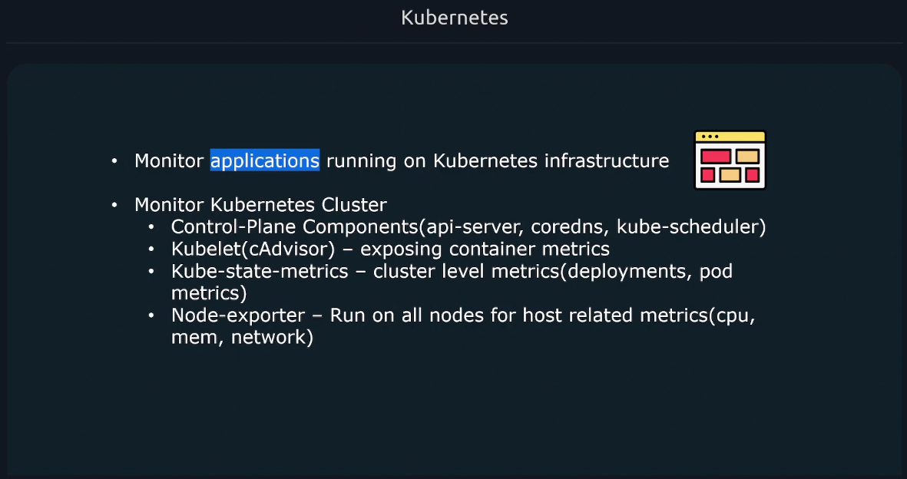

- cluster metrics via `kube-state-metrics`

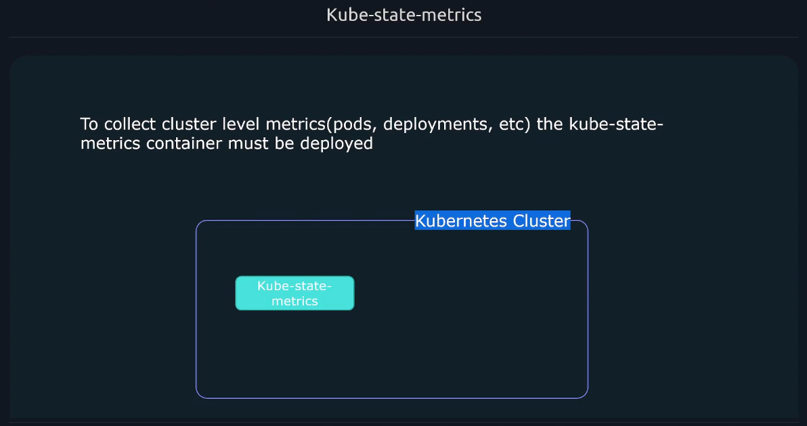

- node metrics via `node_exporter`

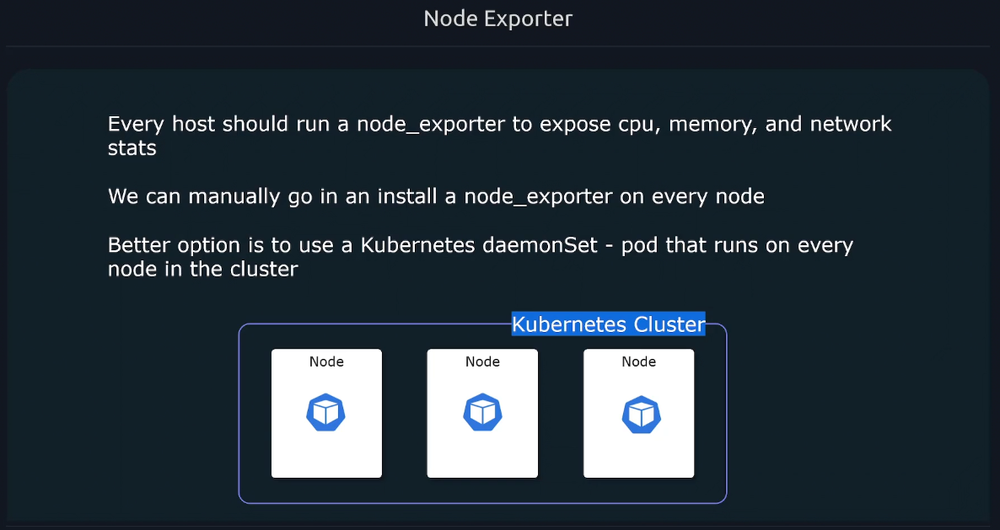

## service discovery

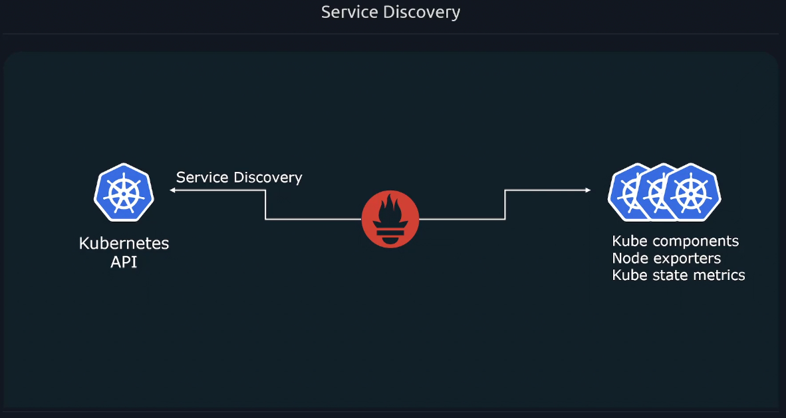

## How to Deploy

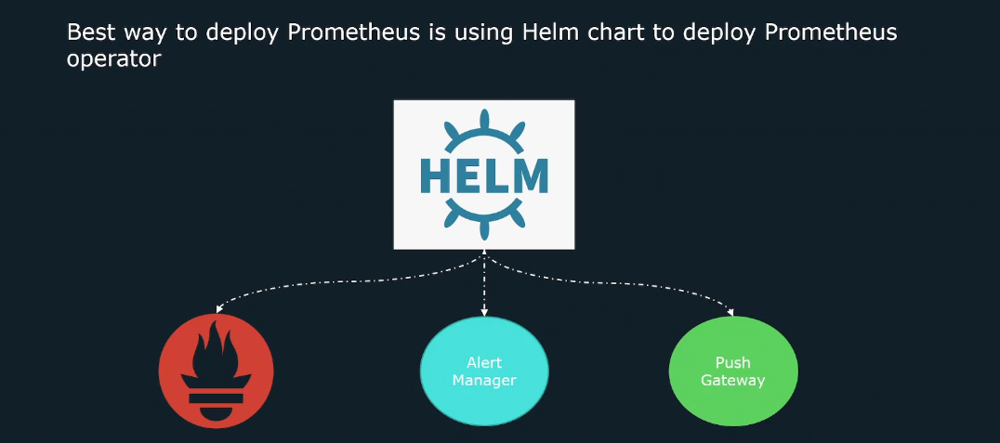

- Repository: prometheus-community
- Chart: kube-prometheus-stack
- [Prometheus Helm Chart Link](https://github.com/prometheus-community/helm-charts/tree/main/charts/kube-prometheus-stack)

## How kube-prometheus-stack works

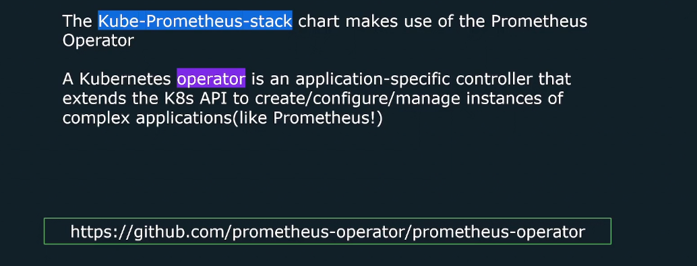

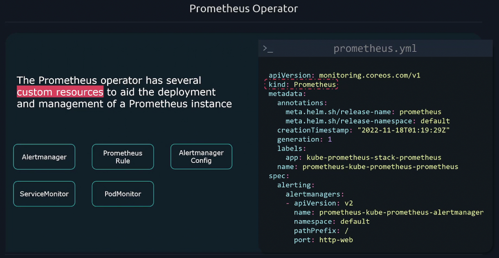

---

---

### Install Prometheus Helm Chart

```sh
helm repo add prometheus-community https://prometheus-community.github.io/helm-charts
helm repo update
helm install prometheus prometheus-community/kube-prometheus-stack
```

## Prometheus Chart Components

...

## Additional Scrape Configs in values.yaml

```yaml
# additionalScrapeConfigs:
# - job_name: 'prometheus'
#   scrape_interval: 5s
#   static_configs:
#     - targets: ['localhost:9090']
```

---

## Service Monitor (CDRs)

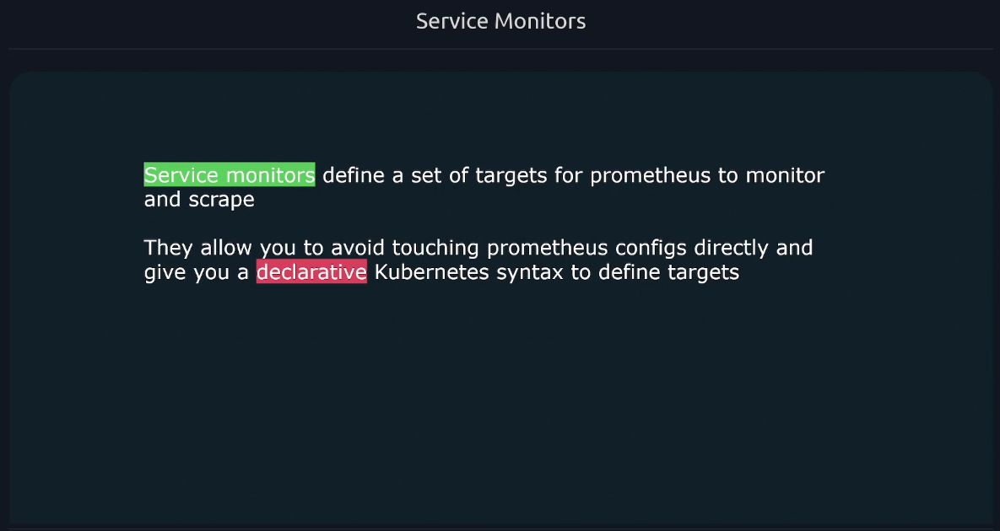

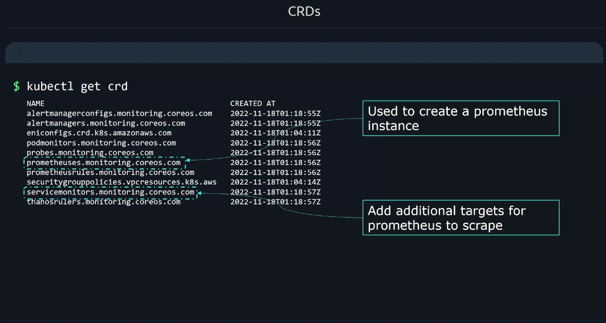

> configure service monitors

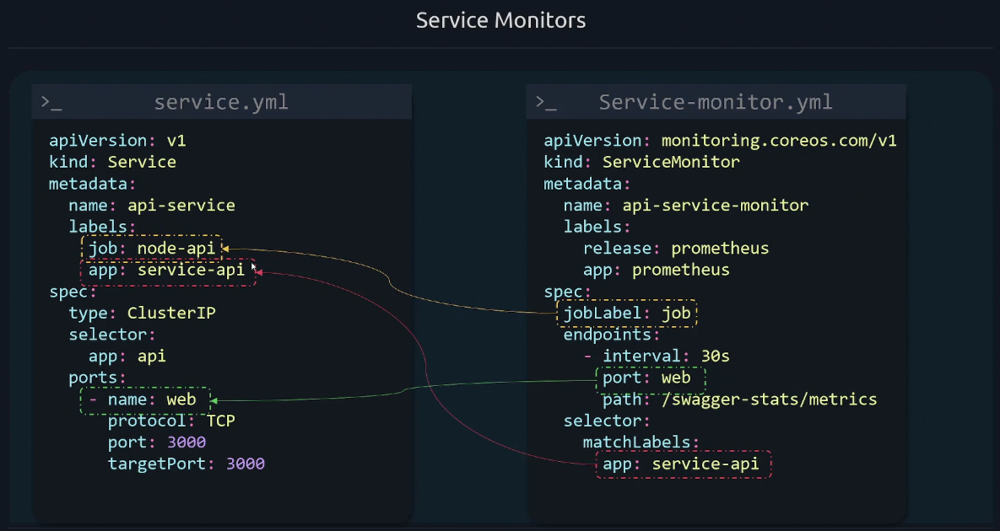

```bash
# select release label
kubectl get prometheus.monitoring.coreos.com  -ojsonpath='{.items[0].spec.serviceMonitorSelector.matchLabels.release}'
```

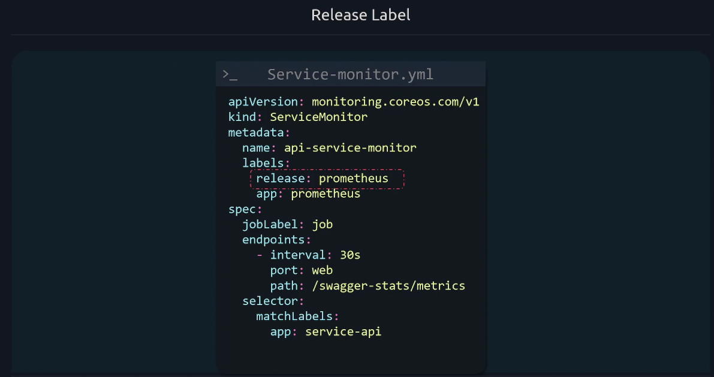

```bash
kubectl apply -f service-monitor.yaml
```

---

## Adding Recording Rules

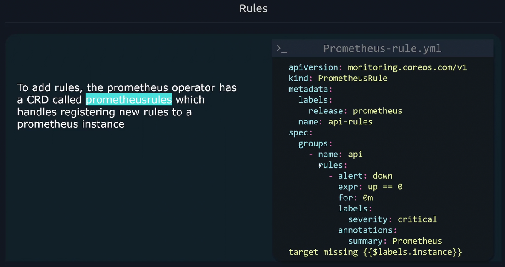

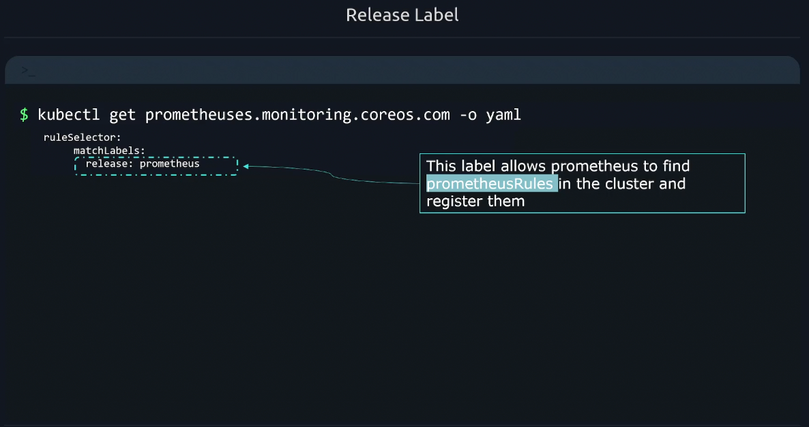

## Adding Alerts Rules

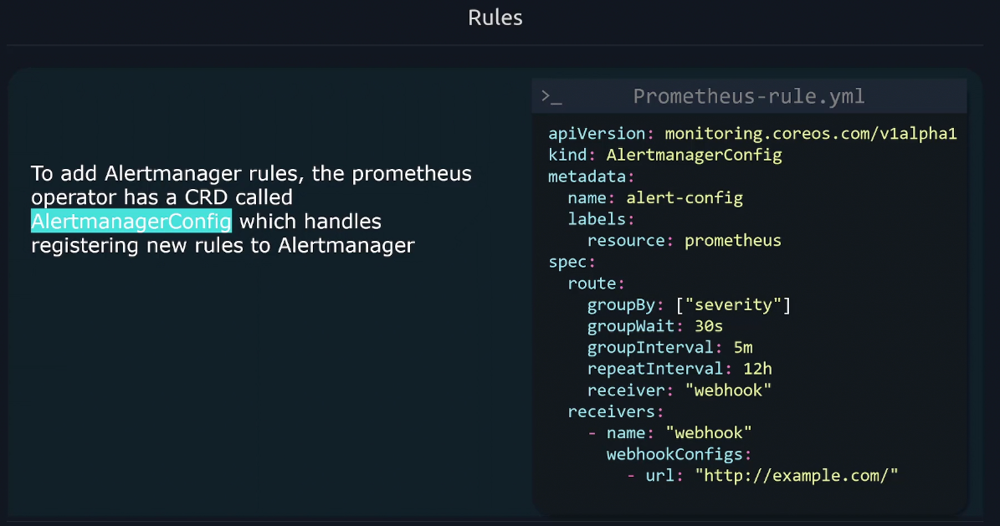

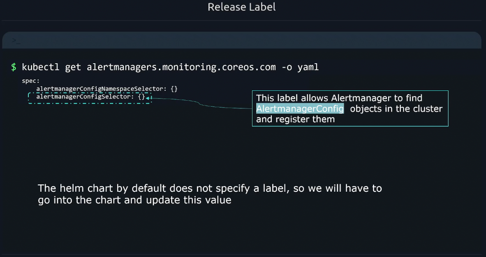


## Upgrade Helm Chart

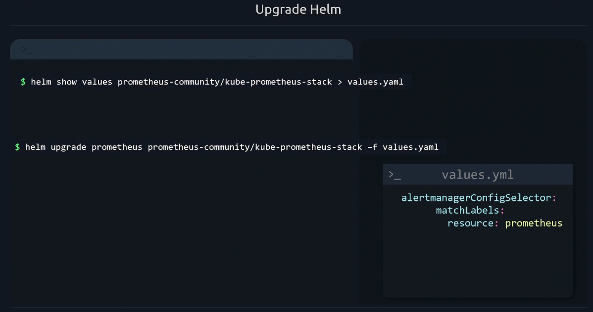
