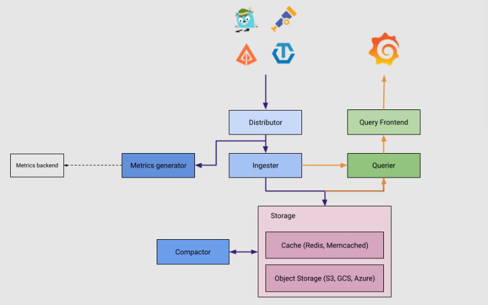
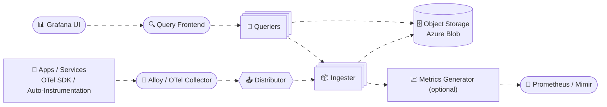

# 📐 Tempo architecture

> **Grafana Tempo receives spans, groups them by TraceID, stores them cheaply in object storage, and lets you fetch/search traces fast (by TraceID or TraceQL).**

Pipeline (typical):
**App (OTel SDK/auto-instr)** → **Alloy / OTel Collector** → **Tempo** → **Grafana UI**

---

<div align="center" style="background-color:#E6E6E6; border-radius: 10px; border: 2px solid">
    
</div>

---

## ⚔️ Two deployment styles: Monolithic vs Distributed

## 📦 Monolithic mode

One Tempo process contains most roles together (internally):

- ingesting spans
- writing blocks to storage
- reading/searching traces

It’s simpler, fewer k8s objects, great to start.

## 🤹‍♂️ Distributed mode

Tempo splits responsibilities into **separate components** (pods):
Distributor, Ingester, Query-Frontend, Querier, Compactor, etc.
This is for high throughput + horizontal scaling.

> Even in monolithic, it helps to understand the “logical components” because the behavior is the same.

---

## 💬 Mental model: “Mail sorting center”

Imagine spans are **letters** arriving from many services.

Tempo must:

1. **Receive** letters (spans)
2. **Group** letters by **TraceID** (same “case file”)
3. **Pack** them into **blocks** and store in **object storage**
4. Later, when you ask “give me case file X”, it must **find** and **return** all letters for that TraceID fast

Now map that to Tempo components.

---

## 🚪 1. Distributor (the “receiving desk + router”)

### What it does

- Accepts spans in multiple formats (OTLP, Jaeger, Zipkin…)
- **Routes spans to the right Ingester(s)** by hashing **TraceID**
- Uses a **consistent hash ring** so routing stays stable as pods scale

### Why hashing by TraceID matters

All spans for the same trace should land on the same ingester set (or predictable subset), so Tempo can build blocks efficiently.

### Best practice

- **OTLP (protobuf) ingestion is fastest**, so Alloy typically uses OTLP exporter to Tempo.

---

## 🏗️ 2.Ingestr (the “builder + packer + uploader”

### What it does

1. Receives spans from Distributor
2. Keeps “recent traces” in memory (and/or WAL depending config)
3. Builds **blocks** over a time/size window
4. Writes blocks to **object storage**
5. Creates **indexes + bloom filters** so queries are fast later

### What is a “block”?

A block is like a **packed box** containing many traces for a time window.

In object storage you’ll see something like:

```ini
<bucket>/<tenant>/<blockID>/
  meta.json
  index
  data
  bloom_0 ... bloom_n
```

### Why parquet/index/bloom?

- **Parquet** layout helps with efficient columnar reads
- **Index** helps locate candidate traces
- **Bloom filters** help quickly skip blocks that definitely don’t contain a trace/span you’re looking for

> In monolithic mode, the same process still “acts as an ingester” internally.

---

## 🎛️ 3. Query Frontend (the “smart receptionist for queries”)

Grafana usually talks to **Query Frontend** (in distributed mode).

### What it does

- Receives requests like:
  - **Get trace by TraceID**
  - **Search using TraceQL**

- **Shards** the search space into many sub-queries
- Sends shards to multiple Queriers in parallel
- Collects results and returns a combined response

### Why it exists

Search can be expensive. Sharding + parallelism is how Tempo stays responsive.

Example endpoint conceptually:

- `GET /api/traces/<traceID>` (what Grafana uses)

---

## 🔎 4. Querier (the “detective that reads storage”)

### What it does

When you ask for a trace (or TraceQL search):

- Looks in **Ingesters** first for **recent not-yet-flushed** data
- Looks in **object storage blocks** for historical data
- Uses bloom/index to avoid scanning everything
- Returns spans back to Query Frontend

Querier has its own HTTP endpoint, but:

> You typically query **Query Frontend**, not Queriers directly.

---

## 🧹 5. Compactor (the “warehouse optimizer + garbage collector”)

### What it does

- Compacts blocks → fewer bigger blocks (less fragmentation, faster queries)
- Deduplicates data (advanced topic)
- Enforces **retention** (deletes old blocks after N days)

### Key point for you (retention question)

Retention is _not_ “only a setting in the ingester”.
Retention is **actually enforced by compaction/retention jobs** that delete old data in object storage.

---

## 🗓️ 6. Backend Scheduler + Worker 🧑‍🏭 (newer compaction architecture)

Tempo is moving from “Compactor does all jobs” to:

- **Scheduler**: decides what jobs must run and tracks them
- **Workers**: execute jobs (compaction, retention, and more later)

Important operational rules (from your reference):

- Only one scheduler active
- When enabling workers, scale compactor to 0 to avoid conflicts
- Workers maintain blocklist coordination via the ring

(If you’re on monolithic, you might not touch this yet.)

---

## 📈 7. Metrics Generator (optional) (turn traces into Prometheus metrics)

This is the “bridge” between tracing and metrics.

### What it can generate

- **Span metrics** (a.k.a. `traces_spanmetrics_*`)
  - request rate (RPS)
  - error rate
  - latency histograms

Example families you’ll see in Prometheus:

- `traces_spanmetrics_calls_total`
- `traces_spanmetrics_latency_sum`
- `traces_spanmetrics_latency_bucket` ✅ (your earlier question)

### Why it’s useful

You can build RED dashboards (Rate, Errors, Duration) from traces even if apps don’t expose good metrics.

---

## 🪣 Object Storage (the “source of truth”)

Tempo stores trace blocks in object storage:

- S3
- GCS
- **Azure Blob** (your case)

Why object storage?

- Cheap
- Durable
- Scales well
  Tempo keeps minimal local state compared to systems like Elasticsearch-based tracing.

---

## 🧠 Three critical “Tempo truths” (must remember)

## 1. There is no “end of trace”

A trace can receive spans later (retries, async processing, delayed spans).

## 2. Querying TraceID returns “what Tempo currently has”

You get all spans stored/ingested _so far_ for that TraceID.

## 3. TraceQL search is parallel and not guaranteed chronological

Frontends return results as they arrive; they may stop early when reaching a limit.

---

<div align="center" style="background-color: #2b3436ff; border-radius: 12px; padding: 10px; border: 2px solid #3e4b4d;">



</div>
