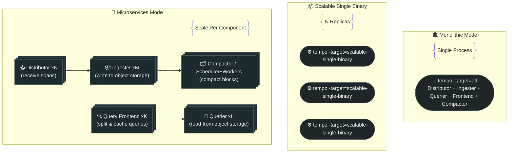

# 🚀 Deployment modes

Tempo is one binary, but it can start **different internal roles** based on **target**:

- `-target=all` → run **everything** in one process (**Monolithic**)
- `-target=scalable-single-binary` → run everything but **in a way that supports multiple replicas** (**SSB / scalable monolithic**)
- `-target=querier` / `distributor` / `ingester` / … → run **one component per process** (**Microservices / distributed**)

So “deployment mode” is basically: **how many processes** and **what each process is responsible for**.

---



## 📦 1. Monolithic mode (Single process does everything)

### What it is

One Tempo instance runs all components **inside one process**:

- ingest
- index/build blocks
- store to object storage
- query
- compact/retention

Command-line:

```bash
tempo -target=all   # default
```

### Mental model

“One warehouse worker does receiving + packing + searching + cleaning.”

### ✅ Pros

- Lowest operational complexity
- One Deployment, one Service
- Great for dev / PoC / small–medium throughput
- Easy Helm install (this is what `grafana-community/tempo` commonly gives you)

### ❌ Cons (the big one)

When sustained volume grows, **one process becomes the bottleneck**:

- memory pressure (indexing + buffering + block building)
- CPU pressure (ingest + query + compaction compete)
- worst case: **OOM → restart → missed traces** (because the process doing ingestion dies)

### When it fits

- “We’re getting started”
- “Trace volume is modest”
- “We can tolerate some risk during spikes”
- “We want easiest ops”

---

## (📦+📦+📦) 2. Scaling monolithic mode (Scalable Single Binary / SSB)

> This is the “I want more horsepower, but I don’t want full microservices complexity” option.

### What it is

You run **multiple replicas** of Tempo, but each replica still runs “all components” inside one process.

Command-line:

```bash
tempo -target=scalable-single-binary
```

### What makes it scalable compared to plain monolithic?

The system behavior changes to support multiple replicas safely:

- consistent hashing / ring used to coordinate ingestion responsibilities
- queriers connect to query-frontend via **frontend_address** discovery (DNS lookup)

### Mental model

“Multiple warehouse workers, each can do everything, but they coordinate.”

### ✅ Pros

- Horizontal scale without deploying 6–8 separate microservices
- Still simpler than full distributed mode
- Better resilience than a single monolith

### ❌ Cons / gotchas

- Still “all roles in one process”, so **resource contention remains**
- Requires coordination config (ring, frontend address, etc.)
- Not as clean as microservices for tuning (e.g., “I only need more ingesters”)

### When it fits

- You’re outgrowing monolithic
- You want HA-ish behavior
- You want scale but minimal component sprawl

---

## 🤹‍♂️ 3. Microservices mode (Distributed / “real production”)

### What it is

Each Tempo component runs as its **own Deployment** (its own process):

- Distributor (N replicas)
- Ingester (M replicas)
- Query Frontend (K replicas)
- Querier (L replicas)
- Compactor / or Scheduler+Worker
- (Optional) metrics-generator

Command examples:

```bash
tempo -target=distributor
tempo -target=ingester
tempo -target=query-frontend
tempo -target=querier
...
```

### Mental model

“A full warehouse: receiving desk, packing team, detective team, cleaning team — each scales independently.”

### ✅ Pros

- **Scale per component** (need more ingest? scale ingesters; need faster search? scale queriers)
- **Better failure domains** (one component crash doesn’t take everything down)
- **Replication factor** is meaningful (e.g., distributor sends spans to multiple ingesters)
- Preferred for production with high volume / high availability requirements

### ❌ Cons

- Highest operational complexity (more Deployments, services, ring config, upgrades)
- Higher infra cost (more pods, more tuning)
- Needs more observability/maintenance maturity

### When it fits

- Sustained high throughput
- You need real HA and replication
- You need predictable performance under load spikes
- You have ops maturity to run distributed systems

### Helm mapping

- This is the default style for **`tempo-distributed`** chart (Grafana / GET style).

---

## ✅ Practical decision guide

### Choose **Monolithic** if:

- You’re early-stage / dev / limited throughput
- You want simplest install & upgrades
- Occasional drops during extreme spikes are acceptable

### Choose **SSB** if:

- Monolithic is “running hot” (CPU/memory)
- You want to scale out quickly
- You still want “one logical service” operationally

### Choose **Microservices** if:

- You need HA + replication for ingest
- You have heavy sustained ingest
- Query performance matters at scale
- You want proper per-component scaling knobs
