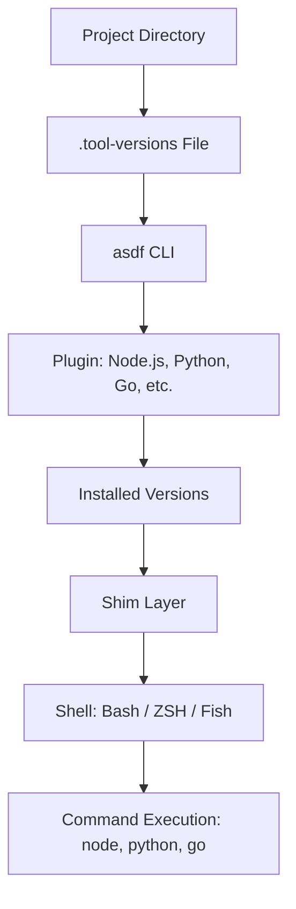

# 🧰 asdf

> _📖 Unified Version Manager for Multiple Runtimes and CLI Tools._

**asdf** is a lightweight, extensible **version manager** that lets you manage multiple programming languages, CLI tools, and runtimes — all from a **single interface**. It’s designed for **developer productivity**, **project consistency**, and **CI/CD reproducibility**, making it a strategic utility for DevOps engineers, full-stack developers, and SREs working across polyglot environments.

---

## 🧠 Architectural Overview

asdf operates as a **plugin-based CLI tool** with a simple but powerful structure:

| Component                     | Role                                                             |
| ----------------------------- | ---------------------------------------------------------------- |
| 📦 **Plugins**                | Add support for runtimes (Node.js, Python, Go, Terraform, etc.). |
| 📄 **.tool-versions File**    | Declares tool versions per project or globally.                  |
| 🧰 **Shims**                  | Lightweight wrappers that route commands to the correct version. |
| 🐚 **Shell Integration**      | Works with Bash, ZSH, Fish, Elvish — supports completions.       |
| 🔄 **Global & Local Configs** | Set versions globally or per directory/project.                  |

asdf uses **shims** to intercept CLI calls and redirect them to the correct version based on your configuration — ensuring consistency across environments.

---

## 📦 Key Features

- 🧬 **Multi-runtime support**: Manage Node.js, Python, Ruby, Java, Go, Rust, Terraform, and more.
- 🔌 **Plugin ecosystem**: 300+ community plugins; easy to add custom ones.
- 📄 **Single config file**: `.tool-versions` defines all tool versions in one place.
- 🔁 **Global & local versioning**: Set tool versions per project or system-wide.
- 🧪 **Backwards compatibility**: Supports `.nvmrc`, `.ruby-version`, etc.
- 🧰 **CI/CD friendly**: GitHub Actions integration for reproducible builds.
- 🐚 **Shell completions**: Tab-completion for commands and versions.
- 📦 **Version listing & installation**: Easily list, install, and switch between versions.
- 🔐 **Isolation & reproducibility**: Prevents version drift across teams and machines.

---

## 🚀 When to Use asdf

asdf is ideal for:

- 🧠 **Polyglot development** across multiple languages and tools.
- 🧰 **Project-specific versioning** to avoid global conflicts.
- 🔁 **CI/CD pipelines** needing reproducible environments.
- 📦 **Toolchain bootstrapping** for onboarding and automation.
- 🔐 **Security-conscious setups** avoiding system-wide installs.

It’s especially powerful in **monorepos**, **multi-service architectures**, and **DevOps toolchains** where version consistency is critical.

---

## ⚔️ asdf vs nvm vs pyenv vs tfenv

| Feature                 | 🧰 **asdf**                            | 🐢 **nvm** (Node.js) | 🐍 **pyenv** (Python) | 🌍 **tfenv** (Terraform) |
| ----------------------- | -------------------------------------- | -------------------- | --------------------- | ------------------------ |
| Scope                   | Multi-runtime                          | Node.js only         | Python only           | Terraform only           |
| Plugin Support          | ✅ 300+ plugins                        | ❌ None              | ❌ None               | ❌ None                  |
| Config File             | `.tool-versions`                       | `.nvmrc`             | `.python-version`     | `.terraform-version`     |
| Global & Local Versions | ✅ Yes                                 | ✅ Yes               | ✅ Yes                | ✅ Yes                   |
| Shell Integration       | ✅ Bash, ZSH, Fish                     | ✅ Bash, ZSH         | ✅ Bash, ZSH          | ✅ Bash, ZSH             |
| CI/CD Compatibility     | ✅ GitHub Actions, reproducible builds | 🔶 Manual setup      | 🔶 Manual setup       | 🔶 Manual setup          |
| Use Case Fit            | DevOps, full-stack, CI/CD              | Node.js dev          | Python dev            | Infra-as-code pipelines  |

**TL;DR**:

- Use **asdf** for **multi-tool version management**.
- Use tool-specific managers only if you’re locked into one language.

---

## 🗺️ Visual Model (Mermaid-style)

This shows how asdf intercepts CLI calls and routes them to the correct version based on your config.

---

## 🧩 Strategic Fit for You, Hady

- 🧠 **Architectural clarity**: asdf’s plugin-based model and shim routing align with your modular design mindset.
- 📁 **Portfolio-ready**: Showcase reproducible `.tool-versions` files across CI/CD pipelines and onboarding flows.
- 🧪 **Tool benchmarking**: Compare asdf vs direnv vs Docker-based version isolation for developer experience and reliability.
- 🔐 **Security signaling**: Avoid global installs, enforce per-project toolchains, and audit version usage.
- 📊 **Interview leverage**: Model toolchain bootstrapping, version drift prevention, and multi-language workflows.

---

You can explore asdf’s official documentation on [asdf-vm.com](https://asdf-vm.com/) or check out [Joshua’s DevOps cheatsheet](https://docs.joshuatz.com/cheatsheets/devops/asdf/) for command references and troubleshooting tips.
