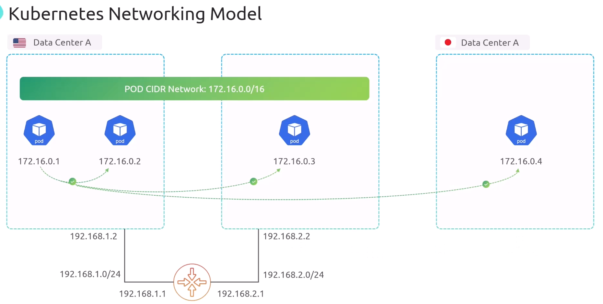
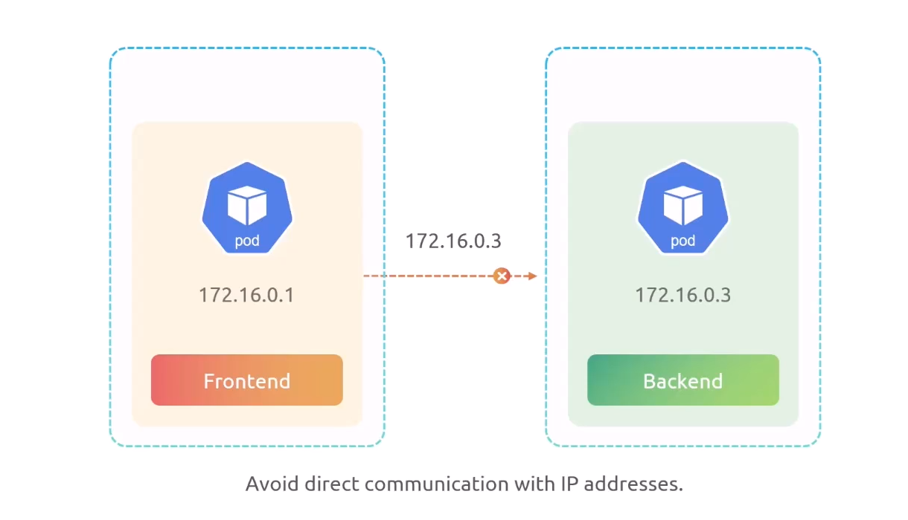
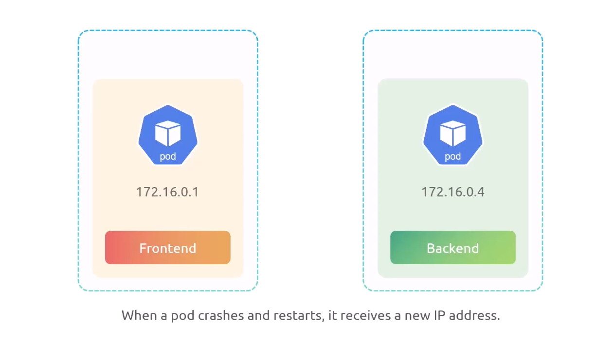
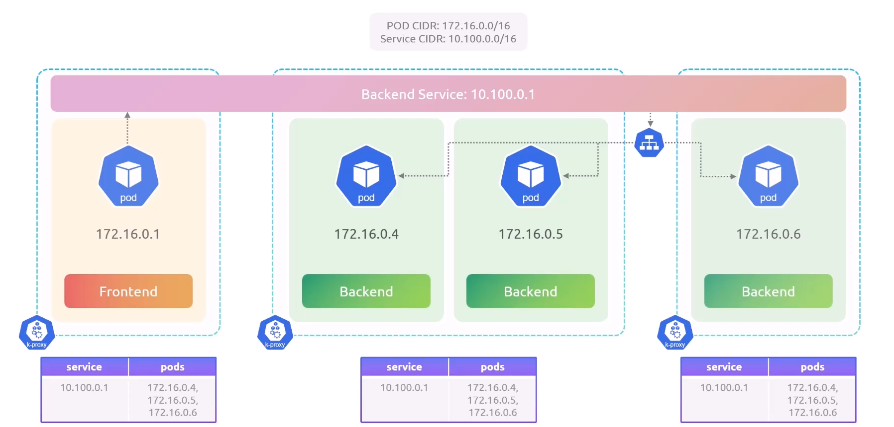
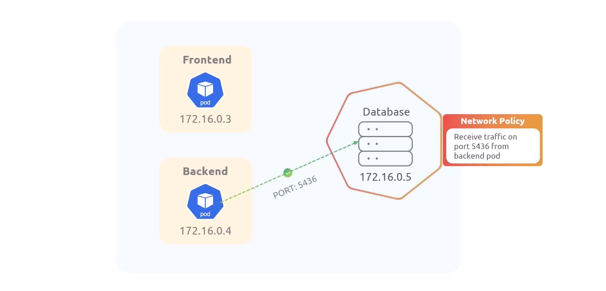
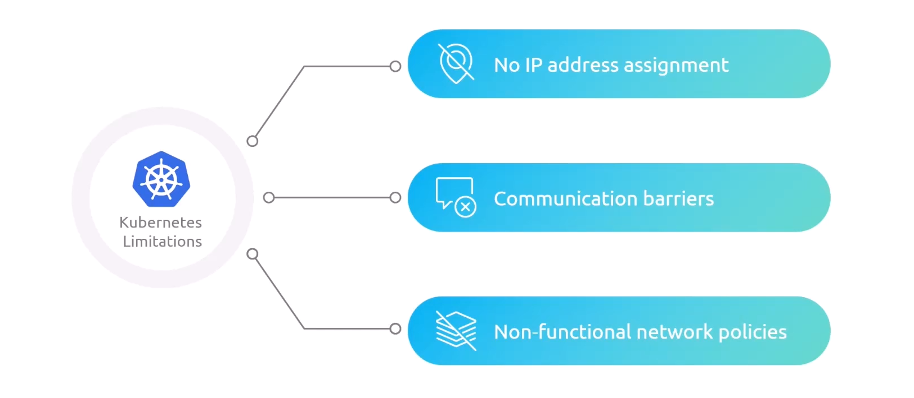
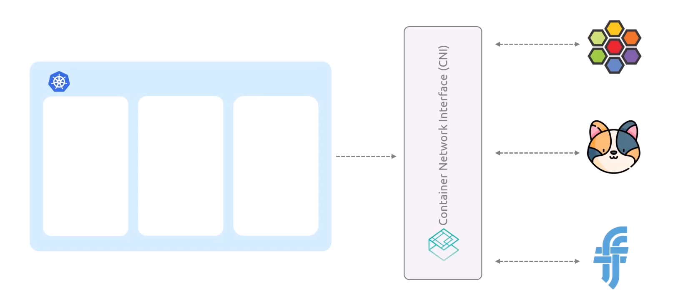

# K8s Networking

## 1.Pods

> By Default, All pods should be able to talk each other

## 2.Services

> Avoid direct communication with pod IP addresses, (use service IP instead)

## 3.Network Policies

> Network policies can be used to control the traffic between pods

## CNI

> `K8s does not implement networking functionality`  
> you should implement networking functionality yourself

