# Cilium

> Cilium is more than just a CNI plugin.

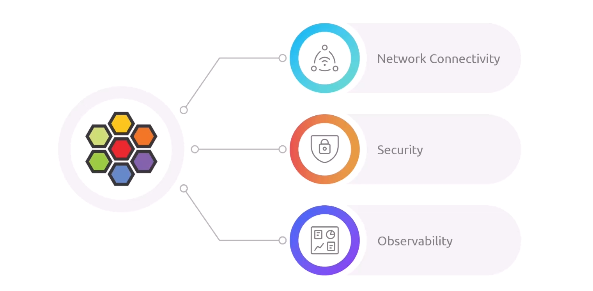

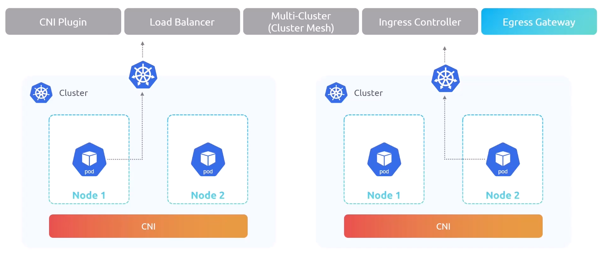

## Cilium Features

### 1. Security

#### Network Policy (L3/L4)

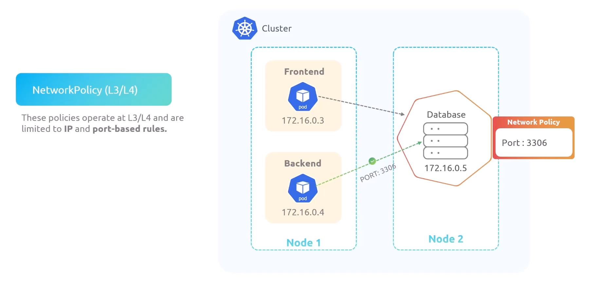

#### Network Policy (L7)

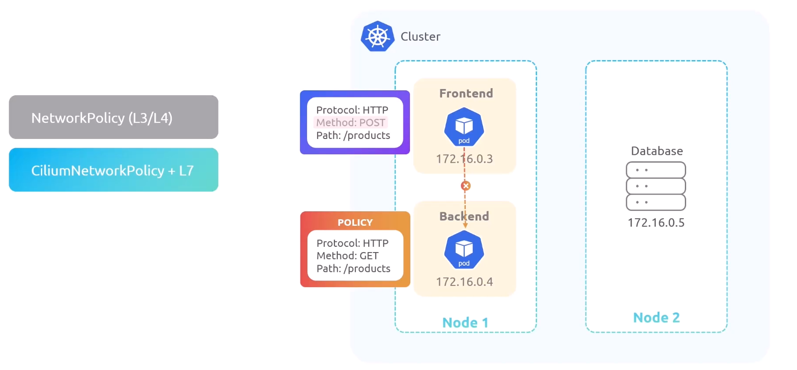

#### Encryption

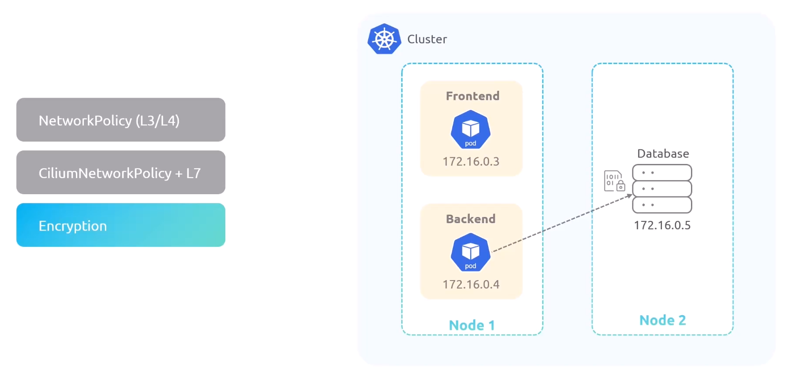

### 2. Observability

#### Integration with Prometheus and Grafana

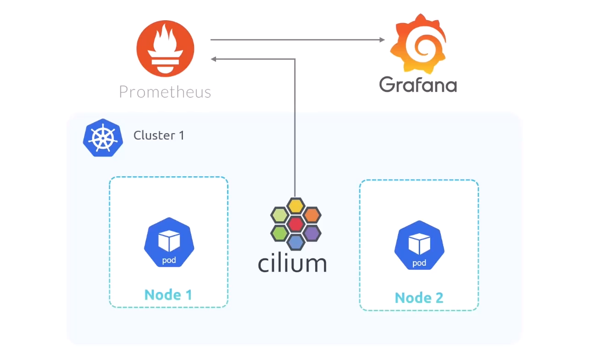

#### Hubble

> observability layer of cilium

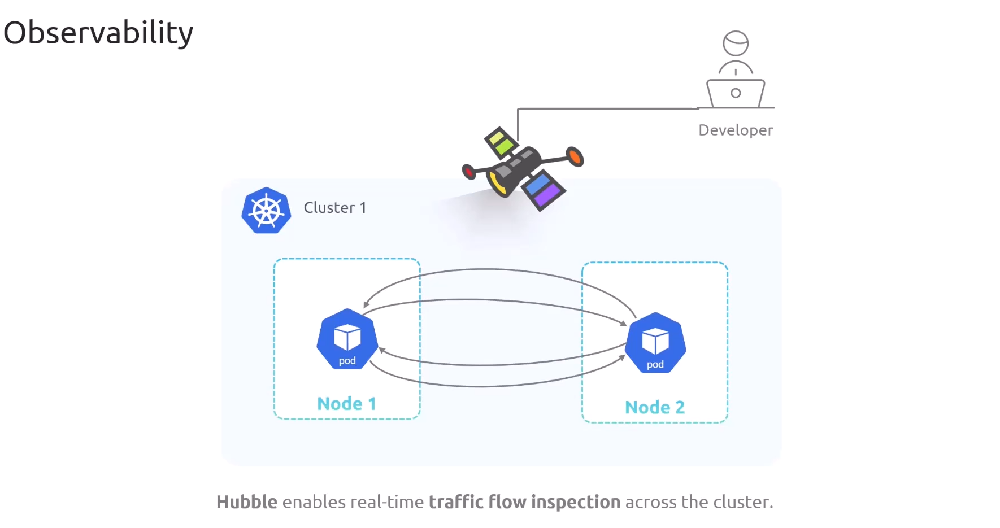

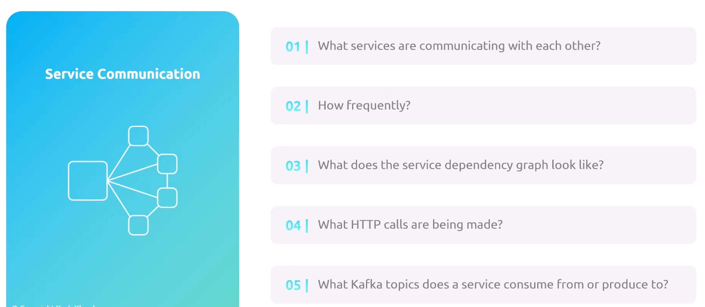

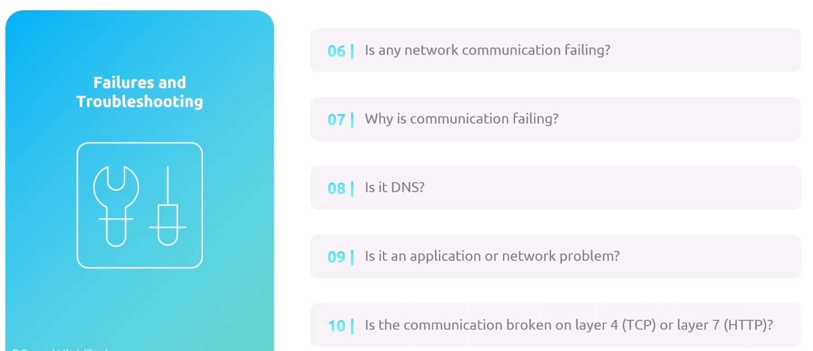

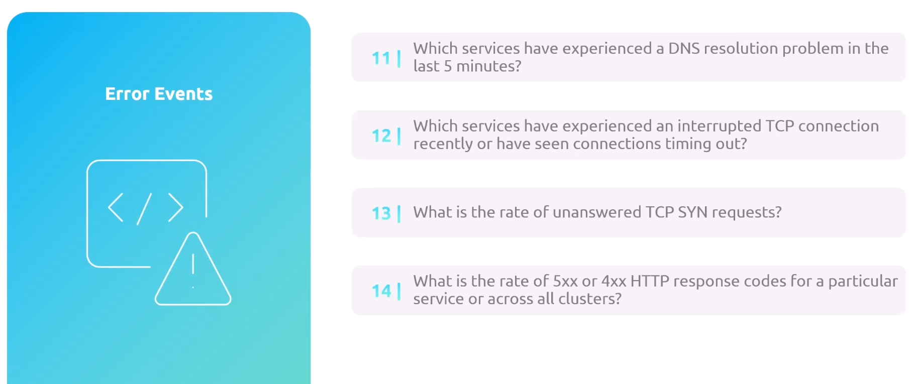

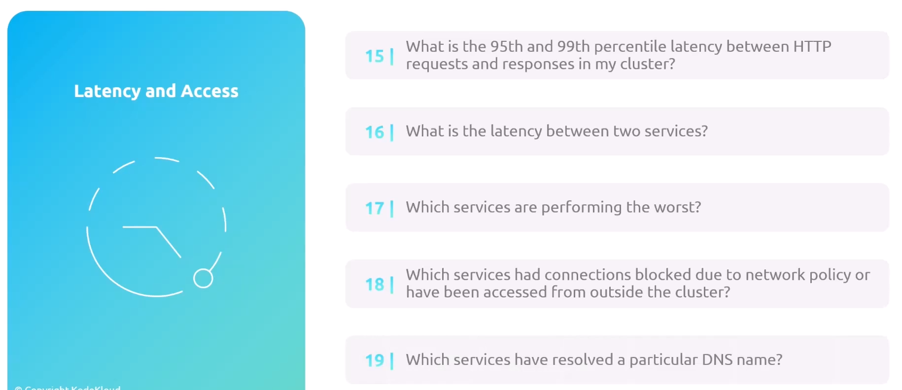

### 3. Service Mesh

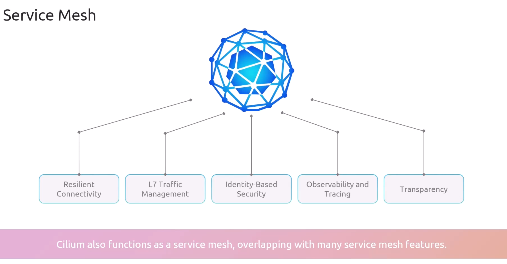

---

## How it Works

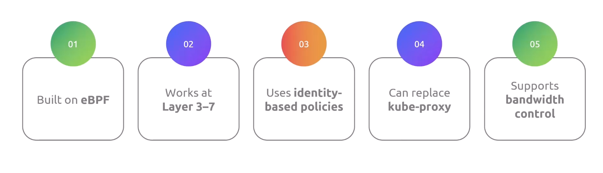

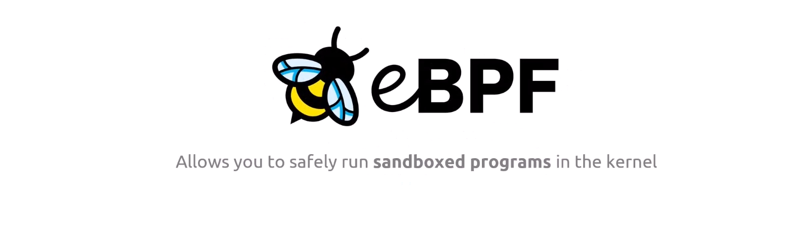

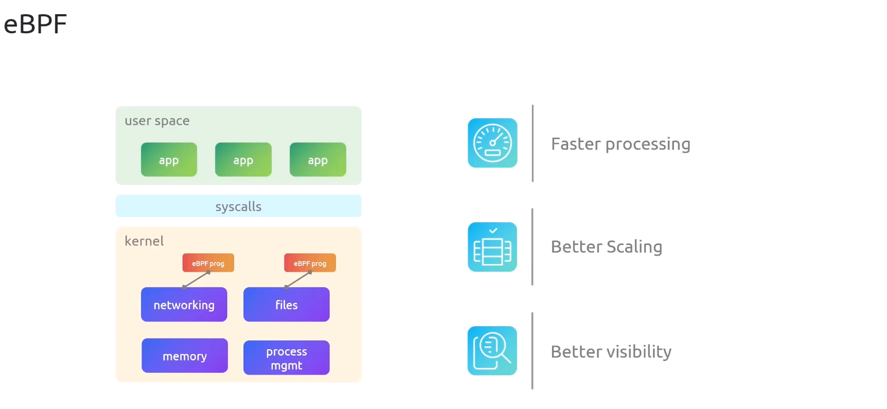

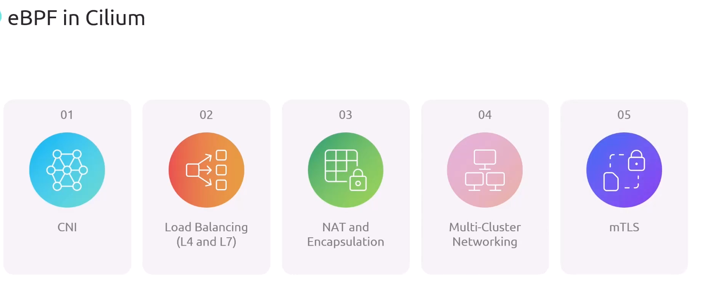

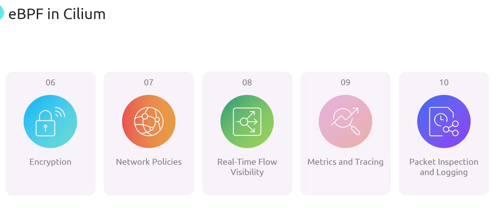

