# Cilium Architecture

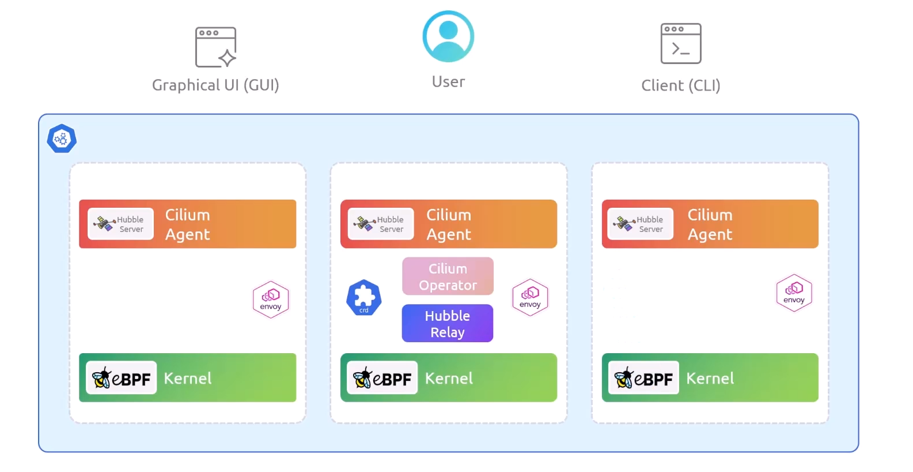

## Cilium Components

### 1. Cilium Agents

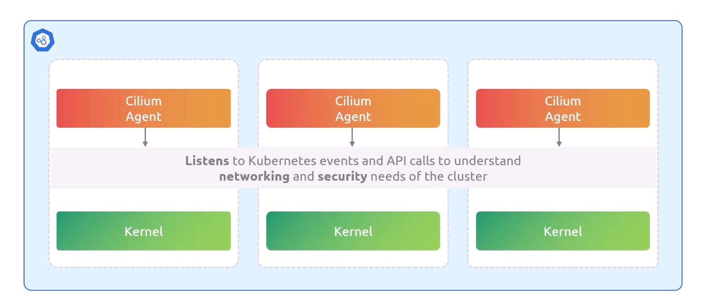

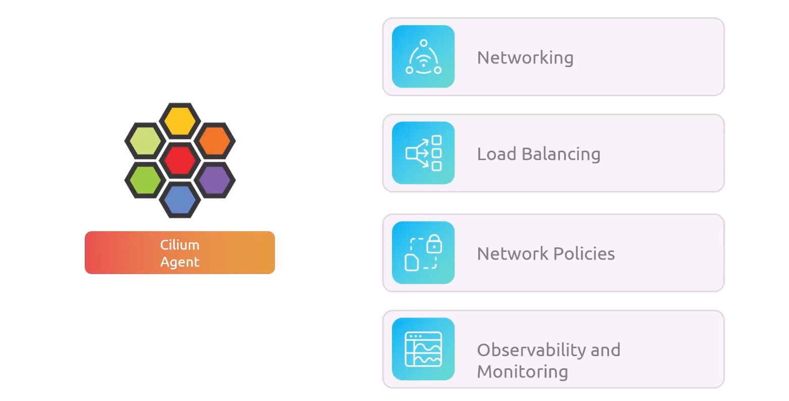

- it listen to:

  1. New pods or containers start
  2. Pods or containers stop
  3. services and endpoints changes
     > any thing changes to those, agent will instantly update Networking related to those events

- it load ebpf program to kernel

---

### 2. eBPF Kernel Module

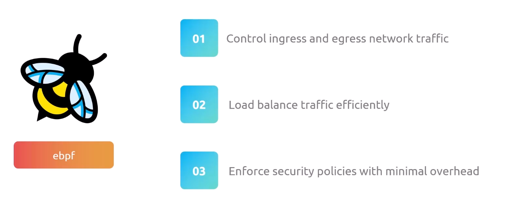

---

### 3. Cilium operator

it responsible for:

1. Node Management
2. Cluster-Wide Services
3. Load Balancer
4. Identity and Security
5. CIDR Management
6. CRD Management
7. Cluster Mesh
8. Security Identity Management
9. IP Address Management (IPAM)
10. Cluster-Wide Network Policies
11. High Availability for Cluster Mesh
12. Hubble Relay Support

---

### 4. Envoy Proxy

Cilium uses Envoy L7 Traffic Filtering and Security

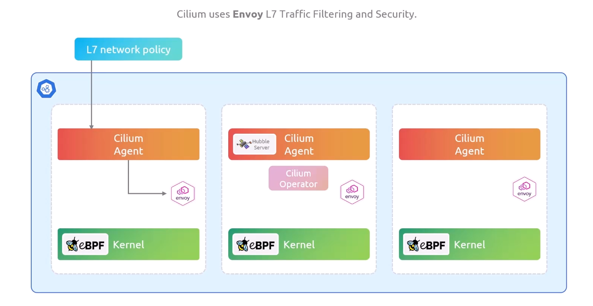

---

### 5. K8s CRDs

Cilium uses k8s CRDs as data store for its configuration (to propagate state between agents)

---

### 6. Hubble Server

Cilium uses Hubble Server to collect telemetry and metrics

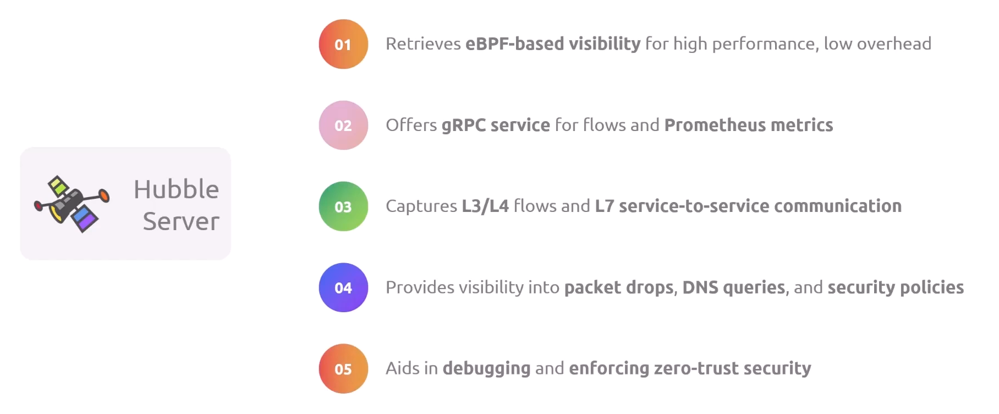

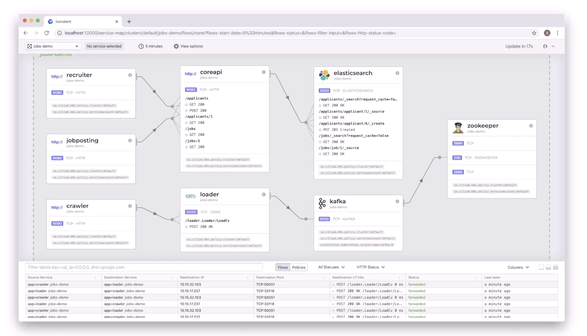

---

### 7. Kube Proxy replacement

You can Configure Cilium to replace Kube Proxy or work with Kube Proxy together(not recommended)

---

## Service Mesh Features

---

### Before Service Mesh

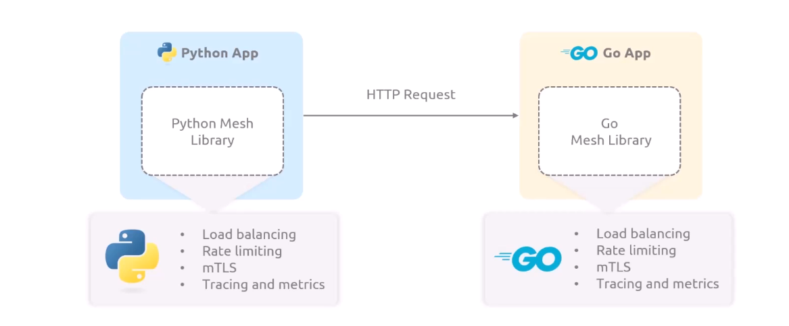

## Sidecar Architecture

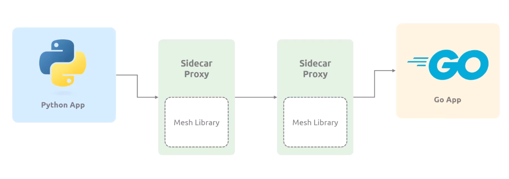

### Sidecar Benefits

1. Services don't need to implement mesh functionality
2. Useful for apps in different languages
3. Support immutable third-party applications

### Sidecar Drawbacks

1. High Resource Usage:  
   Each app needs a sidecar proxy --> increase CPU and memory usage
2. Higher Complexity:
   Proxies (like envoy) need manual configuration
3. Longer Start Times:
   App waits for sidecar proxy to start
4. Race Conditions:
   Issues during sidecar startup/shutdown
5. Added Latency:
   Each request passes through an extra proxy hop

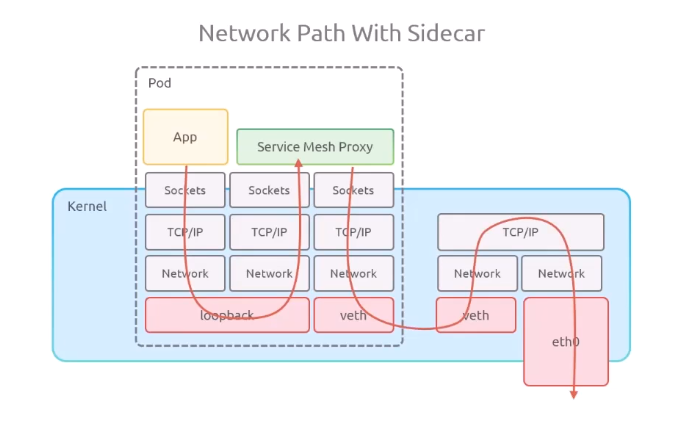

---

## Sidecarless Architecture

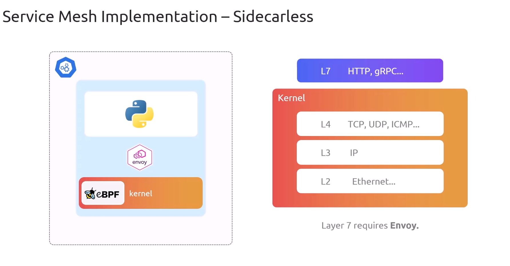

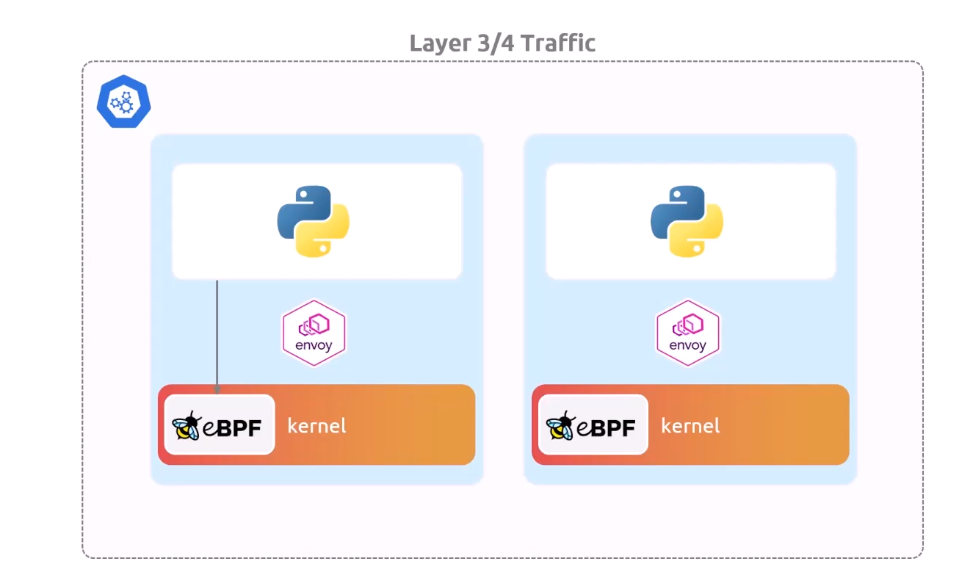

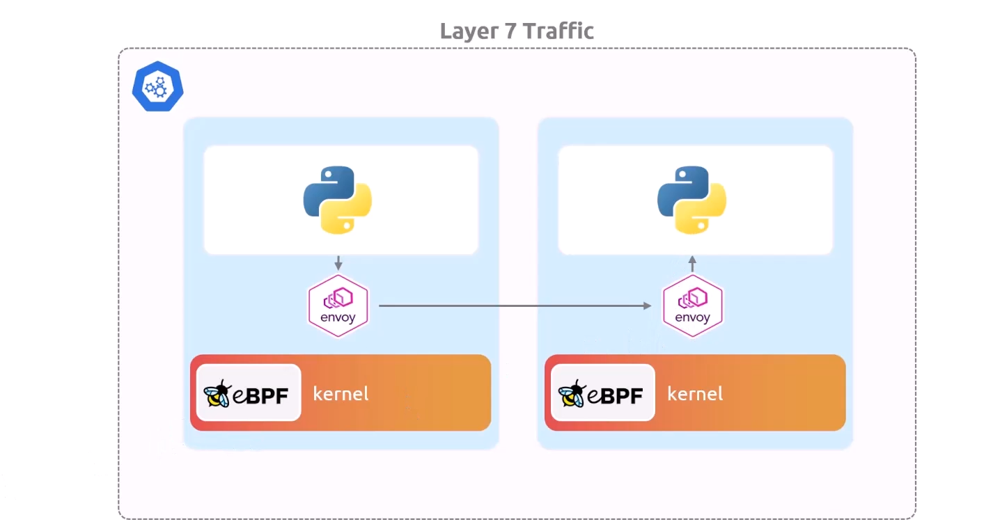

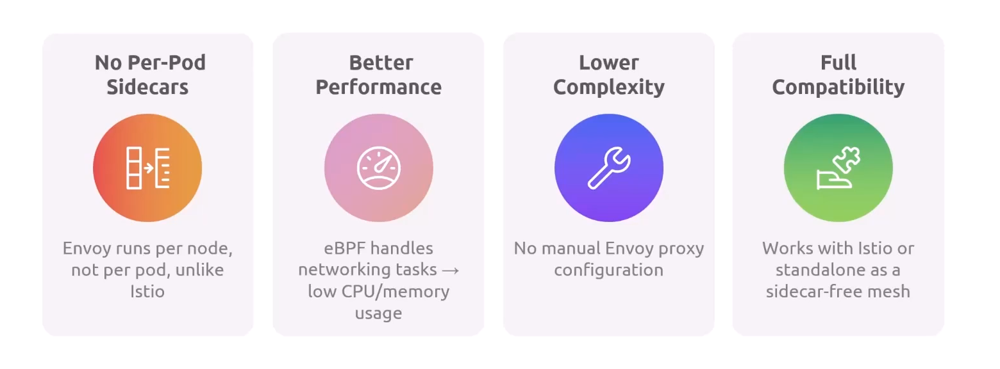

---

## L3/4 vs L7

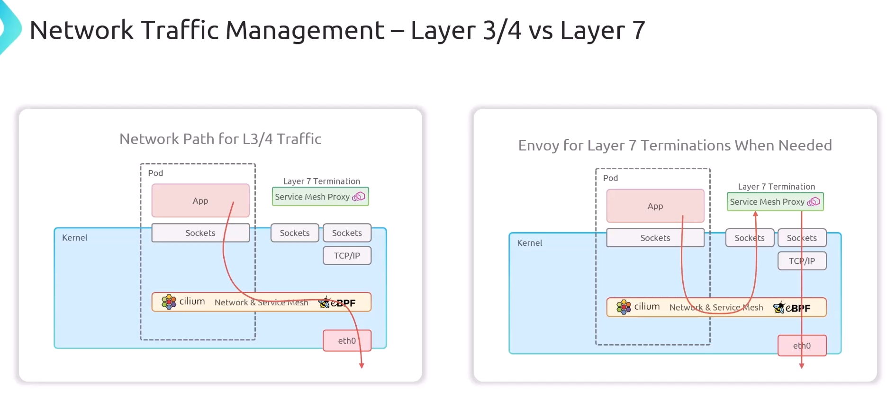

