# eBPF Overview

## 📌 kernel Overview

### Without Kernel

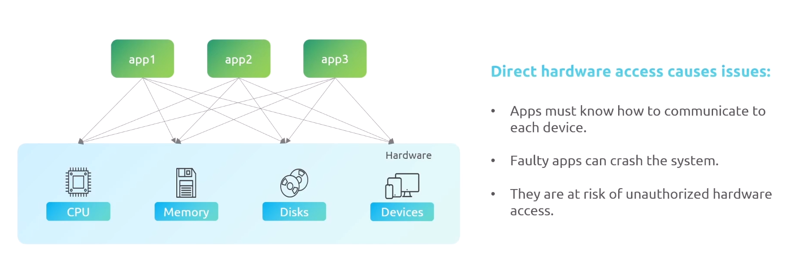

### With Kernel

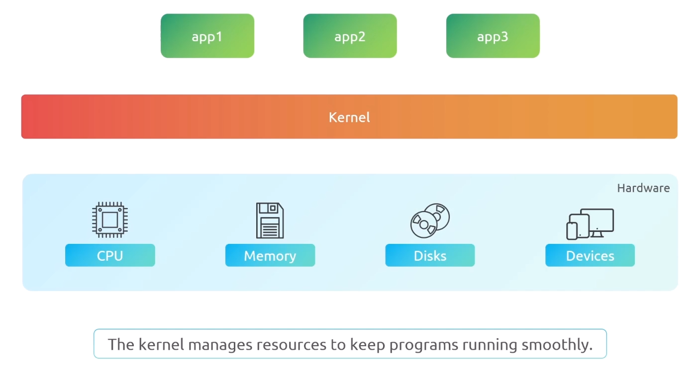

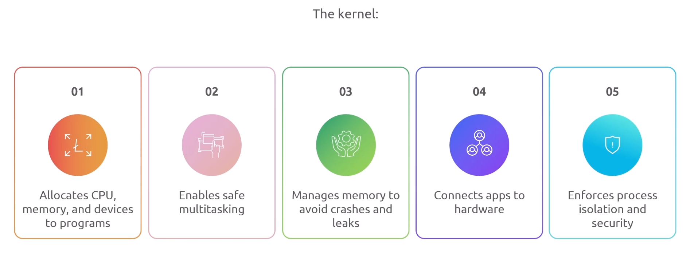

## 📌 Kernel Workflows

> The Kernel uses drivers to communicate with hardware  
> System calls connect user programs with the operating system

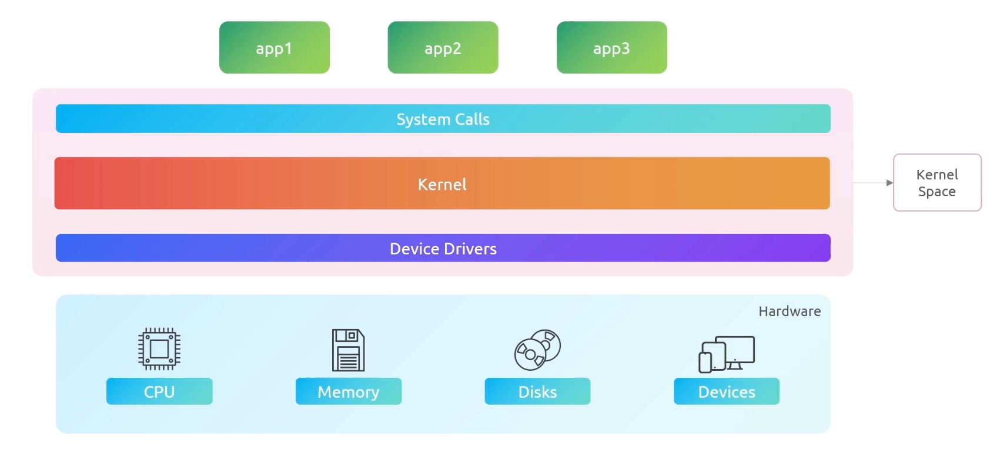

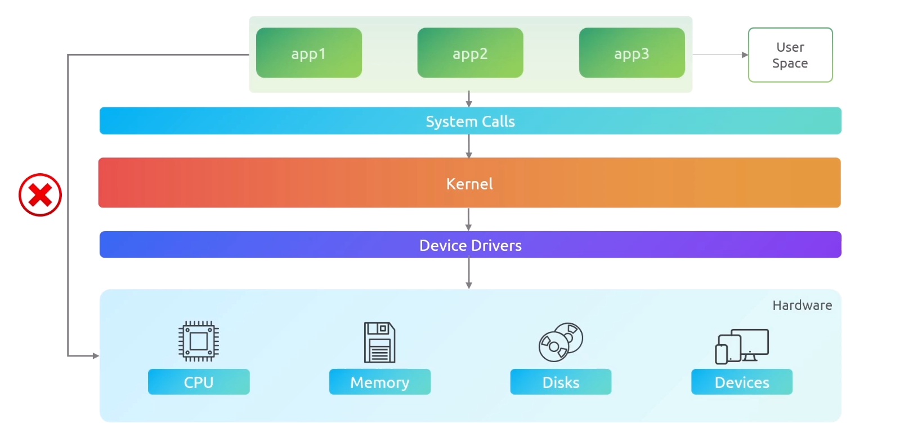

### Kernel space:

- Kernel space handles:

  - Memory Management
  - Process Scheduling
  - Device Control
  - File Systems

- Only the kernel and trusted Components run here to avoid crashes or security issues

### User space:

this where user applications runs with limited access to the kernel
they can't communicate direct to hardware or even the kernel
they have to make system calls to the kernel to access the hardware resources

### Common System Calls

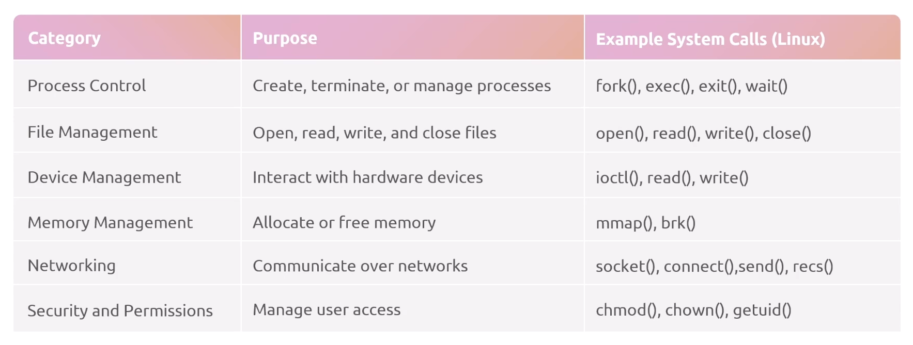

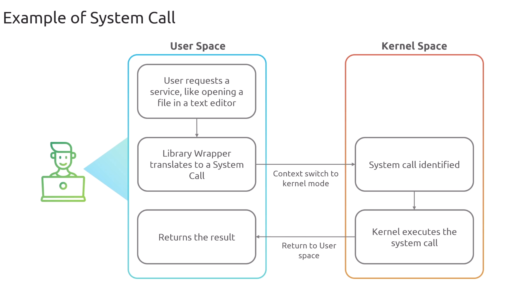

## 📌 eBPF Overview

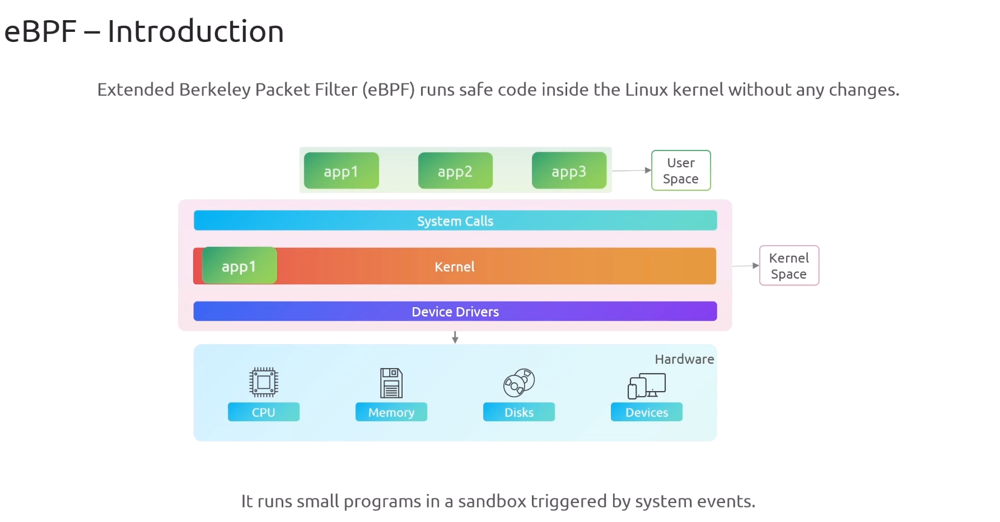

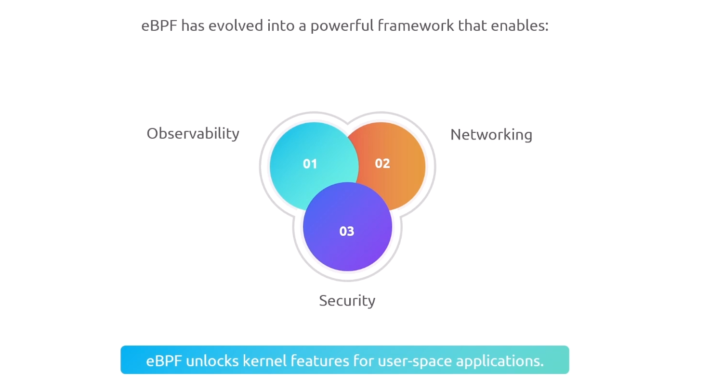

> in summary eBPF lets you extend the kernel with new features from userspace without modifying the kernel source code or even add new kernel modules.

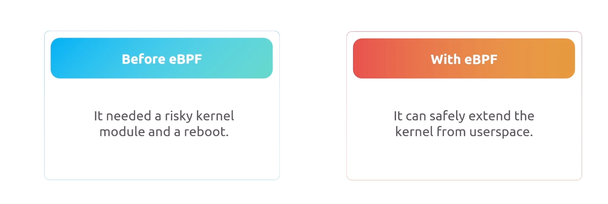

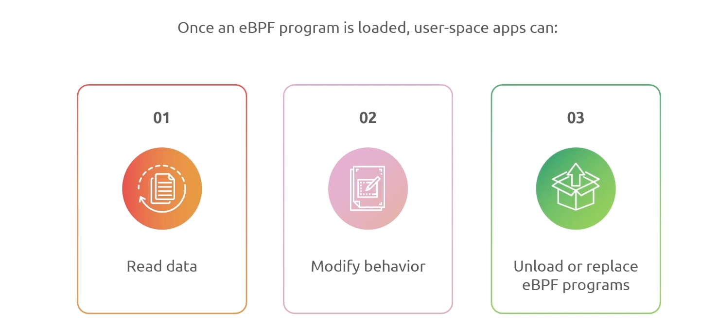

## 📌 eBPF Benefits

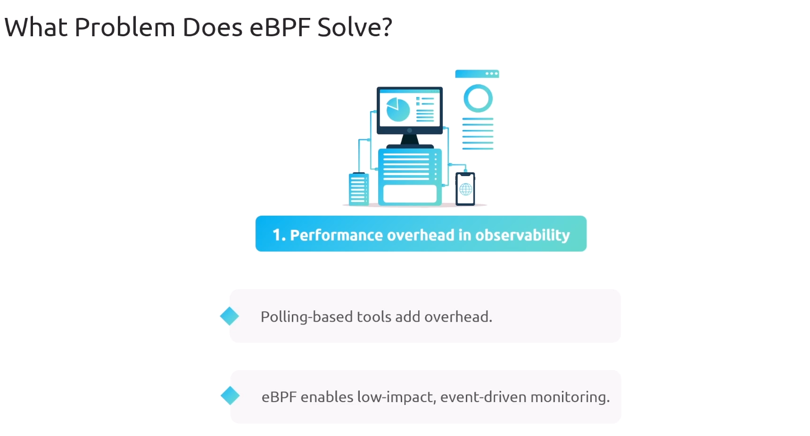

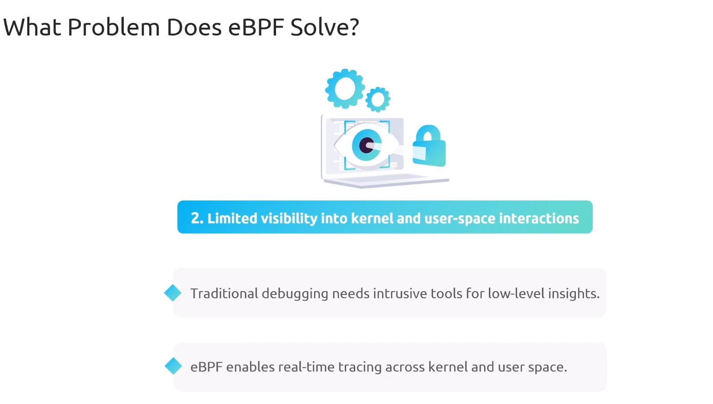

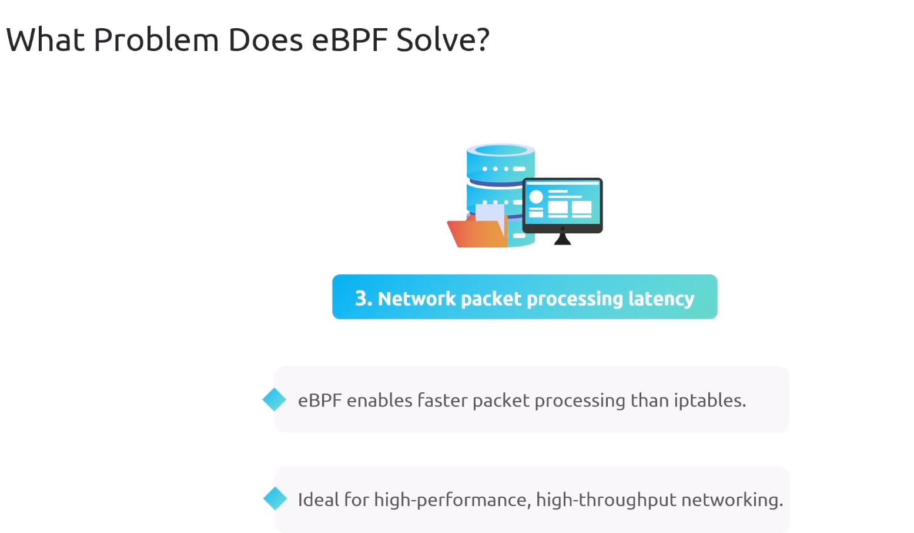

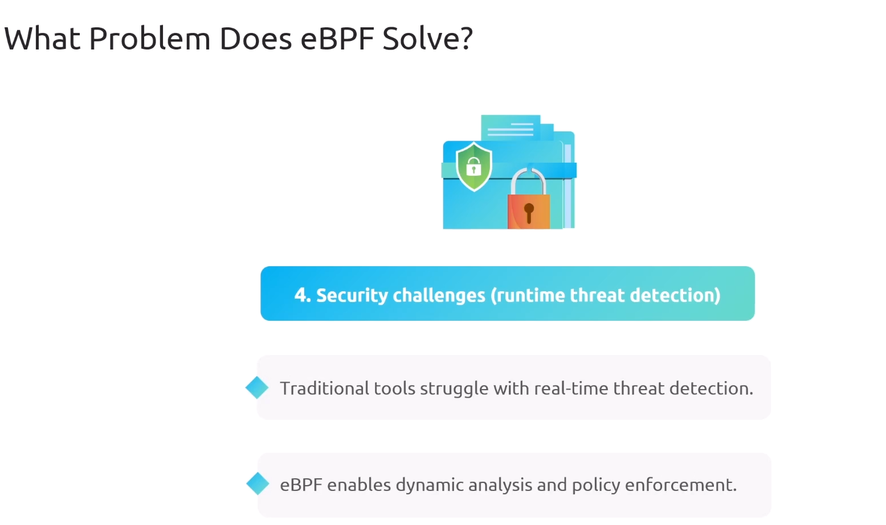

## 📌 eBPF Use Cases

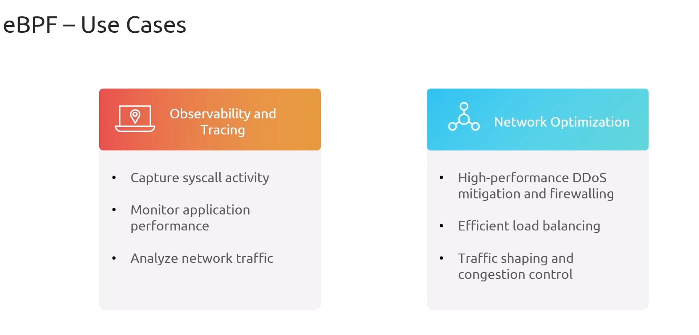

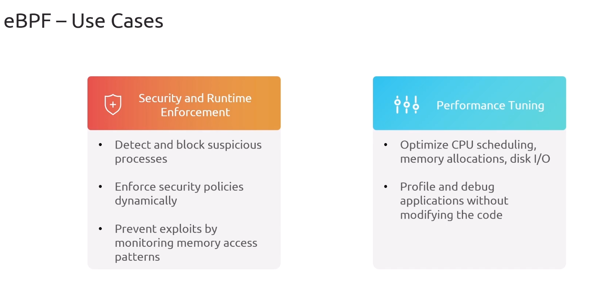

## 📌 XDP Overview

> XDP (eXpress Data Path) is a high-performance packet processing framework built on top of eBPF that allows network packets to be intercepted and processed immediately at the network interface, before they enter the Linux networking stack.

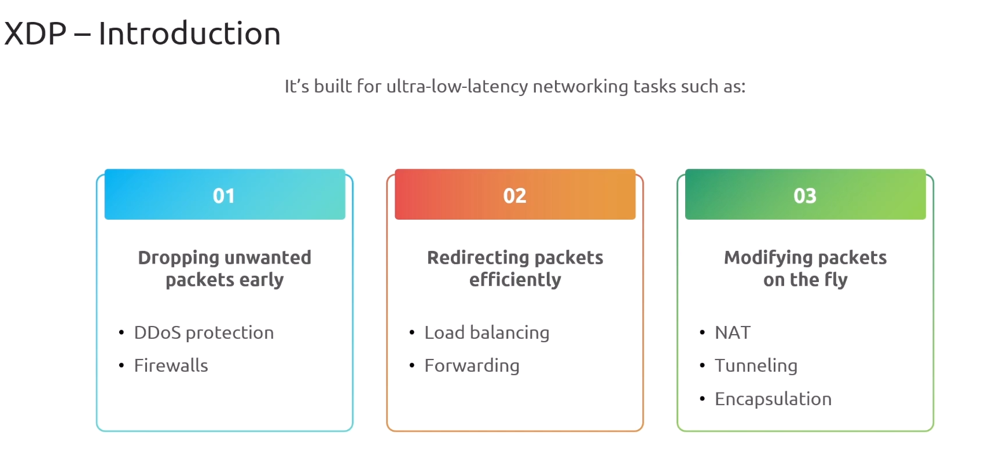

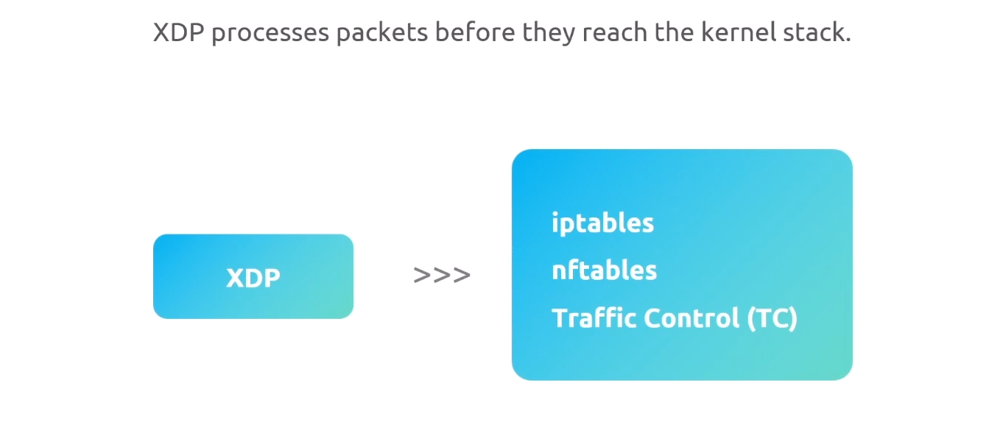

## 📌 Role of eBPF in Cilium

1. replace Kube-proxy (iptables) with eBPF
2. replace k8s network policy (iptables) with eBPF
3. multi-cluster networking
4. encryption between application.
5. Real time visibility
6. metric and tracing
7. packet inspection and logging

## 📌 Why Replace Kube-proxy (iptables) with eBPF?

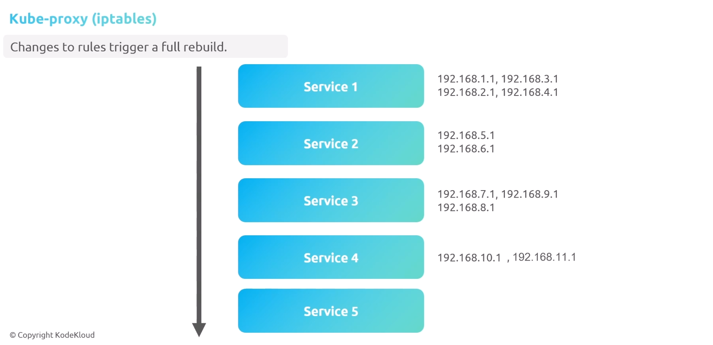

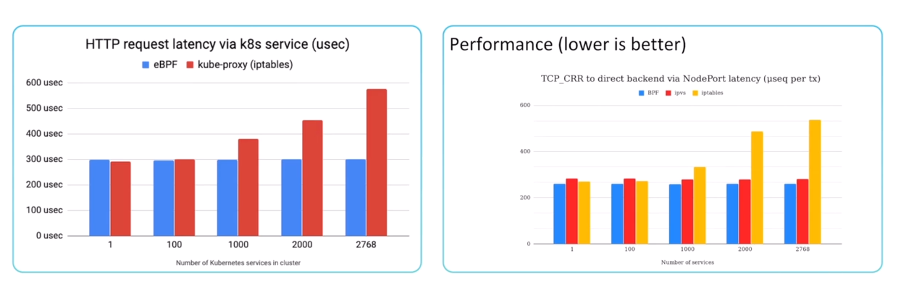

