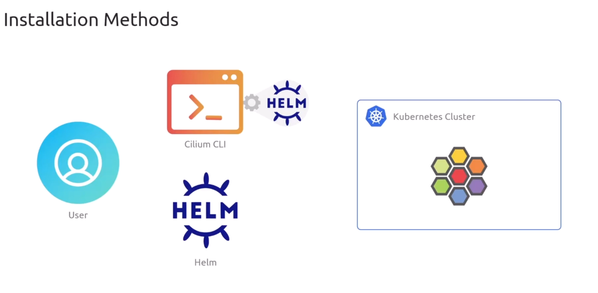
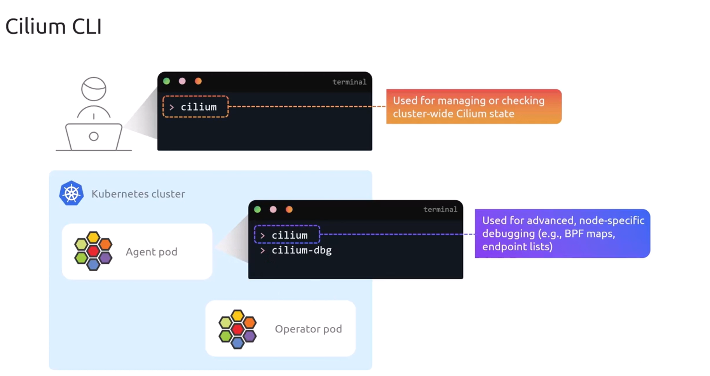
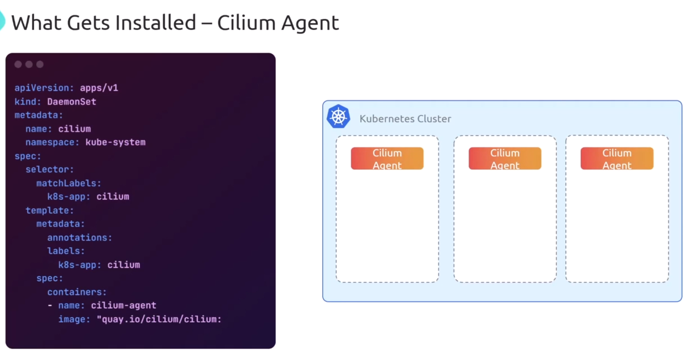
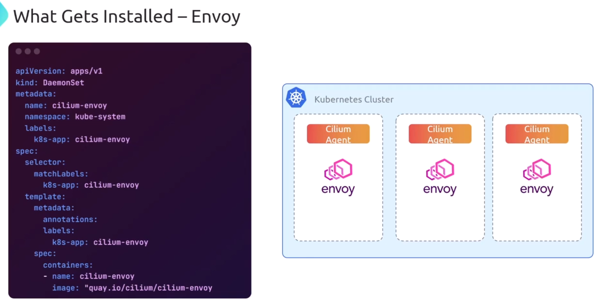
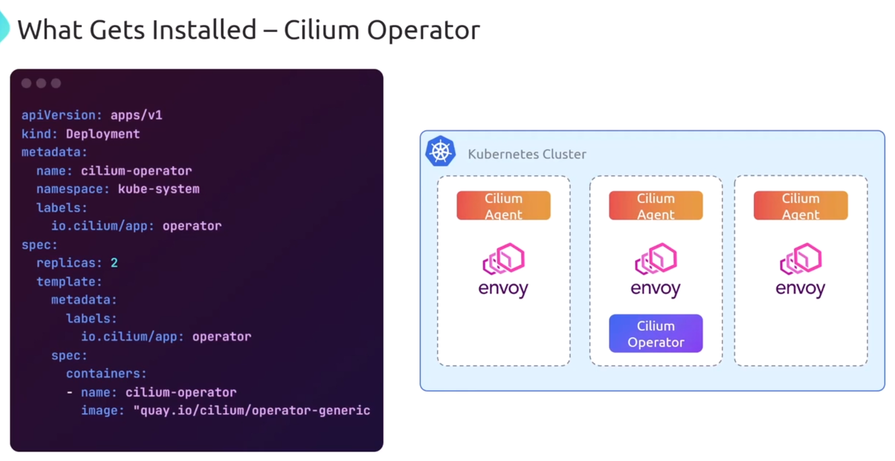
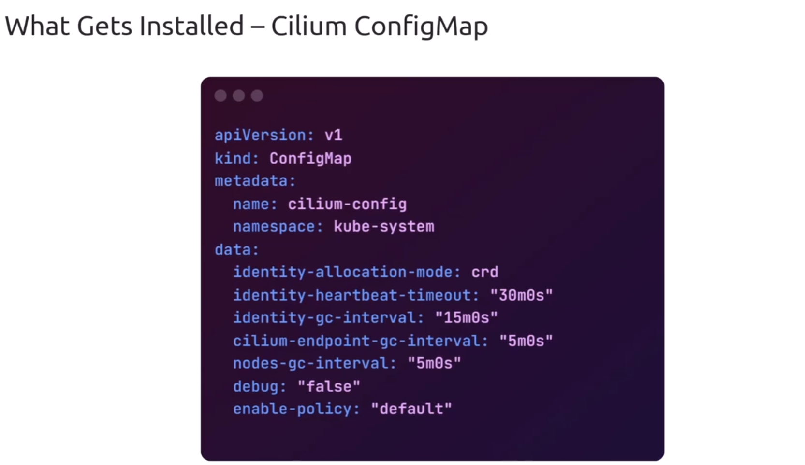
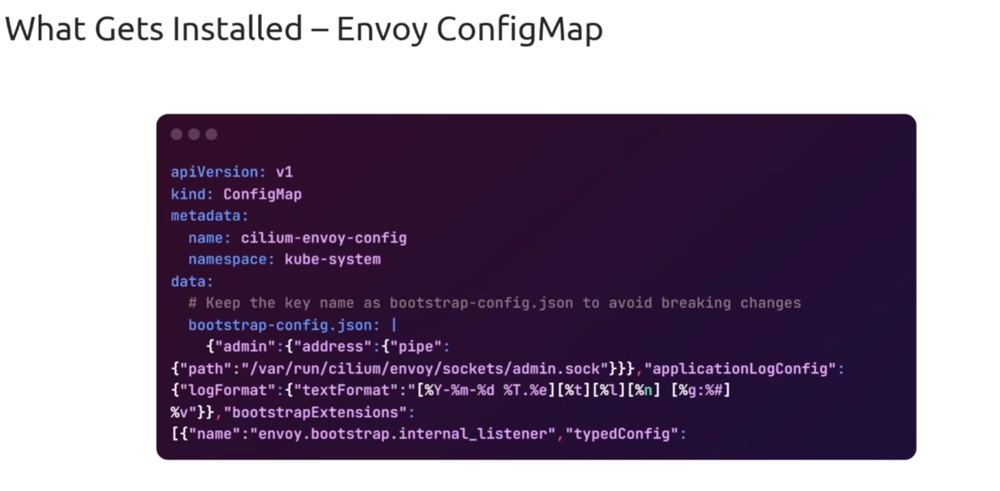
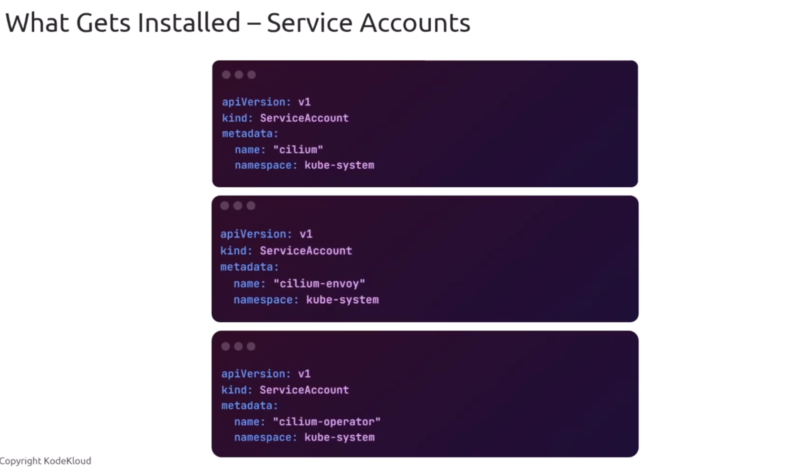
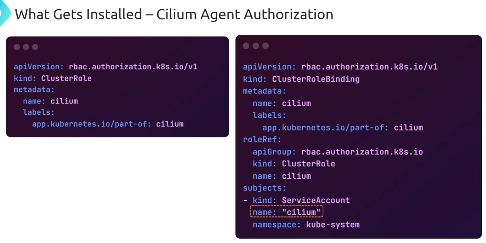
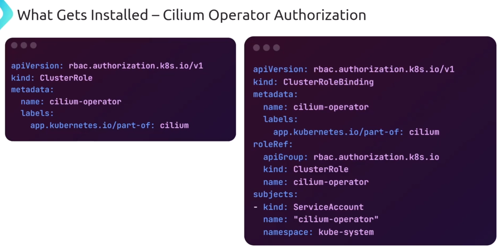

# Cilium Installation

## 📌 Installation Methods

1️⃣ Helm  
2️⃣ Cilium CLI (uses helm under the hood)

---

<div align="center" style="background-color:#fff; border-radius: 10px; border: 2px solid">

</div>

---

## 👨🏻‍💻 Installation using Cilium CLI

### 1. **Install the Cilium CLI**

- Download the latest release binary:

  ```bash
  curl -L --remote-name-all https://github.com/cilium/cilium-cli/releases/latest/download/cilium-linux-amd64.tar.gz
  tar xzvf cilium-linux-amd64.tar.gz
  sudo mv cilium /usr/local/bin/
  ```

- Verify installation:

  ```bash
  cilium version
  ```

### 2. **Prepare Your Kubernetes Cluster**

- Ensure you have a running cluster (e.g., kind, minikube, GKE, EKS, AKS).
- Make sure `kubectl` is configured and points to the cluster.

### 3. **Install Cilium**

- Run:

  ```bash
  cilium install
  ```

- This command:
  - Deploys **Cilium DaemonSet** across nodes.
  - Installs **Custom Resource Definitions (CRDs)** for Cilium.
  - Configures Cilium as the **CNI plugin** for pod networking.

### 4. **Validate Installation**

- Check Cilium status:

  ```bash
  cilium status
  ```

- Run connectivity test:

  ```bash
  cilium connectivity test
  ```

  This spins up test pods and verifies pod-to-pod, pod-to-service, and pod-to-external connectivity.

### 5. **Optional Configuration**

- You can customize installation with flags:
  - `--version <x.y.z>` → install a specific Cilium version.
  - `--datapath-mode <mode>` → choose between `veth`, `ipvlan`, or `direct-routing`.
  - `--helm-set <key=value>` → pass Helm values directly.
- Example:

  ```bash
  cilium install --version 1.18.4 --helm-set hubble.relay.enabled=true --helm-set hubble.ui.enabled=true
  ```

### 6. **Enable Observability (Hubble)**

- Install Hubble (Cilium’s observability layer):

  ```bash
  cilium hubble enable
  cilium hubble ui
  ```

- Access the Hubble UI via port-forward:

  ```bash
  kubectl port-forward -n kube-system svc/hubble-ui 12000:80
  ```

---

### Key Notes

- **Cilium CLI** simplifies installation compared to raw Helm commands.
- It automatically detects cluster type and applies best defaults.
- For **large clusters (>500 nodes)** or advanced datapath modes, you may need to fine-tune Helm values.
- All state is stored in Kubernetes CRDs, so installation is declarative and reproducible.

---

### Cilium cli inside cilium agent != cilium cli install in your terminal

<div align="center" style="background-color:#fff; border-radius: 10px; border: 2px solid">

</div>

---

## 🪖 Installation using Helm

### 1. **Add the Cilium Helm Repository**

```bash
helm repo add cilium https://helm.cilium.io/
helm repo update
```

### 2. **Install Cilium**

Run Helm install into the `kube-system` namespace:

```bash
helm install cilium cilium/cilium --namespace kube-system
```

This will:

- Deploy the **Cilium DaemonSet** across all nodes.
- Install **CRDs** required for Cilium (NetworkPolicies, CiliumEndpoints, etc.).
- Configure Cilium as the **CNI plugin**.

### 3. **Customize Installation**

You can override values with `--set` or a custom `values.yaml`.

Examples:

- Enable Hubble observability:

  ```bash
  helm install cilium cilium/cilium \
    --namespace kube-system \
    --set hubble.relay.enabled=true \
    --set hubble.ui.enabled=true
  ```

- Use a custom values file:

  ```bash
  helm install cilium cilium/cilium \
    --namespace kube-system \
    -f my-values.yaml
  ```

### 4. **Upgrade or Reconfigure**

If you need to change settings later:

```bash
helm upgrade cilium cilium/cilium \
  --namespace kube-system \
  --set some.config=value
```

### 5. **Verify Installation**

- Check pods:

  ```bash
  kubectl -n kube-system get pods -l k8s-app=cilium
  ```

- Confirm Cilium status:

  ```bash
  kubectl -n kube-system exec -it ds/cilium -- cilium status
  ```

- Run connectivity test (if CLI is installed):

  ```bash
  cilium connectivity test
  ```

---

### Key Notes

- **Helm vs CLI**: Helm gives fine-grained control; CLI simplifies defaults and auto-detection.
- **Namespace**: Always install into `kube-system` unless you have a custom setup.
- **CRDs**: Helm automatically manages CRDs, but in some environments you may need `--set installCRDs=true`.

---

## 📌 What Get Installed

### 1. DaemonSets

1. Cilium Agent (DaemonSet)
   <div align="center" style="background-color:#fff; border-radius: 10px; border: 2px solid">
   
   </div>

2. Envoy Proxy (DeamonSet)
   <div align="center" style="background-color:#fff; border-radius: 10px; border: 2px solid">
   
   </div>

### 2. Deployment

1. Cilium Operator
   <div align="center" style="background-color:#fff; border-radius: 10px; border: 2px solid">
   
   </div>

### 3. ConfigMap

1. Cilium ConfigMap
   <div align="center" style="background-color:#fff; border-radius: 10px; border: 2px solid">
   
   </div>

2. Envoy ConfigMap
   <div align="center" style="background-color:#fff; border-radius: 10px; border: 2px solid">
   
   </div>

### 4. Service Accounts

<div align="center" style="background-color:#fff; border-radius: 10px; border: 2px solid">

</div>

### 5. ClusterRole

<div align="center" style="background-color:#fff; border-radius: 10px; border: 2px solid">

</div>

<div align="center" style="background-color:#fff; border-radius: 10px; border: 2px solid">

</div>
