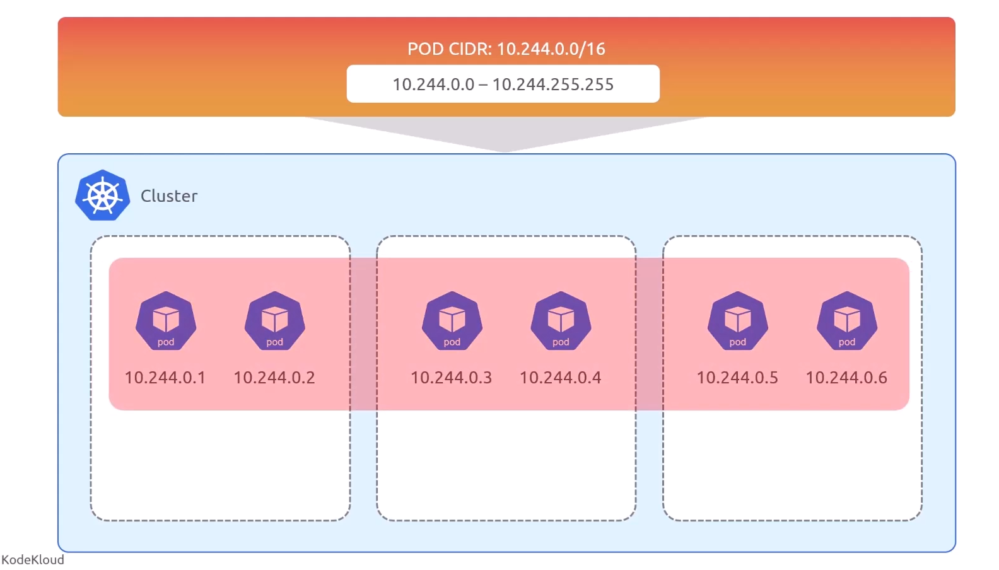
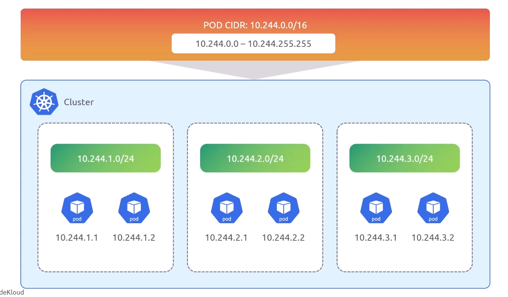
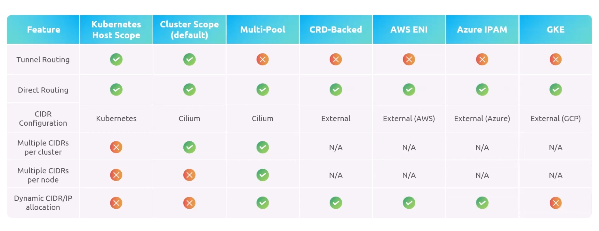
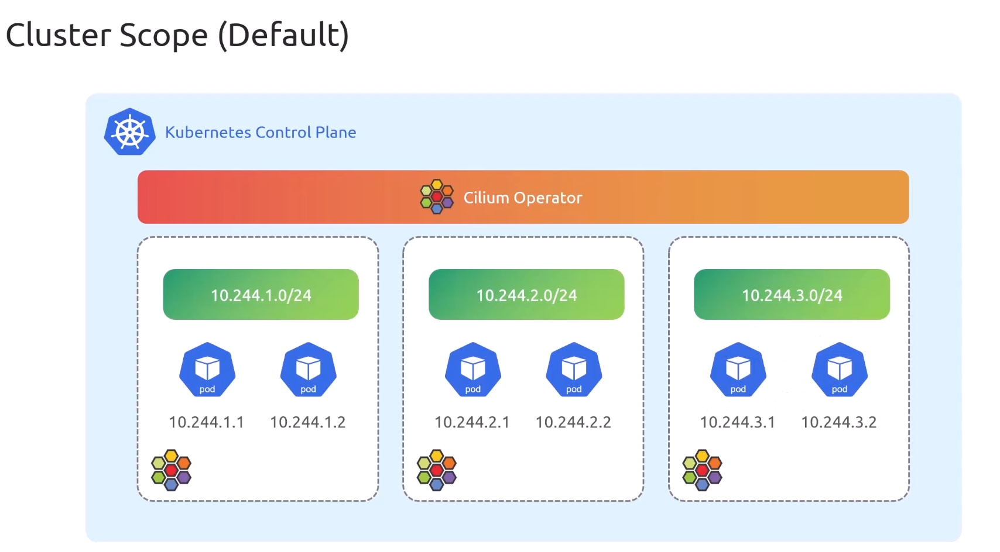
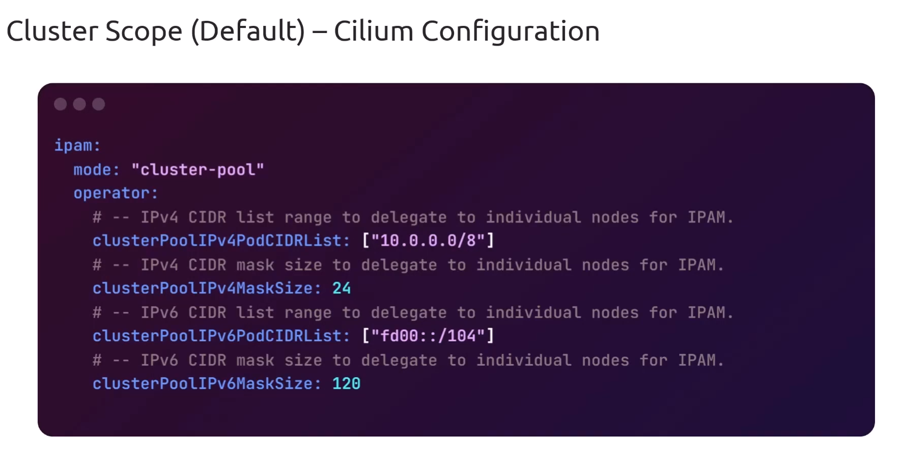
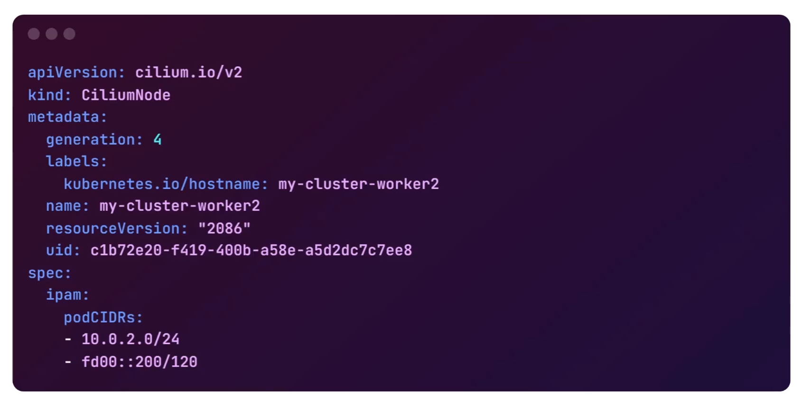
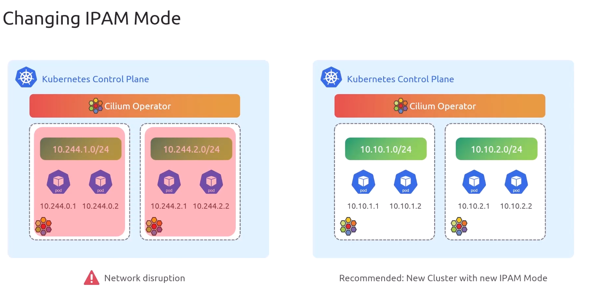

# IPAM - IP Address Management

> How Pods get's IP addresses?

## How Assign IP Addresses to Pods Works

### ❌ Wrong

<div align="center" style="background-color:#fff; border-radius: 10px; border: 2px solid">

</div>

### ✅ Correct

<div align="center" style="background-color:#fff; border-radius: 10px; border: 2px solid">

</div>

---

## IPAM Modes

<div align="center" style="background-color:#fff; border-radius: 10px; border: 2px solid">

</div>

### A. Kubernetes Host Scope

<div align="center" style="background-color:#fff; border-radius: 10px; border: 2px solid">

</div>

#### 1. kube-controller-manager

```ini
commands:
--allocate-node-cidrs=true
--cluster-cidr=10.244.0.0/16,fd00:10:244::/56
--node-cidr-mask-size=24
```

#### 2. tell cilium-agent to use host scope IPAM

helm values:

```yaml
ipam:
  mode: "kubernetes"
k8s:
  requireIPv4PodCIDR: true
  requireIPv6PodCIDR: true
```

apply it:

```bash
helm upgrade cilium cilium/cilium \
  --namespace kube-system \
  --values values.yaml
```

validate it:

```bash
kubectl get nodes node1 -o yaml
```

it should be like this:

```yaml
apiVersion: v1
kind: Node
metadata:
  annotations:
    kubeadm.alpha.kubernetes.io/cri-socket: unix:///run/containerd/containerd.sock
  labels:
    kubernetes.io/os: linux
    kubernetes.io/hostname: node1
  name: node1
spec:
  podCIDR: 10.244.0.0/16
  podCIDRs:
    - 10.244.0.0/16
    - fd00:10:244::/56
```

---

### B. Cluster Scope (default)

<div align="center" style="background-color:#fff; border-radius: 10px; border: 2px solid">

</div>

Helm Values:

<div align="center" style="background-color:#fff; border-radius: 10px; border: 2px solid">

</div>

CiliumNode:

<div align="center" style="background-color:#fff; border-radius: 10px; border: 2px solid">

</div>

verify:

```bash
kubectl exec cilium-agent-xxxxx -n kube-system -it  -- cilium-debug status --all-addresses
```

```ini
kubernetes:        Ok           1.32 (v1.32.0) [linux/amd64]
IPAM               IPv4: 5/254 allocated from 10.0.2.0/24
Allocated addresses:
  10.0.2.163 (default/nginx)
  10.0.2.236 (router)
  10.0.2.244 (default/tshoot-665b9b9b9b)
  10.0.2.48 (health)
  10.0.2.74 (default/tshoot-665b9b9b9b)
```

## 📝 Changing IPAM Mode

`You should not change the IPAM mode of existing clusters`

<div align="center" style="background-color:#fff; border-radius: 10px; border: 2px solid">

</div>
