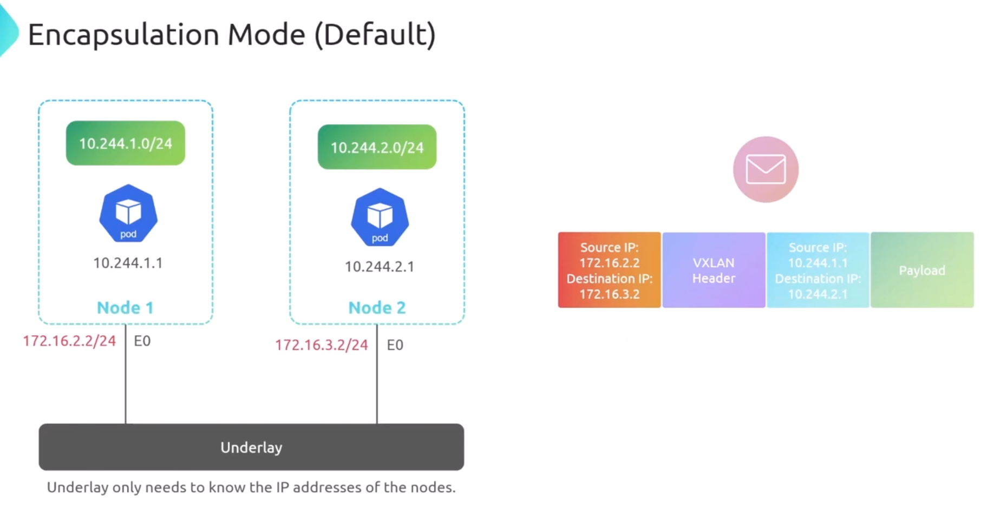
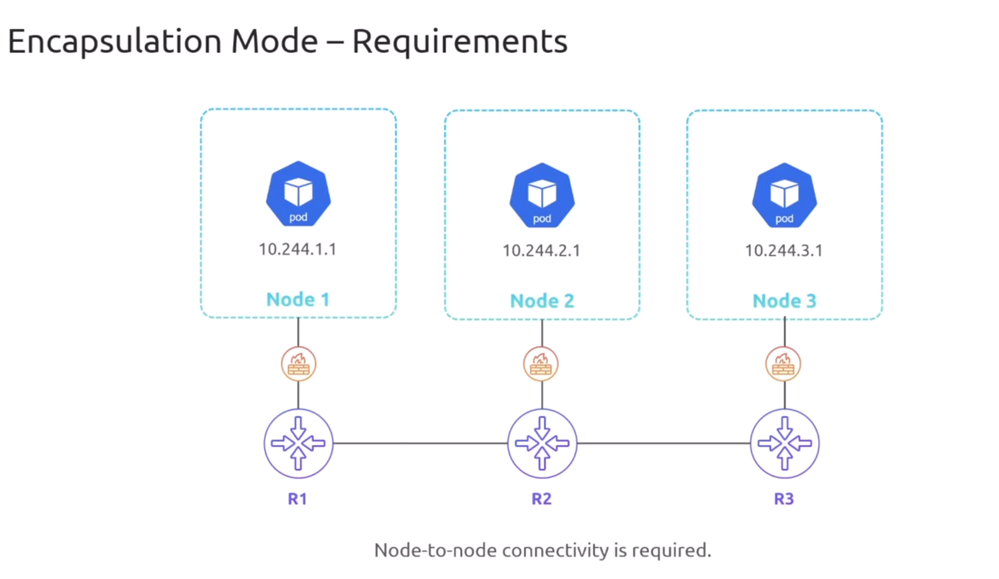
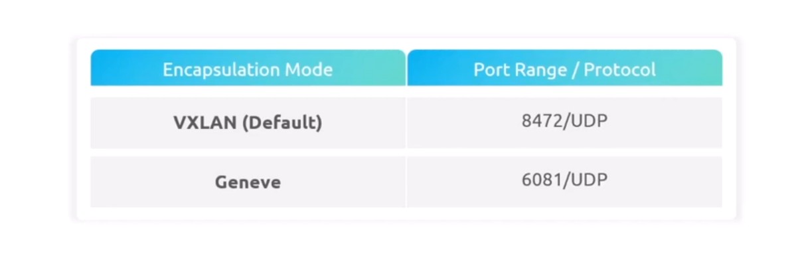
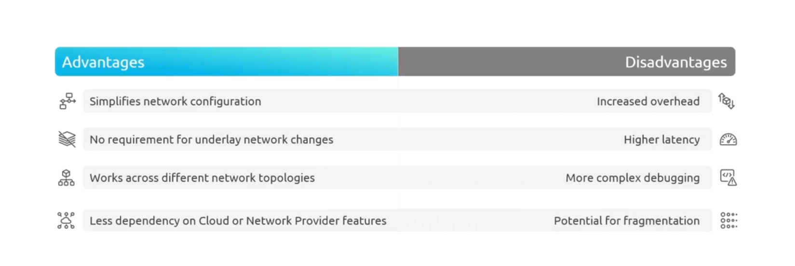
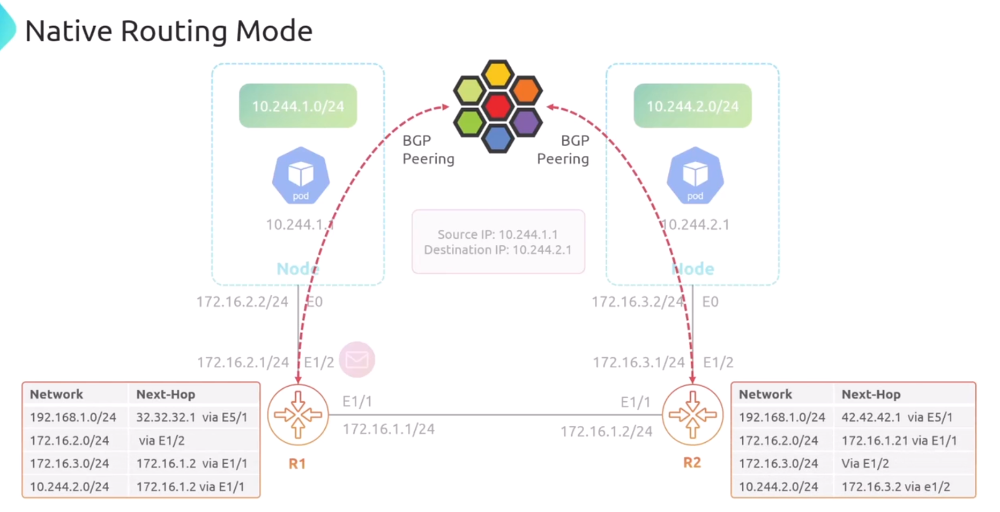
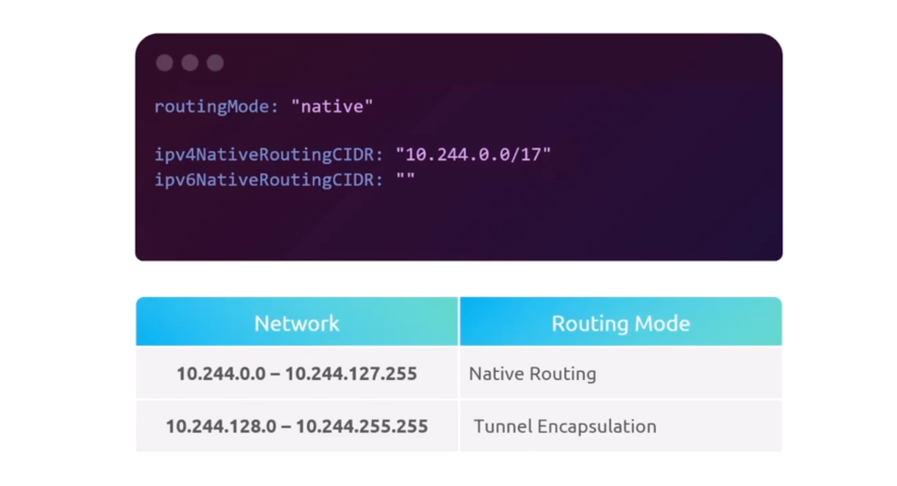

# Cilium Routing Modes

## 1. Tunnel Encapsulation Mode - Packet in Packet encapsulation (Default)

<div align="center" style="background-color:#fff; border-radius: 10px; border: 2px solid">

</div>

---

<div align="center" style="background-color:#fff; border-radius: 10px; border: 2px solid">

</div>

### Requirements

<div align="center" style="background-color:#fff; border-radius: 10px; border: 2px solid">

</div>

### Encapsulation Types

<div align="center" style="background-color:#fff; border-radius: 10px; border: 2px solid">

</div>

### Pros and Cons

<div align="center" style="background-color:#fff; border-radius: 10px; border: 2px solid">

</div>

---

## 2. Native Routing Mode - BGP Routing

<div align="center" style="background-color:#fff; border-radius: 10px; border: 2px solid">

</div>

### How to enable

helm values:

```yaml
routingMode: "native"

ipv4NativeRoutingCIDR: "10.244.0.0/16"
ipv6NativeRoutingCIDR: "5be8:dde9:7f0b:d5a7:bd01:b3be:9c69:573b/112"
```

---

## 3. Hybrid Routing Mode - Packet in Packet encapsulation + BGP Routing

<div align="center" style="background-color:#fff; border-radius: 10px; border: 2px solid">

</div>
