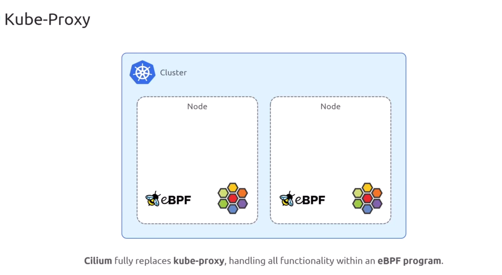
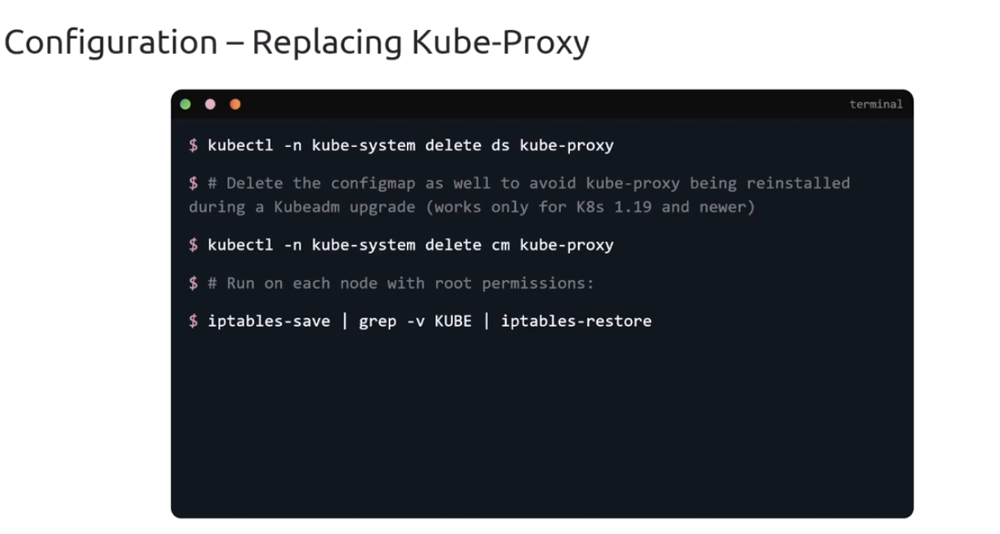
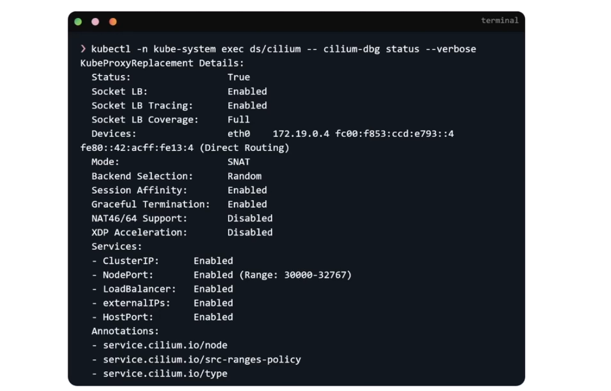

# Kube-proxy-less Mode

<div align="center" style="background-color:#fff; border-radius: 10px; border: 2px solid">

</div>

## kubeProxyReplacement: "false"

<div align="center" style="background-color:#fff; border-radius: 10px; border: 2px solid">

</div>

## kubeProxyReplacement: "true"

<div align="center" style="background-color:#fff; border-radius: 10px; border: 2px solid">



</img>

```bash
# enable
cilium upgrade --set kubeProxyReplacement=true
```

```bash
# verify
kubectl -n kube-system exec ds/cilium -- cilium-dbg status --verbose
```
