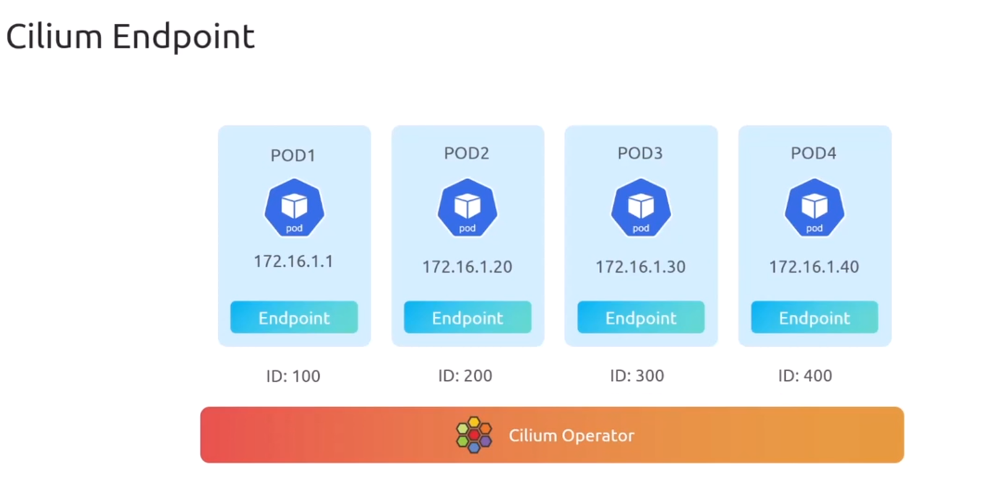

# Cilium Terminology

## 1. Cilium Endpoint

> every pod (ip address) gets a unique endpoint
> each endpoint has internally unique id from cilium

<div align="center" style="background-color:#fff; border-radius: 10px; border: 2px solid">

</div>

```bash
# verify endpoints
kubectl exec -n kube-system ds/cilium -- cilium endpoint list
```

## 2. Cilium Identity

**Cilium Identity is conceptually similar to “matchLabels” selectors in NetworkPolicy**, but it goes further:

- Instead of re‑matching labels every time, Cilium **precomputes an identity** for each unique label set.
- Policies then reference identities, which makes enforcement faster, more scalable, and resilient to IP churn.

---

### Kubernetes NetworkPolicy Selectors

- In a NetworkPolicy, you write rules like:

  ```yaml
  podSelector:
    matchLabels:
      role: frontend
  ```

- This means: _apply this policy to pods that have the label `role=frontend`._
- Enforcement is **per policy evaluation**: kube‑proxy/iptables or Cilium checks labels at runtime to decide if traffic is allowed.

---

### Cilium Identity

- Cilium takes the **labels of a pod** and assigns them a **numeric identity** (e.g., `12345`).
- That identity is stored in a CRD (`CiliumIdentity`) and represents the pod’s label set cluster‑wide.
- Enforcement is **identity‑based**: eBPF programs check the numeric identity of the source/destination, not just IP or labels at runtime.
- This allows **fast lookups** and **stable policy enforcement** even if pod IPs change.

---

### Comparison Table

| Feature           | NetworkPolicy (selectors)                | Cilium Identity                         |
| ----------------- | ---------------------------------------- | --------------------------------------- |
| **Definition**    | `podSelector.matchLabels` in YAML        | Numeric ID mapped to labels (CRD)       |
| **Scope**         | Policy-specific                          | Cluster-wide, shared across policies    |
| **Evaluation**    | Match labels each time policy is applied | Identity lookup via eBPF at packet flow |
| **IP dependence** | Still tied to pod IPs internally         | Decoupled from IPs, identity persists   |
| **Performance**   | Label matching + iptables/IPVS           | Direct identity checks in eBPF maps     |
