# 👮🏻 Cilium Network Policy

## ⚠️ K8s Network Policy Limitations

1. only L4 rules are supported
2. No matching for ICMP
3. No matching for DNS

   

   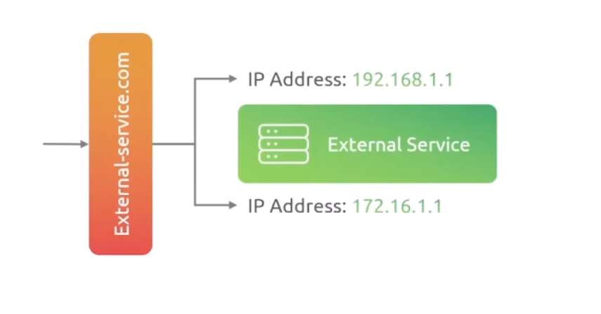
   

4. No matching for Advanced pod filter such as
   - serviceAccount
5. No matching for specific cluster for multi-cluster setup
6. no advanced deny filtering
7. namespace restriction as they operate at namespace level

---

## ✅ Cilium Network Policy

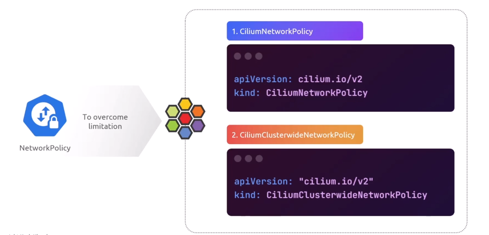

## L3 Rules

### Ingress

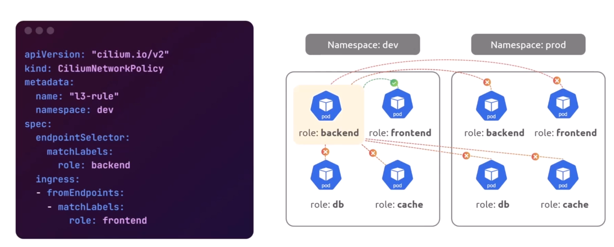
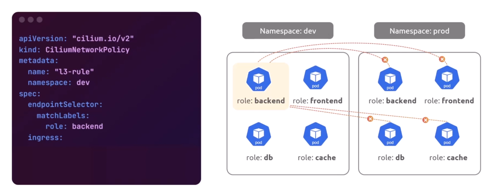
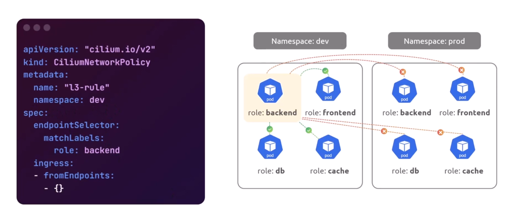

### Egress

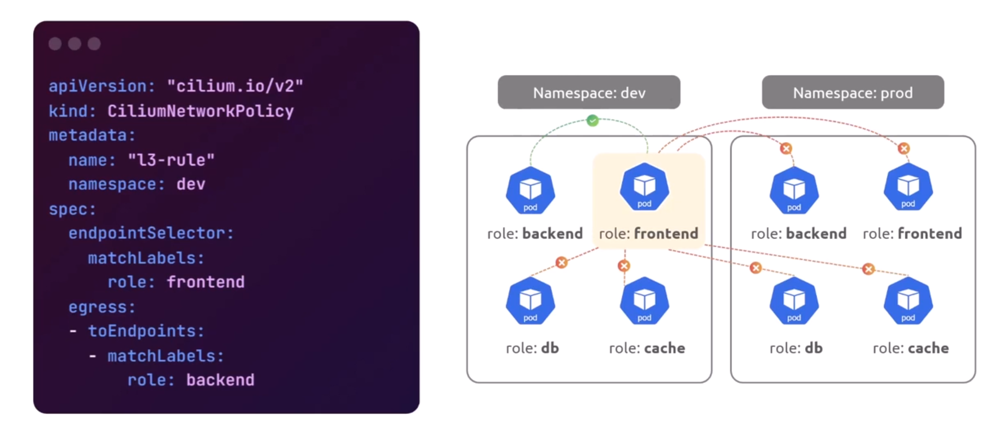
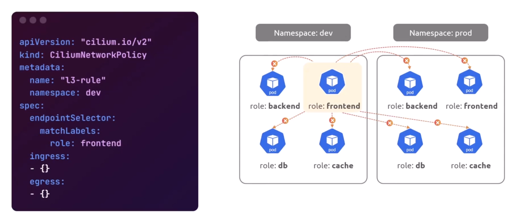
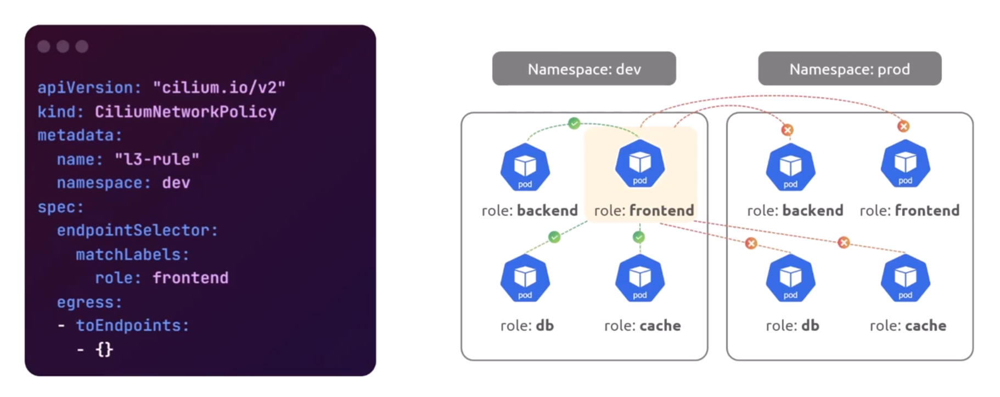

### Match on Service

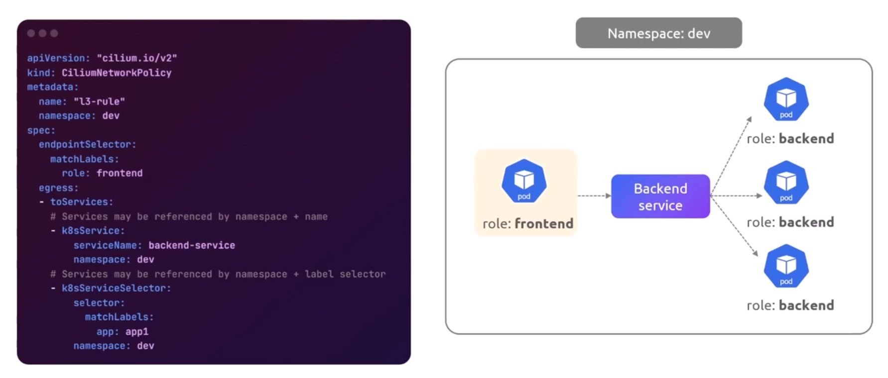

### Match on CIDR

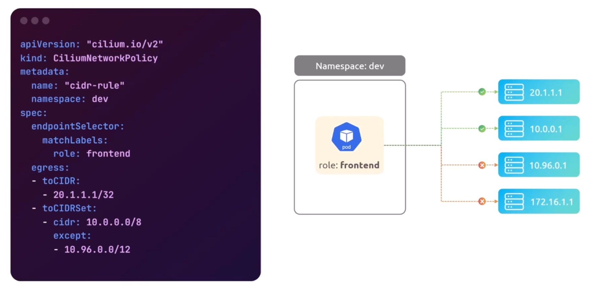

---

## L4 Rules

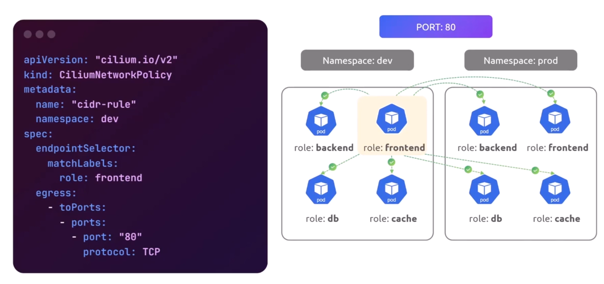

## l4 + l3

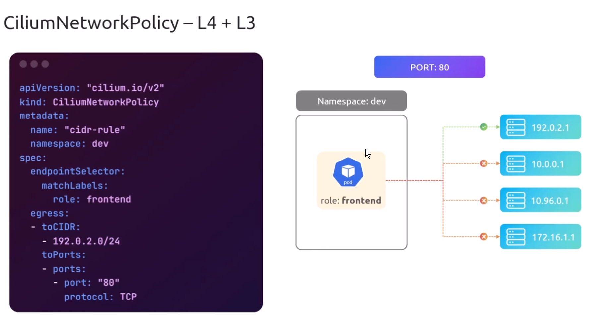

---

## L7 Rules

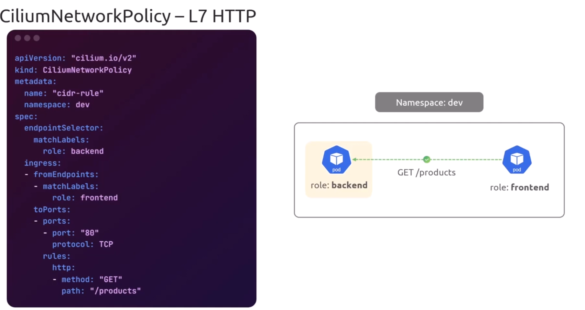
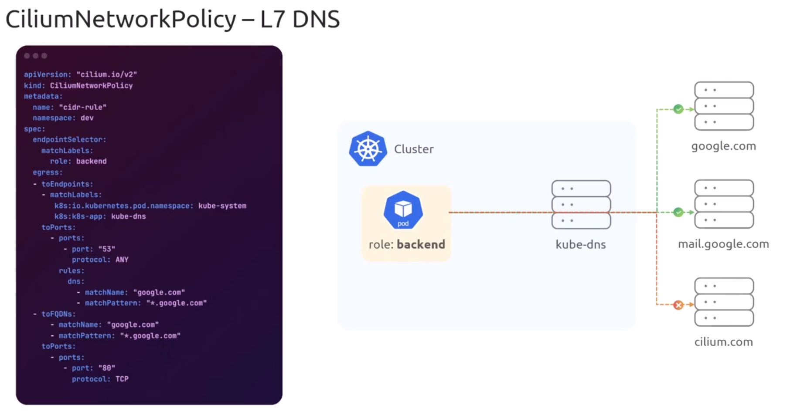

## Entity Rules

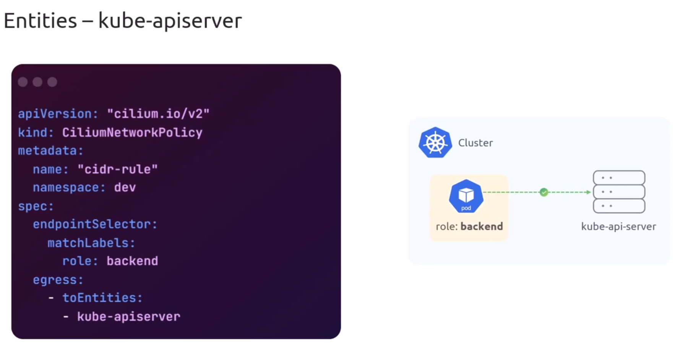
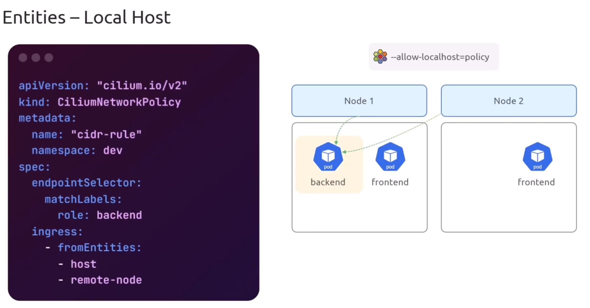
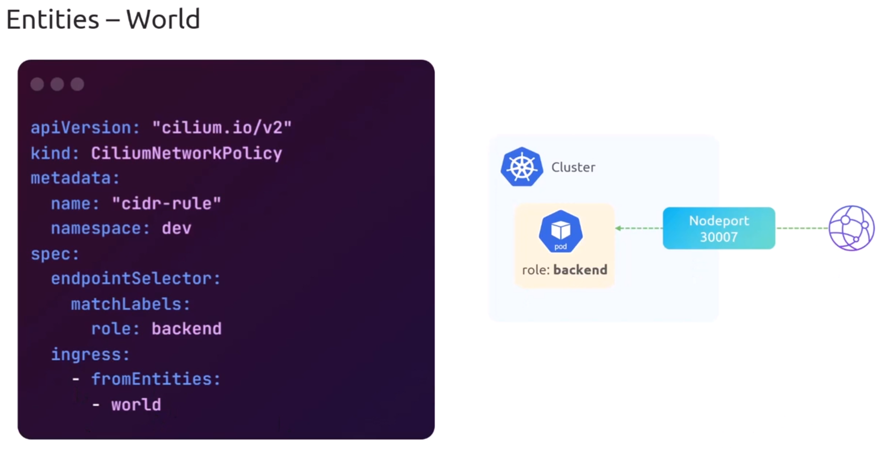

## Deny Rules

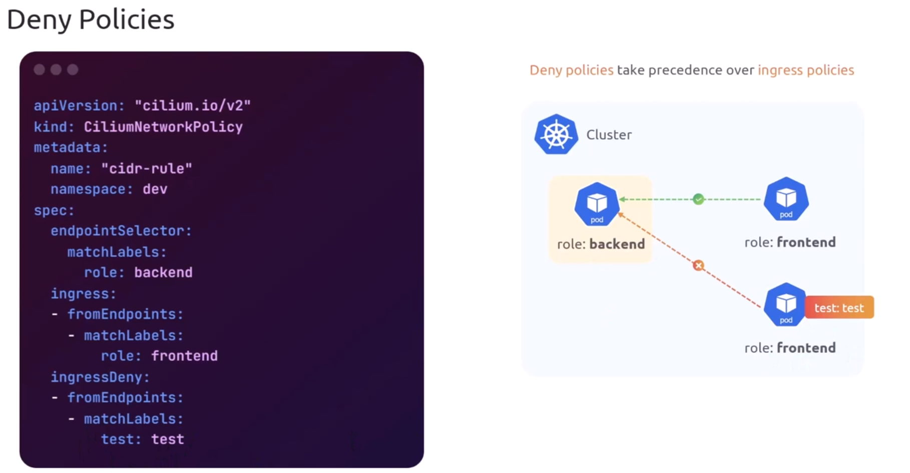

## Cluster Rules

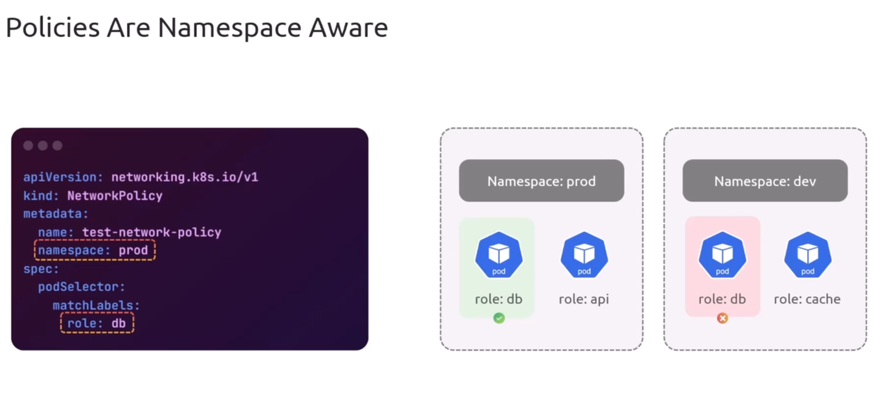

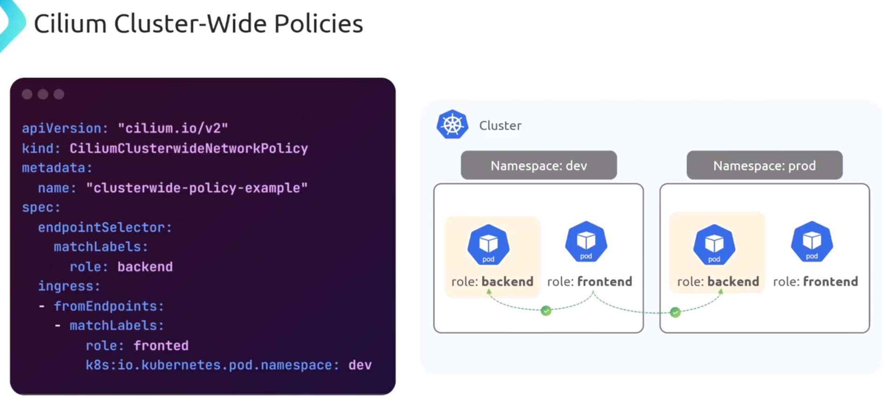
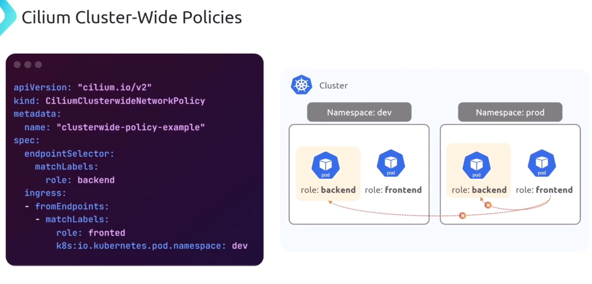

