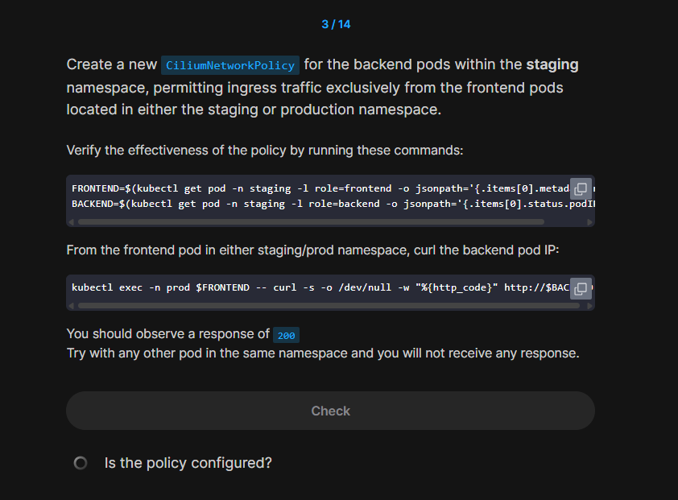

# 1️⃣ Task Summary (What they want)

<div align="center" style="background-color:#141414; border-radius: 10px; border: 2px solid; width: 100%">

</div>

---

## 2️⃣ Your Policy (What you wrote)

```yaml
apiVersion: cilium.io/v2
kind: CiliumNetworkPolicy
metadata:
  name: q3-np-rule
  namespace: staging
spec:
  endpointSelector:
    matchLabels:
      role: backend
  ingress:
  - fromEndpoints:
    - matchLabels:
        role: frontend
        k8s:io.kubernetes.pod.namespace: staging
        k8s:io.kubernetes.pod.namespace: prod
```

---

## 3️⃣ Why This Is **Wrong**

### ❌ Problem 1: Duplicate key in `matchLabels`

`matchLabels` is a **map**. This:

```yaml
k8s:io.kubernetes.pod.namespace: staging
k8s:io.kubernetes.pod.namespace: prod
```

is invalid logically. YAML will **keep only the last one**, so effectively you get:

```yaml
matchLabels:
  role: frontend
  k8s:io.kubernetes.pod.namespace: prod
```

So your policy is actually:

> “Allow only frontend pods in **prod** namespace”

Frontends in `staging` are **not** allowed.

### ❌ Problem 2: Key should be quoted

The key contains `:`:

```yaml
k8s:io.kubernetes.pod.namespace
```

It’s safer and more correct to quote:

```yaml
"k8s:io.kubernetes.pod.namespace": staging
```

---

## 4️⃣ Correct Solution — Option A (Two `fromEndpoints` entries)

Simple, clear, very readable:

```yaml
apiVersion: cilium.io/v2
kind: CiliumNetworkPolicy
metadata:
  name: q3-np-rule
  namespace: staging
spec:
  endpointSelector:
    matchLabels:
      role: backend
  ingress:
    - fromEndpoints:
        # frontend in staging
        - matchLabels:
            role: frontend
            "k8s:io.kubernetes.pod.namespace": staging
        # frontend in prod
        - matchLabels:
            role: frontend
            "k8s:io.kubernetes.pod.namespace": prod
```

**Meaning:**

- Policy targets `role=backend` pods in `staging`.
- Allows ingress from:

  - `role=frontend` in `staging`
  - `role=frontend` in `prod`

- Any other pod (even inside `staging`) → **denied**.

---

## 5️⃣ Correct Solution — Option B (Using `matchExpressions` + `In`)

More compact, a bit more “advanced”:

```yaml
apiVersion: cilium.io/v2
kind: CiliumNetworkPolicy
metadata:
  name: q3-np-rule
  namespace: staging
spec:
  endpointSelector:
    matchLabels:
      role: backend
  ingress:
    - fromEndpoints:
        - matchLabels:
            role: frontend
          matchExpressions:
            - key: "k8s:io.kubernetes.pod.namespace"
              operator: In
              values:
                - staging
                - prod
```

**Meaning:**

> Allow any pod with `role=frontend` whose namespace is either `staging` or `prod`.

---

## 6️⃣ Quick Fix for the Test Commands

Your variable + exec combo has a namespace mismatch (you grab frontend from `staging` but exec in `prod`).

Safer version:

```bash
# frontend in staging
FRONTEND_STAGING=$(kubectl get pod -n staging -l role=frontend -o jsonpath='{.items[0].metadata.name}')
# frontend in prod
FRONTEND_PROD=$(kubectl get pod -n prod -l role=frontend -o jsonpath='{.items[0].metadata.name}')
# backend IP in staging
BACKEND_IP=$(kubectl get pod -n staging -l role=backend -o jsonpath='{.items[0].status.podIP}')

# allowed:
kubectl exec -n staging $FRONTEND_STAGING -- curl -s -o /dev/null -w "%{http_code}" http://$BACKEND_IP
kubectl exec -n prod $FRONTEND_PROD    -- curl -s -o /dev/null -w "%{http_code}" http://$BACKEND_IP

# not allowed (example: some random pod)
OTHER=$(kubectl get pod -n staging -l role!=frontend -o jsonpath='{.items[0].metadata.name}')
kubectl exec -n staging $OTHER -- curl -s -o /dev/null -w "%{http_code}" http://$BACKEND_IP
# This should hang / fail (no 200).
```

---

## 7️⃣ Mental Takeaways

- `matchLabels` = **AND** of labels, **no duplicates** allowed.
- Namespace in Cilium is just another label:
  `"k8s:io.kubernetes.pod.namespace": <ns-name>`.
- To match **multiple namespaces**:

  - Use multiple `fromEndpoints` blocks **OR**
  - Use `matchExpressions` with `operator: In`.

If you want, we can do another 1–2 small tasks like this and I’ll just ask you, “What’s wrong with this policy?” so you can practice spotting issues fast.
