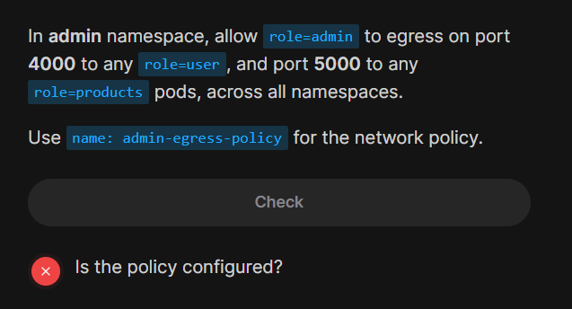

# ⁉️ Ex 2

<div align="center" style="background-color:#141414; border-radius: 10px; border: 2px solid; width: 100%">

</div>

---

```yaml
apiVersion: cilium.io/v2
kind: CiliumClusterwideNetworkPolicy
metadata:
  name: admin-egress-policy
spec:
  endpointSelector:
    matchLabels:
      role: admin
      k8s:io.kubernetes.pod.namespace: admin
  egress:
    - toEndpoints:
        - matchLabels:
            role: user
      toPorts:
        - ports:
            - port: "4000"
              protocol: TCP
    - toEndpoints:
        - matchLabels:
            role: products
      toPorts:
        - ports:
            - port: "5000"
              protocol: TCP
```
