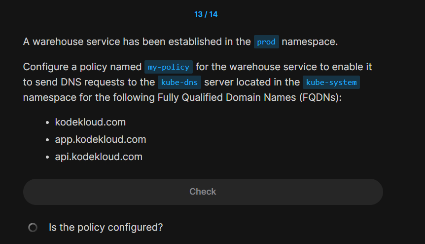

# ⁉️ EX 3

<div align="center" style="background-color:#141414; border-radius: 10px; border: 2px solid; width: 100%">

</div>

---

```yaml
apiVersion: cilium.io/v2
kind: CiliumNetworkPolicy
metadata:
  name: my-policy
  namespace: prod
spec:
  endpointSelector:
    matchLabels:
      app: warehouse
  egress:
    - toEndpoints:
        - matchLabels:
            k8s:io.kubernetes.pod.namespace: kube-system
            k8s:k8s-app: kube-dns
      toPorts:
        - ports:
            - port: "53"
              protocol: ANY
          rules:
            dns:
              - matchName: kodekloud.com
              - matchName: app.kodekloud.com
              - matchName: api.kodekloud.com
```
