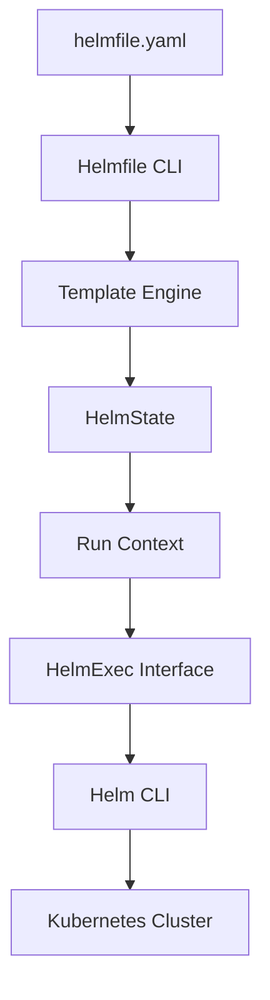

# 🚀 Helmfile

> _📖 Declarative Tool for Managing Helm Charts Across Environments and Releases._

**Helmfile** is a powerful CLI tool that lets you define, deploy, and manage multiple **Helm charts** in a **declarative, version-controlled YAML file**. It’s designed to simplify complex Kubernetes deployments by organizing charts, values, environments, and dependencies into a single, reproducible workflow — making it a strategic asset for **GitOps**, **multi-tenant clusters**, and **CI/CD pipelines**.

---

## 🧠 Architectural Overview

Helmfile acts as a **wrapper around Helm**, orchestrating chart deployments based on a structured config file (`helmfile.yaml`):

| Component                 | Role                                                                  |
| ------------------------- | --------------------------------------------------------------------- |
| 📄 **helmfile.yaml**      | Declarative spec defining releases, environments, values, and repos.  |
| 🧠 **HelmState**          | Internal representation of the desired state of releases.             |
| 🔁 **Run Context**        | Execution layer that applies operations (sync, diff, apply, etc.).    |
| 🔧 **HelmExec Interface** | Abstraction over Helm CLI for executing commands.                     |
| 🧩 **Template Engine**    | Renders dynamic values using Go templating and environment variables. |

Helmfile loads your config, resolves templates, and executes Helm commands in the correct order — including dependency resolution and environment-specific overrides.

---

## 📦 Key Features

- 📦 **Multi-Chart Management**: Deploy multiple Helm charts in one command.
- 🧬 **Environment Support**: Define dev, staging, prod with separate values and overrides.
- 🔁 **DRY Configs**: Share values across releases using templates and inheritance.
- 🔧 **Hooks & Dependencies**: Control install/delete order with `needs` and lifecycle hooks.
- 📜 **Templating**: Use Go templates to inject environment variables and dynamic values.
- 🧪 **Diff & Sync**: Preview changes (`helmfile diff`) and apply them (`helmfile sync`) safely.
- 🔐 **Secrets Integration**: Works with SOPS, Vault, and other secret managers.
- 📊 **Modularization**: Split large `helmfile.yaml` into reusable modules and import them.
- 🧰 **CI/CD Friendly**: Ideal for GitOps workflows and automated deployments.

---

## 🗂️ `helmfile.yaml` Structure Example

```yaml
repositories:
  - name: bitnami
    url: https://charts.bitnami.com/bitnami

environments:
  dev:
    values:
      - values-dev.yaml
  prod:
    values:
      - values-prod.yaml

releases:
  - name: my-app
    chart: bitnami/nginx
    namespace: web
    version: 13.2.18
    values:
      - common-values.yaml
      - "values-{{ .Environment.Name }}.yaml"
```

This defines a chart release with environment-specific values and templated overrides.

---

## ⚔️ Helmfile vs Helm vs Argo CD

| Feature             | 🚀 **Helmfile**           | 🧭 **Helm**                 | 🌊 **Argo CD**                      |
| ------------------- | ------------------------- | --------------------------- | ----------------------------------- |
| Scope               | Multi-chart orchestration | Single chart install/update | GitOps controller for K8s manifests |
| Declarative Config  | ✅ YAML (`helmfile.yaml`) | 🔶 CLI + values.yaml        | ✅ Git-based manifests              |
| Environment Support | ✅ Native                 | 🔶 Manual                   | ✅ Git branch or folder-based       |
| Dependency Ordering | ✅ `needs:` and hooks     | 🔶 Chart dependencies only  | ✅ Sync waves                       |
| Secrets Integration | ✅ SOPS, Vault            | 🔶 External tooling         | ✅ SOPS, Vault, Sealed Secrets      |
| CI/CD Fit           | ✅ CLI + GitOps           | ✅ CLI                      | ✅ GitOps-native                    |

**TL;DR**:

- Use **Helmfile** for **multi-chart, multi-env orchestration**.
- Use **Helm** for **single-chart installs and local dev**.
- Use **Argo CD** for **GitOps-driven continuous delivery**.

---

## 🗺️ Visual Model (Mermaid-style)



This shows how Helmfile transforms declarative configs into Helm operations that deploy resources to Kubernetes.

---

## 🧩 Strategic Fit for You, Hady

- 🧠 **Architectural clarity**: Helmfile’s layered orchestration model mirrors your modular mindset — ideal for multi-service deployments.
- 📁 **Portfolio-ready**: Showcase `helmfile.yaml` with templated values, environment overrides, and dependency graphs.
- 🧪 **Tool benchmarking**: Compare Helmfile vs Argo CD vs Flux for GitOps, secrets, and multi-env support.
- 🔐 **Security signaling**: Integrate SOPS/Vault for encrypted values and demonstrate secure release flows.
- 📊 **Interview leverage**: Model Helmfile’s lifecycle, release ordering, and CI/CD integration with Git workflows.

---

You can explore Helmfile’s architecture in depth via [DeepWiki’s breakdown](https://deepwiki.com/helmfile/helmfile/1.1-architecture) or follow a hands-on guide in [Best DevOps’ tutorial](https://www.bestdevops.com/helmfile-tutorial/).
