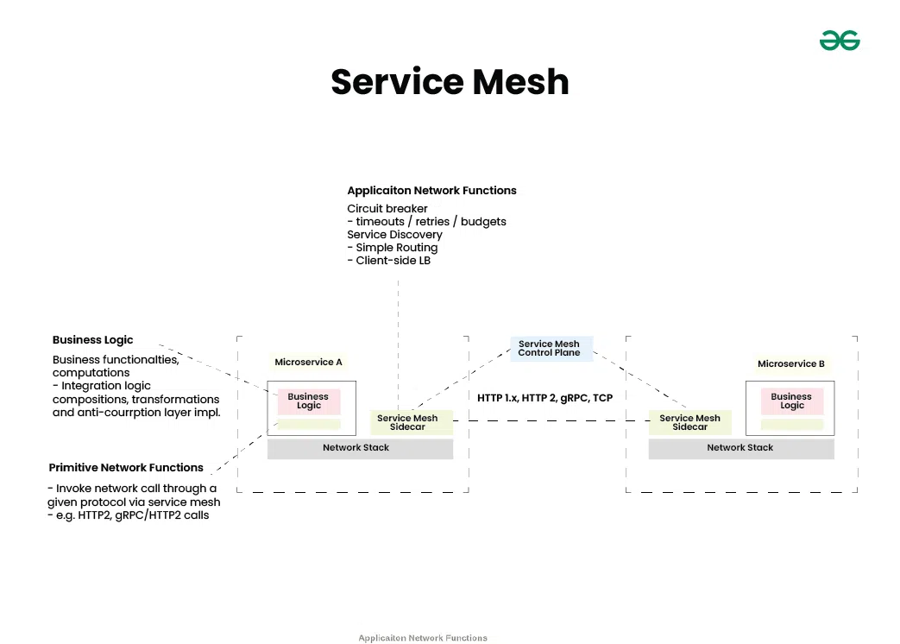
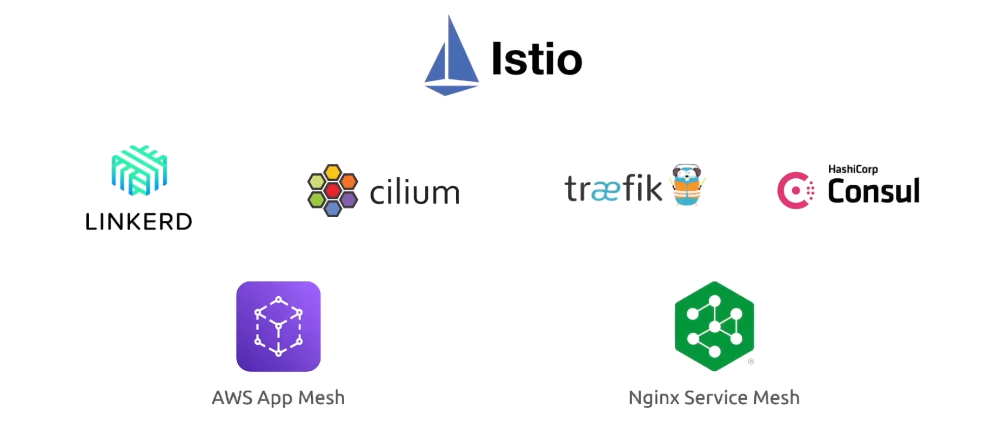
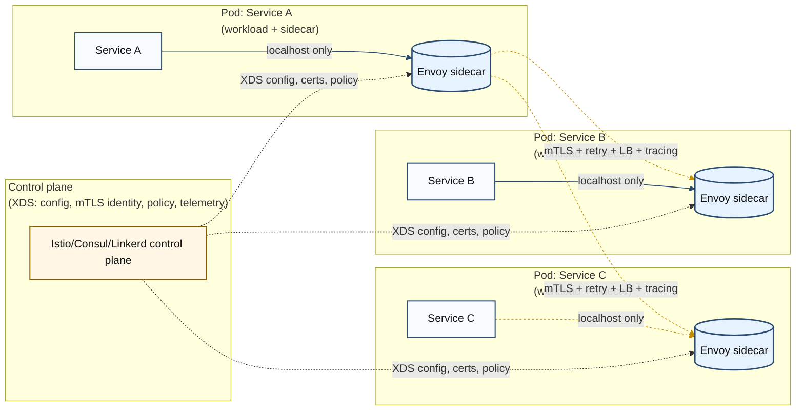

# 🎛️ What Is a Service Mesh?

## 📖 The Official Definition

A **Service Mesh** is a dedicated **infrastructure layer** that handles how microservices talk to each other — **securely**, **reliably**, and **observably** — **without developers writing any extra code**.

👉 Think of it as:  
**“Networking superpowers for your microservices, without touching your application code.”**

---

## 💭 The Real-Life Analogy

Imagine you’re running a city with:

- 50 restaurants
- 20 delivery drivers
- 200 hungry customers

Now imagine:

- Deliveries collide
- Drivers take wrong routes
- Some deliveries are slow
- Some deliveries are unsafe
- You want to track delivery time, errors, breakdowns

🤯 **This is microservices without a service mesh.**

Now install **Google Maps + Traffic Control + Police + Monitoring Cameras** for all drivers.

Suddenly:

- No collisions
- Smooth routing
- Speed restrictions
- Safe roads
- Full visibility

🎉 **That “smart city engine” = a Service Mesh**

---

## 🏛️ Architecture

### 🧠 **Data Plane** = Sidecar Proxies

- Every microservice gets a tiny helper (Envoy proxy) beside it.

### 👷🏻 **Control Plane** = The Boss

- One main component that tells all proxies what to do.

---

## 🧰 What Problems Does Service Mesh Solve?

### 🔒 **1. Security (mTLS)**

- Encrypted communication _between all services_
- Automatic certificate rotation
- No need to modify your app

### 🚦 **2. Smart Traffic Routing**

- Canary deployments
- Blue/Green
- A/B testing
- Traffic shifting (10%, 20%, 50%…)

### 📈 **3. Observability**

- Detailed metrics for each request
- Distributed tracing
- Zero code changes
- Dashboards in Grafana/Kiali

### 🛡️ **4. Resilience**

- Retries
- Timeouts
- Circuit breakers
- Fault injection (test your system!)

### 📌 **Key Insight:**

**All this happens automatically because the proxy handles it.  
Your app doesn't know or care.**

---

## 🎯 The Core Idea (If You Remember Only One Thing)

> **A Service Mesh adds smart network features at the infrastructure level instead of the application level.**

You get:

- Security
- Traffic control
- Monitoring
- Reliability

…without changing a single line of your microservice code.

---

## 🦸 Why Developers Love It

- No more adding retry logic everywhere
- No more writing custom logging/middleware
- No more SSL handshakes in code
- Can do canary deployments without code changes
- Can enforce policies like “Service A cannot talk to Service C”

---

## 🔥 Why DevOps Loves It

- Standardized traffic rules
- Built-in telemetry
- Automatic load balancing
- Easy rollout and rollback
- Enforcing Zero Trust network policies

---

## 🛒 Popular Service Meshes

| Mesh               | Description                                   |
| ------------------ | --------------------------------------------- |
| **Istio**          | The king, powerful, feature-rich, widely used |
| **Linkerd**        | The friendly lightweight cousin               |
| **Consul Connect** | HashiCorp-style, integrated with Consul       |
| **AWS App Mesh**   | Cloud-native version for AWS                  |

---

---

## 🎨 Simple Diagram — How Your App Talks in a Service Mesh

Your app: “I just want to send the request.”  
Envoy: _“Say no more, fam - I’ll handle EVERYTHING.”_ 😎

---

## 🎉 TL;DR

A **Service Mesh** is:

- A network layer for microservices
- Powered by **sidecar proxies**
- Controlled by **a centralized brain**
- Gives **traffic control**, **security**, **reliability**, **observability**
- Without touching application code

👉 It's like **adding superpowers to your Kubernetes apps with zero refactoring**.
