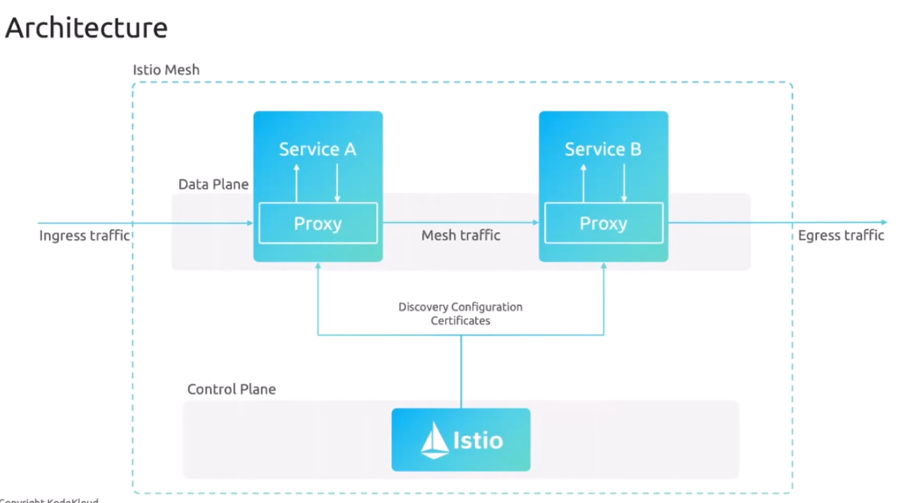
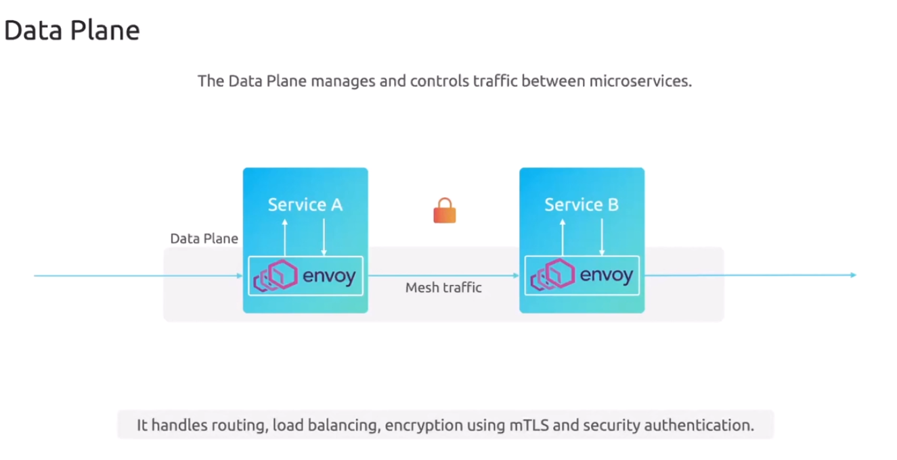
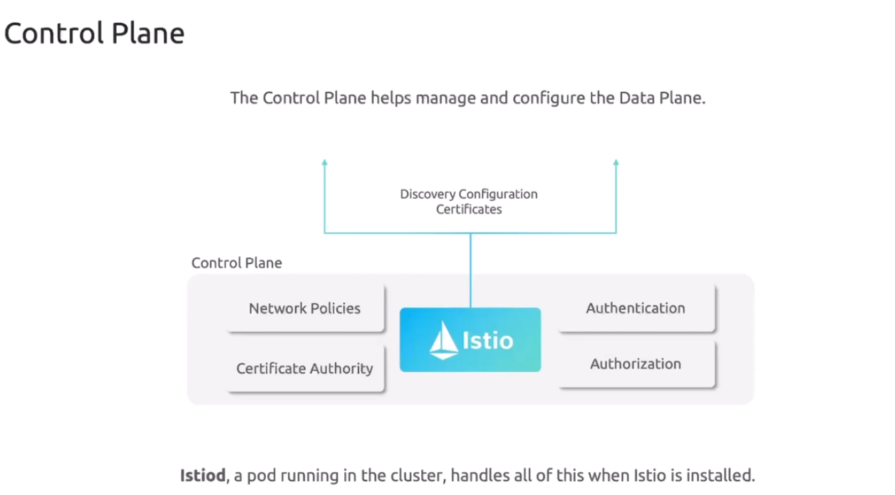
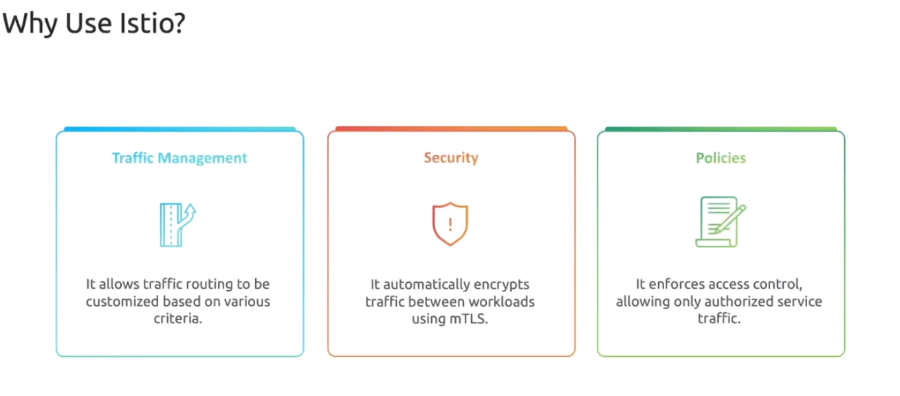
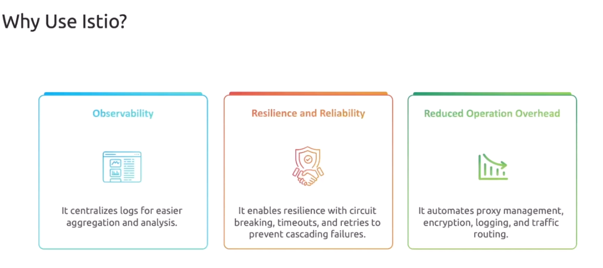

# 🚀 Istio

## 🎛️ What Is Istio?

> **Istio is a service mesh for Kubernetes that gives your microservices security, traffic control, and observability — using either sidecars OR the new ambient mode (no sidecars).**

Istio now has **two modes**:

1️⃣ **Sidecar Mode** — the classic approach (Envoy injected into every pod)  
2️⃣ **Ambient Mode** — the modern, lighter, sidecar-less approach introduced by Istio

Both give you:

- 🔒 mTLS security
- 🚦 Traffic routing
- 📈 Observability
- 🛡️ Policies

But the architecture is different.  
Let’s break it down the enjoyable way

---

## 🧠 Big Picture (Istio = Brain + Networking Helpers)

Istio has:

- A **Control Plane** = istiod (the boss)
- A **Data Plane**

  - Sidecars (classic mode)
  - OR **node-level** ztunnel + optional L7 waypoint proxies (ambient mode)

---

<div align="center" style="background-color:#fff; border-radius: 10px; border: 2px solid">

</div>

---

<div align="center" style="background-color:#fff; border-radius: 10px; border: 2px solid">

</div>

---

<div align="center" style="background-color:#fff; border-radius: 10px; border: 2px solid">

</div>

---

## 🏙️ Before Istio — Microservices Chaos

Without Istio your cluster looks like:

- Services talking randomly
- No encryption
- No retries
- No tracing
- No routing rules
- No consistent policies

It’s like a city with:

- No traffic lights
- No speed limits
- No security gates
- No cameras
- No GPS

Welcome to **Chaos City** 😅

Istio brings the order.

---

<div align="center" style="background-color:#fff; border-radius: 10px; border: 2px solid">

</div>

---

<div align="center" style="background-color:#fff; border-radius: 10px; border: 2px solid">

</div>

---

## 🏛️ Istio Architecture (Two Modes)

Let’s show the difference clearly.

---

## ⭐ Mode 1: **Classic Sidecar Mode** (The OG)

### 👇 Architecture (simple mental model)

Every Pod receives an Envoy proxy.

```ini
Pod:
 ├── App Container
 └── Envoy Sidecar (L4/L7 intelligence)
```

All traffic MUST pass through these sidecars.

### You get:

- Full L7 control
- Advanced routing
- Fault injection
- Observability

### Downsides:

- More resource usage
- Operational overhead
- Slower deployments (sidecar injection issues)

But still powerful.

---

## ⭐ Mode 2: **Ambient Mode (2025+) — Sidecar-less Service Mesh**

### 🧠 Why Ambient Mode?

Sidecar injection is heavy and creates problems like:

- Resource overhead per pod
- Slower rollouts
- Operational complexity
- “My sidecar didn’t inject 😭”

So Istio introduced **Ambient Mode** — with a completely new data plane.

### 🎉 What changes?

No more sidecars.
Instead, we get **node-level and waypoint proxies**.

---

## 🔥 Side-by-Side Comparison (Easy Table)

| Feature     | Sidecar Mode               | Ambient Mode                                   |
| ----------- | -------------------------- | ---------------------------------------------- |
| Sidecars    | Yes (Envoy in every pod)   | ❌ No sidecars                                 |
| L4 Security | Via Envoy sidecar          | ztunnel on node                                |
| L7 Routing  | Sidecar does everything    | Optional waypoint proxy                        |
| Performance | Higher overhead            | Much lighter                                   |
| Operations  | Complex (injection issues) | Easier, cleaner                                |
| Use cases   | Full L7 everywhere         | L4 security everywhere, L7 only where required |

Ambient is the **future** of Istio.

---

## 🧩 How Istio Works (Both Modes)

Regardless of mode:

- **istiod** (control plane) distributes configuration
- Identity is built using **SPIFFE/SPIRE style workloads**
- Traffic can be encrypted (mTLS)
- You get policies, metrics, and routing power

---

## 🔒 mTLS Difference

### Sidecar Mode

Each pod has an Envoy proxy → Envoy handles both mTLS encrypt/decrypt.

### Ambient Mode

- ztunnel handles mTLS for all workloads on node
- Waypoint proxy handles L7 routing only when needed

Ambient is simply more efficient.

---

## 🚦 Traffic Routing Difference

### Sidecar Mode

Routing rules apply **per pod** because every pod has Envoy.

### Ambient Mode

Routing rules apply **via waypoint proxies** for specific workloads.

Example:

- /checkout goes to waypoint
- /inventory may skip waypoint

This means **less overhead** and **more control**.

---

## 📈 Observability Differences

### Sidecar Mode

Full per-pod rich telemetry.

### Ambient Mode

- Telemetry from ztunnel (L4)
- L7 telemetry only for services that have waypoints

This makes the mesh lighter.

---

## 🧑‍🍳 Real Example Use Case

“If I have 50 microservices, I want security everywhere, but I only need L7 routing for 5 of them.”

### Sidecar Mode:

- 50 Envoy sidecars = heavy
- All services get L7 whether they need it or not

### Ambient Mode:

- ztunnel → provides mTLS for all 50
- Only 5 get waypoint proxies for L7 features
- Lighter, faster, cheaper

---

## 🎉 TL;DR

> **Istio is a service mesh that gives microservices security, traffic routing, and observability.
> You can run it in two modes:**

### 🟦 **1. Sidecar Mode** — Powerful L4+L7 per-pod Envoy

### 🟩 **2. Ambient Mode** — Sidecarless, lighter, scalable (ztunnel + optional L7 waypoints)

Ambient mode = **Istio but easier**, with:

- No sidecars
- Lower cost
- Cleaner architecture
- Optional L7 when needed

It is the future of service meshes.

---

If you want, next we can go deeper into:

### ✔️ ztunnel explained visually

### ✔️ Waypoint proxies explained with diagrams

### ✔️ Ambient mode architecture deep dive

### ✔️ Istio traffic objects (VirtualService, DestinationRule)

### ✔️ mTLS and identity in Istio

### ✔️ Ingress Gateway vs Ambient Waypoint

Just tell me **what to explain next** 🔥

---

## 🌉 Ambient Mode Architecture (Simple, Accurate, Humanized)

Ambient mode uses **layers**:

### **Layer 4 (L4) — ztunnel**

- Runs as a DaemonSet
- Provides:

  - mTLS
  - Identity
  - Basic traffic capture

- Works for ALL pods on the node
- No injection needed

Think of **ztunnel** as a **security guard** at each node.

---

### **Layer 7 (L7) — Waypoint Proxies (Optional)**

These give advanced features:

- Traffic routing
- Header manipulation
- Fault injection
- A/B testing
- Canary

Only add them when needed.

Think of **waypoints** as:

> “The traffic control towers for specific services.”

---

### 🙋 Ambient Mode In One Sentence

> **Ambient = zero sidecars + lighter, scalable security + optional L7 features only where needed.**

---
