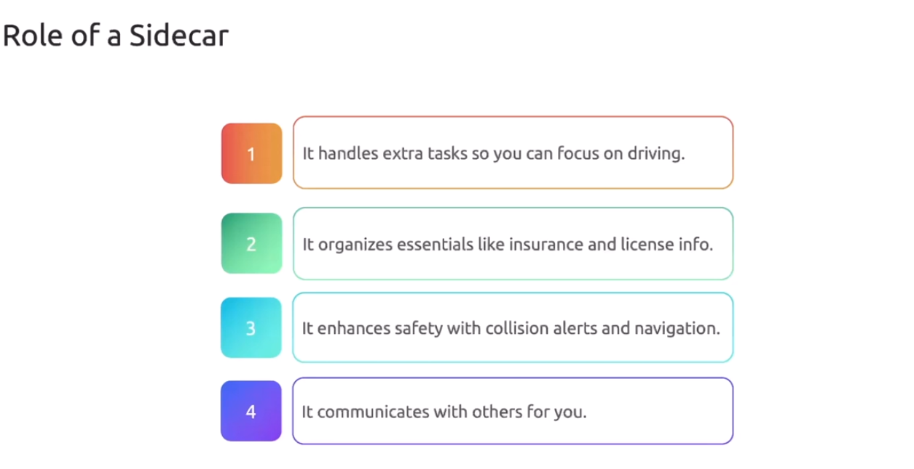
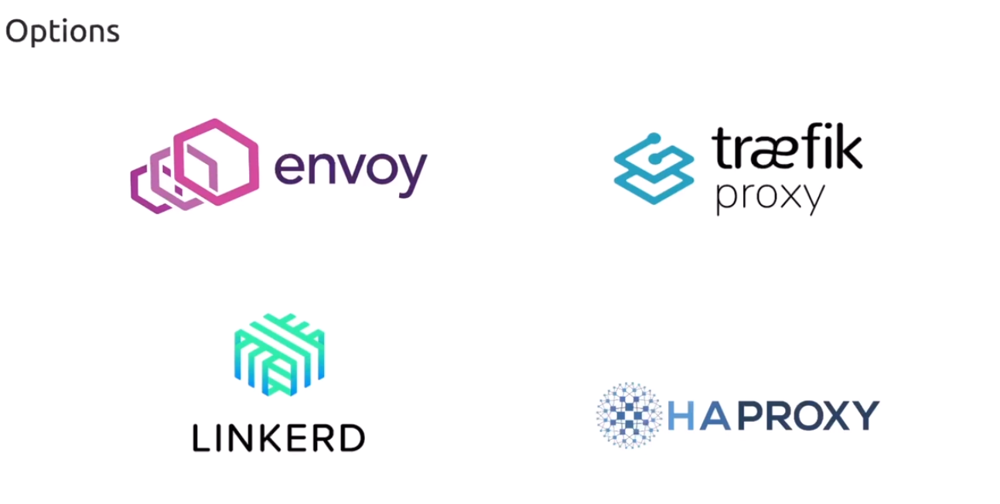
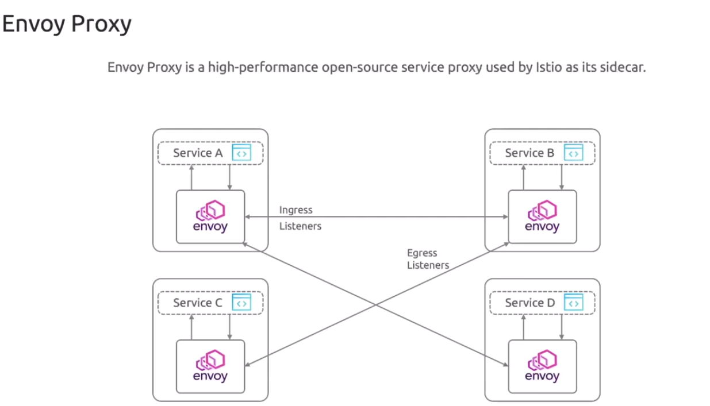

# 🚀 Istio Sidecar Mode Architecture

Istio’s original architecture — **sidecar mode** — is still the most feature-complete and widely used setup.

This is the version where **every Pod gets its own little Envoy bodyguard** 👮‍♂️ called a **sidecar proxy**.

Let’s go layer by layer.

---

## 📖 High-Level Mental Model

> **Istio (sidecar mode) = A giant brain (istiod) controlling thousands of mini-proxies (Envoy sidecars) sitting next to your microservices.**

It is basically:

- Kubernetes → creates pods
- Istio → injects a proxy into each pod
- All traffic goes through proxies
- istiod → controls all proxies

---

## 👷🏻 Role of Sidecar

<div align="center" style="background-color:#fff; border-radius: 10px; border: 2px solid">

</div>

## 🔨 Sidecar tools

<div align="center" style="background-color:#fff; border-radius: 10px; border: 2px solid">

</div>

## ✅ Sidecar envoy (default proxy for istio sidecar mode)

**Every pod = App + Envoy.**

<div align="center" style="background-color:#fff; border-radius: 10px; border: 2px solid">

</div>

---

## 🧩 Components in Sidecar Mode

Sidecar mode has **two planes**:

---

### 🧠 A. Control Plane (Istiod)

Istiod = the brain  
It handles:

#### **1. Configuration distribution**

- Routes
- Policies
- mTLS settings
- Traffic rules

#### **2. Certificate management**

- Generates workload certificates
- Rotates them
- Distributes them to sidecars
- Enables mTLS for all service traffic

#### **3. Service discovery**

- Discovers Kubernetes Services → sends info to Envoy sidecars.

#### **4. Telemetry config**

- Tells Envoy how to emit metrics, logs, and traces.

---

### 🚗 B. Data Plane (Envoy Sidecars)

Envoy = the worker, the traffic cop, the bouncer, the security guard, the traffic router — everything 😂

Each pod gets:

```ini
Application Container
Envoy Sidecar Proxy
```

Envoy handles:

- mTLS encryption/decryption
- Retries
- Timeouts
- Circuit breaking
- Routing rules (e.g., canary, A/B)
- Metrics + tracing
- Service-to-service authorization

Your app does NO networking logic.
Envoy does it all.

---

## 🌐 How Traffic Flows in Sidecar Mode

Let’s say **Service A wants to call Service B**

### **Without Istio**

A → B (direct, unsafe, unmonitored)

### **With Istio Sidecars**

A → A’s Envoy → (mTLS encrypted tunnel) → B’s Envoy → B

Visual:

```ini
App A → Envoy A → secure tunnel → Envoy B → App B
```

Your app literally doesn't know that any magic happened 🙈

---

## 🔒 Security (mTLS) in Sidecar Mode

Sidecars give you **automatic Zero Trust**:

- Envoy sidecar identifies workload using a certificate
- Envoy sidecar encrypts all traffic (TLS)
- Peer sidecar verifies identity

Example:

```ini
A: “I am service-account:checkout in namespace retail”
B: “Identity confirmed. Welcome.”
```

Certificates auto-rotate.

---

## 🚦 Traffic Management

Envoy handles ALL L7 traffic rules:

### Examples:

- Split 90% to v1, 10% to v2
- Route mobile traffic to v3
- Timeout after 3 seconds
- Retry 2 times
- Inject delays/faults for chaos testing

These controlled by:

- **VirtualService**
- **DestinationRule**
- **Gateway**

---

## 📈 Observability

Sidecars automatically produce:

- Metrics (Prometheus format)
- Traces (Jaeger, Zipkin)
- Logs
- Kiali service graph

**You get observability for FREE.**

---

## 🧪 Sidecar Injection (How the Proxy Gets Inside Your Pod)

There are two ways:

### 1. **Automatic Injection (recommended)**

Label namespace:

```ini
kubectl label namespace default istio-injection=enabled
```

Istio automatically adds Envoy into all pods in this namespace.

### 2. **Manual Injection**

You run:

```ini
istioctl kube-inject -f deployment.yaml
```

Rarely needed.

---

## 🚥 Full Traffic Pipeline

When App A sends a request:

1. App A → Envoy A
2. Envoy A:

   - applies routing rules
   - establishes mTLS
   - adds tracing headers
   - emits telemetry

3. Envoy A → Envoy B
4. Envoy B:

   - enforces policies
   - decrypts traffic
   - sends request to App B

Every request flows through **two Envoys**.

This is why sidecar mode gives the most control.

---

## 🎯 Strengths & Weaknesses

### ✅ Strengths

- Full L7 control
- Feature-rich (more than ambient)
- Best for advanced routing
- Best for legacy clusters
- Mature + proven

### ❌ Downsides

- More resource-heavy
- More CPU/RAM per pod
- Sometimes tricky injection bugs
- More moving parts

This is exactly why **Ambient Mode** was introduced later — but sidecar mode is still the power-user choice.

---

## 🎉 TL;DR

> **Istio sidecar mode injects an Envoy proxy into every Pod, and these Envoys handle security, traffic routing, policies, and telemetry for all controlled by the central brain (istiod).**
