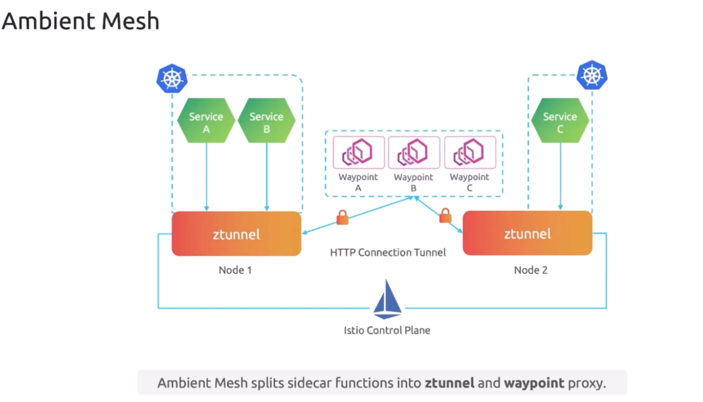
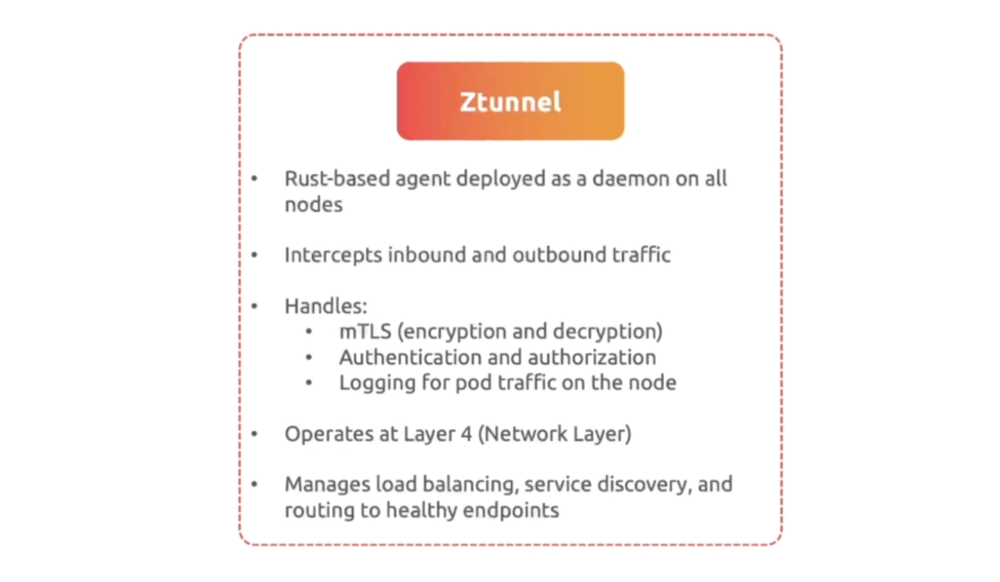
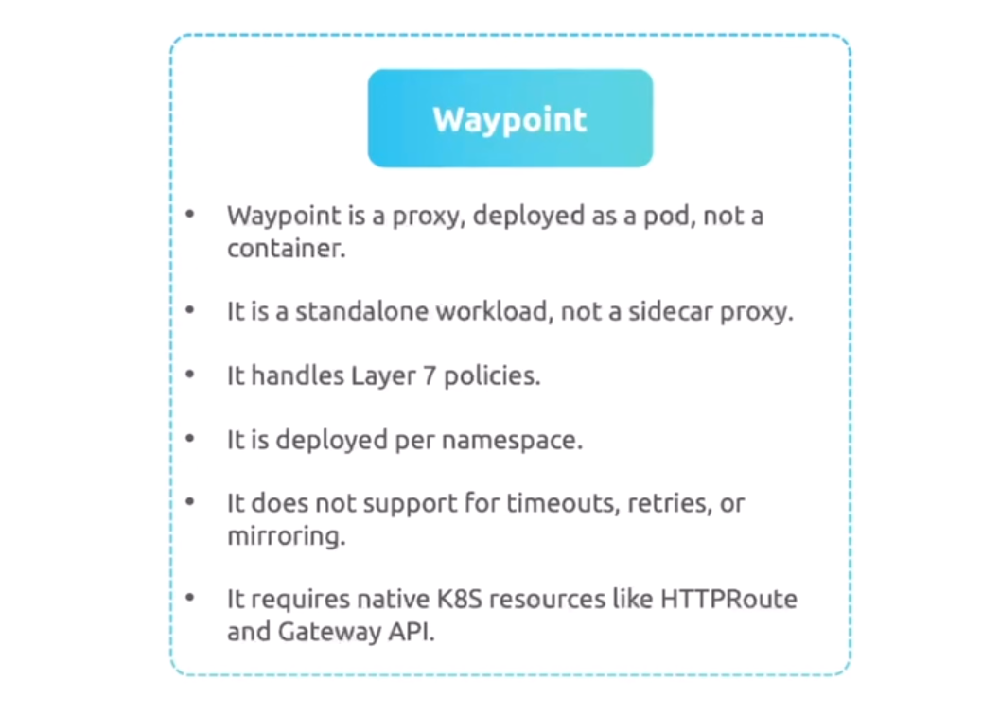

# 🏛️ Istio Ambient Mode Architecture

## (Sidecar-Less Service Mesh — Modern, Lightweight, Powerful)

Istio Ambient Mode is the **newest** and **most innovative** data plane model in Istio.
It **removes sidecars completely** and replaces them with **two lightweight layers**:

- **L4 secure overlay** → `ztunnel`
- **Optional L7 routing layer** → `waypoint proxies`

Let’s break it down beautifully.

---

## ❓ Why Ambient Mode? (The Reason It Exists)

Sidecar mode is powerful but has issues:

- Heavy CPU & memory footprint
- Injection problems
- Slower pod startup
- Hard to debug when sidecar fails
- Every pod needs an Envoy = expensive at scale

So Istio said:

> “Let’s keep the GOOD parts (mTLS, traffic control, observability)
> and REMOVE the bad parts (sidecar overhead).”

And Ambient Mode was born 🎉

---

## 🌉 Ambient Mode = Two-Layer Mesh

Think of Ambient Mode like a **two-layer cake** 🍰

### ✔️ Layer 1 — **L4 secure overlay (ztunnel)**

Handles security (mTLS), identities, basic L4 traffic.

### ✔️ Layer 2 — **L7 processing (waypoint proxy)**

Handles advanced traffic control (routing, retries, canaries, etc.)

**You only add Layer 2 if you need it.**

This makes Ambient:

- cheaper
- cleaner
- more scalable

---

## 🏛️ Ambient Mode Architecture

<div align="center" style="background-color:#fff; border-radius: 10px; border: 2px solid">

</div>

---

## 🔥 ztunnel (L4 Secure Overlay)

<div align="center" style="background-color:#fff; border-radius: 10px; border: 2px solid">

</div>

### 🧱 What is ztunnel?

A **node-level process** (running as a DaemonSet) that:

- Captures traffic
- Establishes mTLS
- Handles identity
- Does simple L4 forwarding

Think of **ztunnel** like:

> “A security guard sitting at every node—checking IDs and encrypting traffic for all workloads.”

### 🎯 Key Capabilities

- mTLS
- SPIFFE-based workload identity
- TCP-level traffic enforcement
- L4 metrics

### 🔧 How It Works (Simple)

All Pod traffic → captured by node-level ztunnel → sent securely to peer ztunnel → delivered to pod.

```ini
Pod A → ztunnel A → encrypted → ztunnel B → Pod B
```

### No Envoy inside pods.

Pods stay clean.

---

### 🌉 Waypoint Proxies (Optional L7)

<div align="center" style="background-color:#fff; border-radius: 10px; border: 2px solid">

</div>

### 🧠 What is a waypoint?

A **single Envoy proxy per service account** that handles:

- L7 routing
- Traffic splitting
- Canaries
- Fault injection
- Header operations

Think of a waypoint as:

> “An L7 control tower for all services running with a specific identity.”

### 💡 Important Difference from Sidecar Mode

- Not per pod
- Not per deployment
- Not per node
- **But per service account (identity)**

This massively reduces the number of proxies.

---

## 🎯 Traffic Flow in Ambient Mode

Let’s say Service A → Service B

### Case 1: No L7 rules (only secure traffic)

```ini
App A
  ↓
ztunnel (Node A)
  ↓ encrypted
ztunnel (Node B)
  ↓
App B
```

### Case 2: L7 rules applied (waypoint exists)

```ini
App A
  ↓
ztunnel A
  ↓
Waypoint for Service A (L7 logic)
  ↓ encrypted
ztunnel B
  ↓
Waypoint for Service B (optional)
  ↓
App B
```

---

## 🔐 Identity & mTLS in Ambient Mode

Ambient Mode uses:

- Workload identity = Kubernetes Service Account
- Certificates stored in ztunnel
- mTLS handshake between ztunnel → ztunnel

Pods never touch certificates → safer & simpler.

This is **Zero Trust without sidecars**.

---

## 🚀 Key Benefits of Ambient Mode

### 🟢 1. No Sidecars (Cleaner Pods)

Pods contain only:

```ini
[ Application Container(s) ]
```

No extra proxy = less memory & CPU.

---

### 🟢 2. Cheaper at Scale

Imagine 2,000 pods:

- Sidecar Mode → 2,000 Envoys
- Ambient Mode → maybe 15 ztunnels + 20 waypoints
  Huge cost savings.

---

### 🟢 3. Faster Pod Startup

No injection
No waiting for sidecar
No race conditions

---

### 🟢 4. Easy to Debug

All logic moves to node or waypoint level.

---

### 🟢 5. Incremental L7 Adoption

You get L4 security automatically
You add L7 only where needed

---

## 🟥 Limitations

Ambient is new → some limitations exist:

- L7 waypoint features still growing
- Some advanced Envoy features only work in sidecar mode
- Deployment models differ from classic Istio
- May require new mental model for routing

But this mode is the future of service meshes.

---

## 🎉 TL;DR

> **Ambient Mode = Zero-sidecar Istio using ztunnel for L4 security and optional waypoint proxies for L7 traffic — lighter, cleaner, faster, cheaper, and the future of service mesh.**
