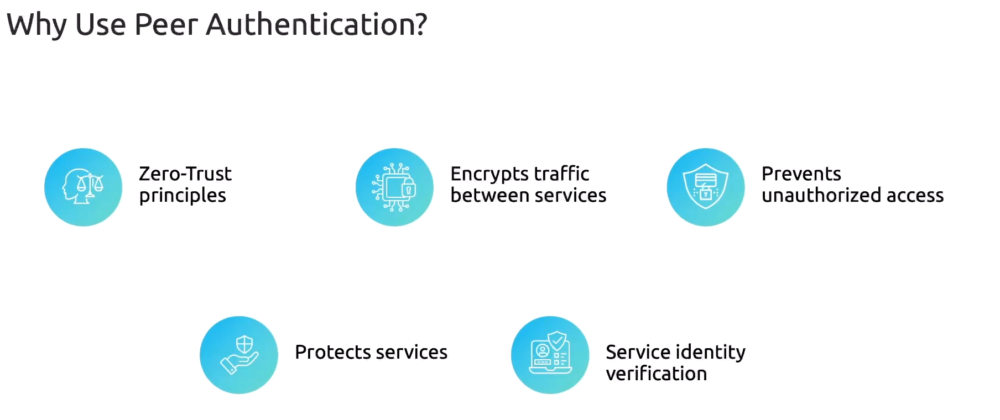
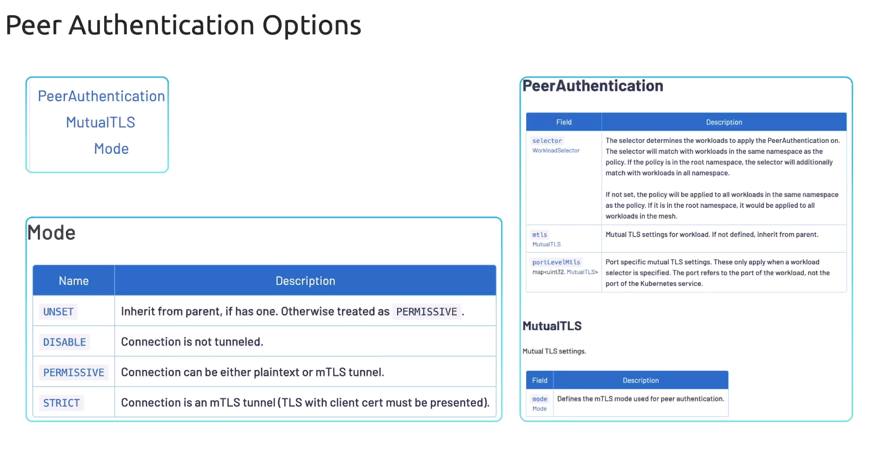

# 🛡️ Istio Peer Authentication

(“mTLS Security Between Services — the real Zero Trust engine”)

Peer Authentication is the **Istio feature that controls how services authenticate to each other using mTLS**.

Think of it like this:

> **Peer Authentication = how workloads prove who they are when talking to each other.**  
> It defines **whether traffic between pods is plaintext, optional mTLS, or STRICT mTLS**.

It is a **mesh-wide or namespace-wide or workload-specific** policy.

---

## 🧠 Why do we need Peer Authentication?

In a microservices cluster without Istio:

- Services talk **unencrypted**
- Clients can **spoof** identity
- Anyone can connect to anything
- No TLS, no certificates, no identity verification

This is NOT Zero Trust 😅

Istio Peer Authentication fixes this by:

- ✔️ Enforcing mTLS
- ✔️ Doing certificate-based identity
- ✔️ Verifying the calling workload
- ✔️ Securing traffic _inside_ the cluster
- ✔️ Enabling Zero Trust communication

---



## 🏛️ How Istio mTLS Works (Simple Mental Model)

Istio injects (sidecar mode) or uses ztunnel (ambient mode) to do:

1. **Issue certificates** to each workload
2. **Encrypt traffic** between workloads
3. **Verify identity** using SPIFFE IDs
4. **Apply PeerAuthentication policy**

Traffic flow (sidecar mode):

```ini
App A → Envoy A → mTLS → Envoy B → App B
```

Traffic flow (ambient mode):

```ini
Pod A → ztunnel → mTLS → ztunnel → Pod B
```

---

## 🔮 Peer Authentication Settings

A `PeerAuthentication` resource supports 3 modes:

### 🔓 **1. PERMISSIVE**

- Accept both plaintext _and_ mTLS
- Useful during migration
- Allows rolling upgrades
- Not secure enough for production

### 🔐 **2. STRICT**

- Require mTLS for all inbound connections
- Drops plaintext
- Recommended for Zero Trust
- Most secure

### 🔄 **3. DISABLE**

- No mTLS
- Plaintext allowed
- Not recommended, but sometimes needed (legacy apps)

---



## 📦 Where can Peer Authentication be applied?

**3 levels**:

| Level                 | Applies To                      | Use Case                 |
| --------------------- | ------------------------------- | ------------------------ |
| **Mesh-wide**         | Entire mesh                     | Default security posture |
| **Namespace-wide**    | All workloads in that namespace | Isolating workloads      |
| **Workload-specific** | A specific Deployment/Pod       | Fine-grained policies    |

Priority (highest wins):

> Workload > Namespace > Mesh

---

## 🧩 CRD structure

Here is the structure:

```yaml
apiVersion: security.istio.io/v1beta1
kind: PeerAuthentication
metadata:
  name: <policy-name>
  namespace: <ns>
spec:
  mtls:
    mode: STRICT | PERMISSIVE | DISABLE | UNSET
  selector:
    matchLabels:
      app: my-app
```

---

## 🧪 Lets Implement It

We’ll cover both:

- ✔️ Sidecar mode
- ✔️ Ambient mode

Because the implementation is slightly different in where traffic gets intercepted, but Peer Auth CRDs are the same.

---

## 🍏 **A. Mesh-Wide Peer Authentication (affects everything)**

This policy usually lives in the **istio-system** namespace.

### Make _all traffic in the mesh_ STRICT mTLS:

```yaml
apiVersion: security.istio.io/v1beta1
kind: PeerAuthentication
metadata:
  name: default
  namespace: istio-system
spec:
  mtls:
    mode: STRICT
```

Apply:

```bash
kubectl apply -f mesh-peerauth.yaml
```

This means:

- All workloads MUST receive mTLS traffic
- Any HTTP/plaintext will get **rejected**

---

## 🍊 **B. Namespace-Level Peer Authentication**

Example: secure all workloads in namespace `payments`:

```yaml
apiVersion: security.istio.io/v1beta1
kind: PeerAuthentication
metadata:
  name: namespace-policy
  namespace: payments
spec:
  mtls:
    mode: STRICT
```

Apply:

```bash
kubectl apply -f ns-peerauth.yaml
```

Everything in `payments` namespace now requires mTLS.

---

## 🍉 **C. Workload-Level Peer Authentication (most specific)**

Secure only the `checkout` service:

```yaml
apiVersion: security.istio.io/v1beta1
kind: PeerAuthentication
metadata:
  name: checkout-strict
  namespace: retail
spec:
  selector:
    matchLabels:
      app: checkout
  mtls:
    mode: STRICT
```

Now:

- Only `app=checkout` strictly requires mTLS
- Other workloads in `retail` namespace don’t

---

## 🔄 Migration Example (How to gradually migrate to mTLS)

The recommended upgrade path:

### Step 1 — Set PERMISSIVE globally

```yaml
mtls:
  mode: PERMISSIVE
```

Now plaintext + mTLS both accepted.

### Step 2 — Configure workloads to send mTLS (DestinationRule)

```yaml
apiVersion: networking.istio.io/v1beta1
kind: DestinationRule
metadata:
  name: default
spec:
  host: "*.local"
  trafficPolicy:
    tls:
      mode: ISTIO_MUTUAL
```

### Step 3 — Switch PeerAuthentication to STRICT

This ensures **100% secure mesh**.

---

## 🎯 How to verify Peer Authentication is working

### Check mTLS mode applied:

```bash
istioctl authn tls-check <source-pod> <destination-pod>
```

Example:

```bash
istioctl authn tls-check reviews-v1 productpage-v1
```

You should see:

```ini
CLIENT → reviews-v1: mTLS is enabled
SERVER → productpage-v1: mTLS is required (STRICT)
```

### Check mesh-wide policies:

```bash
kubectl get peerauthentication -A
```

### Check sidecar certificates:

```bash
istioctl proxy-config secret <pod> -n <ns>
```

---

## 🌉 Peer Authentication in **Ambient Mode**

Ambient mode still uses the **exact same PeerAuthentication resources**.

Key differences:

- ✔️ mTLS happens at **ztunnel level**
- ✔️ App Pods don’t have sidecars, so they never handle certs
- ✔️ Traffic is encrypted node-to-node via ztunnel
- ✔️ STRICT mode means:

  - plaintext into ztunnel is accepted
  - but outgoing to another ztunnel is mTLS only

To enable STRICT for ambient workloads:

```yaml
apiVersion: security.istio.io/v1beta1
kind: PeerAuthentication
metadata:
  name: ambient-strict
  namespace: default
spec:
  mtls:
    mode: STRICT
```

Apply:

```bash
kubectl apply -f ambient-peerauth.yaml
```

Ambient mode is easier because:

- You don’t restart any app pods
- mTLS enforcement is centralized
- zTunnel updates happen as DaemonSets

---

## 🧁 TL;DR

**Istio Peer Authentication = telling Istio what kind of mTLS you want: DISABLE, PERMISSIVE, or STRICT.**

And you can apply it at:

1. Mesh level
2. Namespace level
3. Workload level

STRICT mode = **full Zero Trust**
PERMISSIVE mode = **safe migration**

Works in:

- Sidecar mode → mTLS via Envoy
- Ambient mode → mTLS via ztunnel

---

## Reference

- [Peer Authentication: Documentation -> Reference -> Configuration -> Security -> PeerAuthentication](https://istio.io/latest/docs/reference/config/security/peer_authentication/)
