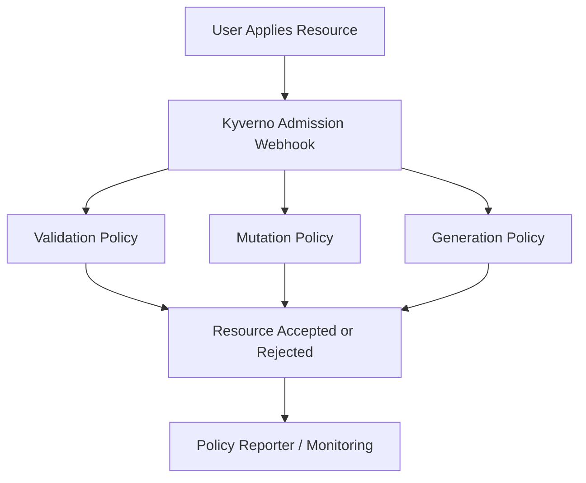

# 🛡️ Kyverno

> _📖 Kubernetes-Native Policy Engine for Secure, Automated Cluster Governance._

**Kyverno** is a powerful, open-source **policy-as-code engine** designed specifically for **Kubernetes**. It enables platform engineers and SREs to **validate, mutate, generate, and clean up resources** using native YAML — no need to learn a new DSL. Kyverno enforces security, compliance, and operational standards across clusters, making it a strategic tool for **multi-tenant environments**, **GitOps workflows**, and **CI/CD pipelines**.

---

## 🧠 Architectural Overview

Kyverno runs as a **controller inside your Kubernetes cluster**, intercepting API requests and applying policies declaratively:

| Component                 | Role                                                           |
| ------------------------- | -------------------------------------------------------------- |
| 📄 **Policy CRDs**        | Define validation, mutation, generation, and cleanup rules.    |
| 🧠 **Kyverno Controller** | Watches for resource events and applies policies in real time. |
| 🔁 **Admission Webhook**  | Intercepts create/update requests and enforces policies.       |
| 🧪 **CLI & Chainsaw**     | Test policies locally or in CI/CD pipelines.                   |
| 📊 **Policy Reporter**    | Visualize policy violations and compliance status.             |

Kyverno policies are written in **pure Kubernetes YAML**, making them intuitive for K8s-native teams.

---

## 📦 Key Features

- ✅ **Validation Policies**: Block misconfigured resources before they’re deployed.
- 🔧 **Mutation Policies**: Automatically adjust resource specs (e.g., add labels, enforce limits).
- 🧬 **Generation Policies**: Create dependent resources (e.g., RoleBindings, NetworkPolicies).
- 🧹 **Cleanup Policies**: Remove resources when parent objects are deleted.
- 🔐 **Image Verification**: Validate container signatures with Cosign, Notary, or Sixty.
- 📜 **Pod Security Policies (PSPs)**: Enforce fine-grained pod security controls.
- 🧪 **Just-in-Time Provisioning**: Dynamically create resources like Roles and Namespaces.
- ⚙️ **Autogen for CRDs**: Automatically extend policies to custom resources.
- 📊 **Reporting & Monitoring**: Integrate with Prometheus, Grafana, and Policy Reporter.
- 🧰 **CLI & Chainsaw**: Test policies outside the cluster and run declarative e2e tests.

---

## 🚀 When to Use Kyverno

Kyverno is ideal for:

- 🧠 **Kubernetes-native policy enforcement** without external tooling.
- 🔐 **Security hardening** via image verification, PSPs, and RBAC controls.
- 🧰 **Multi-tenant clusters** needing scoped policies and namespace isolation.
- 🧪 **CI/CD pipelines** that validate manifests before deployment.
- 📊 **Compliance automation** with audit-ready policy reporting.
- ☁️ **GitOps workflows** that require declarative governance.

It’s especially powerful in **air-gapped environments**, **self-service platforms**, and **regulated industries**.

---

## ⚔️ Kyverno vs OPA/Gatekeeper vs Kubewarden

| Feature                | 🛡️ **Kyverno**                      | 🧠 **OPA/Gatekeeper**     | 🧩 **Kubewarden**                |
| ---------------------- | ----------------------------------- | ------------------------- | -------------------------------- |
| Language               | YAML (Kubernetes-native)            | Rego (custom DSL)         | WebAssembly (WASM)               |
| Ease of Use            | ✅ Intuitive for K8s users          | 🔶 Steep learning curve   | 🔶 Requires WASM knowledge       |
| Policy Types           | Validate, mutate, generate, cleanup | Validate only             | Validate, mutate                 |
| Image Verification     | ✅ Native support                   | ❌ External tooling       | ✅ Native                        |
| CRD Support            | ✅ Autogen for CRDs                 | 🔶 Manual                 | ✅ Native                        |
| CLI Testing Tools      | ✅ Kyverno CLI + Chainsaw           | 🔶 Limited                | ✅ CLI tools                     |
| Reporting & Monitoring | ✅ Policy Reporter + Prometheus     | 🔶 External setup         | ✅ Built-in                      |
| Use Case Fit           | Secure, automated governance        | Complex logic enforcement | Lightweight, WASM-based policies |

**TL;DR**:

- Use **Kyverno** for **Kubernetes-native, YAML-driven policy enforcement**.
- Use **OPA/Gatekeeper** for **complex logic and cross-platform policies**.
- Use **Kubewarden** for **WASM-based lightweight policy execution**.

---

## 🗺️ Visual Model (Mermaid-style)

This shows how Kyverno intercepts and processes resource requests in real time.

---

## 🧩 Strategic Fit for You, Hady

- 🧠 **Architectural clarity**: Kyverno’s declarative, modular policy model aligns with your YAML-first, reusable design mindset.
- 📁 **Portfolio-ready**: Showcase PSP enforcement, image verification, and just-in-time provisioning in multi-tenant clusters.
- 🧪 **Tool benchmarking**: Compare Kyverno vs OPA vs Kubewarden for policy coverage, performance, and developer experience.
- 🔐 **Security signaling**: Demonstrate signature verification, RBAC enforcement, and compliance automation.
- 📊 **Interview leverage**: Model policy lifecycle, autogen flows, and CI/CD integration with Chainsaw and Policy Reporter.

---

You can explore Kyverno’s full capabilities in the [official documentation](https://kyverno.io/docs/) or dive into its architecture and use cases in [Komodor’s feature breakdown](https://komodor.com/learn/kyverno-features-architecture-and-a-quick-tutorial/) and [Not a DevOps Engineer’s Kyverno 101](https://www.notadevopsengineer.com/kyverno-101/).
