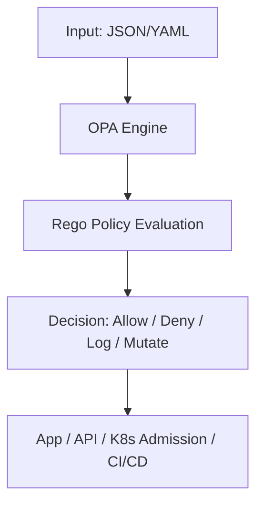

# 🧠 Open Policy Agent (OPA)

> _📖 Universal Policy Engine for Cloud-Native Authorization and Governance._

**OPA** is an open-source, general-purpose **policy engine** that enables you to define and enforce policies across your entire stack — from Kubernetes and microservices to CI/CD pipelines, APIs, and infrastructure. It decouples policy logic from application code, enabling **centralized, declarative governance** using its native language: **Rego**.

OPA is a strategic tool for DevOps, SREs, and platform engineers who need **fine-grained control**, **compliance automation**, and **runtime policy decisions** across distributed systems.

---

## 🧠 Architectural Overview

OPA can be deployed in multiple modes depending on your use case:

| Mode                     | Description                                                   |
| ------------------------ | ------------------------------------------------------------- |
| 🧱 **Standalone**        | Run as a daemon or CLI tool to evaluate policies locally.     |
| 🔗 **Sidecar / Host**    | Co-located with apps/services to make real-time decisions.    |
| 🧩 **Embedded**          | Integrated directly into applications via SDKs.               |
| 🧠 **Gatekeeper (K8s)**  | Admission controller for Kubernetes using OPA under the hood. |
| 🧪 **CI/CD Integration** | Validate IaC, configs, and pipelines before deployment.       |

OPA evaluates **JSON or YAML input** against **Rego policies**, returning decisions that can be used to allow, deny, mutate, or log actions.

---

## 📦 Key Features

- 🧬 **Rego Language**: Declarative, JSON-native policy language for expressive rule definition.
- 🔐 **Access Control**: Fine-grained RBAC, ABAC, and custom authorization logic.
- 🧪 **Configuration Validation**: Enforce standards on Kubernetes, Terraform, Dockerfiles, etc.
- 📊 **Data-Driven Decisions**: Policies can query external data sources or bundle static data.
- 🔁 **Real-Time Evaluation**: Fast, deterministic decisions for APIs, services, and admission controllers.
- 🧰 **Policy Bundling**: Package policies and data for distribution and versioning.
- 📡 **REST API**: Expose policy decisions via HTTP endpoints.
- 🧩 **Tooling Ecosystem**: Includes Conftest (IaC validation), Gatekeeper (K8s), and Rego Playground.
- 📜 **Audit & Compliance**: Centralized policy enforcement simplifies governance and reporting.

---

## 🚀 When to Use OPA

OPA is ideal for:

- 🔐 **Authorization** in microservices, APIs, and service meshes.
- 🧪 **CI/CD guardrails** to validate IaC, configs, and pipeline logic.
- 📊 **Kubernetes governance** via Gatekeeper (e.g., enforce pod security, naming conventions).
- 🧰 **Infrastructure policy enforcement** across cloud and on-prem.
- 🧠 **Custom decision engines** for apps needing dynamic, data-aware logic.

It’s especially powerful in **multi-tenant platforms**, **regulated environments**, and **GitOps workflows**.

---

## ⚔️ OPA vs Kyverno vs Kubewarden

| Feature                | 🧠 **OPA**                           | 🛡️ **Kyverno**                      | 🧩 **Kubewarden**                   |
| ---------------------- | ------------------------------------ | ----------------------------------- | ----------------------------------- |
| Language               | Rego (custom DSL)                    | YAML (Kubernetes-native)            | WebAssembly (WASM)                  |
| Policy Types           | Validate, allow/deny, log            | Validate, mutate, generate, cleanup | Validate, mutate                    |
| Kubernetes Integration | ✅ Gatekeeper                        | ✅ Native                           | ✅ Native                           |
| Ease of Use            | 🔶 Steep learning curve              | ✅ Intuitive for K8s users          | 🔶 Requires WASM knowledge          |
| CI/CD Integration      | ✅ Conftest, CLI, REST API           | ✅ Chainsaw, CLI                    | ✅ CLI tools                        |
| Extensibility          | ✅ High (SDKs, APIs, data injection) | ✅ Autogen for CRDs                 | ✅ WASM modules                     |
| Use Case Fit           | Cross-platform policy engine         | Kubernetes-native governance        | Lightweight, WASM-based enforcement |

**TL;DR**:

- Use **OPA** for **cross-cutting policy enforcement** across apps, infra, and pipelines.
- Use **Kyverno** for **Kubernetes-native governance** with YAML simplicity.
- Use **Kubewarden** for **WASM-based lightweight policy execution**.

---

## 🗺️ Visual Model (Mermaid-style)

This shows how OPA evaluates input against policies and returns decisions to consuming systems.

---

## 🧩 Strategic Fit for You, Hady

- 🧠 **Architectural clarity**: OPA’s decoupled policy model aligns with your modular, reusable design mindset.
- 📁 **Portfolio-ready**: Showcase Rego policies for RBAC, CI/CD validation, and Kubernetes governance.
- 🧪 **Tool benchmarking**: Compare OPA vs Kyverno vs Conftest for policy coverage, developer experience, and performance.
- 🔐 **Security signaling**: Demonstrate centralized policy enforcement, audit trails, and compliance automation.
- 📊 **Interview leverage**: Model policy lifecycle, Rego logic, and integration flows with APIs, Gatekeeper, and Conftest.

---

You can explore OPA’s full capabilities in [Komodor’s feature guide](https://komodor.com/learn/open-policy-agent-opa-features-use-cases-and-how-to-get-started/) or browse curated tools and integrations on [Styra’s awesome-opa repo](https://github.com/StyraOSS/awesome-opa).
