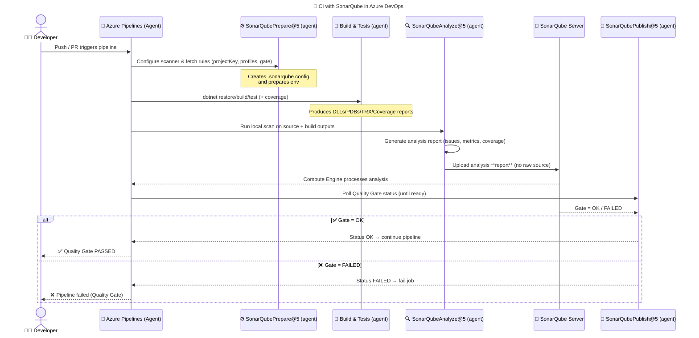
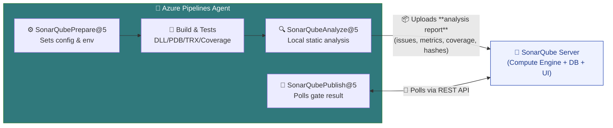
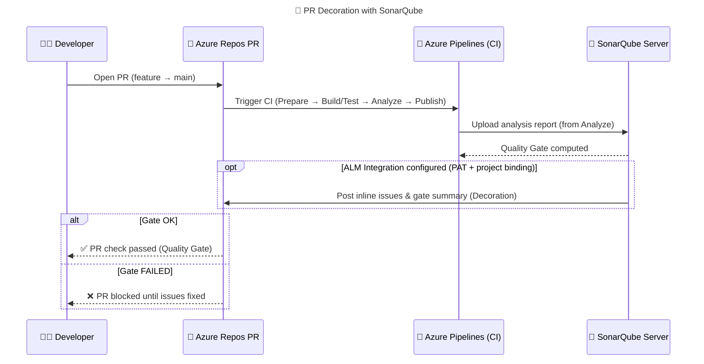

# 🧠 **SonarQube Azure DevOps Tasks**

These tasks come from the **official SonarQube Extension** in Azure DevOps Marketplace.
They are wrappers around the **SonarScanner for MSBuild** (for .NET projects) or the **SonarScanner CLI** (for other languages).

---

## 🧩 Task 1: `SonarQubePrepare@5`

### 🔹 Purpose: _Start the analysis context_

This is the **first** SonarQube task in your pipeline.
It tells Azure DevOps: “Okay, we’re about to analyze code — set everything up.”

---

### ⚙️ What It Actually Does:

1. **Connects to SonarQube server** using the **service connection** you configured.
2. Authenticates using your **SonarQube token**.
3. Creates a **temporary `.sonarqube` folder** on the build agent that holds configuration files and rules.
4. Fetches:

   - Quality profiles (rules for the language)
   - Quality gate configuration
   - Project metadata (key, name, organization, etc.)

5. Sets up **environment variables** that the next tasks will use (especially `SonarQubeAnalyze`).
6. For MSBuild-based projects (.NET, C#), it injects a special **begin command** before build:

   ```bash
   SonarScanner.MSBuild.exe begin /k:"my_project" /d:sonar.host.url="..." /d:sonar.login="..."
   ```

   which starts recording all compiler info for later analysis.

---

### 💡 Typical YAML Usage:

```yaml
- task: SonarQubePrepare@5
  inputs:
    SonarQube: "SonarQube-Service" # Service connection name
    scannerMode: "MSBuild" # Mode: MSBuild or CLI
    projectKey: "myapp"
    projectName: "My Application"
    extraProperties: |
      sonar.coverage.exclusions=**/Migrations/**
      sonar.cs.opencover.reportsPaths=$(Agent.TempDirectory)/**/coverage.opencover.xml
```

---

### 🧠 Key Parameters:

| Parameter         | Meaning                                                   |
| ----------------- | --------------------------------------------------------- |
| `SonarQube`       | The name of the service connection (used for auth)        |
| `scannerMode`     | `MSBuild` for .NET, `CLI` for others                      |
| `projectKey`      | Unique project key in SonarQube                           |
| `projectName`     | Display name for the project                              |
| `extraProperties` | Additional settings like coverage paths, exclusions, etc. |

---

### 🧮 Summary:

**Think of it as:**
📜 _“SonarQube, get ready! I’m about to build something you’ll want to inspect.”_

---

## 🧩 Task 2: `SonarQubeAnalyze@5`

### 🔹 Purpose: _Actually run the code analysis_

This is the **engine** — it reads your compiled project and runs SonarQube’s static analysis rules.

---

### ⚙️ What It Actually Does:

1. Scans the source code + compiled assemblies (.dlls, .pdbs).
2. Applies the **language-specific analyzers**:

   - Roslyn analyzers for C#
   - SonarJS, SonarPython, SonarCxx, etc.

3. Collects metrics:

   - Lines of code (LOC)
   - Duplications
   - Complexity
   - Code smells, bugs, vulnerabilities
   - Coverage (from reports you provided)

4. Generates a **`.sonar` report** (in JSON/XML form) with all detected issues.
5. Uploads this raw report to the **SonarQube server**.

---

### 💡 Typical YAML Usage:

```yaml
- task: SonarQubeAnalyze@5
  displayName: "🔍 Run SonarQube Analysis"
```

---

### 🧠 What Happens Behind the Scenes (for .NET):

Equivalent MSBuild commands:

```bash
SonarScanner.MSBuild.exe end /d:sonar.login="your-token"
```

This uploads all captured data (from the build phase) to the SonarQube server.

---

### 🧮 Summary:

**Think of it as:**
🧪 _“I’ve built the project, now scan and send every bug, smell, and vulnerability you can find.”_

---

## 🧩 Task 3: `SonarQubePublish@5`

### 🔹 Purpose: _Publish results and check Quality Gate_

This is the **final** SonarQube task.
It tells Azure DevOps to **poll SonarQube** until the Quality Gate status is ready — then report pass/fail.

---

### ⚙️ What It Actually Does:

1. Waits for the SonarQube server to finish processing the uploaded analysis (this can take 10–60 seconds).
2. Polls the SonarQube REST API:

   ```ini
   GET /api/qualitygates/project_status?projectKey=myapp
   ```

3. Retrieves the **Quality Gate status**:

   ```json
   {
     "projectStatus": {
       "status": "OK",
       "conditions": [
         { "metricKey": "new_coverage", "status": "OK" },
         { "metricKey": "new_bugs", "status": "OK" },
         { "metricKey": "new_vulnerabilities", "status": "OK" }
       ]
     }
   }
   ```

4. If the status = `ERROR`, the task **fails the build** (marks pipeline red ❌).
5. If the status = `OK`, the pipeline **continues** (green ✅).
6. Optionally, adds a link in the pipeline summary to the **SonarQube dashboard**.

---

### 💡 Typical YAML Usage:

```yaml
- task: SonarQubePublish@5
  displayName: "📊 Publish Quality Gate Result"
  inputs:
    pollingTimeoutSec: "300"
```

---

### 🧠 Key Parameter:

| Parameter           | Meaning                                                                                                        |
| ------------------- | -------------------------------------------------------------------------------------------------------------- |
| `pollingTimeoutSec` | How long to wait (in seconds) for SonarQube to finish computing the Quality Gate result. Default: 300 (5 min). |

---

### ⚠️ Behavior on Fail:

If SonarQube returns **FAILED**, Azure DevOps log shows:

```ini
##[error]SonarQube quality gate failed: FAILED
```

And the job result becomes ❌ **Failed**, blocking any dependent stages (like Deploy).

---

### 🧮 Summary:

**Think of it as:**
🚦 _“SonarQube, tell me: is the code safe to merge or not?”_
If not → stop the pipeline immediately.

---

## 🔄 **Typical Order in Pipeline**

<div align="center" style="background-color: #141a19ff;color: #a8a5a5ff; border-radius: 10px; border: 2px solid">



---



---



</div>

---

🔹 **SonarQubePrepare@5** (agent): sets up scanner config, fetches rules/gates, prepares env.  
🔹 **Build & Tests** (agent): compile + run tests + produce coverage.  
🔹 **SonarQubeAnalyze@5** (agent): **local** static analysis; generates & **uploads report** (no raw source).  
🔹 **SonarQubePublish@5** (agent): polls server’s **Quality Gate** result → pass/fail the job.

---

## 🧮 **Quick Comparison Table**

<div align="center" style="background-color: #141a19ff;color: #a8a5a5ff; border-radius: 10px; border: 2px solid">

| Task                   | When It Runs   | What It Does                                        | Output                           |
| ---------------------- | -------------- | --------------------------------------------------- | -------------------------------- |
| **SonarQubePrepare@5** | Before build   | Sets up analysis, fetches rules, configures scanner | `.sonarqube` folder with config  |
| **SonarQubeAnalyze@5** | After build    | Runs analysis, uploads data to SonarQube            | Raw report in SonarQube          |
| **SonarQubePublish@5** | After analysis | Checks Quality Gate status, passes/fails pipeline   | Build result + link to dashboard |

</div>

---

## 🧾 **Example Full Flow Summary**

```yaml
# 1️⃣ Preparation
- task: SonarQubePrepare@5
  inputs:
    SonarQube: "SonarQube-Service"
    projectKey: "myapp"
    projectName: "MyApp"

# 2️⃣ Build & Test
- task: DotNetCoreCLI@2
  inputs:
    command: "build"
- task: DotNetCoreCLI@2
  inputs:
    command: "test"

# 3️⃣ Analysis
- task: SonarQubeAnalyze@5

# 4️⃣ Quality Gate Check
- task: SonarQubePublish@5
  inputs:
    pollingTimeoutSec: "300"
```

---

## ✅ **TL;DR Cheat Sheet**

<div align="center" style="background-color: #141a19ff;color: #a8a5a5ff; border-radius: 10px; border: 2px solid">

| Task                 | Simple Meaning              | Fails Build?           |
| -------------------- | --------------------------- | ---------------------- |
| `SonarQubePrepare@5` | “Start analysis”            | ❌ No                  |
| `SonarQubeAnalyze@5` | “Run scan & upload data”    | ❌ No                  |
| `SonarQubePublish@5` | “Check quality gate result” | ✅ Yes (if gate fails) |

</div>
