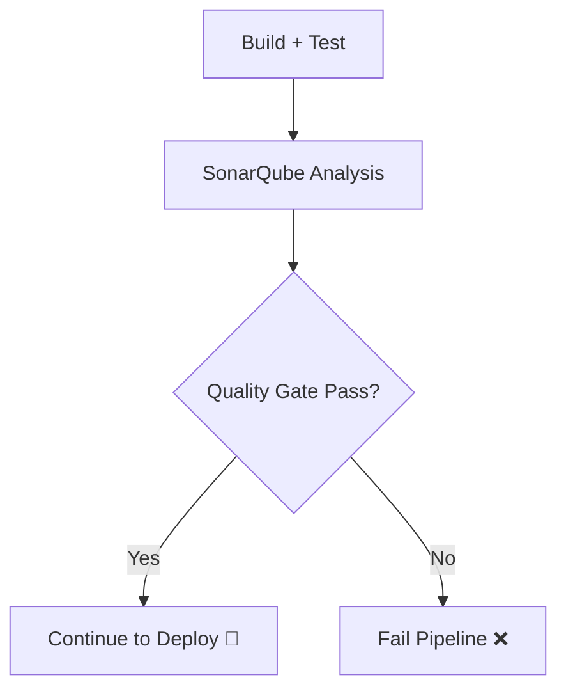

# 🤔 So... Does SonarQube Actually _Fail_ Pipelines?

✅ **Yes — it can!**  
SonarQube is not just a “report viewer.”
It can **automatically fail your Azure DevOps pipeline** if your code breaks the **Quality Gate** rules.

---

## 🧩 Think of it this way

Your CI/CD pipeline has multiple “judges” 👇

| Step         | Judge        | What it checks                               | Can it fail pipeline? |
| ------------ | ------------ | -------------------------------------------- | --------------------- |
| ✅ Build     | Compiler     | Does the code compile?                       | Yes                   |
| ✅ Test      | Test runner  | Do unit tests pass?                          | Yes                   |
| ✅ SonarQube | Quality Gate | Is the code clean, secure, and maintainable? | Yes (if configured)   |

So, **SonarQube is another gatekeeper** like tests or linting — but focused on **code quality, security, and maintainability**.

---

## 🧠 How the “Failure” Happens

In your Azure DevOps YAML pipeline, you usually have this final step:

```yaml
- task: SonarQubePublish@5
  displayName: "Publish Quality Gate Result"
  inputs:
    pollingTimeoutSec: "300"
```

### Here’s what happens:

1. This task **asks SonarQube** for the project’s latest analysis result.
2. SonarQube checks the **Quality Gate** (bugs, vulnerabilities, coverage, duplication).
3. If **any condition fails**, the gate status = ❌ FAILED.
4. The pipeline **marks the build as failed** in Azure DevOps.

---

## 🧱 Example

### 🔴 Failing Gate Example:

Your Quality Gate rules say:

- No new **critical** or **blocker** bugs.
- Code coverage ≥ 80%.
- Duplications ≤ 3%.

After analysis, SonarQube finds:

- 2 Critical Bugs
- Coverage = 55%
- Duplications = 5%

💥 **Result:** Quality Gate failed.
Azure DevOps shows:

```ini
##[error] SonarQube quality gate failed: FAILED
```

Pipeline = ❌ FAILED
Deployment stage = 🚫 Blocked

---

## 🟢 Passing Gate Example:

- 0 Critical Bugs
- Coverage = 87%
- Duplications = 1%

✅ **Result:** Quality Gate passed
Pipeline continues to next stage (deploy, etc.)

---

## 🧭 Simplified Pipeline Logic



---

## 💡 Important Notes

- By default, **SonarQubePublish@5** will fail the pipeline **only** if the Quality Gate = FAILED.
- The **failure is based on metrics**, not only test results.
- You can configure gates to check:

  - Bugs
  - Vulnerabilities
  - Code Smells
  - Coverage %
  - Duplications
  - Security Hotspots

---

## 🔐 In short:

| Task                   | Purpose                        |
| ---------------------- | ------------------------------ |
| `DotNetCoreCLI@2 test` | Fails if tests fail ❌         |
| `SonarQubePublish@5`   | Fails if code quality fails ❌ |

👉 So yes, **SonarQube can make your build fail — just like failing tests — if your code violates quality or security rules.**
