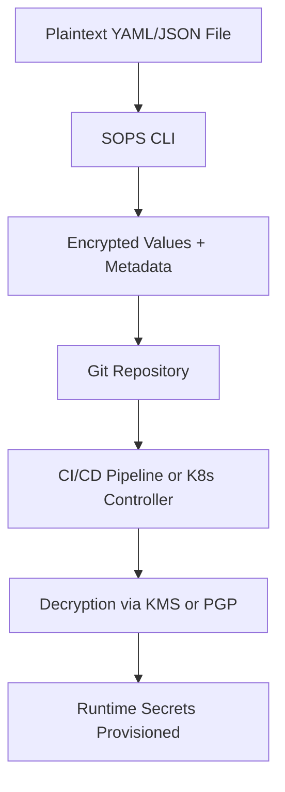

# 🔐 SOPS (Secrets OPerationS)

> _📖 Git-Friendly Encryption Tool for Managing Secrets in YAML, JSON, ENV, and INI Files._

**SOPS** is an open-source tool created by Mozilla that enables **secure, structured encryption of configuration files** — especially useful for managing secrets in **GitOps**, **Kubernetes**, and **CI/CD pipelines**. Unlike traditional secret managers, SOPS encrypts only the **values**, not the structure, allowing teams to **diff, audit, and version secrets safely** in Git.

---

## 🧠 Architectural Overview

SOPS is a **CLI-based encryption engine** that integrates with multiple key management systems:

| Component                   | Role                                                                          |
| --------------------------- | ----------------------------------------------------------------------------- |
| 📄 **Structured Files**     | YAML, JSON, ENV, INI — only values are encrypted, structure remains readable. |
| 🔐 **Key Providers**        | AWS KMS, GCP KMS, Azure Key Vault, PGP — used to encrypt/decrypt secrets.     |
| 🧰 **SOPS CLI**             | Encrypts/decrypts files, integrates with Git workflows and CI/CD.             |
| 📦 **Metadata Block**       | Stores encryption metadata (key sources, version, etc.) inside the file.      |
| 🔁 **GitOps Compatibility** | Secrets can be safely committed to Git and decrypted at runtime.              |

SOPS is often used with **Kubernetes tools** like **Flux**, **Helm**, and **Kustomize**, enabling secure, declarative secret management.

---

## 📦 Key Features

- 🔐 **Field-Level Encryption**: Encrypts only values, preserving file structure for readability and diffing.
- 🧬 **Multi-Format Support**: YAML, JSON, ENV, INI — ideal for config files and manifests.
- 🔁 **Git-Friendly**: Enables version control of secrets without exposing sensitive data.
- 🧰 **Multi-KMS Integration**: AWS KMS, GCP KMS, Azure Key Vault, PGP — choose your provider.
- 📜 **Declarative Metadata**: Encryption keys and settings embedded in the file header.
- 🧪 **CI/CD Integration**: Decrypt secrets during pipeline execution or runtime provisioning.
- 📊 **Auditability**: Track changes to encrypted secrets via Git history.
- 🧩 **Kubernetes-Native**: Works seamlessly with Flux, Kustomize, and Sealed Secrets.
- ⚙️ **Automatic Key Rotation**: Re-encrypt files with new keys without manual intervention.

---

## 🚀 When to Use SOPS

SOPS is ideal for:

- 🔐 **Managing secrets in Git repositories** without compromising security.
- 🧰 **GitOps workflows** where secrets need to be declarative and versioned.
- 🧪 **CI/CD pipelines** that require runtime decryption of secrets.
- 📦 **Kubernetes deployments** using Kustomize, Helm, or Flux.
- 🧠 **Multi-cloud environments** needing flexible KMS integration.

It’s especially powerful in **infrastructure-as-code setups**, **multi-tenant clusters**, and **regulated environments**.

---

## ⚔️ SOPS vs Sealed Secrets vs Vault

| Feature            | 🔐 **SOPS**             | 🧊 **Sealed Secrets**             | 🏰 **HashiCorp Vault**        |
| ------------------ | ----------------------- | --------------------------------- | ----------------------------- |
| Encryption Scope   | File-level, field-level | Kubernetes Secret objects         | Centralized secret store      |
| Git Compatibility  | ✅ Git-friendly         | ✅ Git-friendly                   | ❌ Not designed for Git       |
| KMS Integration    | ✅ AWS, GCP, Azure, PGP | ❌ Uses controller-generated keys | ✅ Vault KMS or external      |
| Runtime Decryption | ✅ CLI or controller    | ✅ Controller-based               | ✅ API-based                  |
| Format Support     | YAML, JSON, ENV, INI    | Kubernetes Secrets only           | Key-value, dynamic secrets    |
| Use Case Fit       | GitOps, IaC, CI/CD      | Kubernetes-native GitOps          | Centralized secret management |

**TL;DR**:

- Use **SOPS** for **Git-friendly, file-based secret encryption**.
- Use **Sealed Secrets** for **Kubernetes-native secret sealing**.
- Use **Vault** for **centralized, dynamic secret management**.

---

## 🗺️ Visual Model (Mermaid-style)

This shows how SOPS encrypts secrets for Git, and decrypts them securely during deployment.

---

## 🧩 Strategic Fit for You, Hady

- 🧠 **Architectural clarity**: SOPS’s field-level encryption and declarative metadata align with your modular, GitOps-first mindset.
- 📁 **Portfolio-ready**: Showcase secure `.sops.yaml` workflows with multi-cloud KMS integration and CI/CD decryption.
- 🧪 **Tool benchmarking**: Compare SOPS vs Vault vs Sealed Secrets for cost, security, and Git compatibility.
- 🔐 **Security signaling**: Demonstrate Git-safe secret management with audit trails and key rotation.
- 📊 **Interview leverage**: Model secret lifecycle, KMS integration, and runtime decryption flows.

---

You can explore SOPS in depth via [Mozilla’s GitHub repo](https://github.com/mozilla/sops) or check out [Flux’s SOPS integration guide](https://fluxcd.io/flux/guides/mozilla-sops/) for Kubernetes workflows.
