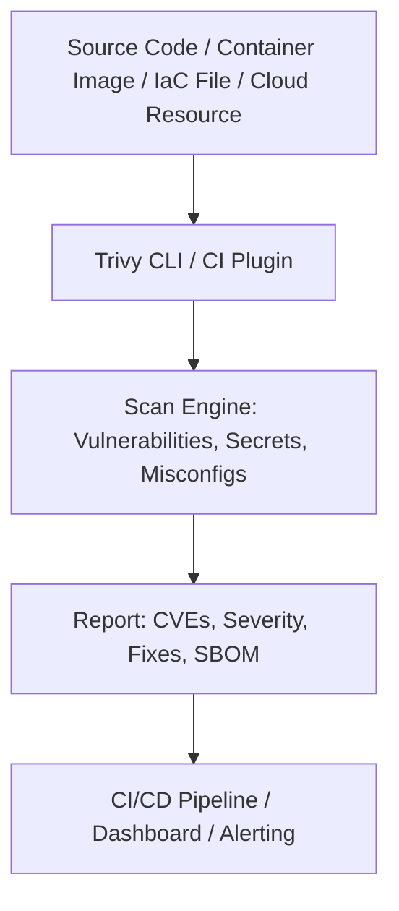

# 🛡️ Trivy

> _📖 All-in-One Security Scanner for Containers, Code, and Cloud Infrastructure._

**Trivy** (by Aqua Security) is a fast, reliable, and easy-to-use **DevSecOps tool** that scans for **vulnerabilities, misconfigurations, secrets, and license issues** across your entire software supply chain — from **container images** and **Kubernetes manifests** to **IaC files**, **source code**, and **cloud resources**. It’s designed to shift security **left**, making it a strategic asset for **CI/CD pipelines**, **SRE workflows**, and **compliance automation**.

---

## 🧠 Architectural Overview

Trivy operates as a **modular CLI tool** or as part of a **CI/CD pipeline**, with multiple scanning modes:

| Mode                   | Target                               | Purpose                                        |
| ---------------------- | ------------------------------------ | ---------------------------------------------- |
| 🐳 **Image Scan**      | Docker/OCI container images          | Detect OS and library vulnerabilities          |
| 📁 **Filesystem Scan** | Local directories or mounted volumes | Scan binaries, config files, and secrets       |
| 📦 **Repository Scan** | Git repositories                     | Find secrets, license issues, and misconfigs   |
| 📄 **Config Scan**     | Kubernetes, Terraform, Dockerfiles   | Detect misconfigurations and policy violations |
| ☁️ **Cloud Scan**      | AWS, GCP, Azure                      | Audit cloud resources for security risks       |

Trivy uses the **Open Vulnerability Database (OVD)**, **NVD**, and other sources to ensure comprehensive coverage.

---

## 📦 Key Features

- 🔍 **Vulnerability Scanning**: Detects CVEs in OS packages and application dependencies.
- 🔐 **Secrets Detection**: Finds hardcoded secrets in code, configs, and containers.
- 🧪 **Misconfiguration Checks**: Validates IaC files and Kubernetes manifests against best practices.
- 📜 **License Compliance**: Flags non-compliant or risky open-source licenses.
- ☁️ **Cloud Resource Auditing**: Scans AWS, GCP, Azure for insecure configurations.
- 🧰 **CI/CD Integration**: Works with GitHub Actions, GitLab CI, Azure DevOps, Jenkins, etc.
- 📄 **SBOM Generation**: Creates Software Bill of Materials for supply chain transparency.
- 🧩 **Policy Engine**: Supports custom policies via Rego (OPA) or built-in rules.
- ⚡ **Fast & Lightweight**: Minimal setup, fast execution, and low resource usage.
- 📊 **Detailed Reports**: Severity levels, remediation guidance, and exportable formats.

---

## 🚀 When to Use Trivy

Trivy is ideal for:

- 🧠 **Shift-left security** in CI/CD pipelines.
- 🧰 **Container image hardening** before deployment.
- 🔐 **Secrets and config auditing** in Git repos and IaC files.
- ☁️ **Cloud posture management** for AWS, GCP, Azure.
- 📊 **Compliance workflows** requiring SBOMs and license checks.
- 🧪 **DevSecOps enablement** across teams and environments.

It’s especially powerful when embedded early in the pipeline — catching issues before they reach production.

---

## ⚔️ Trivy vs Grype vs Snyk

| Feature                 | 🛡️ **Trivy**                        | 🐍 **Snyk**           | 🐾 **Grype**          |
| ----------------------- | ----------------------------------- | --------------------- | --------------------- |
| Scope                   | Containers, IaC, cloud, code        | Code, containers, IaC | Containers, SBOMs     |
| Secrets Detection       | ✅ Yes                              | ✅ Yes                | ❌ No                 |
| Misconfigurations       | ✅ Yes (K8s, Terraform, Dockerfile) | ✅ Yes                | 🔶 Limited            |
| License Scanning        | ✅ Yes                              | ✅ Yes                | ✅ Yes                |
| Cloud Resource Scanning | ✅ AWS, GCP, Azure                  | 🔶 Limited            | ❌ No                 |
| SBOM Support            | ✅ CycloneDX, SPDX                  | ✅ SPDX               | ✅ Syft/CycloneDX     |
| CI/CD Integration       | ✅ Native + plugins                 | ✅ Native + UI        | ✅ CLI-based          |
| Cost                    | ✅ Free & open-source               | 🔶 Freemium           | ✅ Free & open-source |

**TL;DR**:

- Use **Trivy** for **full-spectrum DevSecOps scanning**.
- Use **Snyk** for **developer-first vulnerability management**.
- Use **Grype** for **container-focused scanning with SBOM support**.

---

## 🗺️ Visual Model (Mermaid-style)

This shows how Trivy fits into your pipeline and outputs actionable security insights.

---

## 🧩 Strategic Fit for You, Hady

- 🧠 **Architectural clarity**: Trivy’s modular scanning modes align with your layered DevOps workflows — from code to cloud.
- 📁 **Portfolio-ready**: Showcase Trivy-integrated pipelines with SBOM generation, secrets detection, and IaC validation.
- 🧪 **Tool benchmarking**: Compare Trivy vs Snyk vs Grype for cost, coverage, and CI/CD fit.
- 🔐 **Security signaling**: Demonstrate shift-left scanning, policy enforcement, and compliance readiness.
- 📊 **Interview leverage**: Model Trivy’s role in secure SDLC, GitOps workflows, and cloud posture audits.

---

You can explore Trivy’s full documentation on [Trivy.dev](https://trivy.dev/dev/docs/) or see how it integrates with Azure DevOps in [this practical guide](https://softwaretestinglead.com/boosting-devops-security-using-trivy-in-azure-devops/).
