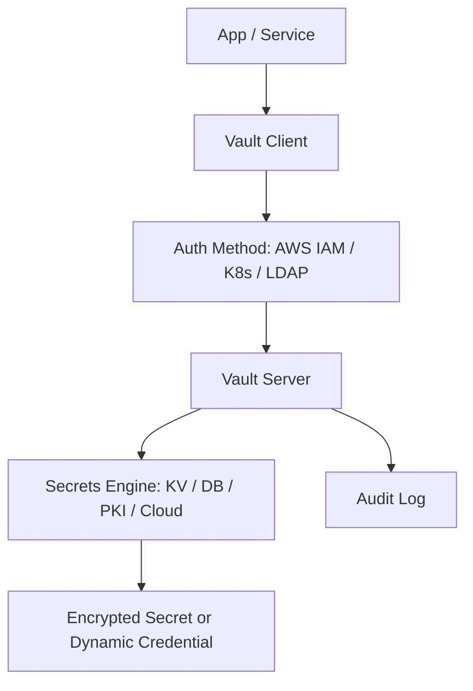

# 🏰 HashiCorp Vault

> _📖 Centralized Secrets Management and Encryption for Cloud-Native Infrastructure._

**Vault** by HashiCorp is a **secure, auditable, and highly flexible secrets management system** designed to protect sensitive data across distributed systems. It provides a unified interface to **store, access, and dynamically generate secrets**, making it a strategic tool for DevOps, SREs, and platform engineers working in **multi-cloud, hybrid, or zero-trust environments**.

---

## 🧠 Architectural Overview

Vault operates as a **client-server system** with modular components and plugin-based extensibility:

| Component              | Role                                                                       |
| ---------------------- | -------------------------------------------------------------------------- |
| 🧱 **Vault Server**    | Core service that handles encryption, authentication, and secret access.   |
| 🔐 **Storage Backend** | Persists encrypted data (e.g., Consul, S3, GCS, Azure Blob, etc.).         |
| 🧩 **Secrets Engines** | Plugins that manage secrets (e.g., KV, database, PKI, cloud credentials).  |
| 🔑 **Auth Methods**    | Plugins for identity verification (e.g., AWS IAM, Kubernetes, LDAP, OIDC). |
| 📜 **Policies**        | Fine-grained access control using HCL-based ACLs.                          |
| 📊 **Audit Devices**   | Log all access attempts for compliance and forensics.                      |

Vault encrypts everything at rest and in transit, and **access is gated by policies** that define who can do what.

---

## 📦 Key Features

- 🔐 **Static Secrets Storage**: Store API keys, passwords, tokens, and certificates securely.
- 🔁 **Dynamic Secrets**: Generate credentials on-demand for databases, cloud providers, etc.
- 🧬 **Encryption-as-a-Service**: Encrypt/decrypt arbitrary data without storing it.
- 🧰 **Identity-Based Access**: Authenticate users/services via cloud IAM, LDAP, Kubernetes, etc.
- 📜 **Policy Enforcement**: Use ACLs to control access to secrets and operations.
- 🧪 **Leases & Revocation**: Secrets expire automatically and can be revoked instantly.
- 🧩 **Secret Rotation**: Automatically rotate credentials and keys.
- 📊 **Audit Logging**: Track every access attempt, successful or denied.
- ☁️ **Multi-Cloud Support**: Integrates with AWS, Azure, GCP, and on-prem systems.
- 🧱 **HCP Vault**: Managed Vault service hosted by HashiCorp for simplified ops.

---

## 🚀 When to Use Vault

Vault is ideal for:

- 🔐 **Centralized secrets management** across services and environments.
- 🧰 **Dynamic credential provisioning** for databases, cloud APIs, and SSH.
- 🧪 **CI/CD pipelines** needing secure access to secrets and encryption.
- 📊 **Compliance-heavy environments** requiring audit trails and access control.
- 🧠 **Zero-trust architectures** where identity and policy drive access.

It’s especially powerful in **multi-tenant platforms**, **regulated industries**, and **GitOps workflows**.

---

## ⚔️ Vault vs SOPS vs Doppler vs AWS Secrets Manager

| Feature                 | 🏰 **Vault**                            | 🔐 **SOPS**                  | 🌊 **Doppler**          | ☁️ **AWS Secrets Manager** |
| ----------------------- | --------------------------------------- | ---------------------------- | ----------------------- | -------------------------- |
| Scope                   | Centralized secrets + encryption        | Git-friendly file encryption | SaaS-based secrets sync | AWS-native secrets store   |
| Dynamic Secrets         | ✅ Yes                                  | ❌ No                        | 🔶 Limited              | ✅ Yes                     |
| Encryption-as-a-Service | ✅ Yes                                  | ❌ No                        | ❌ No                   | ❌ No                      |
| Git Compatibility       | 🔶 Indirect (via Vault Agent templates) | ✅ Native                    | ✅ Native               | ❌ Not designed for Git    |
| Audit Logging           | ✅ Built-in                             | ✅ Git history               | ✅ Dashboard logs       | ✅ CloudTrail              |
| KMS Integration         | ✅ Vault KMS or external                | ✅ AWS/GCP/Azure/PGP         | ✅ Native               | ✅ AWS KMS                 |
| Use Case Fit            | Infra-wide secrets + encryption         | GitOps secrets               | Dev-first secrets sync  | AWS-only secrets           |

**TL;DR**:

- Use **Vault** for **enterprise-grade secrets management and encryption**.
- Use **SOPS** for **GitOps-friendly file encryption**.
- Use **Doppler** for **developer-centric secrets sync**.
- Use **AWS Secrets Manager** for **AWS-native secrets**.

---

## 🗺️ Visual Model (Mermaid-style)

This shows how Vault authenticates clients, evaluates policies, and returns secrets or encryption services.

---

## 🧩 Strategic Fit for You, Hady

- 🧠 **Architectural clarity**: Vault’s plugin-based model and policy-driven access align with your modular, secure design mindset.
- 📁 **Portfolio-ready**: Showcase dynamic secrets provisioning, encryption-as-a-service, and policy enforcement across environments.
- 🧪 **Tool benchmarking**: Compare Vault vs SOPS vs Doppler for GitOps, CI/CD, and multi-cloud security.
- 🔐 **Security signaling**: Demonstrate zero-trust access, audit logging, and secret rotation in regulated environments.
- 📊 **Interview leverage**: Model Vault’s lifecycle, policy architecture, and integration with Terraform, Kubernetes, and GitOps flows.

---

You can explore Vault’s architecture and use cases in [HashiCorp’s official documentation](https://developer.hashicorp.com/vault/docs/about-vault/what-is-vault) or dive into practical examples via [Graph AI’s DevOps glossary](https://www.graphapp.ai/engineering-glossary/devops/vault).
