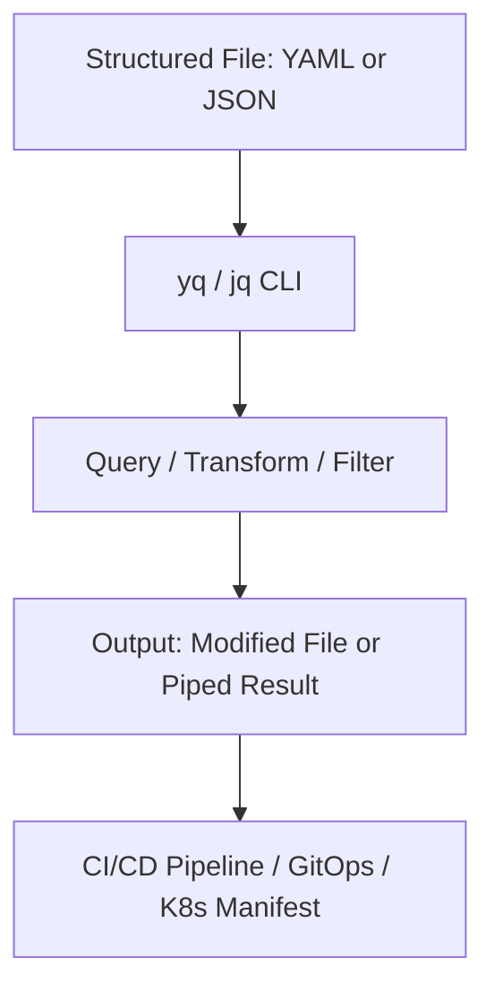

# 🧰 `yq` vs `jq`

> _📖 Command-Line Power Tools for Structured Data: YAML & JSON Processing for DevOps._

**`jq`** and **`yq`** are indispensable CLI tools for manipulating structured data — especially in **DevOps**, **CI/CD**, and **Kubernetes workflows**. They offer powerful, expressive syntax for querying, transforming, and validating **JSON** and **YAML** files, respectively. Think of them as your **grep + sed + awk** for structured documents.

---

## 🧠 Architectural Overview

| Tool    | Primary Format             | Language | Core Functionality                       |
| ------- | -------------------------- | -------- | ---------------------------------------- |
| 🐍 `jq` | JSON                       | C        | Slice, filter, map, and transform JSON   |
| 🧾 `yq` | YAML (also JSON, XML, CSV) | Go       | YAML-first processor with jq-like syntax |

- `jq` is optimized for **JSON**, with a rich functional syntax.
- `yq` (by Mike Farah) wraps `jq`-like logic for **YAML**, but also supports **JSON, XML, INI, CSV, TOML** — making it a **multi-format powerhouse**.

---

## 📦 Key Features

### 🐍 `jq` Highlights

- 🔍 **Query JSON deeply**: `.users[] | select(.active == true)`
- 🔁 **Transform structures**: map, reduce, filter, sort
- 🧪 **Validation & formatting**: compact, pretty-print, minify
- 📊 **Math & logic**: arithmetic, conditionals, string ops
- 📜 **Streaming support**: handle large files efficiently

### 🧾 `yq` Highlights

- 🧬 **YAML-native syntax**: `.spec.containers[0].image`
- 🔁 **Update in-place**: `yq -i '.metadata.name = "prod"' file.yaml`
- 🔧 **Merge files**: `yq ea '. as $item ireduce ({}; . * $item)' *.yml`
- 🔐 **Environment variable injection**: `strenv(DB_URL)`
- 📦 **Multi-format support**: YAML, JSON, XML, CSV, INI, TOML
- 🧰 **Kubernetes-ready**: ideal for Helm, Kustomize, GitOps workflows

---

## ⚔️ `yq` vs `jq`: Strategic Comparison

| Feature                      | 🧾 `yq` (Mike Farah)             | 🐍 `jq`                         |
| ---------------------------- | -------------------------------- | ------------------------------- |
| Primary Format               | YAML (also JSON, XML, CSV, etc.) | JSON only                       |
| Language                     | Go                               | C                               |
| Syntax Style                 | jq-like                          | Functional DSL                  |
| In-place Editing             | ✅ Yes (`-i` flag)               | ❌ No (requires redirection)    |
| Multi-file Merge             | ✅ Yes (`ea` mode)               | ❌ No native support            |
| Environment Variable Support | ✅ Yes (`strenv`)                | ✅ Yes (`env`)                  |
| Kubernetes Use Case          | ✅ Helm, Kustomize, manifests    | 🔶 Limited (JSON-based configs) |
| Learning Curve               | ✅ Easier for YAML users         | 🔶 Steeper for non-programmers  |

**TL;DR**:

- Use **`jq`** for **pure JSON pipelines**, API responses, and data transformations.
- Use **`yq`** for **YAML-heavy DevOps workflows**, especially in Kubernetes and GitOps.

---

## 🗺️ Visual Model (Mermaid-style)

This shows how `yq` and `jq` fit into your automation and observability workflows.

---

## 🧩 Strategic Fit for You, Hady

- 🧠 **Architectural clarity**: Both tools support modular, declarative transformations — ideal for your CI/CD and GitOps pipelines.
- 📁 **Portfolio-ready**: Showcase `yq` scripts for Helm/Kustomize patching, and `jq` for API response shaping or Terraform state parsing.
- 🧪 **Tool benchmarking**: Compare `yq` vs `jq` vs `dasel` for format coverage, performance, and DevOps fit.
- 🔐 **Security signaling**: Use `yq` to inject secrets from SOPS or Vault into manifests securely.
- 📊 **Interview leverage**: Model real-world use cases like merging Helm values, validating JSON responses, or transforming Terraform outputs.

---

You can explore `yq` on [GitHub](https://github.com/mikefarah/yq) and dive into a full comparison of `jq`, `yq`, and other CLI processors on [Ritza’s breakdown](https://ritza.co/articles/gen-articles/jq-vs-yq-vs-jsonpath-vs-jmespath-vs-sed-vs-awk/).
