# ☁️ Cloudflare — The Internet’s Shield, Accelerator & Swiss Army Knife

> **Official tagline:** “Helping build a better Internet.”
> Think of Cloudflare as a **global bouncer + courier + translator** for your website — it protects you from attacks, speeds up your traffic, and handles millions of visitors without breaking a sweat.

---

## 🧠 1. What Is Cloudflare?

### 💬 Official Definition

Cloudflare is a **global cloud network platform** that sits between your **users** and your **origin servers**, providing:

- **Security** 🛡️ (DDoS protection, WAF, Zero Trust)
- **Performance** ⚡ (CDN caching, optimized routing, edge computing)
- **Reliability** 🧩 (load balancing, failover, redundancy)
- **Developer tools** 🧠 (serverless apps, APIs, analytics, and more)

---

### 🔍 Real-World Analogy

Imagine your website as a store in the desert 🌵.

- Without Cloudflare: Every customer walks miles to your shop, and bandits can attack you on the road.
- With Cloudflare: The company builds **hundreds of mini-stores (edge nodes)** worldwide near the customers.
  They:

  - Deliver goods faster (caching)
  - Stop robbers (DDoS, WAF)
  - Manage your store’s door policy (access control, zero trust)

---

## ⚙️ 2. How Cloudflare Works

Let’s visualize this before diving into features 👇

```mermaid
sequenceDiagram
    participant U as 🌍 User
    participant CF as ☁️ Cloudflare Edge (CDN)
    participant O as 🏠 Origin Server

    U->>CF: Request https://myapp.com
    CF-->>U: Serve cached content (if available)
    CF->>O: Fetch from origin (if not cached)
    O-->>CF: Response + headers
    CF-->>U: Optimized, secure response
```



### 🔁 Simplified Flow

1. **DNS Proxying:** You set Cloudflare as your domain’s nameserver.
2. **Edge Routing:** When a user visits your domain, their request hits Cloudflare’s nearest data center.
3. **Inspection:** Cloudflare filters attacks (WAF, DDoS, bot checks).
4. **Caching:** If data is cached → returned instantly.
5. **Forwarding:** If not cached → Cloudflare fetches from your origin.
6. **Optimization:** It compresses, encrypts, and accelerates the response.

---

## 🚀 3. Cloudflare Core Capabilities

Let’s break them down by domain 👇

---

### ⚡ 3.1 Performance & Caching

| Feature                            | Description                                                 | Example                                                                 |
| ---------------------------------- | ----------------------------------------------------------- | ----------------------------------------------------------------------- |
| **CDN (Content Delivery Network)** | Serves static/dynamic content from 300+ edge nodes globally | User in Dubai loads your site hosted in Virginia — served from UAE node |
| **Argo Smart Routing**             | Uses optimized routes, avoiding Internet congestion         | Reduces latency during peak hours                                       |
| **Polish & Mirage**                | Image optimization for mobile & web                         | Compresses images on the fly                                            |
| **HTTP/3, QUIC, Brotli**           | Next-gen network protocols                                  | Speeds up loading and TLS handshakes                                    |
| **Load Balancing**                 | Distributes traffic among multiple origins                  | Routes users between AWS & Azure servers                                |

🧠 **Tip:** You can configure “Cache Everything” for static sites (like blogs) and “Bypass Cache” for APIs or login pages.

---

### 🛡️ 3.2 Security

| Layer           | Capability                       | What It Protects                          |
| --------------- | -------------------------------- | ----------------------------------------- |
| **Network**     | DDoS Mitigation                  | Blocks massive floods (L3/L4 attacks)     |
| **Application** | WAF (Web Application Firewall)   | Stops SQLi, XSS, path traversal           |
| **Identity**    | Zero Trust Access                | Controls who enters your apps             |
| **Bots**        | Bot Management                   | Detects and challenges suspicious traffic |
| **Encryption**  | SSL/TLS (Flexible, Full, Strict) | Ensures HTTPS across all connections      |

💡 _Example:_
You can apply a WAF rule like:

> “Block all traffic with user-agent `sqlmap` attempting `POST /login` more than 50 times per minute.”

---

### 🔒 3.3 Reliability

Cloudflare’s network is designed for **99.999% uptime**.

- **Load Balancing** — Routes users to the nearest healthy server.
- **Always Online** — Serves cached versions even if your origin is down.
- **Automatic Failover** — Detects dead origins and reroutes instantly.
- **DNS-level redundancy** — Cloudflare DNS is one of the fastest in the world (1.1.1.1).

🧩 _Use Case:_
If your AWS EC2 instance in the US goes down, Cloudflare automatically reroutes to a backup in Frankfurt.

---

### 💻 3.4 Developer Platform (Edge Compute)

Welcome to **Cloudflare Workers** — a global, serverless runtime that executes your code at the edge 🚀

| Product                      | Purpose                               | Example                               |
| ---------------------------- | ------------------------------------- | ------------------------------------- |
| **Workers**                  | Run JavaScript/TypeScript at edge     | Build APIs, redirects, custom caching |
| **Workers KV**               | Key-value store                       | Store feature flags, small configs    |
| **D1 (SQLite)**              | Edge database                         | Persist data without central DB       |
| **Pages**                    | Host static sites (like Netlify)      | Deploy React/Next.js builds           |
| **Queues & Durable Objects** | Background jobs / stateful edge logic | Handle chat sessions or job queues    |

🧠 Example Worker:

```js
addEventListener("fetch", (event) => {
  const country = event.request.cf.country;
  const url = country === "AE" ? "/ae-home" : "/global-home";
  event.respondWith(fetch(`https://myorigin.com${url}`));
});
```

📍 Runs instantly near the user — no origin delay!

---

### 🧱 3.5 Zero Trust Platform

Cloudflare isn’t just for public websites. It also protects **internal corporate apps**.

- **Cloudflare Access**: VPN-less secure access to internal tools.
- **Cloudflare Gateway**: DNS-based security filtering.
- **Cloudflare Tunnel**: Securely exposes local apps to the Internet (replaces Ngrok).

🧩 Example:
Your Jenkins CI server runs locally → you can expose it via `mycompany.cloudflareaccess.com` with MFA and device checks, **no VPN**.

---

## 🧩 4. Real-World Use Cases

### 🏪 E-Commerce Website

- Cache all static files (images, JS, CSS)
- Enable WAF & DDoS protection
- Use Page Rules for `/checkout` → bypass cache
- Enable “Polish” for image optimization
- Result → 70% bandwidth reduction, 50% faster page load

---

### 🌐 Global API Provider

- Use Workers for token validation at the edge
- Enable Rate Limiting per IP
- Deploy 3 origins (US, EU, Asia) with Load Balancing
- Restrict origins to Cloudflare IPs only
- Result → 0 downtime, 90% less attack surface

---

### 🏢 Enterprise Internal Apps

- Replace VPNs with Cloudflare Zero Trust
- Integrate with Azure AD or Okta
- Enforce identity-aware access to internal dashboards
- Result → Secure remote access, simplified IT ops

---

## 🧱 5. Cloudflare Architecture (Visual Breakdown)

```mermaid
graph TD
    U[🌍 Users Worldwide] -->|Requests| E[☁️ Cloudflare Edge Network]
    E -->|Cached Response| U
    E -->|Forward (Secure TLS)| O[🏠 Origin Server]
    O -->|Response| E
    E -->|Optimized Output| U
```

📡 **Edge Network:**
Over **300+ data centers** globally → latency <50ms to 95% of Internet users.

🔐 **Security Layers:**

- DDoS Shield → Before origin
- WAF Rules → Before app logic
- TLS Termination → At edge
- Zero Trust → At user/device level

---

## 💡 6. Best Practices & DevOps Tips

✅ **Hide Origin IPs** — Block direct access, allow only Cloudflare IPs
✅ **Set “Full (Strict)” SSL** — Avoid Flexible mode (insecure between CF and origin)
✅ **Use Cache Rules Smartly** — Cache static, bypass dynamic
✅ **Automate with API/Terraform** — Integrate Cloudflare updates in CI/CD
✅ **Enable Firewall Analytics** — Track blocked requests
✅ **Purge Cache via Pipeline** — Invalidate CDN after each deployment

🧰 Example CI/CD Step:

```yaml
- name: Purge Cloudflare Cache
  run: curl -X POST "https://api.cloudflare.com/client/v4/zones/$ZONE_ID/purge_cache" \
       -H "Authorization: Bearer $CF_TOKEN" \
       -H "Content-Type: application/json" \
       --data '{"purge_everything":true}'
```

---

## 🧭 7. Cloudflare vs Traditional Setup

| Feature         | Traditional Setup           | With Cloudflare          |
| --------------- | --------------------------- | ------------------------ |
| CDN             | Separate service            | Built-in + edge caching  |
| DDoS Protection | Costly & manual             | Free & automatic         |
| SSL             | Manual certificate rotation | Auto-renewed globally    |
| Firewall        | Per-server                  | Centralized edge WAF     |
| Edge Compute    | Needs infra (Lambda@Edge)   | Instant deploy (Workers) |
| Latency         | Dependent on origin region  | Global <50ms             |

---

## 🧰 8. Why It Matters For You (DevOps / Full Stack / Cloud)

🧠 **For You as a Developer:**

- You can build **microservices at the edge** without cloud vendor lock-in.
- You gain hands-on practice in **CDN caching, routing, and security automation.**

🧩 **For You as a DevOps Engineer:**

- Integrate Cloudflare into **Terraform**, **GitHub Actions**, or **Azure DevOps pipelines**.
- Automate DNS updates, WAF rule deployments, and cache invalidations.

🌍 **For You as a Cloud Architect:**

- Design hybrid architectures across AWS, Azure, and on-prem — unified under one edge layer.
- Implement zero-downtime global deployments.

---

## 🧾 9. Summary Table

| Capability      | Category           | Example Use Case                 |
| --------------- | ------------------ | -------------------------------- |
| CDN + Caching   | Performance        | Speed up global web apps         |
| WAF + DDoS      | Security           | Protect APIs and login endpoints |
| Workers + KV    | Developer Platform | Build serverless APIs            |
| Load Balancer   | Reliability        | Multi-region traffic routing     |
| Tunnel + Access | Zero Trust         | VPN-less secure access           |
| Analytics       | Monitoring         | Real-time insights into threats  |

---

## 🌈 Final Thoughts

Cloudflare is **not just a CDN** — it’s the **edge layer of the Internet**.
It secures, accelerates, and modernizes every request between your users and your backend.

In modern DevOps architecture, it acts as your:

- **First line of defense** (security layer)
- **Global accelerator** (performance layer)
- **Edge logic engine** (developer layer)

> 🏁 In short: Cloudflare = Security + Speed + Simplicity + Serverless = 💙
