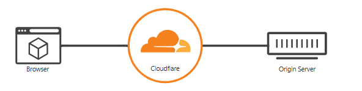
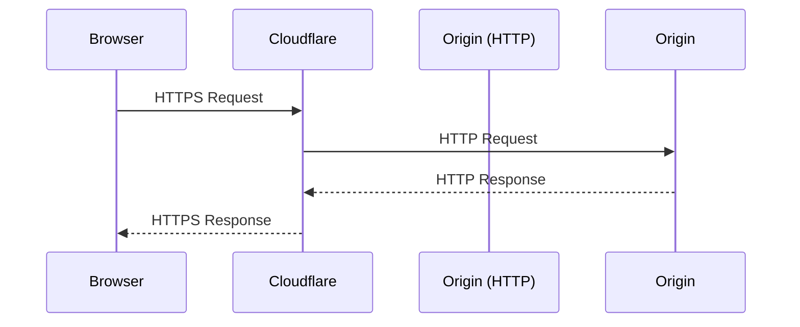
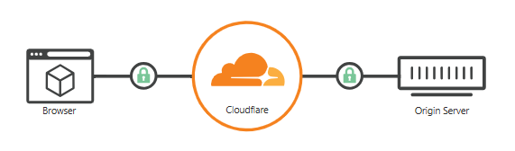
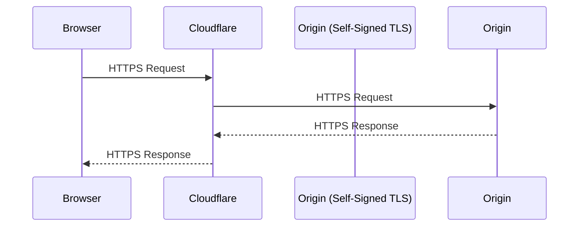
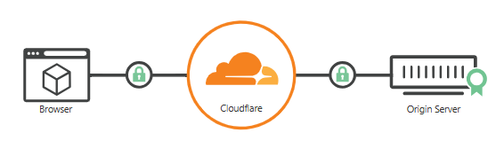
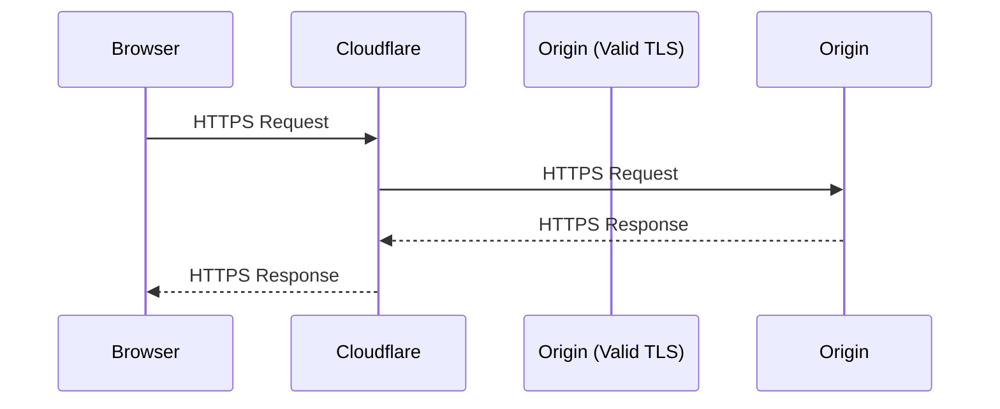

# 🛡️ **Cloudflare TLS Modes**

**Cloudflare offers four TLS modes—Off, Flexible, Full, and Full (Strict)—each controlling how HTTPS is handled between the browser, Cloudflare, and your origin server. The most secure and recommended mode is Full (Strict).**

Let’s break down each mode with real-world examples and diagrams so you can confidently choose the right setup for your infrastructure.

---

## 🔐 Cloudflare TLS Modes Explained

<div align="center" style="background-color: #141a19ff;color: #a8a5a5ff; border-radius: 10px; border: 2px solid">

| Mode              | Browser ↔ Cloudflare | Cloudflare ↔ Origin | Cert Required on Origin? | Use Case                                |
| ----------------- | -------------------- | ------------------- | ------------------------ | --------------------------------------- |
| **Off**           | ❌ No HTTPS          | ❌ No HTTPS         | ❌                       | Rare, legacy HTTP-only sites            |
| **Flexible**      | ✅ HTTPS             | ❌ HTTP             | ❌                       | Quick setup, insecure (not recommended) |
| **Full**          | ✅ HTTPS             | ✅ HTTPS            | ✅ Self-signed OK        | Better, but still vulnerable            |
| **Full (Strict)** | ✅ HTTPS             | ✅ HTTPS            | ✅ Valid CA-signed cert  | 🔒 Best practice                        |

</div>

---

Sources: [Cloudflare Docs](https://developers.cloudflare.com/ssl/origin-configuration/ssl-modes/), [Verpex Guide](https://kb.verpex.com/docs/cloudflare-ssl-configuration-and-flexiblestrict-mode-which-to-use)

---

## 🔸 **1. Off (not secure)**

No encryption applied. Turning off SSL disables HTTPS and causes browsers to show a warning that your website is not secure.

<div align="center" style="background-color:#fff; border-radius: 10px; border: 2px solid">
 
</div>

## 🔸 **2. Flexible Mode** (Not Recommended)

Enable encryption only between your visitors and Cloudflare. This avoids browser security warnings, but all connections between Cloudflare and your origin are made through HTTP.

- You register `example.com` and enable Cloudflare proxy.
- Cloudflare issues a free HTTPS cert for the browser.
- Your origin server only runs HTTP (no cert).
- **Problem**: Traffic between Cloudflare and your server is unencrypted.

<div align="center" style="background-color:#fff; border-radius: 10px; border: 2px solid">
 
</div>

<div align="center" style="background-color: #141a19ff;color: #a8a5a5ff; border-radius: 10px; border: 2px solid">



</div>

---

## 🔸 **3.Full Mode** (Self-Signed Cert OK)

Enable encryption end-to-end. Use this mode when your origin server supports SSL certification but does not use a valid, publicly trusted certificate.

- You install a self-signed cert on your origin server.
- Cloudflare accepts it and encrypts traffic both ways.
- **Risk**: No cert validation—man-in-the-middle attacks are possible.

<div align="center" style="background-color:#fff; border-radius: 10px; border: 2px solid">
 
</div>

<div align="center" style="background-color: #141a19ff;color: #a8a5a5ff; border-radius: 10px; border: 2px solid">



</div>

---

## 🔸 **4.Full (Strict) Mode** (Recommended)

(Recommended mode) Enable encryption end-to-end and enforce validation on origin certificates. Use Cloudflare’s Origin CA to generate certificates for your origin.

- You install a valid cert (e.g. Let’s Encrypt) on your origin.
- Cloudflare verifies the cert and encrypts all traffic.
- **Best for production**: ensures end-to-end TLS integrity.

<div align="center" style="background-color:#fff; border-radius: 10px; border: 2px solid">
 
</div>

<div align="center" style="background-color: #141a19ff;color: #a8a5a5ff; border-radius: 10px; border: 2px solid">



</div>

---

## 🛠️ How to Set It Up

1. **Install a valid TLS cert** on your origin (Let’s Encrypt is free).
2. In Cloudflare dashboard:
   - Go to **SSL/TLS → Overview**
   - Choose **Full (Strict)** mode.
3. Optionally enable **Always Use HTTPS** and **Automatic HTTPS Rewrites**.

---

## 🧠 Pro Tips for Engineers

- Use [Origin CA certificates](https://developers.cloudflare.com/ssl/origin-configuration/origin-ca/) if you only serve traffic via Cloudflare. They’re free and valid for 15 years.
- Test with `curl`:

  ```bash
  curl -I https://example.com --resolve example.com:443:<origin-ip>
  ```

- Monitor TLS handshake with `openssl s_client`:

  ```bash
  openssl s_client -connect example.com:443
  ```
