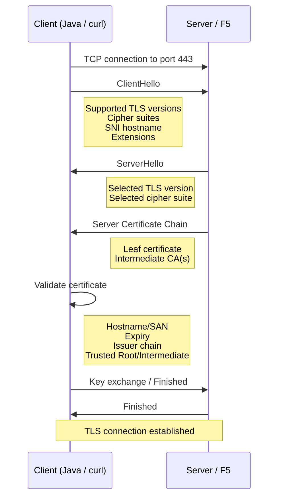
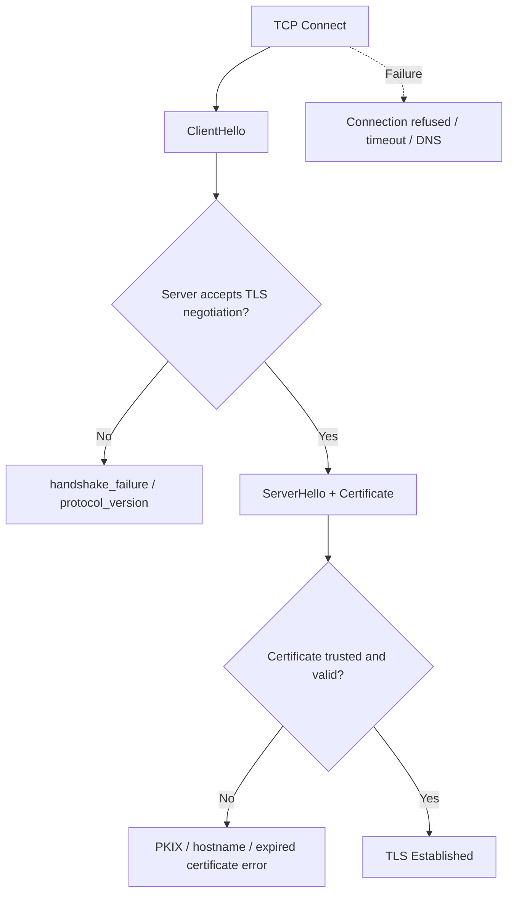

# TLS Handshake Failures Troubleshoot

## 1. What Happens During a TLS Connection

When an application connects to an HTTPS endpoint such as:

```text
https://b2ba.etisalat.corp.ae
```

the TCP connection happens first, then the TLS handshake starts.



The important point is that **certificate validation does not happen at the beginning**.

The client must first send a `ClientHello`, and the server must accept the TLS version/cipher negotiation before the certificate is even exchanged.

---

## 2. Main Failure Areas

A TLS connection can fail at different stages.



### Common Errors

| Error                                               | Typical Meaning                                                        |
| --------------------------------------------------- | ---------------------------------------------------------------------- |
| `Connection refused`                                | Host is reachable but nothing is accepting the connection on that port |
| `UnknownHostException`                              | DNS resolution problem                                                 |
| `SocketTimeoutException`                            | Network path or remote endpoint timeout                                |
| `PKIX path building failed`                         | Java cannot build a trusted certificate chain                          |
| `unable to find valid certification path`           | Root/intermediate CA is not trusted by the Java truststore             |
| `No subject alternative DNS name`                   | Certificate does not match the requested hostname                      |
| `certificate_expired`                               | Certificate validity period has ended                                  |
| `protocol_version`                                  | Client and server do not agree on a TLS version                        |
| `handshake_failure` immediately after `ClientHello` | Usually TLS/cipher/F5/server policy mismatch                           |
| `certificate_required`                              | Server requires an mTLS client certificate                             |
| `bad_certificate`                                   | A certificate presented during the handshake was rejected              |

---

## 3. Debugging with curl

### Basic Test

```bash
curl -v https://b2ba.etisalat.corp.ae
```

Useful output looks like:

```text
Connected to b2ba.etisalat.corp.ae (...) port 443
TLSv1.2 ...
SSL connection using TLSv1.2 / AES128-GCM-SHA256
Server certificate:
 subject: ...
 issuer: ...
 SSL certificate verify ok.
```

This proves:

```text
DNS                  OK
TCP connectivity     OK
TLS negotiation      OK
Certificate trust    OK
```

An HTTP response such as:

```text
HTTP/1.1 404 Not Found
```

still means **TLS succeeded**. The 404 is an application-layer response after TLS has already been established.

---

### Ignore Certificate Validation Temporarily

For troubleshooting only:

```bash
curl -vk https://b2ba.etisalat.corp.ae
```

Interpretation:

```text
curl -v fails
curl -vk succeeds
```

This strongly points to a certificate/trust problem.

If both fail during the TLS handshake, certificate trust is probably **not** the first blocker.

> Do not use `-k` as a production fix.

---

### Force TLS 1.2

```bash
curl -v \
  --tlsv1.2 \
  --tls-max 1.2 \
  https://b2ba.etisalat.corp.ae
```

Use this to verify whether the endpoint accepts TLS 1.2.

---

### Test a Specific Cipher

Example:

```bash
curl -v \
  --tlsv1.2 \
  --tls-max 1.2 \
  --ciphers AES128-GCM-SHA256 \
  https://b2ba.etisalat.corp.ae
```

Then compare with:

```bash
curl -v \
  --tlsv1.2 \
  --tls-max 1.2 \
  --ciphers ECDHE-RSA-AES128-GCM-SHA256 \
  https://b2ba.etisalat.corp.ae
```

If one succeeds and the other fails, you have isolated a **server/F5 cipher-policy issue**.

### Important

The server does not send the client a list of every cipher it supports.

TLS works like this:

```text
ClientHello:
    client sends supported cipher suites

ServerHello:
    server selects ONE cipher
```

So `curl -v` normally shows the cipher that was selected, not the complete server cipher list.

---

## 4. Debugging Directly from Java

Testing from Java is important because `curl` and Java may support different TLS versions, cipher suites, and security policies.

---

### Java 8

#### Step 1 - Open Interactive Shell `jrunscript`

```bash
JAVA_TOOL_OPTIONS="" jrunscript
```

`JAVA_TOOL_OPTIONS=""` applies only to this command. It is useful when the container injects a Java agent such as AppDynamics and you want a clean troubleshooting process.

It does **not** change the already-running application JVM.

#### Step 2 - Execute Line by Line

```javascript
var url = new java.net.URL("https://tibcouat2.etisalat.corp.ae:9160");
var conn = url.openConnection();
conn.connect();
```

If `conn.connect()` returns without an exception, the TLS connection succeeded.

#### Step 3 - Exit

Press:

```text
Ctrl+C
```

---

### Java 21 / 25

#### Step 1 - Open Interactive Shell `jshell`

```bash
JAVA_TOOL_OPTIONS="" jshell
```

#### Step 2 - Execute Line by Line

```java
var url = new java.net.URL("https://tibcouat2.etisalat.corp.ae:9160");
var conn = url.openConnection();
conn.connect();
```

##### Successful Result

If:

```java
conn.connect();
```

returns without an exception, the connection succeeded.

##### Possible Errors

Examples:

```text
java.net.ConnectException: Connection refused
```

Network/service/port problem.

```text
javax.net.ssl.SSLHandshakeException:
PKIX path building failed
```

Java truststore / CA-chain problem.

```text
javax.net.ssl.SSLHandshakeException:
Received fatal alert: handshake_failure
```

TLS negotiation failed. This does **not automatically mean certificate trust**.

---

#### Step 3 - Exit JShell

```text
/exit
```

---

### Enable Java TLS Debugging

For Java 21 / 25:

```bash
JAVA_TOOL_OPTIONS="" jshell \
  -R-Djavax.net.debug=ssl,handshake
```

Then:

```java
var url = new java.net.URL("https://b2ba.etisalat.corp.ae");
var conn = url.openConnection();
conn.connect();
```

The most important thing is to identify **where the handshake stops**.

---

### Show Disabled Cipher Suites in Java

First confirm:

```bash
JAVA_TOOL_OPTIONS="" jshell
```

Then:

```java
java.security.Security.getProperty("jdk.tls.disabledAlgorithms")
```

You should see:

```text
TLS_RSA_*
```

Java 25 disables these suites by default. OpenJDK explicitly says they can be re-enabled by removing `TLS_RSA_*` from `jdk.tls.disabledAlgorithms`. ([OpenJDK Bug System][1])

For production, I would still fix the F5 rather than permanently weakening Java 25's security policy. OpenJDK disabled `TLS_RSA_*` because static RSA key exchange lacks forward secrecy. ([OpenJDK Bug System][1])

[1]: https://bugs.openjdk.org/browse/JDK-8344767?utm_source=chatgpt.com "Loading..."
[2]: https://docs.oracle.com/en/java/javase/25/security/security-properties-file.html?utm_source=chatgpt.com "The Security Properties File"

---

## 5. Inspect a Certificate Without OpenSSL

Minimal container images may not contain `openssl`.

Use `keytool`:

```bash
JAVA_TOOL_OPTIONS="" keytool -printcert \
  -file /path/to/certificate.crt
```

Useful fields:

```text
Owner
Issuer
Validity
SHA256 fingerprint
BasicConstraints
KeyUsage
SubjectAlternativeName
```

For a server/leaf certificate, check:

```text
Owner / CN
SubjectAlternativeName
Issuer
Validity
```

For a CA certificate, check:

```text
BasicConstraints:
    CA:true
```

---

## 6. Commands to Remember

### curl

```bash
curl -v https://HOST
```

```bash
curl -vk https://HOST
```

```bash
curl -v --tlsv1.2 --tls-max 1.2 https://HOST
```

```bash
curl -v \
  --tlsv1.2 \
  --tls-max 1.2 \
  --ciphers CIPHER_NAME \
  https://HOST
```

### Java 21 / 25

```bash
JAVA_TOOL_OPTIONS="" jshell
```

```java
var url = new java.net.URL("https://HOST");
var conn = url.openConnection();
conn.connect();
```

### Java TLS Debug

```bash
JAVA_TOOL_OPTIONS="" jshell \
  -R-Djavax.net.debug=ssl,handshake
```

### Certificate Inspection

```bash
JAVA_TOOL_OPTIONS="" keytool -printcert -file certificate.crt
```

### RHEL Java Truststore

```bash
update-ca-trust extract
```

```bash
keytool -list \
  -keystore /etc/pki/java/cacerts \
  -storepass changeit
```

---

## 7. Core Rule

> `SSLHandshakeException` tells you that the TLS handshake failed. It does not tell you why.

Always determine **where the handshake stopped**:

```text
Before certificate exchange
    -> TLS version / cipher / F5 / SNI

After certificate exchange
    -> certificate / hostname / Java truststore
```
