Yes. I would compress everything into this mental model. The important thing is to separate **keys → CSR → certificate issuance → certificate validation**.

# X.509 Certificates — DevOps Mental Model

## 1. What is a certificate?

A certificate is a **signed digital identity document**.

It basically says:

> **“This identity owns this public key, and this CA confirms it.”**

For example:

```text
Identity    : b2ba.etisalat.corp.ae
Public Key  : RSA 2048-bit public key
Valid From  : 2024-07-04
Valid Until : 2027-07-04
Issuer      : SHA2-ICA01
Signature   : Signed by SHA2-ICA01
```

Most certificates used by HTTPS follow the **X.509 standard**.

So:

```text
Certificate
    ↓
usually
    ↓
X.509 Certificate
```

X.509 defines **what information a certificate contains and how it is structured**.

---

# 2. Certificate generation

Everything starts with a **key pair**.

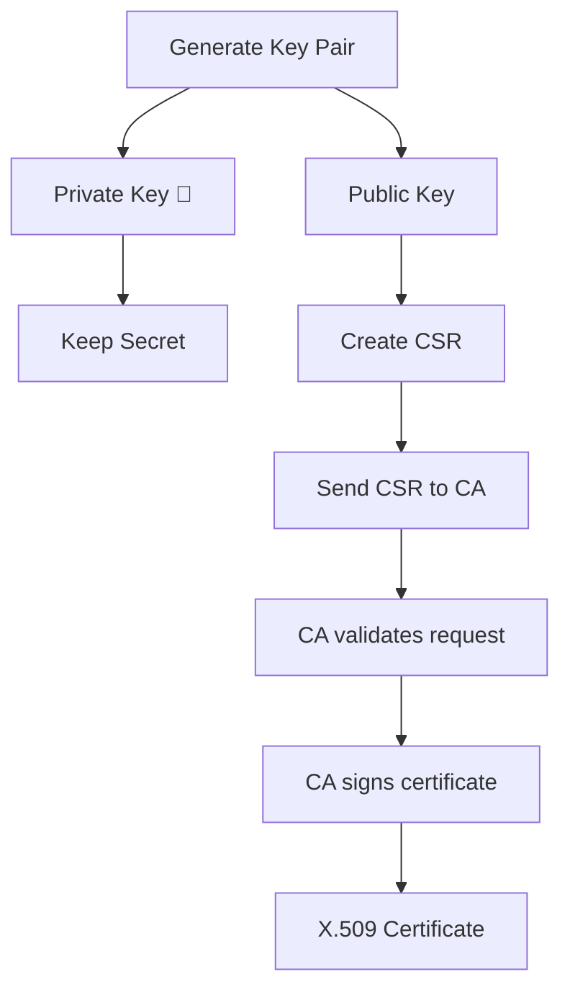

### Step 1 — Generate keys

You get:

```text
Private Key 🔐
Public Key
```

The two are mathematically related.

The private key:

```text
SECRET
stays with server
never included in certificate
```

The public key:

```text
PUBLIC
goes into certificate
```

---

# 3. CSR — Certificate Signing Request

Before you have a certificate, you normally create a:

```text
CSR
Certificate Signing Request
```

Conceptually:

```text
Please issue me a certificate.

Identity:
    b2ba.etisalat.corp.ae

Public Key:
    ABC123...

SAN:
    b2ba.etisalat.corp.ae
```

The CSR is also signed using your private key, proving:

> I actually own the private key corresponding to this public key.

Then:

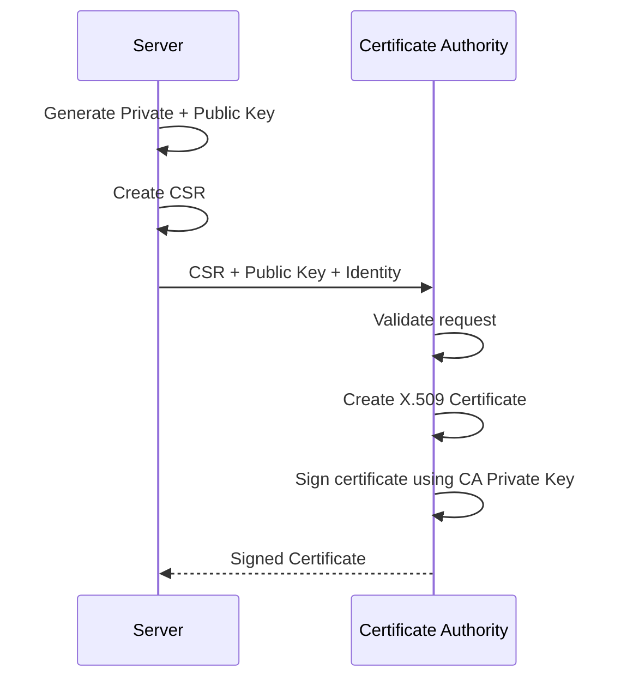

At the end:

```text
server.key       ← Private key 🔐
server.crt       ← X.509 certificate
```

---

# 4. What does the CA actually do?

Suppose:

```text
SHA2-ICA01
```

is your Intermediate CA.

It creates the certificate containing:

```text
Subject
Public Key
SAN
Validity
Serial Number
etc.
```

Then the CA signs that data using:

```text
SHA2-ICA01 Private Key
```

The resulting signature becomes part of the certificate.

Therefore clients can later use:

```text
SHA2-ICA01 Public Key
```

to verify that:

1. SHA2-ICA01 really issued it.
    
2. Nobody modified the certificate afterward.
    

---

# 5. Root → Intermediate → Leaf

Normally:

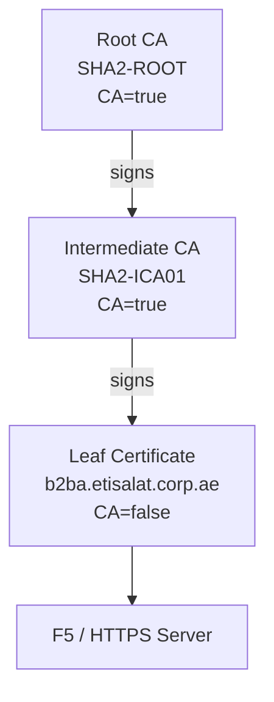

### Root CA

The ultimate trust anchor.

Usually:

```text
Subject = SHA2-ROOT
Issuer  = SHA2-ROOT
CA      = TRUE
```

It is normally self-signed.

### Intermediate CA

Issued by the Root:

```text
Subject = SHA2-ICA01
Issuer  = SHA2-ROOT
CA      = TRUE
```

It normally issues actual server certificates.

### Leaf

The actual server/client identity:

```text
Subject = b2ba.etisalat.corp.ae
Issuer  = SHA2-ICA01
CA      = FALSE
```

---

# 6. How certificate validation works

You connect to:

```text
https://b2ba.etisalat.corp.ae
```

Server usually provides:

```text
Leaf
Intermediate
```

Your client already trusts:

```text
Root
```

Then:

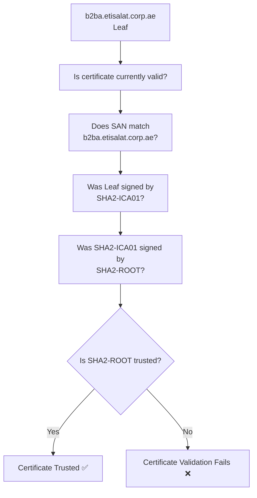

The client checks more than just the signature.

Important checks include:

```text
Chain
Signature
Validity dates
Hostname / SAN
Key Usage
Extended Key Usage
Security algorithms
Revocation, if enabled
```

---

# 7. Is a certificate immutable?

## Yes.

This is extremely important:

> **Once a certificate is signed by the CA, its signed contents are immutable.**

Suppose certificate says:

```text
Not Before : 2024
Not After  : 2027
```

You **cannot simply change**:

```text
2027 → 2030
```

Why?

Because the CA signature covers those fields.

Conceptually:

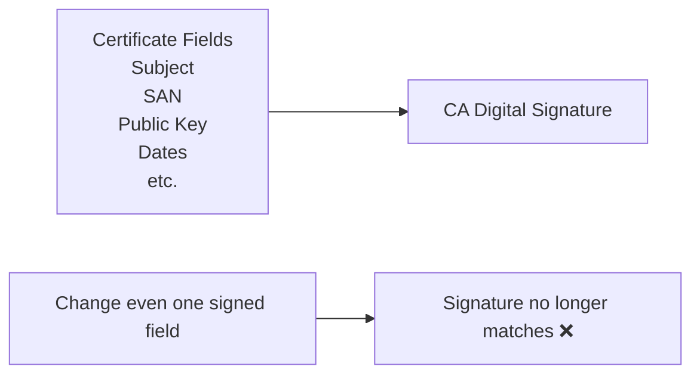

If you modify:

```text
SAN
Subject
Public Key
Expiry
Issuer
Key Usage
```

the original signature becomes invalid.

---

# 8. What happens when a certificate expires?

You don't extend the existing certificate.

You issue a **new certificate**.

```text
OLD

Serial: 123
Valid: 2024 → 2027
Signature: ABC


NEW

Serial: 456
Valid: 2027 → 2030
Signature: XYZ
```

This is certificate **renewal/reissuance**, not editing.

The new certificate might use:

```text
same private/public key
```

or preferably sometimes:

```text
new key pair
```

depending on your organization's security policy.

So:

```text
Certificate expired
        ↓
Generate/reuse CSR/key as appropriate
        ↓
CA issues NEW certificate
        ↓
Deploy new certificate
```

You cannot just edit `Not After`.

---

# 9. What fields does an X.509 certificate contain?

At the high level, an X.509 certificate has **three major parts**:

```text
Certificate
│
├── TBSCertificate
│     "To Be Signed Certificate"
│
├── Signature Algorithm
│
└── Signature Value
```

`TBSCertificate` contains the actual certificate information.

---

## Main X.509 fields

### Version

Usually:

```text
Version 3
```

Modern TLS certificates are normally X.509 v3.

---

### Serial Number

Unique number assigned by the CA.

```text
Serial Number:
180000268ce01971...
```

Useful for:

```text
identification
revocation
CA records
```

---

### Signature Algorithm

Algorithm the CA uses to sign the certificate.

Example:

```text
SHA256withRSA
```

---

### Issuer

Who issued/signed it.

```text
Issuer:
CN=SHA2-ICA01
```

---

### Validity

Contains:

```text
Not Before
Not After
```

Example:

```text
Not Before: 2024-07-04
Not After : 2027-07-04
```

---

### Subject

Who the certificate represents.

Example:

```text
Subject:
CN=b2ba.etisalat.corp.ae
O=Etisalat
C=AE
```

---

### Subject Public Key Info

Contains:

```text
Public-key algorithm
Public key
```

Example:

```text
Algorithm: RSA
Size: 2048 bits
```

---

# 10. X.509 v3 Extensions

This is where much of the useful TLS information lives.

### Subject Alternative Name — SAN

Very important.

```text
DNS:b2ba.etisalat.corp.ae
DNS:b2ba
IP:10.x.x.x
```

For HTTPS:

> **SAN determines what hostnames this certificate is valid for.**

---

### Basic Constraints

Tells you whether certificate can be a CA.

Root/intermediate:

```text
CA:TRUE
```

Leaf:

```text
CA:FALSE
```

May also contain:

```text
Path Length
```

which limits how many CA levels can exist below it.

---

### Key Usage

Defines allowed cryptographic operations.

Examples:

```text
Digital Signature
Key Encipherment
Certificate Sign
CRL Sign
```

A CA commonly has:

```text
Key_CertSign
CRL_Sign
```

---

### Extended Key Usage — EKU

Defines application purposes.

Examples:

```text
serverAuth
clientAuth
codeSigning
emailProtection
```

For HTTPS server:

```text
serverAuth
```

---

### Subject Key Identifier — SKI

Identifier derived from the certificate's public key.

Helps identify:

```text
this certificate's key
```

---

### Authority Key Identifier — AKI

Points toward the issuer's signing key.

Useful for building:

```text
Leaf → Intermediate → Root
```

---

### CRL Distribution Points

Where the client can potentially retrieve a:

```text
Certificate Revocation List
```

Example:

```text
http://ca.company.com/crl/ICA01.crl
```

---

### Authority Information Access — AIA

Often contains:

```text
CA Issuers URL
OCSP URL
```

Example:

```text
Where can I obtain issuer certificate?
Where can I check revocation status?
```

---

### Certificate Policies

Identifies policies under which the CA issued the certificate.

Common in enterprise/public PKI.

---

There are many other optional extensions, but as a DevOps engineer you don't need to memorize every X.509 OID.

---

# 11. What should YOU read first?

When you run:

```bash
keytool -printcert -file certificate.crt
```

or:

```bash
openssl x509 -in certificate.crt -text -noout
```

don't try to understand every line.

Read these first:

```text
1. Subject
2. Issuer
3. Valid From / Until
4. SAN
5. Basic Constraints
6. Key Usage / Extended Key Usage
7. Public Key algorithm + size
8. Signature Algorithm
9. SHA-256 Fingerprint
```

That's enough for most DevOps work.

---

# 12. Fingerprint

A fingerprint is a hash of the **entire encoded certificate**.

Example:

```text
SHA256:
77:28:13:05:D7:23:...
```

It is extremely useful for answering:

> Are these two certificate files actually the same certificate?

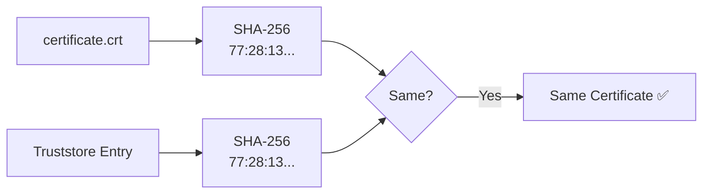

Don't depend only on:

```text
filename
alias
CN
```

Fingerprint is much stronger.

---

# 13. Self-signed certificate

A self-signed certificate has:

```text
Subject = Issuer
```

and it signs itself with its own private key.

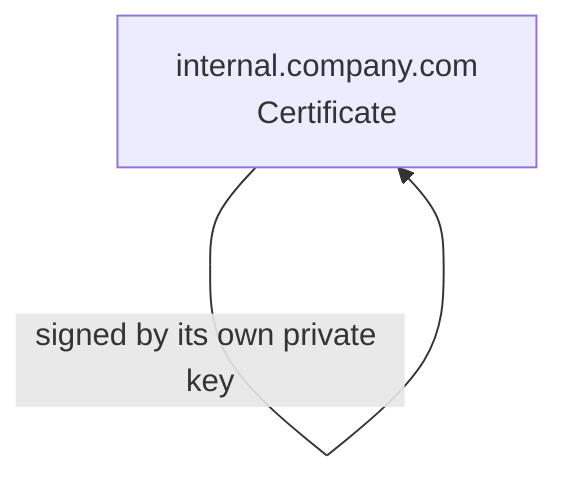

It may be perfectly valid cryptographically.

But nobody automatically trusts it.

You must explicitly place it into a client's trusted certificates.

Then:

```text
"I choose this certificate itself
as a trust anchor."
```

That's different from normal CA trust.

---

# 14. Formats — keep this very simple

After understanding X.509, formats are easy.

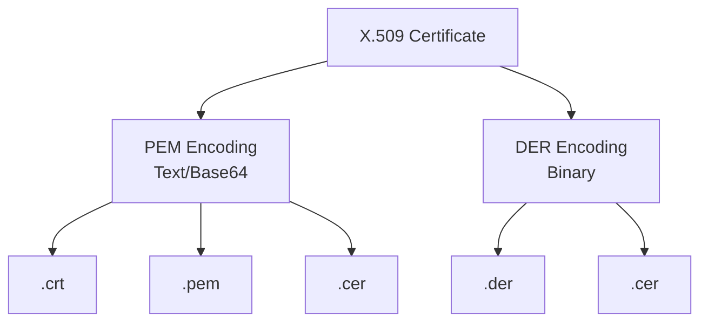

So:

```text
X.509 = certificate structure/standard

PEM = text encoding
DER = binary encoding

.crt/.cer/.pem = filename conventions
```

---

# 15. PFX is different

PFX/P12 is a container:

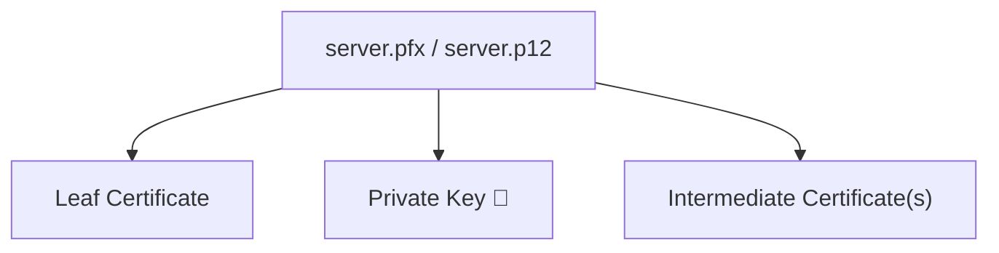

This is why:

```text
.crt → normally safe/public
.pfx → sensitive, may contain private key
```

---

# 16. The complete lifecycle

This is the diagram I would remember.

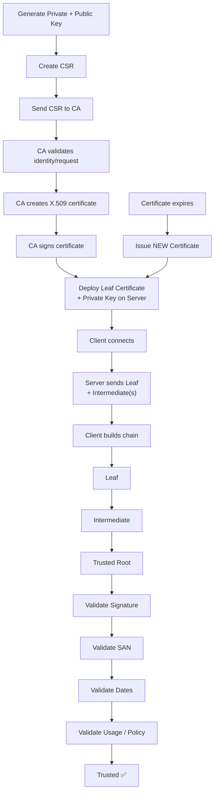

# What to permanently remember as DevOps

Don't memorize hundreds of certificate commands.

Remember these **10 rules**:

1. **Certificate = identity + public key + CA signature.**
    
2. **X.509 = standard describing certificate structure.**
    
3. **Private key is secret and is NOT inside a normal certificate.**
    
4. **Root → Intermediate → Leaf** is the normal trust chain.
    
5. **SAN is what hostname validation cares about.**
    
6. **Root is normally the trust anchor; server normally presents Leaf + Intermediate.**
    
7. **Certificates are immutable after signing.** Changing expiry/SAN/etc. invalidates the signature.
    
8. **Expired certificate → issue a new certificate.** You don't edit it.
    
9. **SHA-256 fingerprint is your best way to compare exact certificates.**
    
10. When debugging, first read:
    

```text
Subject
Issuer
SAN
Validity
CA:true/false
Key Usage / EKU
SHA256 fingerprint
```

If those concepts are clear, truststores, Kubernetes TLS secrets, F5 certificates, Java trust, mTLS, PFX files, and certificate rotation all become variations of the same model.

Remember it as **5 steps**:

```text
1. SERVER/CA CREATES LEAF DATA

Leaf Data:
- hostname / SAN
- leaf public key
- expiry
- issuer
- other X.509 fields
```

```text
2. ISSUER SIGNS IT

HASH(leaf_data)
      ↓
   ABC123

SIGN(
    ISSUER_PRIVATE_KEY,
    ABC123
)
      ↓
Signature = XYZ789
```

The final certificate contains:

```text
Leaf Data
+
Signature XYZ789
```

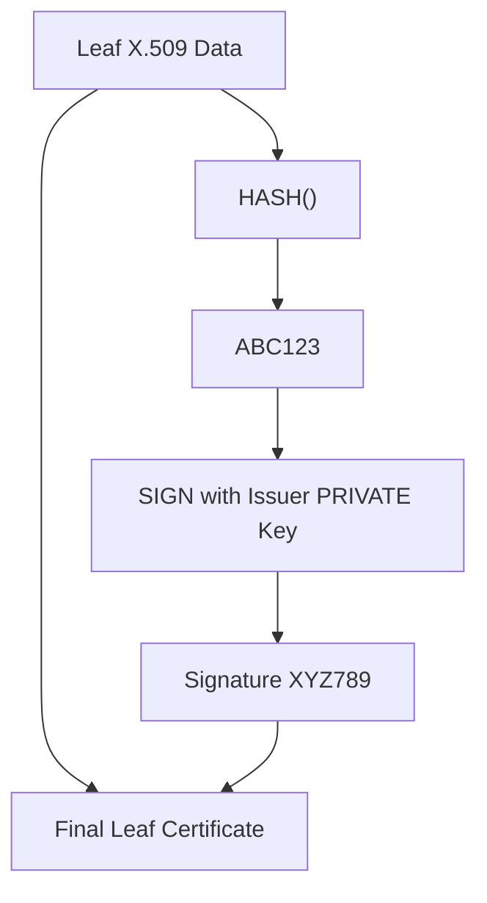

Then on the client side:

```text
3. CLIENT RECEIVES CERTIFICATE

Leaf Data
+
Signature XYZ789
```

```text
4. CLIENT CALCULATES THE HASH AGAIN

HASH(received_leaf_data)
      ↓
   ABC123
```

Then your black box:

```text
5. CLIENT VERIFIES

VERIFY(
    ISSUER_PUBLIC_KEY,
    ABC123,
    XYZ789
)
      ↓
TRUE ✅ / FALSE ❌
```

If there is an intermediate, repeat the same operation:

```text
Leaf
 │
 │ VERIFY using Intermediate PUBLIC key
 ▼
Intermediate
 │
 │ VERIFY using Root PUBLIC key
 ▼
Root
 │
 │ Is Root in my trust store?
 ▼
YES ✅
```

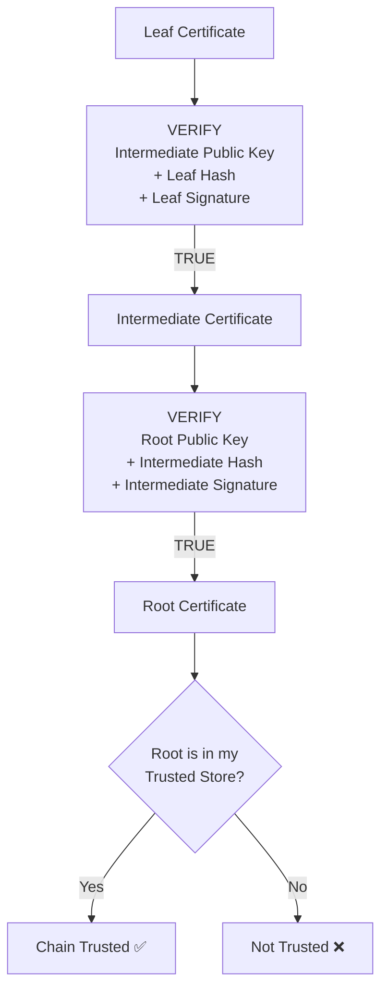

And after the signature chain is trusted, the client still checks:

```text
SAN matches hostname?
Not expired?
Correct Key Usage / EKU?
Allowed algorithms?
Revocation, if configured?
```

### The sentence to memorize

> **CA hashes certificate data → signs the hash with its PRIVATE key. Client hashes the received data again → uses the issuer PUBLIC key and received signature in `VERIFY()` → continues until it reaches a Root it already trusts.**

And:

```text
PRIVATE KEY → SIGN
PUBLIC KEY  → VERIFY
```

That is the whole certificate trust flow.