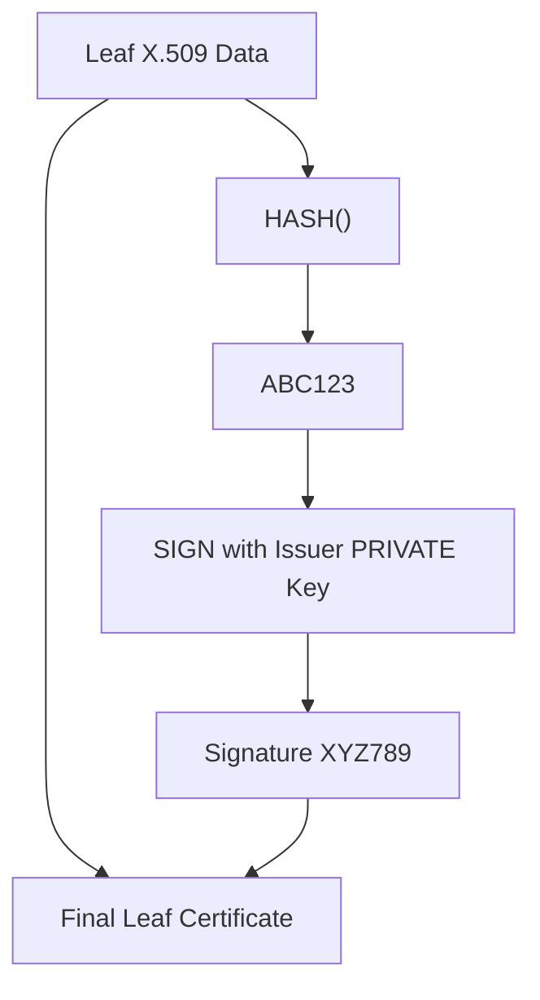
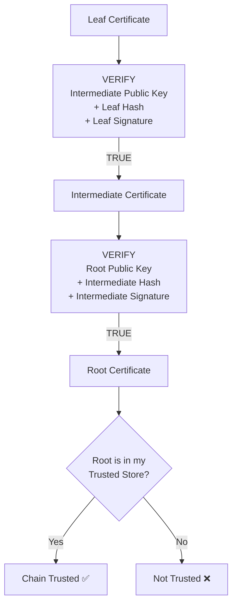

# Certificate Chain Validation

Remember it as **5 steps**:

```text
1. SERVER/CA CREATES LEAF DATA

Leaf Data:
- hostname / SAN
- leaf public key
- expiry
- issuer
- other X.509 fields
```

```text
2. ISSUER SIGNS IT

HASH(leaf_data)
      ↓
   ABC123

SIGN(
    ISSUER_PRIVATE_KEY,
    ABC123
)
      ↓
Signature = XYZ789
```

The final certificate contains:

```text
Leaf Data
+
Signature XYZ789
```



Then on the client side:

```text
3. CLIENT RECEIVES CERTIFICATE

Leaf Data
+
Signature XYZ789
```

```text
4. CLIENT CALCULATES THE HASH AGAIN

HASH(received_leaf_data)
      ↓
   ABC123
```

Then your black box:

```text
5. CLIENT VERIFIES

VERIFY(
    ISSUER_PUBLIC_KEY,
    ABC123,
    XYZ789
)
      ↓
TRUE ✅ / FALSE ❌
```

If there is an intermediate, repeat the same operation:

```text
Leaf
 │
 │ VERIFY using Intermediate PUBLIC key
 ▼
Intermediate
 │
 │ VERIFY using Root PUBLIC key
 ▼
Root
 │
 │ Is Root in my trust store?
 ▼
YES ✅
```



And after the signature chain is trusted, the client still checks:

```text
SAN matches hostname?
Not expired?
Correct Key Usage / EKU?
Allowed algorithms?
Revocation, if configured?
```

### The sentence to memorize

> **CA hashes certificate data → signs the hash with its PRIVATE key. Client hashes the received data again → uses the issuer PUBLIC key and received signature in `VERIFY()` → continues until it reaches a Root it already trusts.**

And:

```text
PRIVATE KEY → SIGN
PUBLIC KEY  → VERIFY
```

That is the whole certificate trust flow.
