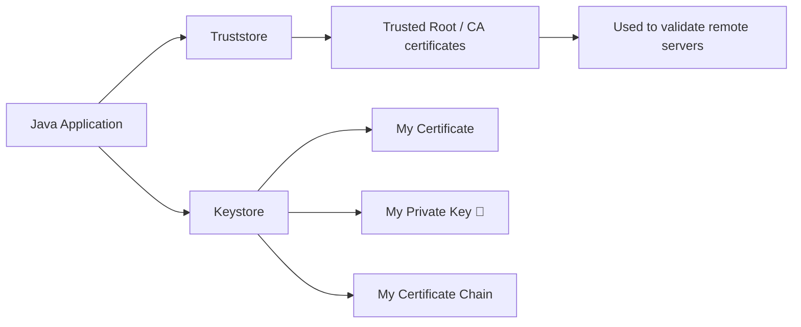
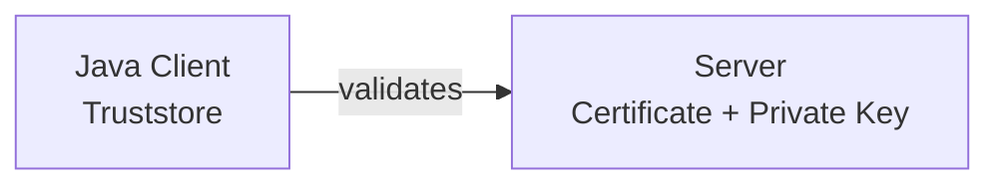
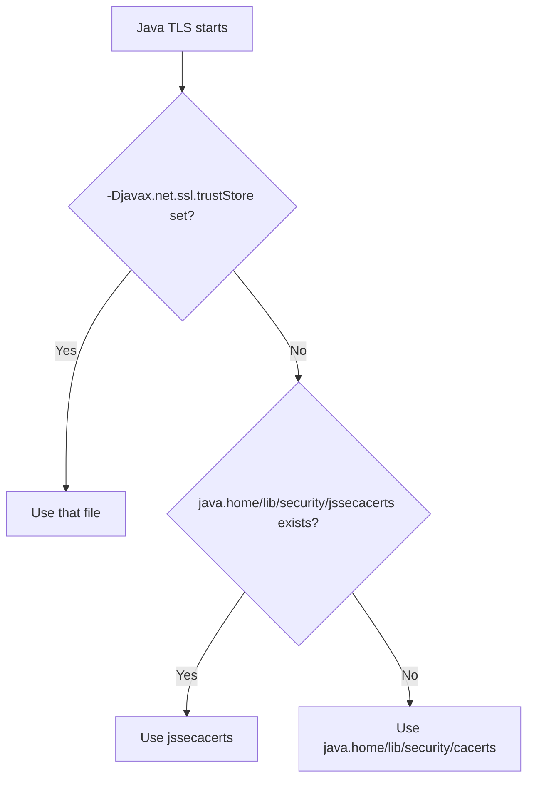
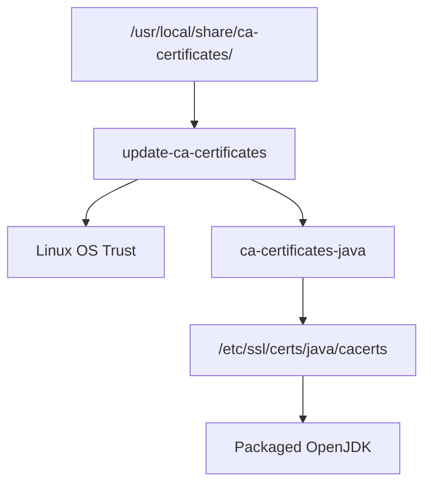
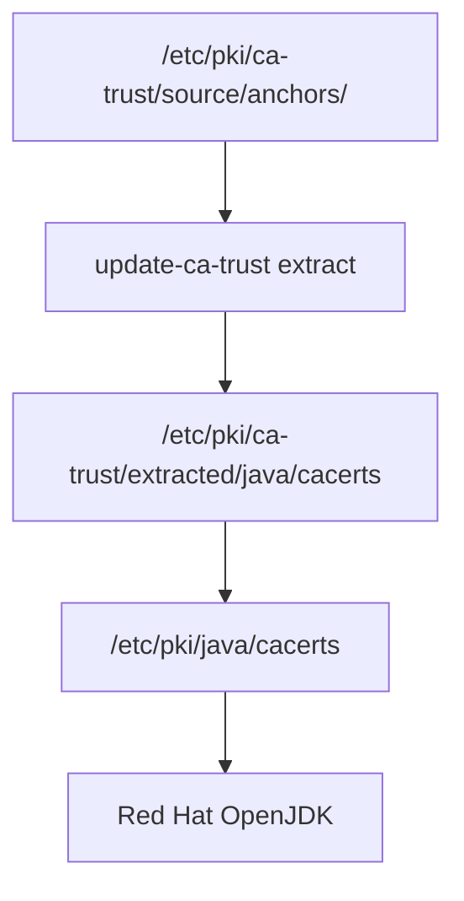

# Certificate Trust in Java

## 1. The most important concept

Java separates two questions:

```text
Truststore → WHO DO I TRUST?
Keystore   → WHO AM I?
```



### Truststore

Contains certificates you trust:

```text
Root CA
Intermediate CA (if explicitly trusted)
Self-signed certificate (if explicitly trusted)
```

Used by Java's **TrustManager**.

### Keystore

Usually contains your own identity:

```text
Private key 🔐
Leaf certificate
Intermediate chain
```

Used by Java's **KeyManager**.

Important:

> `KeyStore` is also the Java API/container concept. A "truststore" is basically a keystore being used to hold trusted certificates.

---

# 2. Normal HTTPS vs mTLS

### Normal HTTPS



Client:

```text
Truststore ✅
Keystore normally not needed
```

Server:

```text
Keystore ✅
```

### mTLS

Both sides authenticate:

```text
Client:
    Truststore ✅
    Keystore   ✅

Server:
    Truststore ✅
    Keystore   ✅
```

---

## 3. How Java chooses its Truststore

For standard JSSE HTTPS, Java looks roughly in this order:



This lookup behavior exists from Java 8 through modern Java versions. ([Oracle Docs](https://docs.oracle.com/javase/8/docs/technotes/guides/security/jsse/JSSERefGuide.html?utm_source=chatgpt.com "Java Secure Socket Extension (JSSE) Reference Guide"))

So if you specify:

```bash
-Djavax.net.ssl.trustStore=/app/config/my-truststore.p12
```

Java uses that truststore instead of the normal default.

---

## 4. Java 8 vs Java 9+

The TLS trust concept did **not fundamentally change**.

The important format change was the default type for newly created keystores:

|Java|Default `KeyStore` type|
|---|---|
|Java 8|`JKS`|
|Java 9+|`PKCS12`|

Java 9 changed the default to PKCS#12 through JEP 229. ([Oracle Docs](https://docs.oracle.com/javase/9/tools/keytool.htm?utm_source=chatgpt.com "keytool"))

Don't assume the existing `cacerts` file's physical format solely from the Java version; let `keytool` inspect it.

---

## 5. Where is Java `cacerts`?

The safest approach is **never guess**.

First:

```bash
JAVA_TOOL_OPTIONS="" java -XshowSettings:properties -version 2>&1 \
  | grep 'java.home'
```

Then:

### Java 8

`java.home` may point to the JRE:

```text
<JAVA_HOME>/jre/lib/security/cacerts
```

or, if `JAVA_HOME` itself points at the JRE:

```text
<JAVA_HOME>/lib/security/cacerts
```

### Java 9+

Normally:

```text
<JAVA_HOME>/lib/security/cacerts
```

Oracle's JSSE documentation defines the default as:

```text
java.home/lib/security/cacerts
```

rather than relying on your shell's `JAVA_HOME`. ([Oracle Docs](https://docs.oracle.com/javase/8/docs/technotes/guides/security/jsse/JSSERefGuide.html?utm_source=chatgpt.com "Java Secure Socket Extension (JSSE) Reference Guide"))

---

## 6. Windows

Normal Oracle/OpenJDK Java does **not simply mean**:

```text
Windows Trusted Root Store
        =
Java cacerts
```

Java normally has its own:

```text
<JAVA_HOME>\lib\security\cacerts
```

Therefore:

```text
Windows trusts CompanyRoot
```

does not automatically mean every Java distribution/application will use that trust.

Check:

```cmd
keytool -list -cacerts -storepass changeit
```

Java can access Windows stores through providers such as `Windows-ROOT`/`Windows-MY`, but that is different from the normal default `cacerts` behavior.

---

## 7. Ubuntu / Debian

Ubuntu has its OS trust:

```text
/usr/local/share/ca-certificates/
        ↓
update-ca-certificates
        ↓
/etc/ssl/certs/
```

Ubuntu/Debian also provides:

```text
ca-certificates-java
```

which integrates system CA certificates into a Java-compatible `cacerts`; `/etc/ssl/certs/java/cacerts` is the common system-managed Java truststore path. ([Ubuntu Packages](https://packages.ubuntu.com/jammy/ca-certificates-java?utm_source=chatgpt.com "Ubuntu – Details of package ca-certificates-java in jammy"))

Conceptually:



But always check the actual JDK:

```bash
readlink -f "$JAVA_HOME/lib/security/cacerts"
```

because vendor/container packaging can differ.

---

## 8. RHEL / OpenShift

This is especially relevant to your environment.

RHEL trust starts here:

```text
/etc/pki/ca-trust/source/anchors/
```

then:

```bash
update-ca-trust extract
```

and RHEL provides Java's system trust at:

```text
/etc/pki/java/cacerts
```

Red Hat documents `/etc/pki/java/cacerts` as the global trust-anchor repository used by Red Hat OpenJDK. ([Red Hat Documentation](https://docs.redhat.com/en/documentation/red_hat_build_of_openjdk/17/html/configuring_red_hat_build_of_openjdk_17_on_rhel_with_fips/openjdk-default-fips-configuration?utm_source=chatgpt.com "Chapter 3. FIPS automation in Red Hat build of OpenJDK 17 | Configuring Red Hat build of OpenJDK 17 on RHEL with FIPS | Red Hat build of OpenJDK | 17 | Red Hat Documentation"))

In your containers you already saw:

```text
/etc/pki/java/cacerts
    ->
/etc/pki/ca-trust/extracted/java/cacerts
```

So:



This is why on RHEL it is normally better to manage system CA trust through `update-ca-trust` instead of manually editing the generated `cacerts`.

---


## 9. Find what Java is actually using

Start here:

```bash
JAVA_TOOL_OPTIONS="" java \
  -XshowSettings:properties \
  -version 2>&1 | grep java.home
```

Then:

```bash
ls -l "$JAVA_HOME/lib/security/cacerts"
```

and:

```bash
readlink -f "$JAVA_HOME/lib/security/cacerts"
```

For Java 8 where `JAVA_HOME` points to the JDK:

```bash
ls -l "$JAVA_HOME/jre/lib/security/cacerts"
```

---

## 10. List trusted Java certificates

Easy modern command:

```bash
JAVA_TOOL_OPTIONS="" keytool \
  -list \
  -cacerts \
  -storepass changeit
```

Find one:

```bash
JAVA_TOOL_OPTIONS="" keytool \
  -list \
  -cacerts \
  -storepass changeit | grep -i sha2
```

Detailed:

```bash
JAVA_TOOL_OPTIONS="" keytool \
  -list \
  -v \
  -cacerts \
  -storepass changeit
```

`changeit` is the traditional initial `cacerts` password. ([Ubuntu Manpages](https://manpages.ubuntu.com/manpages/stonking/man1/keytool.1.html?utm_source=chatgpt.com "Ubuntu Manpage: keytool - a key and certificate management utility"))

---

## 11. Read a certificate before trusting it

```bash
JAVA_TOOL_OPTIONS="" keytool \
  -printcert \
  -file SHA2-ROOT.crt
```

Check:

```text
Owner / Subject
Issuer
Validity
SHA256 fingerprint
BasicConstraints
SAN
Key Usage
```

Especially verify the fingerprint from a trusted source before importing a new CA.

---

## 12. Import a certificate into a custom Java truststore

Recommended when an application should have its own isolated trust.

```bash
keytool -importcert \
  -alias company-root \
  -file SHA2-ROOT.crt \
  -keystore truststore.p12 \
  -storetype PKCS12
```

Then configure Java:

```bash
java \
  -Djavax.net.ssl.trustStore=/app/config/truststore.p12 \
  -Djavax.net.ssl.trustStorePassword='...' \
  -jar app.jar
```

Conceptually:

```text
Java
 ↓
-Djavax.net.ssl.trustStore
 ↓
my-truststore.p12
 ↓
Company Root
```

---

# 13. Import directly into `cacerts`

Possible:

```bash
keytool -importcert \
  -trustcacerts \
  -alias company-root \
  -file SHA2-ROOT.crt \
  -cacerts \
  -storepass changeit
```

Verify:

```bash
keytool -list \
  -cacerts \
  -storepass changeit \
  -alias company-root
```

But:

> On distro-managed Java such as RHEL, prefer the distro's CA-management mechanism where appropriate, because generated `cacerts` files may later be rebuilt.

---

# 14. Delete an entry

Custom truststore:

```bash
keytool -delete \
  -alias company-root \
  -keystore truststore.p12
```

Default `cacerts`:

```bash
keytool -delete \
  -alias company-root \
  -cacerts \
  -storepass changeit
```

---

# 15. Inspect remote server certificate with Java

Very useful:

```bash
JAVA_TOOL_OPTIONS="" keytool \
  -printcert \
  -sslserver b2ba.etisalat.corp.ae:443
```

This lets Java connect and display the server certificate.

For a file:

```bash
keytool -printcert -file server.crt
```

---

# 16. Actually test Java TLS

Java 21/25:

```bash
JAVA_TOOL_OPTIONS="" jshell
```

Then:

```java
var url = new java.net.URL("https://b2ba.etisalat.corp.ae");
var conn = url.openConnection();
conn.connect();
```

No exception:

```text
TLS connection successful ✅
```

Typical trust failure:

```text
PKIX path building failed
```

means Java could not build a valid path to one of its trusted anchors.

---

# 17. Debug exactly what Java is doing

```bash
JAVA_TOOL_OPTIONS="" jshell \
  -R-Djavax.net.debug=ssl,handshake,trustmanager
```

Then connect.

This can show:

```text
which certificates server sent
which TrustManager is used
certificate-chain validation
TLS negotiation
```

This is the strongest Java-side TLS debugging technique.

---

# 18. Keystore command example

Suppose your Java application itself must present a certificate, for example with mTLS.

A PKCS#12 file may contain:

```text
client.p12
├── Client private key 🔐
├── Client leaf certificate
└── Intermediate chain
```

Configure:

```bash
java \
  -Djavax.net.ssl.keyStore=/app/certs/client.p12 \
  -Djavax.net.ssl.keyStorePassword='...' \
  -Djavax.net.ssl.keyStoreType=PKCS12 \
  -jar app.jar
```

Compare:

```text
-Djavax.net.ssl.trustStore
    = Who do I trust?

-Djavax.net.ssl.keyStore
    = Who am I?
```

---

# DevOps cheat sheet

```text
                    JAVA TLS

              ┌─────────────────┐
              │ Java Application│
              └───────┬─────────┘
                      │
          ┌───────────┴────────────┐
          ▼                        ▼
     TRUSTSTORE                KEYSTORE
   "Who I trust"              "Who I am"

   Root CA                    Private Key 🔐
   trusted certs              My Certificate
                              Certificate Chain
```

Remember these commands:

```bash
# Where is this Java?
java -XshowSettings:properties -version 2>&1 | grep java.home

# What does cacerts actually point to?
readlink -f "$JAVA_HOME/lib/security/cacerts"

# List Java trust
keytool -list -cacerts -storepass changeit

# Inspect certificate
keytool -printcert -file cert.crt

# Inspect remote server
keytool -printcert -sslserver HOST:443

# Real Java TLS test
jshell
```

And the two most important rules:

> **Truststore = certificates/public keys Java trusts. Keystore = private key + certificate representing Java itself.**

> **Never assume `curl works` means Java trusts the certificate — first determine which truststore that Java runtime actually uses.** ([Oracle Docs](https://docs.oracle.com/javase/8/docs/technotes/guides/security/jsse/JSSERefGuide.html?utm_source=chatgpt.com "Java Secure Socket Extension (JSSE) Reference Guide"))