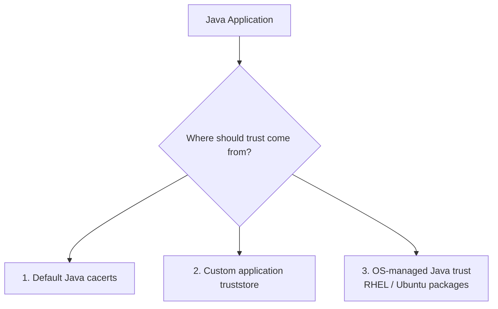
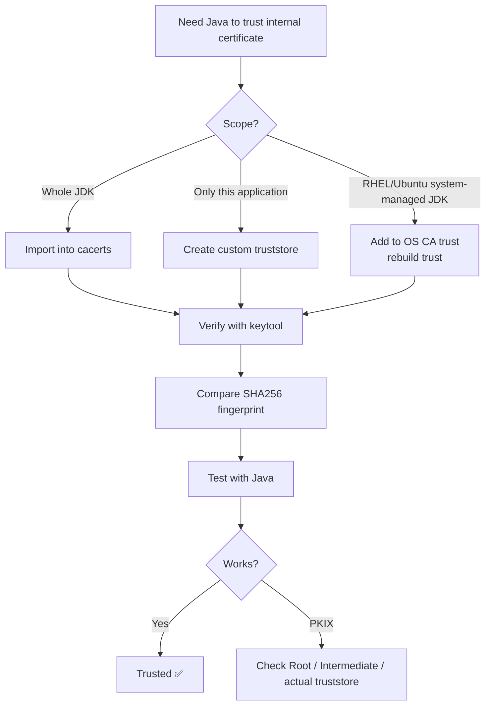

Yes. Think of Java certificate trust as only **3 practical approaches**.

# Ways to Trust Certificates in Java



## 1. Add certificate to Java's default `cacerts`

This makes the certificate trusted by applications using that JDK's default truststore.

Import:

```bash
keytool -importcert \
  -alias company-root \
  -file company-root.crt \
  -cacerts \
  -storepass changeit
```

Java then effectively sees:

```text
Default Java Truststore
│
├── DigiCert Root
├── Let's Encrypt Root
├── Company Root     ← added
└── ...
```

Best for:

```text
JDK-wide trust
shared server/runtime
```

But be careful: upgrading/replacing the JDK can replace its `cacerts`.

---

## 2. Create your own custom truststore

Usually cleaner for an application.

Create/import:

```bash
keytool -importcert \
  -alias company-root \
  -file company-root.crt \
  -keystore /app/certs/truststore.p12 \
  -storetype PKCS12
```

Then tell Java explicitly:

```bash
java \
  -Djavax.net.ssl.trustStore=/app/certs/truststore.p12 \
  -Djavax.net.ssl.trustStorePassword=password \
  -jar app.jar
```

Now:

```text
Java App
   ↓
custom truststore.p12
   ↓
Company Root
```

This is good because the trust configuration belongs to the application instead of modifying the whole JDK.

---

## 3. Use the OS trust integration

This depends on how Java was packaged by the Linux distribution.

### RHEL / OpenShift

Add:

```bash
cp company-root.crt \
  /etc/pki/ca-trust/source/anchors/
```

Then:

```bash
update-ca-trust extract
```

Red Hat OpenJDK commonly uses:

```text
/etc/pki/java/cacerts
```

which may point to:

```text
/etc/pki/ca-trust/extracted/java/cacerts
```

So:


This was the model you saw in your OpenShift containers.

### Ubuntu / Debian

Usually:

```bash
cp company-root.crt \
  /usr/local/share/ca-certificates/
```

then:

```bash
update-ca-certificates
```

With `ca-certificates-java`, packaged OpenJDK can receive the system CA trust into a Java-compatible truststore.

---

## Which certificate should you trust?

Normally:

```text
Root CA          → YES ✅
Intermediate CA  → normally server provides it
Leaf certificate → normally NO
```

Preferred:

```text
Truststore:
    Root

Server sends:
    Leaf
    Intermediate
```

Then Java builds:

```text
Leaf
  ↓ verified using
Intermediate
  ↓ verified using
Trusted Root
```

For a self-signed certificate:

```text
Self-signed Leaf
```

you can import that exact certificate as trusted because there is no Root above it.

---

## How do I validate that Java trusts it?

Use these checks in order.

### Check 1 — Is it inside the truststore?

Default Java truststore:

```bash
keytool -list \
  -cacerts \
  -storepass changeit \
  -alias company-root
```

Custom truststore:

```bash
keytool -list \
  -keystore /app/certs/truststore.p12 \
  -alias company-root
```

If it exists:

```text
trustedCertEntry
```

that's a good sign.

---

### Check 2 — Compare the fingerprint

Inspect original certificate:

```bash
keytool -printcert \
  -file company-root.crt
```

Look for:

```text
SHA256:
AA:BB:CC:...
```

Then:

```bash
keytool -list \
  -v \
  -cacerts \
  -storepass changeit \
  -alias company-root
```

Compare:

```text
certificate file SHA256
        =
truststore SHA256
```

If equal:

> Same certificate. ✅

This is much better than comparing only aliases or filenames.

---

### Check 3 — Actually connect with Java

Java 21/25:

```bash
JAVA_TOOL_OPTIONS="" jshell
```

Then:

```java
var url = new java.net.URL("https://example.company.com");
var conn = url.openConnection();
conn.connect();
```

If nothing is returned:

```text
Success ✅
```

If:

```text
PKIX path building failed
```

then Java cannot build:

```text
Leaf → Intermediate → Trusted Root
```

---

### Check 4 — Debug the trust decision

```bash
JAVA_TOOL_OPTIONS="" jshell \
  -R-Djavax.net.debug=ssl,handshake,trustmanager
```

Then:

```java
var url = new java.net.URL("https://example.company.com");
var conn = url.openConnection();
conn.connect();
```

This is useful when you want to see:

```text
Which certificates server sent?
Which truststore/TrustManager Java used?
Where did chain validation fail?
```

---

## Your practical decision tree



## What I would remember as a DevOps engineer

```text
Option 1:
Java cacerts
→ trust globally for that JDK

Option 2:
Custom truststore.p12
→ trust only for my application

Option 3:
OS-managed trust
→ best for distro-managed Java such as RHEL
```

And for validation:

```text
1. keytool -list
2. Compare SHA256 fingerprint
3. Test real Java connection
4. If needed: javax.net.debug=ssl,handshake,trustmanager
```

The most important distinction is:

> **Importing a certificate proves it exists in the truststore. A successful Java TLS connection proves Java actually used that trust successfully.**

